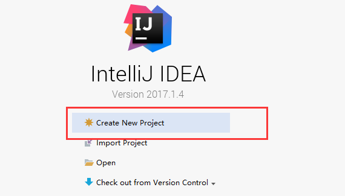
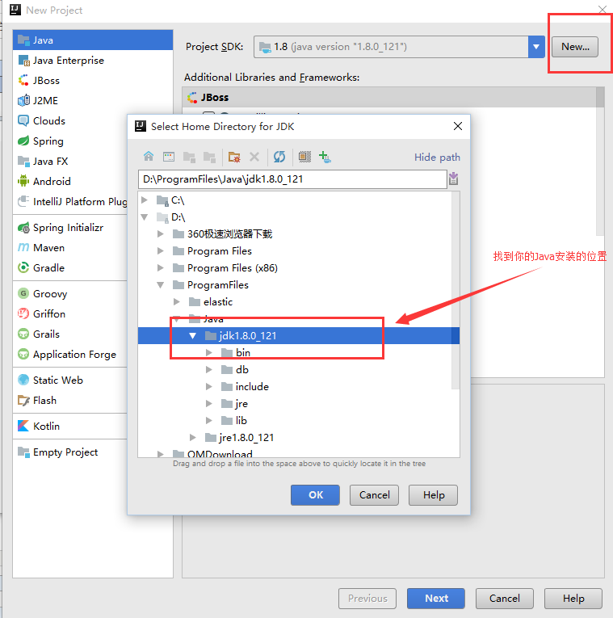
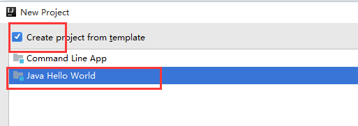
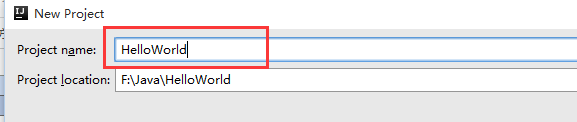
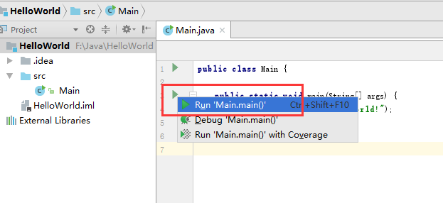
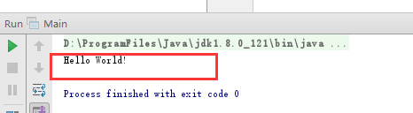

> java基础主要内容 copy 自：https://www.cnblogs.com/ginb/p/7113409.html

# Java介绍

## **java**语言概述

Java是sun公司开发的一门编程语言,目前被Oracle公司收购，编程语言就是用来编写软件的。

### Java的应用

* 开发QQ、迅雷程序(桌面应用软件)
* 淘宝、京东(互联网应用软件)
* 安卓应用程序

### Java的擅长

* 互联网：电商、P2P等等
* 企业级应用：ERP、CRM、BOS、OA等等

### Java语言平台

* JavaSE（标准版）部分,JavaSE并不能开发大型项目。
* JavaEE（企业版）部分,学习完JavaEE部分就可以开发各种大型项目了。

## **java**语言开发环境

JDK是Java开发环境，官网 http://www.oracle.com/cn/index.html

### JDK的安装

傻瓜式安装，双击安装程序，然后一路next即可，安装的推荐方式：

* 安装路径不要有中文或者特殊符号如空格等。
* 所有和开发相关的软件最好安装目录统一。
* 当提示安装JRE时，可以选择不安装。建议还是安装上。

 验证安装是否成功，通过DOS命令，切换到JDK安装的bin目录下。比如 **D:\develop\Java\jdk1.**7**.0_72\bin**，然后分别输入javac和java，如果正常显示一些内容，说明安装成功。

### 配置环境变量

环境变量的作用：由于javac和java命令只能在固定的目录下才能执行，而我们写的代码如果都和javac及java命令放在相同的目录中的话，会显得很乱”，为了让Java的bin目录下的javac命令可以在任意目录下执行，就得配置环境变量。

**JDK和JRE以及跨平台**

JDK与JRE的关系

* JDK：Java Development Kit ，Java语言的开发工具包，提供了Java语言的开发工具，它里面包含了JRE，同时也就包含了JVM（Java虚拟机）。
* JRE：Java Runtime Environment，它是Java运行环境，如果你不需要开发只需要运行Java程序，那么你可以安装JRE。例如程序员开发出的程序最终卖给了用户，用户不用开发，只需要运行程序，所以用户在电脑上安装JRE即可。它包含了Java虚拟机，也就是JVM，同时还包含了Java语言运行需要的核心类库。

跨平台特性：平台指的是操作系统 （Windows，Linux，Mac）。只需在相应的平台上安装Java虚拟机，就可以运行Java程序。

## 使用IntelliJ IDEA打印Hello World

### 第一步：创建新项目



### 第二步：选择jdk，然后next



### 第三步：选择Hello World模板，然后Next



### 第四步：输入项目名称，然后Finish



### 第五步：运行



### 第六步：查看结果



## Java代码的编写执行过程

源文件：编写Java源文件（我们也称之为源代码文件），它的扩展名为.java；

编译：然后通过编译器把源文件编译成字节码文件，字节码文件扩展名为.class；

运行：最后使用解释器来运行字节码文件。

## CentOS7下Java8安装

1、到[https://www.oracle.com/technetwork/java/javase/downloads/jdk8-downloads-2133151.html](https://www.oracle.com/technetwork/java/javase/downloads/jdk8-downloads-2133151.html)找到jdk-8u221-linux-x64.tar.gz的下载地址，需要登录。

2、打开终端，使用 wget命令下载。比如：

```
wget [https://download.oracle.com/otn/java/jdk/8u221-b11/230deb18db3e4014bb8e3e8324f81b43/jdk-8u221-linux-x64.tar.gz?AuthParam=1569641530_05c699a00ac2afe0c0dde7cc5784e4d5](https://download.oracle.com/otn/java/jdk/8u221-b11/230deb18db3e4014bb8e3e8324f81b43/jdk-8u221-linux-x64.tar.gz?AuthParam=1569641530_05c699a00ac2afe0c0dde7cc5784e4d5)
```

3、解压，tar -xzvf jdk-8u221-linux-x64.tar.gz?AuthParam=1569641530_05c699a00ac2afe0c0dde7cc5784e4d5

4、移动到/usr/local目录下，mv jdk-8u221-linux-x64.tar.gz?AuthParam=1569641530_05c699a00ac2afe0c0dde7cc5784e4d5 /opt/usr

5、切换到opt目录下，cd /opt/usr

6、改名为java8，mv jdk-8u221-linux-x64.tar.gz?AuthParam=1569641530_05c699a00ac2afe0c0dde7cc5784e4d5 java8

7、配置环境变量，vi /etc/profile,在文件后面追加以下代码：

JAVA_HOME=/usr/local/java8
JRE_HOME=/usr/local/java8/jre
PATH=$PATH:$JAVA_HOME/bin:$JRE_HOME/bin
CLASSPATH=.:$JAVA_HOME/lib/dt.jar:$JAVA_HOME/lib/tools.jar:$JRE_HOME/lib
export JAVA_HOME JRE_HOME PATH CLASSPATH

8、执行source /etc/profile命令使配置生效，到这一步就算安装完成了，使用java -version查看安装是否成功。

# Reference Links：

https://www.cnblogs.com/ginb/p/7113409.html

https://www.cnblogs.com/yjlch1016/p/8900841.html
