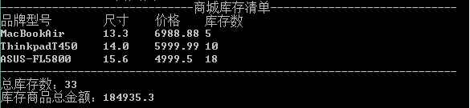

# 变量、数据类型，运算符

## 注释

注释用来解释和说明程序的文字，注释是不会被执行的.

单行注释

```
//这是一条单行注释 
public int i;
```

多行注释

```
/* 这是
* 一段注释，
* 它跨越了多个行
*/ 
public void f() {}
}
```

文档注释

```
/** The first Thinking in Java example program.
* Lists system information on current machine.
* @author Bruce Eckel
* @author http://www.BruceEckel.com
* @version 1.0
*/
public class Property {
/** Sole entry point to class & application
* @param args array of string arguments
* @return No return value
* @exception exceptions No exceptions thrown
*/
public static void main(String[] args) {
System.out.println(new Date());
Properties p = System.getProperties();
p.list(System.out);
System.out.println("--- Memory Usage:");
Runtime rt = Runtime.getRuntime();
System.out.println("Total Memory = "
+ rt.totalMemory()
+ " Free Memory = "
+ rt.freeMemory());
}59
}
```

对于单行和多行注释，被注释的文字，不会被JVM解释执行；对于文档注释，可以被JDK提供的工具**javadoc** 所解析，生成一套以网页文件形式体现的该程序的说明文档；单行注释可以嵌套使用，多行注释不能嵌套使用。

## **关键字**

是被Java语言赋予特殊含义，具有专门用途的单词，比如class，int，double均为Java已经预设好的;

组成关键字的字母全部小写 ,注意String不是关键字;

goto与const是Java中的保留字，即没有赋予特殊含义却仍被Java占用的单词;

## **标识符**

就是给类,接口,方法,变量等起名字时使用的字符序列,组成规则只能包含下面的内容,不能有其它内容:

* 英文大小写字母
* 数字字符
* $和_

### 注意事项

* 数字不能开头
* 不可以使用关键字
* 严格区分大小写，不限制长度
* 起名时，尽量见名知意

### 标识符中常见的命名规则

* 包名：多单词组成时所有字母均小写，使用.连接.比如：aaa.bbb.ccc
* 类名&接口名：大驼峰式。比如：AaaBbbCcc
* 变量名&方法名：小驼峰式。比如：aaaBbbCcc
* 常量名：多单词组成是所有字母均大写，使用_连接。比如：AAA_BBB_CCC

## 数据类型

为什么有数据类型？

Java是强类型语言，对于每一种数据都定义了明确的具体数据类型，变量必须要有明确的类型，什么类型的变量装载什么类型的数据。

### 数据类型的分类

基本数据类型

基本数据类型是Java语言中内置的类型，分别是整数类型、小数类型、字符类型、布尔类型。

这四类基本类型是最简单、最基础的类型。

* 整数(byte、short、int、long)，默认的整数类型是int类型，long类型需添加"L"后缀。
* 小数(float、double)、字符类型(char)，默认的浮点类型是double类型。在Java中所有没有后缀以及使用“D”后缀（小写也可以，但建议使用大写）的小数都是double类型；float类型常量必须添加“F”后缀
* 字符类型（char）
* 布尔类型(boolean)

引用数据类型

引用数据类型是强大的数据类型，它是基于基本数据类型创建的。JavaSE中提供了一个超级类库，类库中包含了近万种引用数据类型。比如：数组、类、接口。

## **常量**

常量就是不变的数据量, 在程序执行的过程中其值不可以发生改变

### 常量分类

整数类型

* 十进制表示方式：正常数字，如 13、25等
* 二进制表示方式：以0b(0B)开头，如0b1011 、0B1001
* 十六进制表示方式：以0x(0X)开头，数字以0-9及A-F组成  如0x23A2、0xa、0x10
* 八进制表示方式：以0开头，如01、07、0721

小数类型，如1.0、-3.15、3.168等

布尔类型， true、false

字符类型，字符必须使用’’ 包裹，并且其中只能且仅能包含一个字符。如'a'，'A', '0', '家'

字符串类型，一种引用类型，字符串必须使用""包裹，其中可以包含0~N个字符。如"我爱Java"，"0123"，""，"null"

### **在程序中输出Java中的常量**

```
public class Main {
    public static void main(String[] args) {
        //输出整数 十进制
        System.out.println(50);//50
        //输出整数，二进制, 数字开头0B
        System.out.println(0B11);//3
        //输出整数，八进制，数字开头0
        System.out.println(051);//41
        //输出整数，十六进制，数组开头0X  0-9 A-F
        System.out.println(0XE);//14
        //输出浮点数据
        System.out.println(5.0);//5.0
        //输出布尔数据，只有2个值，true，false 关键字
        System.out.println(true);//true
        System.out.println(false);//false
        //输出字符常量，单引号包裹，只能写1个字符
        System.out.println('a');//a
        //输出字符串常量，双引号包裹，可以写0-n个字符
        System.out.println("HelloWorld");//HelloWorld
    }
}
```

## **变量**

### **什么是变量?**

变量是一个内存中的小盒子（小容器），容器是什么？生活中也有很多容器，例如水杯是容器，用来装载水；你家里的大衣柜是容器，用来装载衣裤；饭盒是容器，用来装载饭菜。

那么变量是装载什么的呢？答案是数据！结论：变量是内存中装载数据的小盒子，你只能用它来存数据和取数据。

### 定义变量

```
数据类型  变量名  =  数据值；
int         a    =  100;
```

### **变量使用的注意事项**

变量定义后可以不赋值，使用时再赋值。不赋值不能使用。

```
int x;
x = 20; //为x赋值20
```

变量使用时有作用域的限制。

```
public static void main(String[] args) {
    int x = 20;
    {
        int y = 20;
    }
    System.out.println(x);//读取x变量中的值，再打印
    System.out.println(y);//读取y变量中的值失败，失败原因，找不到y变量，因为超出了y变量作用范围，所以不能使用y变量
}
```

变量不可以重复定义。

```
public static void main(String[] args){
      int x = 10;
      double x = 5.5;//编译失败，变量重复定义
}
```

## 数据类型转换

不同类型的变量可以在一起运算，但要先进行类型转换再运算。

* 范围小的数据类型值（如byte），可以直接转换为范围大的数据类型值（如int）；
* 范围大的数据类型值（如int），不可以直接转换为范围小的数据类型值（如byte）

数据范围从小到大依次列出：byte -> short -> int -> long -> float -> double

两种方式的数据类型转换

自动类型转换：表示范围小的数据类型转换成范围大的数据类型。格式：

```
范围大的数据类型 变量 = 范围小的数据类型值；
比如：double d = 1000; 
```

强制类型转换：表示范围大的数据类型转换成范围小的数据类型

```
范围小的数据类型  变量 = (范围小的数据类型) 范围大的数据类型值;
比如：int  i = (int)6.718;   //i的值为6
```

## 运算符

### 算数运算符

加号（ +）、减号和负号（ -）、乘号（ *）、除号（ /）、取模（%）、*自增（++）、自减（--）**以及等号（ =）的用法与其他所有编程语言都是类似的 。**

++,--运算符后置时，先使用变量a原有值参与运算操作，运算操作完成后，变量a的值自增1或者自减1。

l ++，--运算符前置时，先将变量a的值自增1或者自减1，然后使用更新后的新值参与运算操作。

### 赋值运算符

赋值（=）、加后赋值（+=）、减后赋值（-=）、乘后赋值（*=）、整除后赋值（/=）取模后赋值（%=）的用法与其他所有编程语言都是类似的 。

### 关系运算符

等于 `==`  不等于 `!=`  小于 `<`  大于 `>`  小于等于 `<=`  大于等于 `>=`  的用法与其他所有编程语言都是类似的 。

### **逻辑运算符**

与（&&）、或（||）、非（!）的用法与其他所有编程语言都是类似的 。

短路：当使用与或者或时，只要能判断出结果则后边的部分就不再判断。

### **三元运算符**

(条件表达式)？表达式1：表达式2；

```
int n = (3>2 && 4>6) ? 100 : 200;
//逻辑运算后的结果为false，运算结果为表达式2的值200,然后将结果200赋值给了变量n
```

## 商场库存清单案例

案例输出结果如下：



### **案例需求分析**

观察清单后，可将清单分解为三个部分（清单顶部、清单中部、清单底部）

清单顶部为固定的数据，直接打印即可
清单中部为商品，为变化的数据，需要记录商品信息后，打印，经过观察，我们确定一项商品应该有如下几个属性：

* 品牌型号: 即商品名称，String型
* 尺寸：物品大小，double型
* 价格：物品单价，double型
* 配置：这一项为每种商品的配置信息，String型
* 库存数：这一项为每种商品的库存个数，int型

清单底部包含了统计操作，需经过计算后，打印，我们发现两个单独的可变化量：

* 总库存数：所有商品总个数，int型
* 库存商品总金额：所有商品金额，double型

```


public class Main {
    public static void main(String[] args) {
        //苹果笔记本电脑
        String macBrand = "MacBookAir";
        double macSize = 13.3;
        double macPrice = 6988.88;
        int macCount = 5;

        //联想Thinkpad笔记本电脑
        String thinkpadBrand = "ThinkpadT450";
        double thinkpadSize = 14.0;
        double thinkpadPrice = 5999.99;
        int thinkpadCount = 10;

        //华硕ASUS笔记本电脑
        String ASUSBrand = "ASUS-FL5800";
        double ASUSSize = 15.6;
        double ASUSPrice = 4999.50;
        int ASUSCount = 18;
        //统计所有库存商品数量与金额
        //统计库存总个数、库存总金额
        int totalCount = macCount + thinkpadCount + ASUSCount;
        double totalMoney = (macCount * macPrice) + (thinkpadCount * thinkpadPrice) + (ASUSCount * ASUSPrice);
        //打印库存清单顶部信息
        System.out.println("------------------------------商城库存清单-----------------------------");
        System.out.println("品牌型号    尺寸    价格    库存数");
        //打印库存清单中部信息
        System.out.println(macBrand + "    " + macSize + "    " + macPrice + "    " + macCount);
        System.out.println(thinkpadBrand + "    " + thinkpadSize + "    " + thinkpadPrice + "    " + thinkpadCount);
        System.out.println(ASUSBrand + "    " + ASUSSize + "    " + ASUSPrice + "    "+ASUSCount);
        //打印库存清单底部信息
        System.out.println("-----------------------------------------------------------------------");
        System.out.println("总库存数：" + totalCount);
        System.out.println("库存商品总金额：" + totalMoney);
    }
}
```

# Reference Links：

https://www.cnblogs.com/ginb/p/7103664.html
