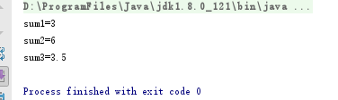

# 数组、方法

### 数组的需求

现在需要统计某公司员工的工资情况，例如计算平均工资、最高工资等。假设该公司有50名员工，用前面所学的知识完成，那么程序首先需要声明50个变量来分别记住每位员工的工资，这样做会显得很麻烦.

### 数组的概述

数组是指一组数据的集合，数组中的每个数据被称作元素。在数组中可以存放任意类型的元素，但同一个数组里存放的元素类型必须一致。

### 数组的定义

格式:

```
数据类型[] 数组名 = new 数据类型[元素个数或数组长度];

举例:int[] x = new int[100];
```

要点说明

* 数据类型: 数组中存储元素的数据类型
* [] 表示数组的意思
* 变量名 自定义标识符
* new 创建容器关键字
* 元素个数,就是数组中,可以存储多少个数据 (恒定, 定长)
* 数组是一个容器: 存储到数组中的每个元素,都有自己的自动编号(索引(index), 下标, 角标)
* 访问数组存储的元素,必须依赖于索引,  **数组名[索引]**
* 数组中最小的索引是0，最大的索引是“数组的长度-1”。

在程序中可以通过“数组名.length”的方式来获得数组的长度，即元素的个数。

接下来，通过一个案例来演示如何定义数组以及访问数组中的元素，如下所示。ArrayDemo01.java

```
 public class ArrayDemo01 {
    public static void main(String[] args) {
               int[] arr; // 声明变量
               arr = new int[3]; // 创建数组对象
               System.out.println("arr[0]=" + arr[0]); // 访问数组中的第一个元素
               System.out.println("arr[1]=" + arr[1]); // 访问数组中的第二个元素
               System.out.println("arr[2]=" + arr[2]); // 访问数组中的第三个元素
               System.out.println("数组的长度是：" + arr.length); // 打印数组长度
           }
}
```


如果在使用数组时，不想使用这些默认初始值，也可以显式地为这些元素赋值。接下来通过一个程序来学习如何为数组的元素赋值，如下所示。ArrayDemo02.java

```
 public class ArrayDemo02 {
     public static void main(String[] args) {
                int[] arr = new int[4]; // 定义可以存储4个整数的数组
                arr[0] = 1; // 为第1个元素赋值1
                arr[1] = 2; // 为第2个元素赋值2
                // 下面的代码是打印数组中每个元素的值
                System.out.println("arr[0]=" + arr[0]);
                System.out.println("arr[1]=" + arr[1]);
                System.out.println("arr[2]=" + arr[2]);
                System.out.println("arr[3]=" + arr[3]);
            }
}
```


在定义数组时只指定数组的长度，由系统自动为元素赋初值的方式称作动态初始化。

在初始化数组时还有一种方式叫做静态初始化，就是在定义数组的同时就为数组的每个元素赋值。数组的静态初始化有两种方式，具体格式如下：

```
方式1  　　类型[] 数组名 = new 类型[]{元素，元素，……};
方式2 　　 类型[] 数组名 = {元素，元素，元素，……};
```

上面的两种方式都可以实现数组的静态初始化，但是为了简便，建议采用第二种方式。接下来通过一段代码来演示数组静态初始化的效果，如下所示。ArrayDemo03.java

```
 public class ArrayDemo03 {
    public static void main(String[] args) {
                int[] arr = { 1, 2, 3, 4 }; // 静态初始化
                // 下面的代码是依次访问数组中的元素
                System.out.println("arr[0] = " + arr[0]);
                System.out.println("arr[1] = " + arr[1]);
                System.out.println("arr[2] = " + arr[2]);
                System.out.println("arr[3] = " + arr[3]);
            }
 }
```


在操作数组时，经常需要依次访问数组中的每个元素，这种操作称作数组的遍历。接下来通过一个案例来学习如何使用for循环来遍历数组，如下所示。ArrayDemo04.java

```
public class ArrayDemo04 {
    public static void main(String[] args) {
        int[] arr = { 1, 2, 3, 4, 5 }; // 定义数组
        // 使用for循环遍历数组的元素
        for (int i = 0; i < arr.length; i++) {
            System.out.println(arr[i]); // 通过索引访问元素
        }
    }
}
```


数组在编写程序时应用非常广泛，灵活地使用数组对实际开发很重要。接下来，本节将针对数组的常见操作进行详细地讲解，如数组的遍历、最值的获取、数组的排序等。

在操作数组时，经常需要获取数组中元素的最值。接下来通过一个案例来演示如何获取数组中元素的最大值，如下所示。ArrayDemo05.java

```
public class ArrayDemo05 {
    public static void main(String[] args) {
        int[] arr = { 4, 1, 6, 3, 9, 8 }; // 定义一个数组
        int max = arr[0]; // 定义变量max用于记住最大数，首先假设第一个元素为最大值
        // 下面通过一个for循环遍历数组中的元素
        for (int x = 1; x < arr.length; x++) {
            if (arr[x] > max) { // 比较 arr[x]的值是否大于max
                max = arr[x]; // 条件成立，将arr[x]的值赋给max
            }
        }
        System.out.println("max=" + max); // 打印最大值
    }
}
//max=9
```

每个数组的索引都有一个范围，即0~length-1。在访问数组的元素时，索引不能超出这个范围，否则程序会报错

在使用变量引用一个数组时，变量必须指向一个有效的数组对象，如果该变量的值为null，则意味着没有指向任何数组，此时通过该变量访问数组的元素会出现空指针异常，接下来通过一个案例来演示这种异常，如下所示。ArrayDemo07.java

```
 public class ArrayDemo07 {
     public static void main(String[] args) {
                int[] arr = new int[3]; // 定义一个长度为3的数组
                arr[0] = 5; // 为数组的第一个元素赋值
                System.out.println("arr[0]=" + arr[0]); // 访问数组的元素
                arr = null; // 将变量arr置为null
                System.out.println("arr[0]=" + arr[0]); // 访问数组的元素
            }
}
```


## 二维数组

二维数组的定义有很多方式，接下来针对几种常见的方式进行详细地讲解，具体如下：

第一种方式：`int**[][] arr =** new int**[3][4];**`

第二种方式：`int**[][] arr =** new int**[3][];**`

第三种方式：`int**[][] arr = {{1,2},{3,4,5,6},{7,8,9}};**`

对二维数组中元素的访问也是通过角标的方式，如需访问二维数组中第一个元素数组的第二个元素，具体代码如下：

```
arr[0][1];
```

操作二维数组时，经常需要获取数组中元素的值。接下来通过一个案例来演示如何获取数组中元素值，如下所示。ArrayDemo08.java

```
class ArrayDemo08 {
    public static void main(String[] args){
        //定义二维数组的方式
        int[][] arr = new int[3][4];

        System.out.println( arr );
        System.out.println("二维数组的长度: " + arr.length);
        //获取二维数组的3个元素
        System.out.println( arr[0] );
        System.out.println( arr[1] );
        System.out.println( arr[2] );

        System.out.println("打印第一个一维数组的元素值");
        System.out.println( arr[0][0] );
        System.out.println( arr[0][1] );//访问的为二维数组中第1个一维数组的第2个元素
        System.out.println( arr[0][2] );
        System.out.println( arr[0][3] );

        System.out.println("打印第二个一维数组的元素值");
        System.out.println( arr[1][0] );
        System.out.println( arr[1][1] );
        System.out.println( arr[1][2] );
        System.out.println( arr[1][3] );

        System.out.println("打印第三个一维数组的元素值");
        System.out.println( arr[2][0] );
        System.out.println( arr[2][1] );
        System.out.println( arr[2][2] );
        System.out.println( arr[2][3] );
    }
}
```

运行结果：

```
[[I@1540e19d
二维数组的长度: 3
[I@677327b6
[I@14ae5a5
[I@7f31245a
打印第一个一维数组的元素值
0
0
0
0
打印第二个一维数组的元素值
0
0
0
0
打印第三个一维数组的元素值
0
0
0
0
```

学习完了数组元素的访问，我们来学习下数组的遍历及数组的元素累加和操作。

```
public class ArrayDemo09 {
    public static void main(String[] args){
        //一维数组的求累加和并遍历
        int[] arr = {10,20,30,40,50};
        int sum = 0;
        for (int i=0; i<arr.length; i++) {
            //System.out.println(arr[i]);
            sum += arr[i];
        }
        System.out.println("sum= " + sum);
        System.out.println("---------------------");

//二维数组的求累加和并遍历
        int[][] arr2 = { {1,2},{3,4,5},{6,7,8,9,10} };
        int sum2 = 0;
        for (int i=0; i<arr2.length; i++) {
            for (int j=0; j<arr2[i].length; j++) {
                //System.out.println(arr2[i][j])
                sum2 += arr2[i][j];
            }
        }
        System.out.println("sum2= "+ sum2);
    }
}
```


接下来通过一个案例来熟悉二维数组的使用。例如要统计一个公司三个销售小组中每个小组的总销售额以及整个公司的销售额。如下所示

* 第一小组销售额为{11, 12}万元
* 第二小组销售额为{21, 22, 23}万元
* 第三小组销售额为{31, 32, 33, 34}万元。

```
/**
 * Created by yang on 2017/7/2.
 */
public class ArrayDemo10 {
    public static void main(String[] args) {
        int[][] arr = new int[3][]; // 定义一个长度为3的二维数组
        arr[0] = new int[]{11, 12}; // 为数组的元素赋值
        arr[1] = new int[]{21, 22, 23};
        arr[2] = new int[]{31, 32, 33, 34};

        int sum = 0; // 定义变量记录总销售额
        for (int i = 0; i < arr.length; i++) { // 遍历数组元素
            int groupSum = 0; // 定义变量记录小组销售总额
            for (int j = 0; j < arr[i].length; j++) { // 遍历小组内每个人的销售额
                groupSum = groupSum + arr[i][j];
            }
            sum = sum + groupSum; // 累加小组销售额
            System.out.println("第" + (i + 1) + "小组销售额为：" + groupSum + " 万元");
        }
        System.out.println("总销售额为: " + sum + " 万元");
    }
}
```


### JVM内存划分

 JVM对自己的内存划分为5个区域

* 寄存器:内存和CUP之间
* 本地方法栈: JVM调用了系统中的功能
* 方法和数据共享: 运行时期class文件进入的地方
* 方法栈:所有的方法运行的时候进入内存
* 堆:存储的是容器和对象

### 数组的内存

int[] x; // 声明一个int[]类型的变量
x = new int[100]; // 创建一个长度为100的数组
接下来，通过两张内存图来详细地说明数组在创建过程中内存的分配情况。
第一行代码 int[] x; 声明了一个变量x，该变量的类型为int[]，即一个int类型的数组。变量x会占用一块内存单元，它没有被分配初始值
第二行代码 x = new int[100]; 创建了一个数组，将数组的地址赋值给变量x。在程序运行期间可以使用变量x来引用数组，这时内存中的状态会发生变化


### 数组中常见的异常

数组操作中,常见的两个异常
数组的索引越界异常
空指针异常

### 二维数组内存图

举例:int[][] arr = new int[3][4];
外层数组长在内存开辟连续的3个大的内存空间,每一个内存空间都对应的有地址值
每一个大内存空间里又开辟连续的四个小的内存空间.


# 方法

在java中，方法就是用来完成解决某件事情或实现某个功能的办法。

### **方法的语法格式**

在Java中，声明一个方法的具体语法格式如下：

```
修饰符 返回值类型 方法名(参数类型 参数名1,参数类型 参数名2,．．．．．．){ 
    执行语句
    ……… 
    return 返回值;
}
```

对于上面的语法格式中具体说明如下：

* 修饰符：方法的修饰符比较多，有对访问权限进行限定的，有静态修饰符static，还有最终修饰符final等，这些修饰符在后面的学习过程中会逐步介绍
* 返回值类型：用于限定方法返回值的数据类型
* 参数类型：用于限定调用方法时传入参数的数据类型
* 参数名：是一个变量，用于接收调用方法时传入的数据
* return关键字：用于结束方法以及返回方法指定类型的值
* 返回值：被return语句返回的值，该值会返回给调用者

### 方法使用的注意事项

* 方法不调用，自己不执行
* 方法中不能定义方法， 但是，方法中可以调用方法
* 方法定义的位置在类中，其他方法的外面
* 方法中的“参数类型 参数名1，参数类型 参数名2”被称作参数列表，它用于描述方法在被调用时需要接收的参数，如果方法不需要接收任何参数，则参数列表为空，即()内不写任何内容。
* 如果方法没有明确的返回值类型，使用'空'类型， void表示
* void只能在方法返回值类型位置使用，不能作为普通的数据类型使用
* 如果方法返回值类型为void类型，可以省略 return ;

接下来通过一个案例来演示方法的定义与使用，如下图所示。MethodDemo01.java

```
public class MethodDemo01 {
    public static void main(String[] args) {
        int area = getArea(3, 5); // 调用 getArea方法
        System.out.println(" The area is " + area);
    }

    // 下面定义了一个求矩形面积的方法，接收两个参数，其中x为高，y为宽
    public static int getArea(int x, int y) {
        int temp = x * y; // 使用变量temp记住运算结果
        return temp; // 将变量temp的值返回
    }
}
```

### 方法的重载

Java允许在一个类中定义多个名称相同的方法，但是参数的类型或个数必须不同，这就是方法的重载。

比如，下面的三个方法互为重载关系

```
public static int add(int x,int y) {逻辑} //两个整数加法

public static int add(int x,int y,int z) {逻辑} //三个整数加法

public static int add(double x,double y) {逻辑} //两个小数加法
```

接下来演示方法重载的方式如下所示。MethodDemo03.java

```
public class MethodDemo03 {
    public static void main(String[] args) {
        // 下面是针对求和方法的调用
        int sum1 = add(1, 2);
        int sum2 = add(1, 2, 3);
        double sum3 = add(1.2, 2.3);
        // 下面的代码是打印求和的结果
        System.out.println("sum1=" + sum1);
        System.out.println("sum2=" + sum2);
        System.out.println("sum3=" + sum3);
    }

    // 下面的方法实现了两个整数相加
    public static int add(int x, int y) {
        return x + y;
    }
    // 下面的方法实现了三个整数相加
    public static int add(int x, int y, int z) {
        return x + y + z;
    }
    // 下面的方法实现了两个小数相加
    public static double add(double x, double y) {
        return x + y;
    }
}
```



### 重载的注意事项

重载方法参数必须不同：

* 参数个数不同，如method(int x)与method(int x,int y)不同
* 参数类型不同，如method(int x)与method(double x)不同
* 参数顺序不同，如method(int x,double y)与method(double x,int y)不同

重载只与方法名与参数类型相关，与返回值无关。如void method(int x)与int method(int y)不是方法重载，不能同时存在

重载与具体的变量标识符无关。如method(int x)与method(int y)不是方法重载，不能同时存在

### **参数传递**

定义方法时，参数列表中的变量，我们称为形式参数

调用方法时，传入给方法的数值，我们称为实际参数

### 参数传递图解与结论


通过上面的两段程序可以得出如下结论：

* 当调用方法时，如果传入的数值为基本数据类型（包含String类型），形式参数的改变对实际参数不影响
* 当调用方法时，如果传入的数值为引用数据类型（String类型除外），形式参数的改变对实际参数有影响

# 库存管理案例

现在，我们将原有的库存管理案例，进行业务逻辑的封装。

将对下列功能进行方法封装：

* 打印库存清单功能
* 库存商品数量修改功能
* 退出程序功能

编写代码，StockMamager.java

```
import java.util.Scanner;

/**
 * Created by yang on 2017/7/2.
 */
public class StockMamager {
    /**
     * 库存管理功能菜单
     * @return 管理员键盘输入的功能操作序号
     */
    public static int chooseFunction() {
        System.out.println("-------------库存管理------------");
        System.out.println("1.查看库存清单");
        System.out.println("2.修改商品库存数量");
        System.out.println("3.退出");
        System.out.println("请输入要执行的操作序号：");
        //接收键盘输入的功能选项序号
        Scanner sc = new Scanner(System.in);
        int choose = sc.nextInt();
        return choose;
    }
    /**
     * 查看库存清单
     * @param brands 商品品牌型号
     * @param sizes 商品尺寸大小
     * @param prices 商品价格
     * @param counts 商品库存个数
     */
    public static void printStore(String[] brands, double[] sizes, double[] prices, int[] counts) {
        //统计总库存个数、统计库存总金额
        int totalCount = 0;
        double totalMoney = 0.0;
        for (int i = 0; i < brands.length; i++) {
            totalCount += counts[i];
            totalMoney += counts[i] * prices[i];
        }
        //列表顶部
        System.out.println("---------------------------查看库存清单--------------------------");
        System.out.println("品牌型号        尺寸    价格    库存数");
        //列表中部
        for (int i = 0; i < brands.length; i++) {
            System.out.println(brands[i]+"    "+sizes[i]+"    "+prices[i]+"    "+counts[i]);
        }
        //列表底部
        System.out.println("-------------------------------------------------------------");
        System.out.println("总库存数："+totalCount);
        System.out.println("库存商品总金额："+totalMoney);
    }

    /**
     * 修改商品库存数量
     * @param brands 商品品牌型号
     * @param counts 商品库存个数
     */
    public static void update(String[] brands, int[] counts){
        System.out.println("------------修改商品库存数量-----------");
        for (int i = 0; i < brands.length; i++) {
            System.out.println("请输入"+ brands[i] +"商品库存数");
            counts[i] = new Scanner(System.in).nextInt();
        }
    }

    /**
     * 退出
     */
    public static void exit(){
        System.out.println("----------------退出---------------");
        System.out.println("您已退出系统");
    }

    public static void main(String[] args) {
        //记录库存商品信息
        //品牌型号
        String[] brands = new String[]{"MacBookAir", "ThinkpadT450"};
        //尺寸大小
        double[] sizes = new double[]{13.3, 14.0};
        //价格
        double[] prices = new double[]{6988.88, 5999.99};
        //库存个数
        int[] counts = new int[]{0, 0};

        //通过while循环模拟管理员进行功能重复选择操作
        while (true) {
            //打印功能菜单操作,接收键盘输入的功能选项序号
            int choose = chooseFunction();
            //执行序号对应的功能
            switch (choose) {
                case 1://查看库存清单
                    printStore(brands, sizes, prices, counts);
                    break;
                case 2://修改商品库存数量
                    update(brands, counts);
                    break;
                case 3://退出
                    exit();
                    return;
                default:
                    System.out.println("----------------------------------");
                    System.out.println("功能选择有误，请输入正确的功能序号!");
                    break;
            }
        }
    }
}
```

 运行结果如下：

```
-------------库存管理------------
1.查看库存清单
2.修改商品库存数量
3.退出
请输入要执行的操作序号：
1
---------------------------查看库存清单--------------------------
品牌型号        尺寸    价格    库存数
MacBookAir    13.3    6988.88    0
ThinkpadT450    14.0    5999.99    0
-------------------------------------------------------------
总库存数：0
库存商品总金额：0.0
-------------库存管理------------
1.查看库存清单
2.修改商品库存数量
3.退出
请输入要执行的操作序号：
2
------------修改商品库存数量-----------
请输入MacBookAir商品库存数
222
请输入ThinkpadT450商品库存数
15454
-------------库存管理------------
1.查看库存清单
2.修改商品库存数量
3.退出
请输入要执行的操作序号：
1
---------------------------查看库存清单--------------------------
品牌型号        尺寸    价格    库存数
MacBookAir    13.3    6988.88    222
ThinkpadT450    14.0    5999.99    15454
-------------------------------------------------------------
总库存数：15676
库存商品总金额：9.427537682E7
-------------库存管理------------
1.查看库存清单
2.修改商品库存数量
3.退出
请输入要执行的操作序号：
3
----------------退出---------------
您已退出系统

Process finished with exit code 0
```

# Reference Links：

https://www.cnblogs.com/ginb/p/7106177.html
