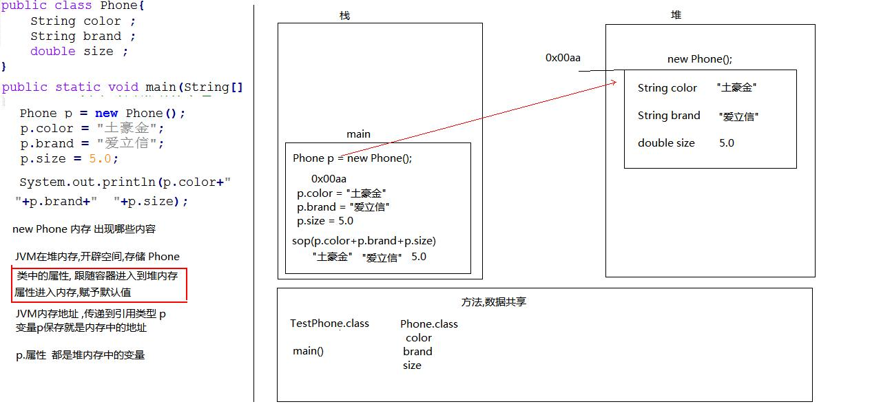
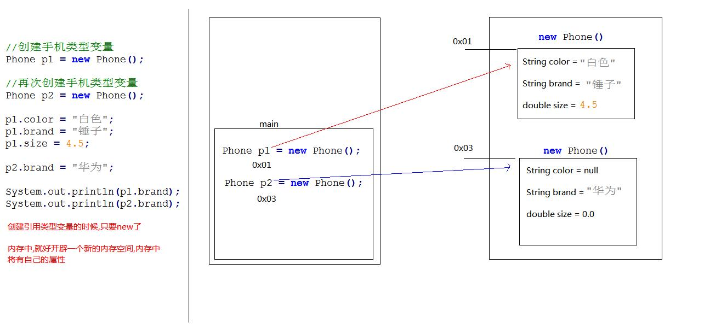
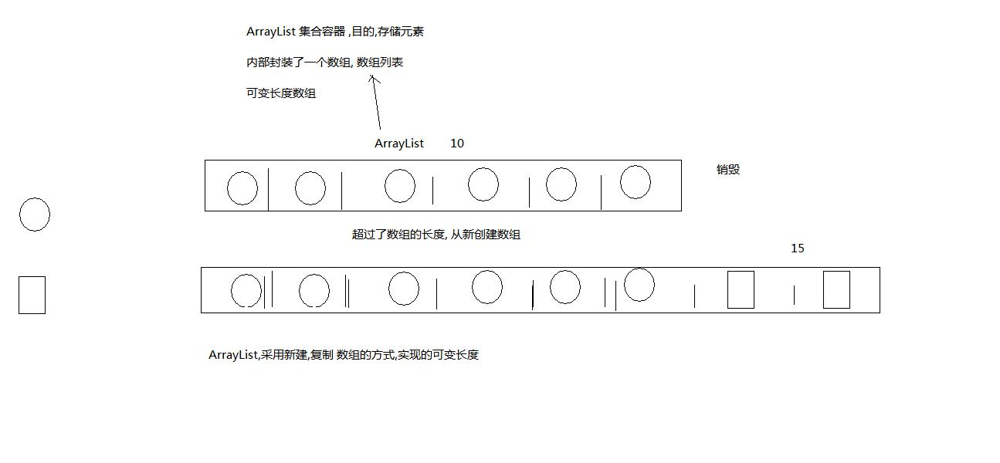

# 类和ArrayList

### 引用数据类型

引用数据类型分类，提到引用数据类型（类），其实我们对它并不陌生，如使用过的Scanner类、Random类。
我们可以把类的类型为两种：

* 第一种，Java为我们提供好的类，如Scanner类，Random类等，这些已存在的类中包含了很多的方法与属性，可供我们使用。
* 第二种，我们自己创建的类，按照类的定义标准，可以在类中包含多个方法与属性，来供我们使用。

这里我们主要介绍第二种情况的简单使用。

## 自定义数据类型概述

在Java中，将现实生活中的事物抽象成了代码。这时，我们可以使用自定义的数据类型（类）来描述（映射）现实生活中的事物。
类，它是引用数据类型，与之前学习的所有引用数据类型相同，自定义类也是一种数据类型。只是自定义类型并非Java为我们预先提供好的类型，而是我们自己定义的一种引用数据类型用来描述一个事物。

### 类的定义与使用

java代码映射成现实事物的过程就是定义类的过程。
我们就拿一部手机进行分析，它能用来做什么呢？它可以打电话，上网，聊微信等，这些就是手机所提供的功能，也就是方法；手机也有它的特征，如颜色、尺寸大小、品牌型号等，这些就是手机的特征，也就是属性。
目前，我们只关注类中的属性，类中的方法在面向对象部分再进行学习。

### 类的定义格式

创建java文件，与类名相同

```
public class 类名{
    数据类型 属性名称1；
    数据类型 属性名称2；
    …
}
```

通过类的定义格式，来进行手机类的描述，如下所示

```
public class Phone {
    /*
    * 属性
    */
    String brand;// 品牌型号
    String color;// 颜色
    double size; // 尺寸大小
}
```

上述代码，就是创建一个类的的过程，类的名称我们给起名为Phone，类中包含了三个属性（brand品牌型号、color颜色、size尺寸大小）。注意，类中定义的属性没有个数要求。

### 类的使用格式

Phone类定义好后，我们就可以使用这个类了，使用方式和使用引用数据类型Scanner类相似。格式如下：

* 导包：我们将所有的类放到同一个文件夹下，可以避免导包;
* 创建对象：数据类型 变量名 = new 数据类型();
* 调用方法：目前我们定义的自定义类不涉及方法，只是属性;
* 访问属性：变量名.属性 (这是当前的方式，后期会采取调用方法的方式替代掉直接访问的方式来完成对属性的访问。)

当有了Phone数据类型的变量后，我们就可以使用Phone类中的属性了。对属性的访问我们来演示一下，如下所示：

```
package arraylist;

public class Test {
    public static void main(String[] args) {
//定义了一个Phone类型的变量p
        Phone p = new Phone();
/*
* 通过p,使用Phone中的属性
*/
//访问p中的brand品牌属性
        p.brand = "苹果6s";//为p中brand属性赋值为 苹果6s
//访问p中的color颜色属性
        p.color = "白色";//为p中color属性赋值为”白色”
//访问p中的size尺寸大小属性
        p.size = 5.5;//为p中size属性赋值为5.5
        System.out.println("手机品牌为" + p.brand);
        System.out.println("手机颜色为" + p.color);
        System.out.println("手机尺寸大小为" + p.size);
    }
}
//手机品牌为苹果6s
//手机颜色为白色
//手机尺寸大小为5.5
```

### 自定义类型注意事项与内存图

上述代码中，通过类Phone创建出来的变量p，它相当于我们生活中的盒子，里面包含了它能够使用的属性。
通过 p.属性名 就可以对属性进行操作
与引用类型数组类似，引用类型的自定义类型的变量，直接变量时，结果为对象地址值，这里可以通过内存图简单解释。



下面再来看看某个类创建两个对象的内存图：



## ArrayList集合

在某些情况下无法确定到底要保存多少个元素，此时数组将不再适用，因为数组的长度不可变。为了保存这些数目不确定的元素，JDK中提供了一系列特殊的类，这些类可以存储任意类型的元素，并且长度可变，统称为集合。

在这里，我们先介绍ArrayList集合，其他集合在后续课程中学习。

ArrayList集合是程序中最常见的一种集合，它属于引用数据类型（类）。在ArrayList内部封装了一个长度可变的数组，当存入的元素超过数组长度时，ArrayList会在内存中分配一个更大的数组来存储这些元素，因此可以将ArrayList集合看作一个长度可变的数组。

### 集合的创建

创建集合的常用格式在此说明一下：

* 导包：import java.util.ArrayList;
* 创建对象：与其他普通的引用数据类型创建方式完全相同，但是要指定容器中存储的数据类型：
* `ArrayList<要存储元素的数据类型> 变量名 = new ArrayList<要存储元素的数据类型>()`;
  * 集合中存储的元素，只能为 `<>`括号中指定的数据类型元素；
  * `<要存储元素的数据类型>`中的数据类型必须是引用数据类型，不能是基本数据类型；

下面给出8种基本数据类型所对应的引用数据类型表示形式:
基本数据类型 对应的引用数据类型表示形式

```
byte　　——> 　　Byte
short    ——>　　Short
Int　　——>    Integer
long    ——>　　Long
float    ——>　　Float
double    ——>　　Double
char    ——>　　Character
boolean    ——>　　Boolean
```

我们通过举几个例子，来明确集合的创建方式：

```
//存储String类型的元素
ArrayList<String> list = new ArrayList<String>();
//存储int类型的数据
ArrayList<Integer> list = new ArrayList<Integer>(); 
//存储Phone类型的数据
ArrayList<Phone> list = new ArrayList<Phone>();
```

### 集合中常用方法

接下来，我们来学习下ArrayList集合提供的一些常用方法，如下：

```
boolean add（Object obj）    //将指定元素obj追加到集合的末尾
Object get（int index）      //返回集合中指定位置上的元素
int size（）    　　　　　　   //返回集合中的元素个数
```

下面通过代码演示上述方法的使用。

```
#ArrayListDemo01.java

package arraylist;
import java.util.ArrayList;
public class ArrayListDemo01 {
    public static void main(String[] args) {
// 创建ArrayList集合
        ArrayList<String> list = new ArrayList<String>();
// 向集合中添加元素
        list.add("stu1");
        list.add("stu2");
        list.add("stu3");
        list.add("stu4");
// 获取集合中元素的个数
        System.out.println("集合的长度：" + list.size());
// 取出并打印指定位置的元素
        System.out.println("第1个元素是：" + list.get(0));
        System.out.println("第2个元素是：" + list.get(1));
        System.out.println("第3个元素是：" + list.get(2));
        System.out.println("第4个元素是：" + list.get(3));
    }
}
//集合的长度：4
//第1个元素是：stu1
//第2个元素是：stu2
//第3个元素是：stu3
//第4个元素是：stu4
```

强调一点，ArrayList集合相当于是一个长度可变的数组，所以访问集合中的元素也是采用索引方式访问，第一个元素存储在索引0的位置，第二个元素存储在索引1的位置，依次类推。

### 集合的遍历

通过集合遍历，得到集合中每个元素，这是集合中最常见的操作。集合的遍历与数组的遍历很像，都是通过索引的方式，集合遍历方式如下：

```
#ArrayListDemo02.java

package arraylist;
import java.util.ArrayList;
public class ArrayListDemo02 {
    public static void main(String[] args) {
        //创建ArrayList集合
        ArrayList<Integer> list = new ArrayList<Integer>();
        //添加元素到集合
        list.add(13);
        list.add(15);
        list.add(22);
        list.add(29);
        //遍历集合
        for (int i = 0; i < list.size(); i++) {//[获取集合中元素的个数]
            //通过索引，获取到集合中每个元素
            int n = list.get(i);//[获取集合中指定位置上的元素值];
            System.out.println(n);
        }
    }
}
//13
//15
//22
//29
```

上述代码中，定义了一个可以存储int元素的集合；接着实现将int类型数值存储到集合中；接着实现遍历集合元素。这里要强调一点，get方法返回值的类型为集合中元素的类型。

### 集合中的常用方法补充

ArrayList集合提供的一些常用方法，如下：

```
boolean add（int index, Object obj）      //将指定元素obj插入到集合中指定的位置
Object remove（int index）    　　　　　 　//从集合中删除指定index处的元素，返回该元素
void clear（）    　　　　　　　　　　　　   //清空集合中所有元素
Object set（int index, Object obj）      //用指定元素obj替代集合中指定位置上的元素
```



## ASCII编码表

ASCII编码表， 英文全称 American Standard Code for Information Interchange，美国标准信息交换代码。

### ASCII编码表由来

计算机中，所有的数据在存储和运算时都要使用二进制数表示
a、b、c、d这样的52个字母（包括大写）、以及0、1等数字还有一些常用的符号, 在计算机中存储时也要使用二进制数来表示， 具体用哪些二进制数字表示哪个符号，当然每个人都可以约定自己的一套（这就叫编码）。
大家如果要想互相通信而不造成混乱，那么大家就必须使用相同的编码规则，于是美国有关的标准化组织就出台了ASCII编码，统一规定了上述常用符号用哪些二进制数来表示。

中文编码表

* GB2312
* UNICODE

字符中重要的ASCII码对应关系

* a : 97
* A : 65
* 0 : 48

### char类型的存储

short:占两个字节,是有符号数据,取值范围-32768-32767，char: 占两个字节,是无符号数据,取值范围0-65536。char类型的数据参加运算时要先转换为int数据类型。

案例代码

```
package arraylist;

/*
    ASCII编码表演示
    字符Java 数据类型,char
    整数Java 数据类型,int
  
    int 类型和 char 数据类型转换
    char  两个字节, int 四个字节
  
    char转成int类型的时候,类型自动提示,char数据类型,会查询编码表,得到整数
    int转成char类型的时候,强制转换,会查询编码表
  
    char存储汉字,查询Unicode编码表
  
    char可以和int计算,提示为int类型, 内存中两个字节
    char取值范围是0-65535, 无符号的数据类型
*/
public class ASCIIDemo {
    public static void main(String[] args){
        char c = 'a';
        int i = c + 1;
        System.out.println(i);

        int j = 90;
        char h = (char)j;
        System.out.println(h);

        System.out.println( (char)6 );

        char k = '你';
        System.out.println(k);


        //char m = -1;
    }
}
//98
//Z
//
//你
```

# Reference Links：

https://www.cnblogs.com/ginb/p/7123912.html
