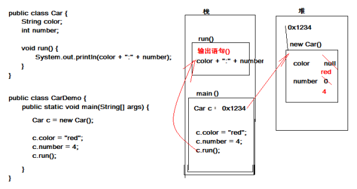
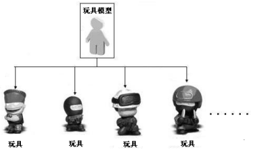
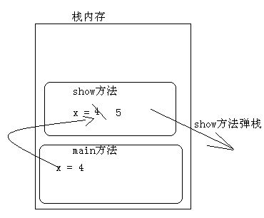
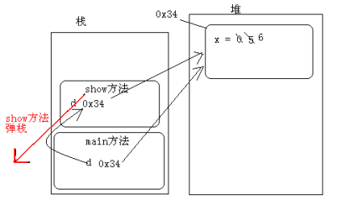
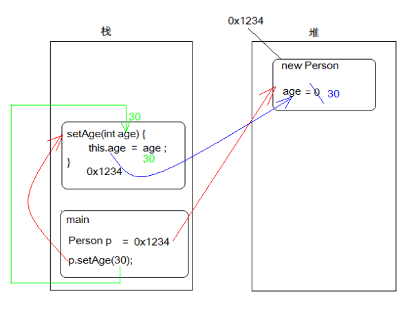

# 面向对象

### 理解什么是面向过程、面向对象

面向过程与面向对象都是我们编程中，编写程序的一种思维方式。
面向过程的程序设计方式，是遇到一件事时，思考“我该怎么做”，然后一步步实现的过程。
例如：公司打扫卫生（擦玻璃、扫地、拖地、倒垃圾等），按照面向过程的程序设计方式会思考“打扫卫生我该怎么做，然后一件件的完成”，最后把公司卫生打扫干净了。
面向对象的程序设计方式，是遇到一件事时，思考“我该让谁来做”，然后那个“谁”就是对象，他要怎么做这件事是他自己的事，反正最后一群对象合力能把事就好就行了。
例如，公司打扫卫生（擦玻璃、扫地、拖地、倒垃圾等），按照面向对象的程序设计方式会思考“我该让谁来做，如小明擦玻璃、让小丽扫地、让小郭拖地、让小强倒垃圾等”,这里的“小明、小丽、小郭、小强”就是对象，他们要打扫卫生，怎么打扫是他们自己的事，反正最后一群对象合力把公司卫生打扫干净了。

### 面向对象举例

买电脑（组装机）
使用面向过程说明买电脑这件事：上网查询参数和报价、电脑城询价、现场安装和监督、抱电脑回家。在整个过程中我们参与了每一个细节，并且会感觉相当累。
使用面向对象说明买电脑这件事：假如我们需要买组装机，这时应该找一个懂电脑硬件的人，让他帮我们查看参数和报价，并进行询价和杀价，以及现场组装监督。而我们自己并不需要亲历亲为具体怎么做，只要告诉这个人我们想要的具体需求即可。分析上述整个过程，发现瞬间变的十分轻松，只要找到懂电脑硬件的这个人，我们的问题都可以解决。并且在这个过程中我们不用那么辛苦。

面向对象思维方式的好处

通过生活中的真实场景使用面向对象分析完之后，我们开始分析面向过程和面向对象的差异做出总结：

* 面向对象思维方式是一种更符合人们思考习惯的思想
* 面向过程思维方式中更多的体现的是执行者（自己做事情），面向对象中更多的体现是指挥者（指挥对象做事情）。
* 面向对象思维方式将复杂的问题简单化。

## 类与对象

### 对象在需求中的使用

对面向对象有了了解之后，我们来说说在具体问题中如何使用面向对象去分析问题，和如何使用面向对象。
我们把大象装冰箱为例进行分析。在针对具体的需求，可以使用名词提炼的办法进行分析，寻找具体的对象。
需求：把大象装冰箱里
对象：大象、冰箱
分三步：

* 1、打开冰箱门
* 2、将大象装进去
* 3、关闭冰箱门

分析发现打开、装、关闭都是冰箱的功能。即冰箱对象具备如下功能：
冰箱打开
冰箱存储
冰箱关闭
用伪代码描述，上述需求中有两个具体的事物 大象 和 冰箱
描述大象：

```
class 大象
{
}
```

描述冰箱

```
class冰箱
{
    void 打开(){}
    void 存储(大象){}
    void 关闭(){}
}
```

当把具体的事物描述清楚之后，需要使用这些具体的事物，Java使用具体的事物，需要通过new关键字来创建这个事物的具体实例。

使用对象：
1、创建冰箱的对象

```
冰箱 bx = new 冰箱(); 
```

2、调用冰箱的功能

```
对象.功能()；
bx.打开();
bx.存储(new 大象());
bx.关闭();
```

总结：

1、先按照名词提炼问题领域中的对象
2、对对象进行描述，其实就是在明确对象中应该具备的属性和功能
3、通过new的方式就可以创建该事物的具体对象
4、通过该对象调用它以后的功能。

### 对象在代码中的体现

在分析现实生活中的事物时发现，这些事物都有其具体的特点和功能，这些特点和功能就组成了这个特殊的事物。
比如描述小汽车：

* 分析：
* 事物的特点（属性）：
* 颜色。
* 轮胎个数。
* 事物的(功能)：
* 运行。

可以发现：事物其实就是由特点（属性）和行为（功能）组成的。
可以简单理解：属性就是数值，其实就是变量；行为就是功能，就是方法。

```
小汽车 {
    颜色；
    轮胎个数；
    运行() {    }
}
```

通过计算机语言Java来描述这个事物。

定义类的格式

```
public class 类名 {
    //可编写0至n个属性
    数据类型 变量名1；
    数据类型 变量名2；

    //可编写0至n个方法
    修饰符 返回值类型 方法名(参数){
        执行语句;
    }
}
```

汽车类

```
public class Car {
    String color;
    int number;

    void run() {
        System.out.println(color + ":" + number);
    }
}
```

通过代码的描述，知道类的真正意义就是在描述事物。属性和功能统称为事物中的成员。

事物的成员分为两种：成员属性和成员功能。
成员属性在代码中的体现就是成员变量；成员功能在代码中的体现就是成员方法
把写好的代码测试一下。需要一个可以独立运行类。
创建对象的格式： **类名 对象名 =** new **类名();**
测试类

```
public class CarDemo {
    public static void main(String[] args) { 
/*
* 测试：Car类中的run方法。
*/
// 1,创建Car的对象。给对象起个名字。
        Car c = new Car();// c是类类型的变量。c指向了一个具体的Car类型的对象。
// 2,通过已有的对象调用该对象的功能。格式：对象.对象成员;
// 3,可以该对象的属性赋值。
        c.color = "red";
        c.number = 4;
        c.run();
    }
}
```

对象的内存图解



### 类和对象的区别

面向对象的编程思想力图在程序中对事物的描述与该事物在现实中的形态保持一致。为了做到这一点，面向对象的思想中提出两个概念，即类和对象。其中，类是对某一类事物的抽象描述，而对象用于表示现实中该类事物的个体。接下来通过一个图例来抽象描述类与对象的关系，如下图所示。



在上图中，可以将玩具模型看作是一个类，将一个个玩具看作对象，从玩具模型和玩具之间的关系便可以看出类与对象之间的关系。类用于描述多个对象的共同特征，它是对象的模板。对象用于描述现实中的个体，它是类的实例。从上图中可以明显看出对象是根据类创建的，并且一个类可以对应多个对象，接下来分别讲解什么是类和对象。
经过前面几个知识点的学习，基本上掌握了类是用于描述事物的，类中可以定义事物的属性和行为。而对象是通过描述的这个类，使用new关键字创建出来，通过对象就可以调用该对象具体的属性和功能了。

### 局部变量和成员变量区别

类中定义的变量，和在方法定义的变量有啥差别呢？
区别一：定义的位置不同
定义在类中的变量是成员变量；定义在方法中或者{}语句里面的变量是局部变量
区别二：在内存中的位置不同
成员变量存储在对内存的对象中；局部变量存储在栈内存的方法中
区别三：声明周期不同
成员变量随着对象的出现而出现在堆中，随着对象的消失而从堆中消失；局部变量随着方法的运行而出现在栈中，随着方法的弹栈而消失
区别四：初始化不同
成员变量因为在堆内存中，所以有默认的初始化值；局部变量没有默认的初始化值，必须手动的给其赋值才可以使用。

### 基本类型和引用类型作为参数传递

引用类型数据和基本类型数据作为参数传递有没有差别呢？我们用如下代码进行说明：

```
class Demo
{
    public static void main(String[] args)
    {
        int x = 4;
        show(x);
        System.out.println("x="+x);
    }
    public static void show(int x)
    {
        x = 5;

    }
}  
```

基本类型作为参数传递时，其实就是将基本类型变量x空间中的值复制了一份传递给调用的方法show()，当在show()方法中x接受到了复制的值，再在show()方法中对x变量进行操作，这时只会影响到show中的x。当show方法执行完成，弹栈后，程序又回到main方法执行，main方法中的x值还是原来的值。

```
class Demo
{
    int x ;
    public static void main(String[] args)
    {

        Demo d = new Demo();
        d.x = 5;
        show(d);
        System.out.println("x="+d.x);
    }
    public static void show(Demo d)
    {
        d.x = 6;
    }
}  
```

当引用变量作为参数传递时，这时其实是将引用变量空间中的内存地址(引用)复制了一份传递给了show方法的d引用变量。这时会有两个引用同时指向堆中的同一个对象。当执行show方法中的d.x=6时，会根据d所持有的引用找到堆中的对象，并将其x属性的值改为6.show方法弹栈。由于是两个引用指向同一个对象，不管是哪一个引用改变了引用的所指向的对象的中的值，其他引用再次使用都是改变后的值。





## 封装

### 封装概述

封装，它也是面向对象思想的特征之一。面向对象共有三个特征：封装，继承，多态。
封装表现：

* 方法就是一个最基本封装体。
* 类其实也是一个封装体。

从以上两点得出结论，封装的好处：

* 提高了代码的复用性。
* 隐藏了实现细节，还要对外提供可以访问的方式。便于调用者的使用。这是核心之一，也可以理解为就是封装的概念。
* 提高了安全性。

封装举例
一台电脑，它是由CPU、主板、显卡、内存、硬盘、电源等部件组长，其实我们将这些部件组装在一起就可以使用电脑了，但是发现这些部件都散落在外面，很容造成不安全因素，于是，使用机箱壳子，把这些部件都装在里面，并在机箱壳上留下一些插口等，若不留插口，大家想想会是什么情况。总结：机箱其实就是隐藏了办卡设备的细节，对外提供了插口以及开关等访问内部细节的方式。

### 私有private

了解到封装在生活的体现之后，又要回到Java中，细说封装的在Java代码中的体现，先从描述Person说起。

```
class Person {
    int age;
    String name;

    public void show() {
        System.out.println("age=" + age + ",name" + name);
    }
}

public class PersonDemo {
    public static void main(String[] args) {
// 创建Person对象
        Person p = new Person();
        p.age = -20; // 给Person对象赋值
        p.name = "人妖";
        p.show(); // 调用Person的show方法
    }
}
```

通过上述代码发现，虽然我们用Java代码把Person描述清楚了，但有个严重的问题，就是Person中的属性的行为可以任意访问和使用。这明显不符合实际需求。

可是怎么才能不让访问呢？需要使用一个Java中的关键字也是一个修饰符 private(私有，权限修饰符)。只要将Person的属性和行为私有起来，这样就无法直接访问。

```
class Person {
    private int age;
    private String name;

    public void show() {
        System.out.println("age=" + age + ",name" + name);
    }
}
```

年龄已被私有，错误的值无法赋值，可是正确的值也赋值不了，这样还是不行，那肿么办呢？按照之前所学习的封装的原理，隐藏后，还需要提供访问方式。只要对外提供可以访问的方法，让其他程序访问这些方法。同时在方法中可以对数据进行验证。

一般对成员属性的访问动作：赋值(设置 set)，取值(获取 get)，因此对私有的变量访问的方式可以提供对应的 setXxx或者getXxx的方法。

```
class Person {
    // 私有成员变量
    private int age;
    private String name;

    // 对外提供设置成员变量的方法
    public void setAge(int a) {
// 由于是设置成员变量的值，这里可以加入数据的验证
        if (a < 0 || a > 130) {
            System.out.println(a + "不符合年龄的数据范围");
            return;
        }
        age = a;
    }

    // 对外提供访问成员变量的方法
    public void getAge() {
        return age;
    }
}
```

总结：类中不需要对外提供的内容都私有化，包括属性和方法。以后再描述事物，属性都私有化，并提供setXxx getXxx方法对其进行访问。注意：私有仅仅是封装的体现形式而已。

### this关键字

成员变量和局部变量同名问题，当在方法中出现了局部变量和成员变量同名的时候，那么在方法中怎么区别局部变量成员变量呢？可以在成员变量名前面加上this，来区别成员变量和局部变量。

```
class Person {
    private int age;
    private String name;

    public void speak() {
        this.name = "小强";
        this.age = 18;
        System.out.println("name=" + this.name + ",age=" + this.age);
    }
}
class PersonDemo {
    public static void main(String[] args) {
        Person p = new Person();
        p.speak();
    }
}
```

### 对象的内存解释

我们已经学习了如何把生活中的事物使用Java代码描述，接下来我们分析对象在内存中的分配情况。这里需要画图一步一步演示，严格按照画图流程讲解内存对象创建使用过程。

```
class Person {
    private int age;
    public int getAge() {
        return this.age;
    }
    public void setAge(int age) {
        this.age = age;
    }
}
public class PersonDemo {
    public static void main(String[] args) {
        Person p = new Person();
        p.setAge(30);
        System.out.println("大家好，今年我" + p.getAge() + "岁");
    }
}
```

下图为程序中内存对象的创建使用过程。



程序执行流程说明：

* 1、先执行main方法（压栈），执行其中的 Person p = new Person()；
* 2、在堆内存中开辟空间，并为其分配内存地址0x1234，紧接着成员变量默认初始化(age = 0)；将内存地址0x1234赋值给栈内中的Person p 变量
* 3、继续执行p.setAge(30)语句，这时会调用setAge(int age)方法，将30赋值为setAge方法中的“age”变量；执行this.age = age语句，将age变量值30 赋值给成员变量this.age为30；
* 4、setAge()方法执行完毕后（弹栈），回到main()方法，执行输出语句System.out.println()，控制台打印p对象中的age年龄值。

注意：
this到底代表什么呢？this代表的是对象，具体代表哪个对象呢？哪个对象调用了this所在的方法，this就代表哪个对象。
上述代码中的 p.setAge(30)语句中，setAge(int age)方法中的this代表的就是p对象。
this的应用
学习this的用法之后，现在做个小小的练习。需求：在Person类中定义功能，判断两个人是否是同龄人。

```
class Person {
    private int age;
    private String name;

    public int getAge() {
        return age;
    }

    public void setAge(int age) {
        this.age = age;
    }

    public String getName() {
        return name;
    }

    public void setName(String name) {
        this.name = name;
    }

    public void speak() {
        System.out.println("name=" + this.name + ",age=" + this.age);
    }

    // 判断是否为同龄人
    public boolean equalsAge(Person p) {
// 使用当前调用该equalsAge方法对象的age和传递进来p的age进行比较
// 由于无法确定具体是哪一个对象调用equalsAge方法，这里就可以使用this来代替
/*
* if(this.age == p.age) { return true; } return false;
*/
        return this.age == p.age;
    }
}
```

# Reference Links：

https://www.cnblogs.com/ginb/p/7124041.html
