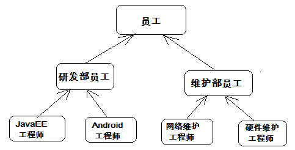
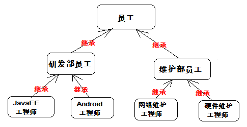

## 继承和抽象

### 继承的概念

在现实生活中，继承一般指的是子女继承父辈的财产。在程序中，继承描述的是事物之间的所属关系，通过继承可以使多种事物之间形成一种关系体系。

例如公司中的研发部员工和维护部员工都属于员工，程序中便可以描述为研发部员工和维护部员工继承自员工，同理，JavaEE工程师和Android工程师继承自研发部员工，而维网络维护工程师和硬件维护工程师继承自维护部员工。这些员工之间会形成一个继承体系，具体如下图所示。



在Java中，类的继承是指在一个现有类的基础上去构建一个新的类，构建出来的新类被称作子类，现有类被称作父类，子类会自动拥有父类所有可继承的属性和方法。

### 继承的格式&使用

在程序中，如果想声明一个类继承另一个类，需要使用extends关键字。
格式：class 子类 extends 父类 {}
接下来通过一个案例来学习子类是如何继承父类的，如下所示。Employee .java

```
/*
* 定义员工类Employee
*/
public class Employee {
    String name; // 定义name属性
    // 定义员工的工作方法
    public void work() {
        System.out.println("尽心尽力地工作");
    }
}
```

```
/*
* 定义研发部员工类Developer 继承 员工类Employee
*/
class Developer extends Employee {
    // 定义一个打印name的方法
    public void printName() {
        System.out.println("name=" + name);
    }
}
```

```
* 定义测试类
*/
public class Example01 {
    public static void main(String[] args) {
        Developer d = new Developer(); // 创建一个研发部员工类对象
        d.name = "小明"; // 为该员工类的name属性进行赋值
        d.printName(); // 调用该员工的printName()方法
        d.work(); // 调用Developer类继承来的work()方法
    }
}
```

运行结果如下图所示。


在上述代码中，Developer类通过extends关键字继承了Employee类，这样Developer类便是Employee类的子类。从运行结果不难看出，子类虽然没有定义name属性和work()方法，但是却能访问这两个成员。这就说明，子类在继承父类的时候，会自动拥有父类的成员。

### 继承的好处&注意事项

继承的好处：

* 继承的出现提高了代码的复用性，提高软件开发效率。
* 继承的出现让类与类之间产生了关系，提供了多态的前提。

在类的继承中，需要注意一些问题，具体如下：
1、在Java中，类只支持单继承，不允许多继承，也就是说一个类只能有一个直接父类，例如下面这种情况是不合法的。

```
class A{} 
class B{}
class C extends A,B{} // C类不可以同时继承A类和B类
```

2、多个类可以继承一个父类，例如下面这种情况是允许的。

```
class A{}
class B extends A{}
class C extends A{} // 类B和类C都可以继承类A
```

3、在Java中，多层继承是可以的，即一个类的父类可以再去继承另外的父类，例如C类继承自B类，而B类又可以去继承A类，这时，C类也可称作A类的子类。下面这种情况是允许的。

```
class A{}
class B extends A{} // 类B继承类A，类B是类A的子类
class C extends B{} // 类C继承类B，类C是类B的子类，同时也是类A的子类
```

4、在Java中，子类和父类是一种相对概念，也就是说一个类是某个类父类的同时，也可以是另一个类的子类。例如上面的这种情况中，B类是A类的子类，同时又是C类的父类。

### 继承-子父类中成员变量的特点

了解了继承给我们带来的好处，提高了代码的复用性。继承让类与类或者说对象与对象之间产生了关系。那么，当继承出现后，类的成员之间产生了那些变化呢？
成员变量：如果子类父类中出现不同名的成员变量，这时的访问是没有任何问题。
看如下代码：

```
class Fu
{
    //Fu中的成员变量。
    int num = 5;
}
class Zi extends Fu
{
    //Zi中的成员变量
    int num2 = 6;
    //Zi中的成员方法
    public void show()
    {
//访问父类中的num
        System.out.println("Fu num="+num);
//访问子类中的num2
        System.out.println("Zi num2="+num2);
    }
}
class Demo
{
    public static void main(String[] args)
    {
        Zi z = new Zi(); //创建子类对象
        z.show(); //调用子类中的show方法
    }
}
```

代码说明：Fu类中的成员变量是非私有的，子类中可以直接访问，若Fu类中的成员变量私有了，子类是不能直接访问的。

当子父类中出现了同名成员变量时，在子类中若要访问父类中的成员变量，必须使用关键字super来完成。super用来表示当前对象中包含的父类对象空间的引用。
在子类中，访问父类中的成员变量格式： super**.父类中的成员变量**
看如下代码：

```
class Fu
{
    //Fu中的成员变量。
    int num = 5;
}
class Zi extends Fu
{
    //Zi中的成员变量
    int num = 6;
    void show()
    {
//子父类中出现了同名的成员变量时
//在子类中需要访问父类中非私有成员变量时，需要使用super关键字
//访问父类中的num
        System.out.println("Fu num="+super.num);
//访问子类中的num2
        System.out.println("Zi num2="+this.num);
    }
}
class Demo5
{
    public static void main(String[] args)
    {
        Zi z = new Zi(); //创建子类对象
        z.show(); //调用子类中的show方法
    }
}
```

### 继承-子父类中成员方法特点-重写&应用

子父类中成员方法的特点
当在程序中通过对象调用方法时，会先在子类中查找有没有对应的方法，若子类中存在就会执行子类中的方法，若子类中不存在就会执行父类中相应的方法。
看如下代码：

```
class Fu{
    public void show(){
        System.out.println("Fu类中的show方法执行");
    }
}
class Zi extends Fu{
    public void show2(){
        System.out.println("Zi类中的show2方法执行");
    }
}
public class Test{
    public static void main(String[] args) {
        Zi z = new Zi();
        z.show(); //子类中没有show方法，但是可以找到父类方法去执行
        z.show2();
    }
}
```

### 成员方法特殊情况——覆盖

子类中出现与父类一模一样的方法时，会出现覆盖操作，也称为override重写、复写或者覆盖。

```
class Fu
{
    public void show()
    {
        System.out.println("Fu show");
    }
}
class Zi extends Fu
{
    //子类复写了父类的show方法
    public void show()
    {
        System.out.println("Zi show");
    }
}
```

### 方法重写（覆盖）的应用

当子类需要父类的功能，而功能主体子类有自己特有内容时，可以重写父类中的方法，这样，即沿袭了父类的功能，又定义了子类特有的内容。
举例：比如手机，当描述一个手机时，它具有发短信，打电话，显示来电号码功能，后期由于手机需要在来电显示功能中增加显示姓名和头像，这时可以重新定义一个类描述智能手机，并继承原有描述手机的类。并在新定义的类中覆盖来电显示功能，在其中增加显示姓名和头像功能。
在子类中，访问父类中的成员方法格式： super**.父类中的成员方法();**
看如下代码：

```
//手机类
class Phone{
    public void sendMessage(){
        System.out.println("发短信");
    }
    public void call(){
        System.out.println("打电话");
    }
    public void showNum(){
        System.out.println("来电显示号码");
    }
}

//智能手机类
class NewPhone extends Phone{

    //覆盖父类的来电显示号码功能，并增加自己的显示姓名和图片功能
    public void showNum(){
//调用父类已经存在的功能使用super
        super.showNum();
//增加自己特有显示姓名和图片功能
        System.out.println("显示来电姓名");
        System.out.println("显示头像");
    }
}
```

### 方法重写的注意事项

重写需要注意的细节问题：子类方法覆盖父类方法，必须要保证权限大于等于父类权限。

```
class Fu(){
    void show(){}
    public void method(){}
}
class Zi() extends Fu{
    public void show(){} //编译运行没问题
        void method(){} //编译错误
}
```

写法上稍微注意:必须一模一样:方法的返回值类型 方法名 参数列表都要一样。

总结：当一个类是另一个类中的一种时，可以通过继承，来继承属性与功能。如果父类具备的功能内容需要子类特殊定义时，进行方法重写。

不能为了继承某个功能而随意进行继承操作， 必须要符合 is a 的关系

* 苹果 is a 水果
* 男人 is a 人
* 狗 is a 人 ， 这种情况就不能继承了

## 重载与重写对比

### 重载

权限修饰符(public private 默认):无关
方法名:重载的两个方法的方法名必须相同
形参列表:

* 形参类型的顺序不同
* 形参的个数不同
* 形参的类型不同

三者至少满足一个
返回值类型:重载与返回值类型无关

### 重写

权限修饰符(public private 默认): 子类方法的权限>=父类的方法的权限
方法名: 子类方法和父类方法必须相同
形参列表: 子类方法和父类方法的形参列表必须相同
返回值类型:基本类数据类型:必须相同
引用数据类型:子类方法的返回值类型和父类方法的返回值类型相同，或者子类方法的返回值类型是父类方法的返回值类型的 子类

## 抽象类

### 抽象类-产生

当编写一个类时，我们往往会为该类定义一些方法，这些方法是用来描述该类的功能具体实现方式，那么这些方法都有具体的方法体。但是有的时候，某个父类只是知道子类应该包含怎么样的方法，但是无法准确知道子类如何实现这些方法。比如一个图形类应该有一个求周长的方法，但是不同的图形求周长的算法不一样。那该怎么办呢？
分析事物时，发现了共性内容，就出现向上抽取。会有这样一种特殊情况，就是方法功能声明相同，但方法功能主体不同。那么这时也可以抽取，但只抽取方法声明，不抽取方法主体。那么此方法就是一个抽象方法。
描述JavaEE工程师：行为：工作。
描述Android工程师：行为：工作。
JavaEE工程师和Android工程师之间有共性，可以进行向上抽取。抽取它们的所属共性类型：研发部员工。由于JavaEE工程师和Android工程师都具有工作功能，但是他们具体工作内容却不一样。这时在描述研发部员工时，发现了有些功能（工作）不具体，这些不具体的功能，需要在类中标识出来，通过java中的关键字abstract(抽象)。
当定义了抽象函数的类也必须被abstract关键字修饰，被abstract关键字修饰的类是抽象类。

### 抽象类&抽象方法的定义

抽象方法定义的格式：

```
public abstract 返回值类型 方法名(参数);
    抽象类定义的格式：
    abstract class 类名 {
}
```

看如下代码：

```
//研发部员工 
abstract class Developer {
    public abstract void work();//抽象函数。需要abstract修饰，并分号;结束
}

//JavaEE工程师
class JavaEE extends Developer{
    public void work() {
        System.out.println("正在研发淘宝网站");
    }
}
```

```
//Android工程师

class Android extends Developer {
    public void work() {
        System.out.println("正在研发淘宝手机客户端软件");
    }
}
```

### 抽象类的特点

* 1、抽象类和抽象方法都需要被abstract修饰。抽象方法一定要定义在抽象类中。
* 2、抽象类不可以直接创建对象，原因：调用抽象方法没有意义。
* 3、只有覆盖了抽象类中所有的抽象方法后，其子类才可以创建对象。否则该子类还是一个抽象类。

之所以继承抽象类，更多的是在思想，是面对共性类型操作会更简单。

抽象类的细节问题：
1、抽象类一定是个父类？ 是的，因为不断抽取而来的。
2、抽象类中是否可以不定义抽象方法。是可以的，那这个抽象类的存在到底有什么意义呢？不让该类创建对象,方法可以直接让子类去使用
3、抽象关键字abstract不可以和哪些关键字共存？

* private：私有的方法子类是无法继承到的，也不存在覆盖，而abstract和private一起使用修饰方法，abstract既要子类去实现这个方法，而private修饰子类根本无法得到父类这个方法。互相矛盾。
* final，暂时不关注，后面学
* static，暂时不关注，后面学

## 综合案例---员工类系列定义

### 案例介绍

某IT公司有多名员工，按照员工负责的工作不同，进行了部门的划分（研发部员工、维护部员工）。研发部根据所需研发的内容不同，又分为JavaEE工程师、Android工程师；维护部根据所需维护的内容不同，又分为网络维护工程师、硬件维护工程师。
公司的每名员工都有他们自己的员工编号、姓名，并要做它们所负责的工作。

工作内容

JavaEE工程师：员工号为xxx的 xxx员工，正在研发淘宝网站
Android工程师：员工号为xxx的 xxx员工，正在研发淘宝手机客户端软件
网络维护工程师：员工号为xxx的 xxx员工，正在检查网络是否畅通
硬件维护工程师：员工号为xxx的 xxx员工，正在修复打印机
请根据描述，完成员工体系中所有类的定义，并指定类之间的继承关系。进行XX工程师类的对象创建，完成工作方法的调用。

### 案例分析

根据上述部门的描述，得出如下的员工体系图



根据员工信息的描述，确定每个员工都有员工编号、姓名、要进行工作。则，把这些共同的属性与功能抽取到父类中（员工类），关于工作的内容由具体的工程师来进行指定。

### 案例代码实现

根据员工体系图，完成类的定义
定义员工类(抽象类)

```
public abstract class Employee {
    private String id;// 员工编号
    private String name; // 员工姓名

    public String getId() {
        return id;
    }
    public void setId(String id) {
        this.id = id;
    }
    public String getName() {
        return name;
    }
    public void setName(String name) {
        this.name = name;
    }

    //工作方法（抽象方法）
    public abstract void work();
}
```

定义研发部员工类Developer 继承 员工类Employee

```
public abstract class Developer extends Employee {
}
```

定义维护部员工类Maintainer 继承 员工类Employee

```
public abstract class Maintainer extends Employee {
}
```

定义JavaEE工程师 继承 研发部员工类，重写工作方法

```
public class JavaEE extends Developer {
    @Override
    public void work() {
        System.out.println("员工号为 " + getId() + " 的 " + getName() + " 员工，正在研发淘宝网站");
    }
}
```

定义Android工程师 继承 研发部员工类，重写工作方法

```
public class Android extends Developer {
    @Override
    public void work() {
        System.out.println("员工号为 " + getId() + " 的 " + getName() + " 员工，正在研发淘宝手机客户端软件");
    }
}
```

定义Network网络维护工程师 继承 维护部员工类，重写工作方法

```
public class Network extends Maintainer {
    @Override
    public void work() {
        System.out.println("员工号为 " + getId() + " 的 " + getName() + " 员工，正在检查网络是否畅通");
    }
}
```

定义Hardware硬件维护工程师 继承 维护部员工类，重写工作方法

```
public class Hardware extends Maintainer {
    @Override
    public void work() {
        System.out.println("员工号为 " + getId() + " 的 " + getName() + " 员工，正在修复打印机");
    }
}
```

在测试类中，创建JavaEE工程师对象，完成工作方法的调用

```
public class Test {
    public static void main(String[] args) {
//创建JavaEE工程师员工对象
        JavaEE ee = new JavaEE();
//设置该员工的编号
        ee.setId("000015");
//设置该员工的姓名
        ee.setName("小明");
//调用该员工的工作方法
        ee.work();
    }
}
```

# Reference Links：

https://www.cnblogs.com/ginb/p/7128615.html
