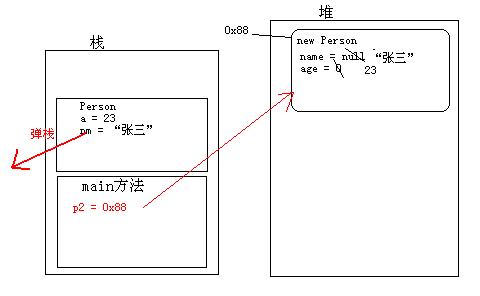
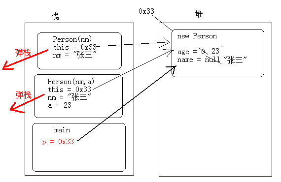

# this，super和构造方法

## 构造方法

我们对封装已经有了基本的了解，接下来我们来看一个新的问题，依然以Person为例，由于Person中的属性都被private了，外界无法直接访问属性，必须对外提供相应的set和get方法。当创建Person对象的时候，Person对象一创建就要明确其姓名和年龄，那该怎么做呢？

### 构造方法介绍

在开发中经常需要在创建对象的同时明确对象的属性值，比如员工入职公司就要明确他的姓名、年龄等属性信息。也就是在创建对象的时候就要做的事情，当使用new关键字创建对象时，怎么给对象的属性初始化值呢？这就要学习Java另外一门小技术，构造方法。
那什么是构造方法呢？从字面上理解就是对象创建时要执行的方法。既然是对象创建时要执行的方法，那么只要在new对象时，知道其执行的构造方法是什么，就可以在执行这个方法的时候给对象进行属性赋值。

构造方法的格式：

```
修饰符 构造方法名(参数列表)
{
}
```

### 构造方法的体现

* 构造方法没有返回值类型。也不需要写返回值。因为它是为构建对象的，对象创建完，方法就执行结束。
* 构造方法名称必须和类型保持一致。
* 构造方法没有具体的返回值。

构造方法的代码体现：

```
class Person {
    // Person的成员属性age和name
    private int age;
    private String name;

    // Person的构造方法，拥有参数列表
    Person(int a, String nm) {
    // 接受到创建对象时传递进来的值，将值赋给成员属性
        age = a;
        name = nm;
    }
}
```

### 构造方法调用和内存图解

理解构造方法的格式和基本功能之后，现在就要研究构造方法是怎么执行的呢？在创建对象的时候是如何初始化的呢？构造方法是专门用来创建对象的，也就是在new对象时要调用构造方法。现在来看看如何调用构造方法。

```
class Person {
    // Person的成员属性age和name
    private int age;
    private String name;

    // Person的构造方法，拥有参数列表
    Person(int a, String nm) {
    // 接受到创建对象时传递进来的值，将值赋给成员属性
        age = a;
        name = nm;
    }

    public void speak() {
        System.out.println("name=" + name + ",age=" + age);
    }
}

class PersonDemo {
    public static void main(String[] args) {
    // 创建Person对象，并明确对象的年龄和姓名
        Person p2 = new Person(23, "张三");
        p2.speak();
    }
}
```

上述代码演示了创建对象时构造方法的调用。即在创建对象时，会调用与参数列表对应的构造方法。

上述代码的图解：



图解说明：

* 1、首先会将main方法压入栈中，执行main方法中的 new Person(23,"张三");
* 2、在堆内存中分配一片区域，用来存放创建的Person对象，这片内存区域会有属于自己的内存地址（0x88）。然后给成员变量进行默认初始化（name=null，age=0）。
* 3、执行构造方法中的代码（age = a ; name = nm;）,将变量a对应的23赋值给age，将变量nm对应的”张三赋值给name，这段代码执行结束后，成员变量age和name的值已经改变。执行结束之后构造方法弹栈，Person对象创建完成。将Person对象的内存地址0x88赋值给p2。

### 默认构造方法和细节

如果没有显示指定构造方法，当在编译Java文件时，编译器会自动给class文件中添加默认的构造方法。如果在描述类时，我们显示指定了构造方法，那么，当在编译Java源文件时，编译器就不会再给class文件中添加默认构造方法。

```
class Person {
//如果没有显示指定构造方法，编译会在编译时自动添加默认的构造方法
//Person(){} //空参数的默认构造方法
}
```

当在描述事物时，要不要在类中写构造方法呢？这时要根据描述事物的特点来确定，当描述的事物在创建其对象时就要明确属性的值，这时就需要在定义类的时候书写带参数的构造方法。若创建对象时不需要明确具体的数据，这时可以不用书写构造方法（不书写也有默认的构造方法）。

构造方法的细节：

* 1、一个类中可以有多个构造方法，多个构造方法是以重载的形式存在的
* 2、构造方法是可以被private修饰的，作用：其他程序无法创建该类的对象。

```
class Person {
    private int age;
    private String name;

    // 私有无参数的构造方法，即外界不能通过new Person();语句创建本类对象
    private Person() {
    }

    // 多个构造方法是以重载的形式存在
    Person(int a) {
        age = a;
    }

    Person(String nm, int a) {
        name = nm;
        age = a;
    }
}
```

### 构造方法和一般方法区别

构造方法在对象创建时就执行了，而且只执行一次。一般方法是在对象创建后，需要使用时才被对象调用，并可以被多次调用。
问题：有了构造方法之后可以对对象的属性进行初始化，那么还需要对应的set和get方法吗？需要相应的set和get方法，因为对象在创建之后需要修改和访问相应的属性值时，在这时只能通过set或者get方法来操作。
思考，如下代码有问题吗？

```
class Person {
    void Person() {//void有问题
    }
}

class PersonDemo {
    public static void main(String[] args) {
        Person p = new Person();
    }
}
```

## this关键字

在之前学习方法时，我们知道方法之间是可以相互调用的，那么构造方法之间能不能相互调用呢？若可以，怎么调用呢？

### this调用构造方法

在之前学习方法之间调用时，可以通过方法名进行调用。可是针对构造方法，无法通过构造方法名来相互调用。构造方法之间的调用，可以通过this关键字来完成。
构造方法调用格式：

```
this(参数列表);
```

构造方法的调用

```
class Person {
    // Person的成员属性
    private int age;
    private String name;

    // 无参数的构造方法
    Person() {
    }

    // 给姓名初始化的构造方法
    Person(String nm) {
        name = nm;
    }

    // 给姓名和年龄初始化的构造方法
    Person(String nm, int a) {
    // 由于已经存在给姓名进行初始化的构造方法 name = nm;因此只需要调用即可
    // 调用其他构造方法，需要通过this关键字来调用
        this(nm);
    // 给年龄初始化
        age = a;
    }
}
```

### this的原理图解

了解了构造方法之间是可以相互调用，那为什么他们之间通过this就可以调用呢？通过上面的学习，简单知道使用this可以实现构造方法之间的调用，但是为什么就会知道this调用哪一个构造方法呢？接下来需要图解完成。

```
class Person {
    private int age;
    private String name;

    Person() {
    }
    Person(String nm) {
        name = nm;
    }
    Person(String nm, int a) {
        this(nm);
        age = a;
    }
}

class PersonDemo {
    public static void main(String[] args) {
        Person p = new Person("张三", 23);
    }
}
```



图列说明：

* 1、先执行main方法，main方法压栈，执行其中的new Person(“张三”,23);
* 2、堆内存中开辟空间，并为其分配内存地址0x33，，紧接着成员变量默认初始化（name=null age = 0）；
* 3、拥有两个参数的构造方法（Person（String nm , int a））压栈，在这个构造方法中有一个隐式的this，因为构造方法是给对象初始化的，那个对象调用到这个构造方法，this就指向堆中的那个对象。
* 4、由于Person（String nm , int a）构造方法中使用了this(nm);构造方法Person(String nm)就会压栈，并将“张三”传递给nm。在Person（String nm , int a）构造方法中同样也有隐式的this，this的值同样也为0x33，这时会执行其中name = nm，即把“张三”赋值给成员的name。当赋值结束后Person（String nm , int a）构造方法弹栈。
* 5、程序继续执行构造方法（Person（String nm , int a）中的age = a；这时会将23赋值给成员属性age。赋值结束构造方法（Person（String nm , int a）弹栈。
* 6、当构造方法（Person（String nm , int a）弹栈结束后，Person对象在内存中创建完成，并将0x33赋值给main方法中的p引用变量。

#### this到底代表什么呢？this代表的是对象，具体代表哪个对象呢？哪个对象调用了this所在的方法，this就代表哪个对象。

#### 调用其他构造方法的语句必须定义在构造方法的第一行，原因是初始化动作要最先执行。

### 成员变量和局部变量同名问题

通过上面学习，基本明确了对象初始化过程中的细节，也知道了构造方法之间的调用是通过this关键字完成的。但this也有另外一个用途，当在方法中出现了局部变量和成员变量同名的时候，那么在方法中怎么区别局部变量成员变量呢？可以在成员变量名前面加上this.来区别成员变量和局部变量。

```
class Person {
    private int age;
    private String name;

    // 给姓名和年龄初始化的构造方法
    Person(String name, int age) {
    // 当需要访问成员变量是，只需要在成员变量前面加上this.即可
        this.name = name;
        this.age = age;
    }
    public void speak() {
        System.out.println("name=" + this.name + ",age=" + this.age);
    }
}

class PersonDemo {
    public static void main(String[] args) {
        Person p = new Person("张三", 23);
        p.speak();
    }
}
```

### this的应用

学习完了构造方法、this的用法之后，现在做个小小的练习。需求：在Person类中定义功能，判断两个人是否是同龄人

```
class Person {
    private int age;
    private String name;

    // 给姓名和年龄初始化的构造方法
    Person(String name, int age) {
   // 当需要访问成员变量是，只需要在成员变量前面加上this.即可
        this.name = name;
        this.age = age;
    }

    public void speak() {
        System.out.println("name=" + this.name + ",age=" + this.age);
    }

    // 判断是否为同龄人
    public boolean equalsAge(Person p) {
    // 使用当前调用该equalsAge方法对象的age和传递进来p的age进行比较
    // 由于无法确定具体是哪一个对象调用equalsAge方法，这里就可以使用this来代替
    /*
    * if(this.age == p.age) { return true; } return false;
    */
        return this.age = p.age;
    }
}
```

## super关键字

子父类中构造方法的调用
在创建子类对象时，父类的构造方法会先执行，因为子类中所有构造方法的第一行有默认的隐式super();语句。
格式：

```
//调用本类中的构造方法
this(实参列表);
//调用父类中的空参数构造方法
super();
//调用父类中的有参数构造方法
super(实参列表);
```

为什么子类对象创建都要访问父类中的构造方法？因为子类继承了父类的内容，所以创建对象时，必须要先看父类是如何对其内容进行初始化的，看如下程序：

```
public class Test {
    public static void main(String[] args) {
        new Zi();
    }

}
class Fu{
    int num ;
    Fu(){
        System.out.println("Fu构造方法"+num);
        num = 4;
    }
}
class Zi extends Fu{
    Zi(){
    //super(); 调用父类空参数构造方法
        System.out.println("Zi构造方法"+num);
    }
}
//　　执行结果：
//　　Fu构造方法0
//　　Zi构造方法4
```

通过结果发现，子类构造方法执行时中，调用了父类构造方法，这说明，子类构造方法中有一句super()。那么，子类中的构造方法为什么会有一句隐式的super()呢？

原因：子类会继承父类中的内容，所以子类在初始化时，必须先到父类中去执行父类的初始化动作。这样，才可以使用父类中的内容。
当父类中没有空参数构造方法时，子类的构造方法必须有显示的super语句，指定要访问的父类有参数构造方法。

### 子类对象创建过程的细节

如果子类的构造方法第一行写了this调用了本类其他构造方法，那么super调用父类的语句还有吗？这时是没有的，因为this()或者super(),只能定义在构造方法的第一行，因为初始化动作要先执行。
父类构造方法中是否有隐式的super呢？也是有的。记住：只要是构造方法默认第一行都是super();
父类的父类是谁呢？super调用的到底是谁的构造方法呢？Java体系在设计，定义了一个所有对象的父类Object

#### 类中的构造方法默认第一行都有隐式的super()语句，用来访问父类中的空参数构造方法。所以父类的构造方法既可以给自己的对象初始化，也可以给自己的子类对象初始化。如果默认的隐式super()语句在父类中没有对应的构造方法，那么必须在构造方法中通过this或者super的形式明确要调用的构造方法。

### super应用

练习：描述学生和工人这两个类，将他们的共性name和age抽取出来存放在父类中，并提供相应的get和set方法，同时需要在创建学生和工人对象就必须明确姓名和年龄

```
//定义Person类，将Student和Worker共性抽取出来
class Person {
    private String name;
    private int age;
    public Person(String name, int age) {
// super();
        this.name = name;
        this.age = age;
    }
    public String getName() {
        return name;
    }
    public void setName(String name) {
        this.name = name;
    }
    public int getAge() {
        return age;
    }
    public void setAge(int age) {
        this.age = age;
    }
}
class Student extends Person {
// Student类的构造方法
    Student(String name, int age) {
// 使用super关键字调用父类构造方法，进行相应的初始化动作
        super(name, age);
    }
    public void study() {// Studnet中特有的方法
        System.out.println(this.getName() + "同学在学习");
    }
}
class Worker extends Person {
    Worker(String name, int age) {
// 使用super关键字调用父类构造方法，进行相应的初始化动作
        super(name, age);
    }
    public void work() {// Worker 中特有的方法
        System.out.println(this.getName() + "工人在工作");
    }
}
public class Test {
    public static void main(String[] args) {
        Student stu = new Student("小明",23);
        stu.study();

        Worker w = new Worker("小李",45);
        w.work();
    }
}
```

## 知识点总结

this关键字

* this关键字，本类对象的引用
* this是在方法中使用的，哪个对象调用了该方法，那么，this就代表调用该方法的对象引用
* this什么时候存在的？当创建对象的时候，this存在的
* this的作用：用来区别同名的成员变量与局部变量（this.成员变量）

```
public void setName(String name) {
    this.name = name;
}
```

构造方法： 用来给类的成员进行初始化操作

格式：

```
修饰符 类名 (参数列表) {
    ...
}
```

构造方法的特点：

* 方法名与类名相同
* 没有返回值，也没有返回值类型，连void也没有
* 只有在创建对象的时候才可以被调用

super关键字

* super指的是父类的存储空间(理解为父类的引用)
* 调用父类的成员变量：super.成员变量;
* 调用父类的构造方法:super(参数);
* 调用父类的成员方法:super.成员方法();

继承中的构造方法注意事项：

* 如果我们手动给出了构造方法，编译器不会在给我们提供默认的空参数构造方法
* 如果我们没写任何的构造方法，编译器提供给我们一个空参数构造方法
* 在构造方法中，默认的第一条语句为 super();它是用来访问父类中的空参数构造方法，进行父类成员的初始化操作
* 当父类中没有空参数构造方法的时候， 可以通过 super(参数) 访问父类有参数的构造方法； 也可以通过 this(参数) 访问本类中其他构造方法，前提是本类中的其他构造方法已经能够正常访问父类构造方法；
* super(参数) 与 this(参数) 不能同时在构造方法中存在。

# Reference Links：

https://www.cnblogs.com/ginb/p/7158908.html
