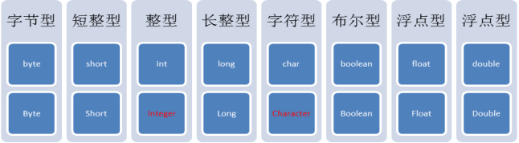
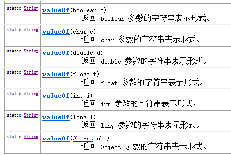
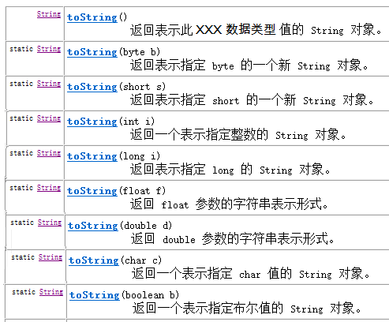
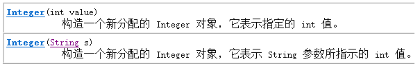
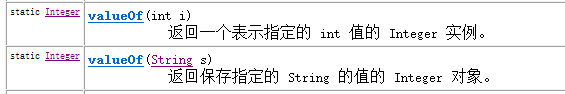

## 基本类型包装类

Java中有8种基本的数据类型，可是这些数据是基本数据，想对其进行复杂操作，变的很难。怎么办呢？
在实际程序使用中，程序界面上用户输入的数据都是以字符串类型进行存储的。而程序开发中，我们需要把字符串数据，根据需求转换成指定的基本数据类型，如年龄需要转换成int类型，考试成绩需要转换成double类型等。那么，想实现字符串与基本数据之间转换怎么办呢？
Java中提供了相应的对象来解决该问题，基本数据类型对象包装类：java将基本数据类型值封装成了对象。封装成对象有什么好处？可以提供更多的操作基本数值的功能。8种基本类型对应的包装类如下：



其中需要注意int对应的是Integer，char对应的Character，其他6个都是基本类型首字母大写即可。

基本数据类型对象包装类特点：用于在基本数据和字符串之间进行转换。

### 将字符串转成基本类型


parseXXX(String s);其中XXX表示基本类型，参数为可以转成基本类型的字符串，如果字符串无法转成基本类型，将会发生数字转换的问题 NumberFormatException

```
System.out.println(Integer.parseInt("123") + 2);
//打印结果为 125
```

### 将基本数值转成字符串

有3种方式：

* 基本类型直接与””相连接即可；34+""
* 调用String的valueOf方法；String.valueOf(34) ；



* 调用包装类中的toString方法；Integer.toString(34) ；



### 基本类型和对象转换

使用int类型与Integer对象转换进行演示，其他基本类型转换方式相同。

### 基本数值---->包装对象





```
Integer i = new Integer(4);//使用构造函数函数
Integer ii = new Integer("4");//构造函数中可以传递一个数字字符串

Integer iii = Integer.valueOf(4);//使用包装类中的valueOf方法
Integer iiii = Integer.valueOf("4");//使用包装类中的valueOf方法
```

### 包装对象---->基本数值


```
int num = i.intValue();
```

### 自动装箱拆箱

在需要的情况下，基本类型与包装类型可以通用。有些时候我们必须使用引用数据类型时，可以传入基本数据类型。
比如：
基本类型可以使用运算符直接进行计算，但是引用类型不可以。而基本类型包装类作为引用类型的一种却可以计算，原因在于，Java”偷偷地”自动地进行了对象向基本数据类型的转换。
相对应的，引用数据类型变量的值必须是new出来的内存空间地址值，而我们可以将一个基本类型的值赋值给一个基本类型包装类的引用。原因同样在于Java又”偷偷地”自动地进行了基本数据类型向对象的转换。
自动拆箱：对象转成基本数值
自动装箱：基本数值转成对象

```
Integer i = 4;//自动装箱。相当于Integer i = Integer.valueOf(4);
i = i + 5;//等号右边：将i对象转成基本数值(自动拆箱) i.intValue() + 5; 加法运算完成后，再次装箱，把基本数值转成对象。
```

自动装箱(byte常量池)细节

当数值在byte范围之内时，进行自动装箱，不会新创建对象空间而是使用已有的空间。

```
Integer a = new Integer(3);
Integer b = new Integer(3);
System.out.println(a==b);//false
System.out.println(a.equals(b));//true

System.out.println("---------------------");
Integer x = 127;
Integer y = 127;
//在jdk1.5自动装箱时，如果数值在byte范围之内，不会新创建对象空间而是使用原来已有的空间。
System.out.println(x==y); //true
System.out.println(x.equals(y)); //true
```

## System类

在API中System类介绍的比较简单，我们给出定义，System中代表程序所在系统，提供了对应的一些系统属性信息，和系统操作。
System类不能手动创建对象，因为构造方法被private修饰，阻止外界创建对象。System类中的都是static方法，类名访问即可。在JDK中，有许多这样的类。
常用方法

currentTimeMillis() 获取当前系统时间与1970年01月01日00:00点之间的毫秒差值

exit(int status) 用来结束正在运行的Java程序。参数传入一个数字即可。通常传入0记为正常状态，其他为异常状态

gc() 用来运行JVM中的垃圾回收器，完成内存中垃圾的清除。

getProperty(String key) 用来获取指定键(字符串名称)中所记录的系统属性信息


arraycopy方法，用来实现将源数组部分元素复制到目标数组的指定位置

### System类的方法练习

验证for循环打印数字1-9999所需要使用的时间（毫秒）

```
public static void main(String[] args) {
        long start = System.currentTimeMillis();
        for (int i=0; i<10000; i++) {
            System.out.println(i);
        }
        long end = System.currentTimeMillis();
        System.out.println("共耗时毫秒：" + (end-start) );
    }
```

练习二：将src数组中前3个元素，复制到dest数组的前3个位置上

复制元素前：src数组元素[1,2,3,4,5]，dest数组元素[6,7,8,9,10]
复制元素后：src数组元素[1,2,3,4,5]，dest数组元素[1,2,3,9,10]

```
 public static void main(String[] args) {
        int[] src = new int[]{1,2,3,4,5};
        int[] dest = new int[]{6,7,8,9,10};
        System.arraycopy( src, 0, dest, 0, 3);
        //代码运行后：两个数组中的元素发生了变化

        //src数组元素[1,2,3,4,5]
        //dest数组元素[1,2,3,9,10]
    }
```

练习三：循环生成100-999之间的的三位数并进行打印该数，当该数能被10整除时，结束运行的程序

```
 public static void main(String[] args){
        Random random = new Random();
        while(true){
            int number = random.nextInt(900)+100; //0-899 + 100
            if (nmumber % 10 == 0) {
                System.exit(0);
            }
        }
    }
```

## Math类

Math 类是包含用于执行基本数学运算的方法的数学工具类，如初等指数、对数、平方根和三角函数。
类似这样的工具类[工具类，代表能够完成一系列功能的类，在使用它们时，不用创建对象，该类中方法为静态方法]，其所有方法均为静态方法，并且一般不会创建对象。如System类

常用方法

abs方法,结果都为正数

```
double d1 = Math.abs(-5); // d1的值为5
double d2 = Math.abs(5); // d2的值为5
```

ceil方法，结果为比参数值大的最小整数的double值

```
double d1 = Math.ceil(3.3); //d1的值为 4.0
double d2 = Math.ceil(-3.3); //d2的值为 -3.0
double d3 = Math.ceil(5.1); // d3的值为 6.0
```

floor方法，结果为比参数值小的最大整数的double值

```
double d1 = Math.floor(3.3); //d1的值为3.0
double d2 = Math.floor(-3.3); //d2的值为-4.0
double d3 = Math.floor(5.1); //d3的值为 5.0
```

max方法，返回两个参数值中较大的值

```
double d1 = Math.max(3.3, 5.5); //d1的值为5.5
double d2 = Math.max(-3.3, -5.5); //d2的值为-3.3
```

min方法，返回两个参数值中较小的值

```
double d1 = Math.min(3.3, 5.5); //d1的值为3.3
double d2 = Math.max(-3.3, -5.5); //d2的值为-5.5
```

pow方法，返回第一个参数的第二个参数次幂的值

```
double d1 = Math.pow(2.0, 3.0); //d1的值为 8.0
double d2 = Math.pow(3.0, 3.0); //d2的值为27.0
```

round方法，返回参数值四舍五入的结果

```
double d1 = Math.round(5.5); //d1的值为6.0
double d2 = Math.round(5.4); //d2的值为5.0
```

random方法，产生一个大于等于0.0且小于1.0的double小数

```
double d1 = Math.random();
```

## Arrays类

此类包含用来操作数组（比如排序和搜索）的各种方法。需要注意，如果指定数组引用为 null，则访问此类中的方法都会抛出空指针异常NullPointerException。

### 常用方法

sort方法，用来对指定数组中的元素进行排序（元素值从小到大进行排序）

```
//源arr数组元素{1,5,9,3,7}, 进行排序后arr数组元素为{1,3,5,7,9}
int[] arr = {1,5,9,3,7};
Arrays.sort( arr );
```

toString方法，用来返回指定数组元素内容的字符串形式

```
int[] arr = {1,5,9,3,7};
String str = Arrays.toString(arr); // str的值为[1, 3, 5, 7, 9]
```

binarySearch方法，在指定数组中，查找给定元素值出现的位置。若没有查询到，返回位置为-1。要求该数组必须是个有序的数组。

```
int[] arr = {1,3,4,5,6};
int index = Arrays.binarySearch(arr, 4); //index的值为2
int index2= Arrasy.binarySearch(arr, 2); //index2的值为-1
```

### Arrays类的方法练习

练习一：定义一个方法，接收一个数组，数组中存储10个学生考试分数，该方法要求返回考试分数最低的后三名考试分数。

```
  public static int[] method(double[] arr){
        Arrays.sort(arr); //进行数组元素排序（元素值从小到大进行排序）
        int[] result = new int[3]; //存储后三名考试分数
        System.arraycopy(arr, 0, result, 0, 3);//把arr数组前3个元素复制到result数组中
        return result;
    }
```

## 大数据运算

### BigInteger

java中long型为最大整数类型,对于超过long型的数据如何去表示呢.在Java的世界中,超过long型的整数已经不能被称为整数了,它们被封装成BigInteger对象.在BigInteger类中,实现四则运算都是方法来实现,并不是采用运算符.
BigInteger类的构造方法:

构造方法中,采用字符串的形式给出整数
四则运算代码：

```
  public static void main(String[] args) {
//大数据封装为BigInteger对象
        BigInteger big1 = new BigInteger("12345678909876543210");
        BigInteger big2 = new BigInteger("98765432101234567890");
//add实现加法运算
        BigInteger bigAdd = big1.add(big2);
//subtract实现减法运算
        BigInteger bigSub = big1.subtract(big2);
//multiply实现乘法运算
        BigInteger bigMul = big1.multiply(big2);
//divide实现除法运算
        BigInteger bigDiv = big2.divide(big1);
    }
```

### BigDecimal

在程序中执行下列代码,会出现什么问题?

```
System.out.println(0.09 + 0.01);
System.out.println(1.0 - 0.32);
System.out.println(1.015 * 100);
System.out.println(1.301 / 100);
```

double和float类型在运算中很容易丢失精度,造成数据的不准确性,Java提供我们BigDecimal类可以实现浮点数据的高精度运算

构造方法如下:

建议浮点数据以字符串形式给出,因为参数结果是可以预知的
实现加法减法乘法代码如下:

```
 public static void main(String[] args) {
//大数据封装为BigDecimal对象
        BigDecimal big1 = new BigDecimal("0.09");
        BigDecimal big2 = new BigDecimal("0.01");
//add实现加法运算
        BigDecimal bigAdd = big1.add(big2);

        BigDecimal big3 = new BigDecimal("1.0");
        BigDecimal big4 = new BigDecimal("0.32");
//subtract实现减法运算
        BigDecimal bigSub = big3.subtract(big4);

        BigDecimal big5 = new BigDecimal("1.105");
        BigDecimal big6 = new BigDecimal("100");
//multiply实现乘法运算
        BigDecimal bigMul = big5.multiply(big6);
    }
```

对于浮点数据的除法运算,和整数不同,可能出现无限不循环小数,因此需要对所需要的位数进行保留和选择舍入模式

# Reference Links：

https://www.cnblogs.com/ginb/p/7163380.html
