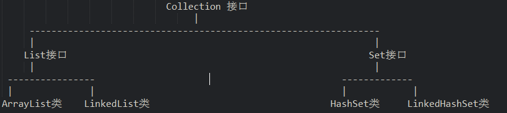
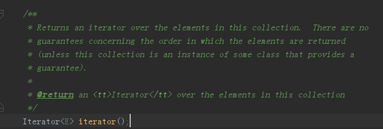
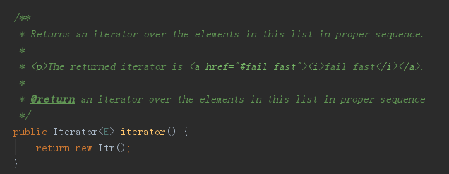
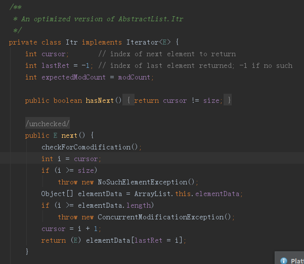
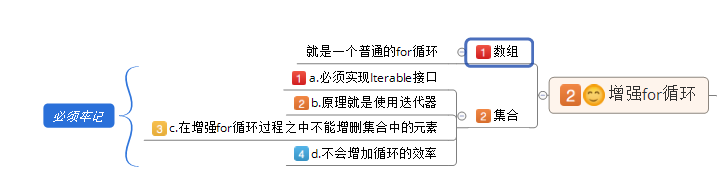

## Collection

集合，集合是java中提供的一种容器，可以用来存储多个数据。
在前面的学习中，我们知道数据多了，可以使用数组存放或者使用ArrayList集合进行存放数据。那么，集合和数组既然都是容器，它们有啥区别呢？

* 数组的长度是固定的。集合的长度是可变的。
* 集合中存储的元素必须是引用类型数据

### 集合继承关系图

ArrayList的继承关系:

查看ArrayList类发现它继承了抽象类AbstractList同时实现接口List，而List接口又继承了Collection接口。Collection接口为最顶层集合接口了。
源代码：

```
interface List extends Collection {
}
public class ArrayList extends AbstractList implements List{
}
```

集合继承体系：

这说明我们在使用ArrayList类时，该类已经把所有抽象方法进行了重写。那么，实现Collection接口的所有子类都会进行方法重写。

* Collecton接口常用的子接口有：List接口、Set接口
* List接口常用的子类有：ArrayList类、LinkedList类
* Set接口常用的子类有：HashSet类、LinkedHashSet类



## Collection

集合Collection的方法，是集合中所有实现类必须拥有的方法

Object[] toArray() 集合中的元素,转成一个数组中的元素, 集合转成数组

```
      /*  Collection接口方法
       *  Object[] toArray() 集合中的元素,转成一个数组中的元素, 集合转成数组
       *  返回是一个存储对象的数组, 数组存储的数据类型是Object
       */
      private static void function_2() {
        Collection<String> coll = new ArrayList<String>();
        coll.add("abc");
        coll.add("itcast");
        coll.add("itheima");
        coll.add("money");
        coll.add("123");
  
        Object[] objs = coll.toArray();
        for(int i = 0 ; i < objs.length ; i++){
          System.out.println(objs[i]);
        }
      }
```

学习Java中三种长度表现形式：

* 数组.length 属性 返回值 int
* 字符串.length() 方法,返回值int
* 集合.size()方法, 返回值int

 boolean contains(Object o) 判断对象是否存在于集合中,对象存在返回true

```
      /*
       * Collection接口方法
       * boolean contains(Object o) 判断对象是否存在于集合中,对象存在返回true
       * 方法参数是Object类型
       */
      private static void function_1() {
        Collection<String> coll = new ArrayList<String>();
        coll.add("abc");
        coll.add("itcast");
        coll.add("itheima");
        coll.add("money");
        coll.add("123");
  
        boolean b = coll.contains("itcast");
        System.out.println(b);
      }
```

void clear() 清空集合中的所有元素

```
      /*
       * Collection接口的方法
       * void clear() 清空集合中的所有元素
       * 集合容器本身依然存在
       */
      public static void function(){
        //接口多态的方式调用
        Collection<String> coll = new ArrayList<String>();
        coll.add("abc");
        coll.add("bcd");
        System.out.println(coll);
  
        coll.clear();
  
        System.out.println(coll);
  
      }
```

boolean remove(Object o)移除集合中指定的元素

```
 /*
     * Collection接口方法
     * boolean remove(Object o)移除集合中指定的元素
     */
    private static void function_3(){
      Collection<String> coll = new ArrayList<String>();
      coll.add("abc");
      coll.add("money");
      coll.add("itcast");
      coll.add("itheima");
      coll.add("money");
      coll.add("123");  
      System.out.println(coll);
  
      boolean b = coll.remove("money");
      System.out.println(b);
      System.out.println(coll);
    }
```

# 迭代器

java中提供了很多个集合，它们在存储元素时，采用的存储方式不同，我们要取出这些集合中的元素，可通过一种通用的获取方式来完成。

Collection集合元素的通用获取方式：在取元素之前先要判断集合中有没有元素，如果有，就把这个元素取出来，继续在判断，如果还有就再取出来。一直把集合中的所有元素全部取出。这种取出方式专业术语称为迭代。

每种集合的底层的数据结构不同,例如ArrayList是数组,LinkedList底层是链表,但是无论使用哪种集合,我们都会判断是否有元素，以及取出里面的元素的动作,那么Java为我们提供一个迭代器定义了统一的判断元素和取元素的方法。

### 迭代器的实现原理

 集合中的迭代器:获取集合中元素方式

```
接口 Iterator : 两个抽象方法
```

* boolean hasNext() 判断集合中还有没有可以被取出的元素,如果有返回true
* next() 取出集合中的下一个元素

```
Iterator接口,找实现类.
Collection接口定义方法：Iterator  iterator()  
```



ArrayList 重写方法 iterator(),返回了Iterator接口的实现类的对象





使用ArrayList集合的对象

```
Iterator it =array.iterator(),运行结果就是Iterator接口的实现类的对象
it是接口的实现类对象,调用方法 hasNext 和 next 集合元素迭代
```

### 迭代器的代码实现

```
package cn.itcast.demo;

import java.util.ArrayList;
import java.util.Collection;
import java.util.Iterator;

/*
 *  集合中的迭代器:
 *    获取集合中元素方式
 *  接口 Iterator : 两个抽象方法
 *     boolean hasNext() 判断集合中还有没有可以被取出的元素,如果有返回true
 *     next() 取出集合中的下一个元素
 *   
 *  Iterator接口,找实现类.
 *    Collection接口定义方法 
 *       Iterator  iterator()
 *    ArrayList 重写方法 iterator(),返回了Iterator接口的实现类的对象
 *    使用ArrayList集合的对象
 *     Iterator it = array.iterator(),运行结果就是Iterator接口的实现类的对象
 *     it是接口的实现类对象,调用方法 hasNext 和 next 集合元素迭代
 */
public class IteratorDemo {
    public static void main(String[] args) {
        Collection<String> coll = new ArrayList<String>();
        coll.add("abc1");
        coll.add("abc2");
        coll.add("abc3");
        coll.add("abc4");
        //迭代器,对集合ArrayList中的元素进行取出
  
        //调用集合的方法iterator()获取出,Iterator接口的实现类的对象
        Iterator<String> it = coll.iterator();
        //接口实现类对象,调用方法hasNext()判断集合中是否有元素
        //boolean b = it.hasNext();
        //System.out.println(b);
        //接口的实现类对象,调用方法next()取出集合中的元素
        //String s = it.next();
        //System.out.println(s);
  
        //迭代是反复内容,使用循环实现,循环的条件,集合中没元素, hasNext()返回了false
        while(it.hasNext()){
            String s = it.next();
            System.out.println(s);
        }
  
        /*for (Iterator<String> it2 = coll.iterator(); it2.hasNext();  ) {
            System.out.println(it2.next());
        }*/
  
    }
}
```

### 迭代器的执行过程

```
 while(it.hasNext()) {
            System.out.println(it.next());
       }
   
       //cursor记录的索引值不等于集合的长度返回true,否则返回false
         public boolean hasNext() {   
           return cursor != size; //cursor初值为0
                   
         }

        //next()方法作用:
        //①返回cursor指向的当前元素 
        //②cursor++
        public Object next() {    
                 int i = cursor; 
                 cursor = i + 1;  
                 return  elementData[lastRet = i]; 
     
             }
     //for循环迭代写法:
        for (Iterator<String> it2 = coll.iterator(); it2.hasNext();  ) {
         System.out.println(it2.next());
       } 
```

### 集合迭代中的转型

在使用集合时，我们需要注意以下几点：

1、集合中存储的其实都是对象的地址。

2、集合中可以存储基本数值吗？jdk1.5版本以后可以存储了。因为出现了基本类型包装类，它提供了自动装箱操作（基本类型对象），这样，集合中的元素就是基本数值的包装类对象。

3、存储时提升了Object。取出时要使用元素的特有内容，必须向下转型。  注意：如果集合中存放的是多个对象，这时进行向下转型会发生类型转换异常。

```
 Collection coll = new ArrayList();
     coll.add("abc");
     coll.add("aabbcc");
     coll.add("shitcast");
     Iterator it = coll.iterator();
     while (it.hasNext()) {
      //由于元素被存放进集合后全部被提升为Object类型
     //当需要使用子类对象特有方法时，需要向下转型
      String str = (String) it.next();
      System.out.println(str.length());
}
```

4、Iterator接口也可以使用 `<>`来控制迭代元素的类型的。代码演示如下：

```
 Collection<String> coll = new ArrayList<String>();
     coll.add("abc");
     coll.add("aabbcc");
     coll.add("shitcast");
     Iterator<String> it = coll.iterator();
     while (it.hasNext()) {
      String str =  it.next(); 
     //当使用Iterator<String>控制元素类型后，就不需要强转了。获取到的元素直接就是String类型
      System.out.println(str.length());
}
```

### 增强for循环遍历数组

```
  /*
      *  JDK1.5新特性,增强for循环
      *  JDK1.5版本后,出现新的接口 java.lang.Iterable
      *    Collection开是继承Iterable
      *    Iterable作用,实现增强for循环
      *  
      *    格式:
      *      for( 数据类型  变量名 : 数组或者集合 ){
      *         sop(变量);
      *      }
      */
     public static void function_1(){
        //for对于对象数组遍历的时候,能否调用对象的方法呢
        String[] str = {"abc","itcast","cn"};
        for(String s : str){
          System.out.println(s.length());
        }
      }
```

```
/*
       *  实现for循环,遍历数组
       *  好处: 代码少了,方便对容器遍历
       *  弊端: 没有索引,不能操作容器里面的元素
       */
      public static void function(){
        int[] arr = {3,1,9,0};
        for(int i : arr){
          System.out.println(i+1);
        }
        System.out.println(arr[0]);
      }
```

### 增强for循环遍历集合

```
        /*
         *  增强for循环遍历集合
         *  存储自定义Person类型
         */
        public static void function_2(){
          ArrayList<Person> array = new ArrayList<Person>();
          array.add(new Person("a",20));
          array.add(new Person("b",10));
          for(Person p : array){
            System.out.println(p);// System.out.println(p.toString());
          }
        }
```



# Reference Links：

https://www.cnblogs.com/ginb/p/7168787.html
