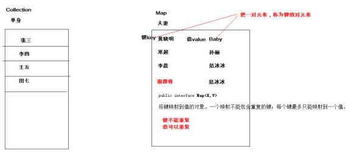
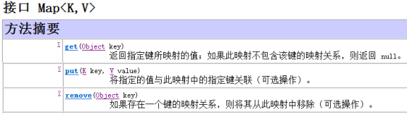
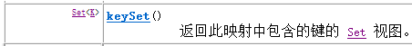
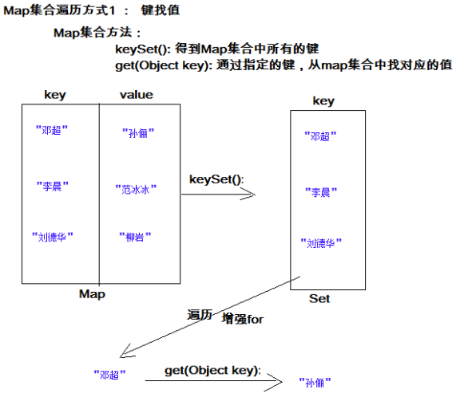
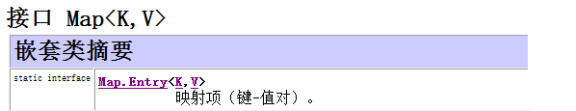
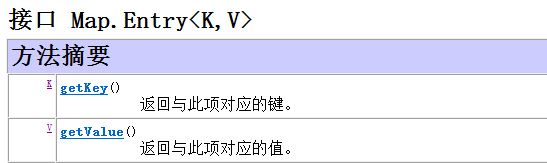
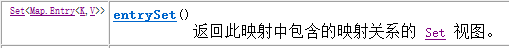
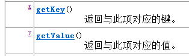

## Map接口

通过查看Map接口描述，发现Map接口下的集合与Collection接口下的集合，它们存储数据的形式不同，如下图。



Collection中的集合，元素是孤立存在的（理解为单身），向集合中存储元素采用一个个元素的方式存储。

Map中的集合，元素是成对存在的(理解为夫妻)。每个元素由键与值两部分组成，通过键可以找对所对应的值。

Collection中的集合称为单列集合，Map中的集合称为双列集合。

需要注意的是，Map中的集合不能包含重复的键，值可以重复；每个键只能对应一个值。

Map中常用的集合为HashMap集合、LinkedHashMap集合。

### Map接口中常用集合概述

通过查看Map接口描述，看到Map有多个子类，这里我们主要讲解常用的HashMap集合、LinkedHashMap集合。

* `HashMap<K,V>`：存储数据采用的哈希表结构，元素的存取顺序不能保证一致。由于要保证键的唯一、不重复，需要重写键的hashCode()方法、equals()方法。
* `LinkedHashMap<K,V>`：HashMap下有个子类LinkedHashMap，存储数据采用的哈希表结构+链表结构。通过链表结构可以保证元素的存取顺序一致；通过哈希表结构可以保证的键的唯一、不重复，需要重写键的hashCode()方法、equals()方法。

注意：Map接口中的集合都有两个泛型变量 `<K,V>`,在使用时，要为两个泛型变量赋予数据类型。两个泛型变量 `<K,V>`的数据类型可以相同，也可以不同。

### Map接口中的常用方法



put方法：将指定的键与值对应起来，并添加到集合中，方法返回值为键所对应的值。

* 使用put方法时，若指定的键(key)在集合中没有，则没有这个键对应的值，返回null，并把指定的键值添加到集合中；
* 使用put方法时，若指定的键(key)在集合中存在，则返回值为集合中键对应的值（该值为替换前的值），并把指定键所对应的值，替换成指定的新值。

get方法：获取指定键(key)所对应的值(value)

remove方法：根据指定的键(key)删除元素，返回被删除元素的值(value)。

Map接口的方法演示

```
public class MapDemo {
    public static void main(String[] args) {
//创建Map对象
        Map<String, String> map = new HashMap<String,String>();
//给map中添加元素
        map.put("星期一", "Monday");
        map.put("星期日", "Sunday");
        System.out.println(map); // {星期日=Sunday, 星期一=Monday}
//当给Map中添加元素，会返回key对应的原来的value值，若key没有对应的值，返回null
        System.out.println(map.put("星期一", "Mon")); // Monday
        System.out.println(map); // {星期日=Sunday, 星期一=Mon}
//根据指定的key获取对应的value
        String en = map.get("星期日");
        System.out.println(en); // Sunday
//根据key删除元素,会返回key对应的value值
        String value = map.remove("星期日");
        System.out.println(value); // Sunday
        System.out.println(map); // {星期一=Mon}
    }
}
```

### Map集合遍历键找值方式

键找值方式：即通过元素中的键，获取键所对应的值。

操作步骤与图解：

* 1.获取Map集合中所有的键，由于键是唯一的，所以返回一个Set集合存储所有的键



* 2.遍历键的Set集合，得到每一个键
* 3.根据键，获取键所对应的值



代码演示：

```
public class MapDemo {
    public static void main(String[] args) {
//创建Map对象
        Map<String, String> map = new HashMap<String,String>();
//给map中添加元素
        map.put("邓超", "孙俪");
        map.put("李晨", "范冰冰");
        map.put("刘德华", "柳岩");
//获取Map中的所有key
        Set<String> keySet = map.keySet();
//遍历存放所有key的Set集合
        Iterator<String> it =keySet.iterator();
        while(it.hasNext()){
//得到每一个key
            String key = it.next();
//通过key获取对应的value
            String value = map.get(key);
            System.out.println(key+"="+value);
        }
    }
}
```

### Entry键值对对象





在Map类设计时，提供了一个嵌套接口：Entry。Entry将键值对的对应关系封装成了对象。即键值对对象，这样我们在遍历Map集合时，就可以从每一个键值对（Entry）对象中获取对应的键与对应的值。

Entry是Map接口中提供的一个静态内部嵌套接口。

* getKey()方法：获取Entry对象中的键
* getValue()方法：获取Entry对象中的值
* entrySet()方法：用于返回Map集合中所有的键值对(Entry)对象，以Set集合形式返回。

### Map集合遍历键值对方式

键值对方式：即通过集合中每个键值对(Entry)对象，获取键值对(Entry)对象中的键与值。

操作步骤与图解：

* 1.获取Map集合中，所有的键值对(Entry)对象，以Set集合形式返回。



* 2.遍历包含键值对(Entry)对象的Set集合，得到每一个键值对(Entry)对象
* 3.通过键值对(Entry)对象，获取Entry对象中的键与值。



```
public class MapDemo {
    public static void main(String[] args) {
//创建Map对象
        Map<String, String> map = new HashMap<String,String>();
//给map中添加元素
        map.put("邓超", "孙俪");
        map.put("李晨", "范冰冰");
        map.put("刘德华", "柳岩");
//获取Map中的所有key与value的对应关系
        Set<Map.Entry<String,String>> entrySet = map.entrySet();
//遍历Set集合
        Iterator<Map.Entry<String,String>> it =entrySet.iterator();
        while(it.hasNext()){
//得到每一对对应关系
            Map.Entry<String,String> entry = it.next();
//通过每一对对应关系获取对应的key
            String key = entry.getKey();
//通过每一对对应关系获取对应的value
            String value = entry.getValue();
            System.out.println(key+"="+value);
        }
    }
}
```

#### 注意：Map集合不能直接使用迭代器或者foreach进行遍历。但是转成Set之后就可以使用了。

### HashMap存储自定义类型键值

练习：每位学生（姓名，年龄）都有自己的家庭住址。那么，既然有对应关系，则将学生对象和家庭住址存储到map集合中。学生作为键, 家庭住址作为值。

注意，学生姓名相同并且年龄相同视为同一名学生。

学生类

```
public class Student {
    private String name;
    private int age;
//编写构造方法，文档中已省略
//编写get,set方法，文档中已省略
//编写toString方法，文档中已省略
}
```

测试类

```
public class HashMapTest {
    public static void main(String[] args) {
//1,创建hashmap集合对象。
        Map<Student,String> map = new HashMap<Student,String>();
//2,添加元素。
        map.put(new Student("lisi",28), "上海");
        map.put(new Student("wangwu",22), "北京");
        map.put(new Student("zhaoliu",24), "成都");
        map.put(new Student("zhouqi",25), "广州");
        map.put(new Student("wangwu",22), "南京");
//3,取出元素。键找值方式
        Set<Student> keySet = map.keySet();
        for(Student key : keySet){
            String value = map.get(key);
            System.out.println(key.toString()+"....."+value);
        }
//取出元素。键值对方式
        Set<Map.Entry<Student, String>> entrySet = map.entrySet();
        for (Map.Entry<Student, String> entry : entrySet) {
            Student key = entry.getKey();
            String value = entry.getValue();
            System.out.println(key.toString()+"....."+value);
        }
    }
}
```

当给HashMap中存放自定义对象时，如果自定义对象作为key存在，这时要保证对象唯一，必须复写对象的hashCode和equals方法(如果忘记，请回顾HashSet存放自定义对象)。

如果要保证map中存放的key和取出的顺序一致，可以使用LinkedHashMap集合来存放。

## 静态导入

在导包的过程中我们可以直接导入静态部分，这样某个类的静态成员就可以直接使用了。在源码中经常会出现静态导入。

静态导入格式： import static **XXX.YYY;**  ，导入后YYY可直接使用。

例如：Map.Entry的访问，简化后为Entry

```
import static java.util.Map.Entry;
public class HashMapTest {
    public static void main(String[] args) {
//1,创建hashmap集合对象。
        Map<Student,String> map = new HashMap<Student,String>();
//取出元素。键值对方式
//Set<Map.Entry<Student, String>> entrySet = map.entrySet();
        Set<Entry<Student, String>> entrySet = map.entrySet();
//for (Map.Entry<Student, String> entry : entrySet) {
        for (Entry<Student, String> entry : entrySet) {
            Student key = entry.getKey();
            String value = entry.getValue();
            System.out.println(key.toString()+"....."+value);
        }
    }
}
```

## 可变参数

在JDK1.5之后，如果我们定义一个方法需要接受多个参数，并且多个参数类型一致，我们可以对其简化成如下格式：

```
修饰符 返回值类型 方法名(参数类型... 形参名){ }
```

其实这个书写完全等价与

```
修饰符 返回值类型 方法名(参数类型[] 形参名){ }
```

只是后面这种定义，在调用时必须传递数组，而前者可以直接传递数据即可。jdk1.5以后。出现了简化操作。... 用在参数上，称之为可变参数。

同样是代表数组，但是在调用这个带有可变参数的方法时，不用创建数组(这就是简单之处)，直接将数组中的元素作为实际参数进行传递，其实编译成的class文件，将这些元素先封装到一个数组中，在进行传递。这些动作都在编译.class文件时，自动完成了。

代码演示：

```
public class ParamDemo {
    public static void main(String[] args) {
        int[] arr = {21,89,32};
        int sum = add(arr);
        System.out.println(sum);
        sum = add(21,89,32);//可变参数调用形式
        System.out.println(sum);
    }
//JDK1.5之后写法
    public static int add(int...arr){
        int sum = 0;
        for (int i = 0; i < arr.length; i++) {
            sum += arr[i];
        }
        return sum;
    }
//原始写法
/*
public static int add(int[] arr) {
int sum = 0;
for (int i = 0; i < arr.length; i++) {
sum += arr[i];
}
return sum;
}
*/
}
```

上述add方法在同一个类中，只能存在一个。因为会发生调用的不确定性

#### 注意：如果在方法书写时，这个方法拥有多参数，参数中包含可变参数，可变参数一定要写在参数列表的末尾位置。

## Collections集合工具类

Collections是集合工具类，用来对集合进行操作。部分方法如下：

```
public static <T> void sort(List<T> list) // 集合元素排序
//排序前元素list集合元素 [33,11,77,55]
Collections.sort( list );
//排序后元素list集合元素 [11,33,55,77]
public static void shuffle(List<?> list) // 集合元素存储位置打乱
//list集合元素 [11,33,55,77]
Collections.shuffle( list );
//使用shuffle方法后，集合中的元素为[77,33,11,55]，每次执行该方法，集合中存储的元素位置都会随机打乱
```

### 集合嵌套

集合嵌套并不是一个新的知识点，仅仅是集合内容又是集合，如Collection集合嵌套、Collection集合与Map集合相互嵌套、Map集合嵌套。

ArrayList嵌套 ArrayList：ArrayList< ArrayList `<String>` >、Collection< ArrayList `<Integer>` >

Map嵌套 ArrayList：`HashMap<String, ArrayList<Person>>`、`ArrayList< HashMap<String, String>>`

Map集合嵌套：`HashMap<String, HashMap<String,String>>`、`HashMap<String, HashMap<Person,String>>`

### 集合继承体系的面向对象思想

接口：用来明确所有集合中该具有的功能，相当于在定义集合功能标准；

抽象类：把多个集合中功能实现方式相同的方法，抽取到抽象类实现，具体集合不再遍写，继承使用即可；

具体类：继承抽象类，实现接口，重写所有抽象方法，达到具备指定功能的集合。每个具体集合类，根据自身的数据存储结构方式，对接口中的功能方法，进行不同方式的实现。

## 模拟斗地主洗牌发牌

案例介绍：按照斗地主的规则，完成洗牌发牌的动作。

具体规则：

* 1. 组装54张扑克牌
* 2. 将54张牌顺序打乱
* 3. 三个玩家参与游戏，三人交替摸牌，每人17张牌，最后三张留作底牌。
* 4. 查看三人各自手中的牌（按照牌的大小排序）、底牌
* 手中扑克牌从大到小的摆放顺序：大王,小王,2,A,K,Q,J,10,9,8,7,6,5,4,3

案例需求分析

准备牌：

* 完成数字与纸牌的映射关系：
* 使用双列Map(HashMap)集合，完成一个数字与字符串纸牌的对应关系(相当于一个字典)。

洗牌：通过数字完成洗牌发牌

发牌：将每个人以及底牌设计为ArrayList `<String>`,将最后3张牌直接存放于底牌，剩余牌通过对3取模依次发牌。

存放的过程中要求数字大小与斗地主规则的大小对应。

将代表不同纸牌的数字分配给不同的玩家与底牌。

看牌：

通过Map集合找到对应字符展示。

通过查询纸牌与数字的对应关系，由数字转成纸牌字符串再进行展示。

实现代码步骤：

首先，要修改java文件编码，由GBK修改为UTF-8，因为默认的字符编码GBK没有我们要的梅花、方片、黑桃、红桃(♠♥♦♣)等特殊字符。

```
package Poker;
import java.util.ArrayList;

import java.util.Collections;
import java.util.HashMap;

/*
* 斗地主洗牌发牌排序
*/
public class Poker {
    public static void main(String[] args) {
//准备花色
        ArrayList<String> color = new ArrayList<String>();
        color.add("♠");
        color.add("♥");
        color.add("♦");
        color.add("♣");
//准备数字
        ArrayList<String> number = new ArrayList<String>();
        Collections.addAll(number,"3","4","5","6","7","8","9","10","J","Q","K","A","2");
//定义一个map集合：用来将数字与每一张牌进行对应
        HashMap<Integer, String> map = new HashMap<Integer, String>();
        int index = 0;
        for (String thisNumber : number) {
            for (String thisColor : color) {
                map.put(index++, thisColor+thisNumber);
            }
        }

//加入大小王
        map.put(index++, "小☺");
        map.put(index++, "大☻");
//一副54张的牌 ArrayList里边为0-53的数的新牌
        ArrayList<Integer> cards = new ArrayList<Integer>();
        for (int i = 0; i <= 53; i++) {
            cards.add(i);
        }
//洗牌
        Collections.shuffle(cards);
//创建三个玩家和底牌
        ArrayList<Integer> iPlayer = new ArrayList<Integer>();
        ArrayList<Integer> iPlayer2 = new ArrayList<Integer>();
        ArrayList<Integer> iPlayer3 = new ArrayList<Integer>();
        ArrayList<Integer> itCards = new ArrayList<Integer>();
//遍历这副洗好的牌，遍历过程中，将牌发到三个玩家和底牌中
        for (int i = 0; i < cards.size(); i++) {
            if(i>=51) {
                itCards.add(cards.get(i));
            } else {
                if(i%3==0) {
                    iPlayer.add(cards.get(i));
                }else if(i%3==1) {
                    iPlayer2.add(cards.get(i));
                }else {
                    iPlayer3.add(cards.get(i));
                }
            }
        }
//对每个人手中的牌排序
        Collections.sort(iPlayer);
        Collections.sort(iPlayer2);
        Collections.sort(iPlayer3);
//对应数字形式的每个人手中的牌，定义字符串形式的牌
        ArrayList<String> sPlayer = new ArrayList<String>();
        ArrayList<String> sPlayer2 = new ArrayList<String>();
        ArrayList<String> sPlayer3 = new ArrayList<String>();
        ArrayList<String> sCards = new ArrayList<String>();
        for (Integer key : iPlayer) {
            sPlayer.add(map.get(key));
        }
        for (Integer key : iPlayer2) {
            sPlayer2.add(map.get(key));
        }
        for (Integer key : iPlayer3) {
            sPlayer3.add(map.get(key));
        }
        for (Integer key : itCards) {
            sCards.add(map.get(key));
        }
//看牌
        System.out.println(sPlayer);
        System.out.println(sPlayer2);
        System.out.println(sPlayer3);
        System.out.println(sCards);
    }
}
```

### 知识点总结

Map集合:

* map集合中的元素都是成对出现，成对存储的
* map集合中的元素都是以一对键和值的形式组成存在的，称为键值对，理解为夫妻对
* map集合中的键不能重复存储，值可以重复
* map集合中的每一个键 对应着一个值

方法：

* V put(K key, V value) 把指定的键与指定的值添加到Map集合中
* V remove(Object key) 把指定的键 所对应的键值对元素 在Map集合中删除，返回被删除元素的值
* `Set<Map.Entry<K,V>>` entrySet() 获取到Map集合中所有的键值对对象的集合(Set集合)
* V get(Object key) 根据指定的键，在Map集合中获取对应的值
* Set `<K>` keySet() 获取Map集合中所有的键，存储到Set集合中

Map集合遍历的两种方式

* 方式1：根据键找值的方式

```
//a, 获取到Map集合中所有的键，返回对应的Set集合
//b, 遍历键的集合，获取到每一个键
//c, 通过键，找到对应的值
//获取到Map集合中所有的键，返回对应的Set集合
Set<String> keys = map.keySet();
//遍历键的集合，获取到每一个键
for (String key : keys) {
//通过键，找到对应的值
Student s = map.get(key);
System.out.println( key + "..." + s.getName() + "..." + s.getAge() );
}
```

* 方式2：根据键值对对象找键和值的方式

```
//a, 获取Map集合中所有的键值对元素,返回对应的Set集合
//b, 遍历键值对元素集合，获取到每一个键值对元素对象
//c, 通过键值对元素对象，获取对应的键，和对应的值
//获取Map集合中所有的键值对元素,返回对应的Set集合
Set< Map.Entry<String, Student>> entrySet = map.entrySet();
//遍历键值对元素集合，获取到每一个键值对元素对象
for (Map.Entry<String, Student> entry : entrySet) {
//通过键值对元素对象，获取对应的键，和对应的值
//找键
String key = entry.getKey();
//找值
Student s = entry.getValue();
//打印
System.out.println( key+"..."+s.getName()+"..."+s.getAge() );
}
```

HashMap:

特点：

* 是Map集合的子集合
* 底层采用哈希表结构
* HashMap集合中的key不能重复，通过重写hashCode() 与 equals()方法来保证键的唯一。
* 不能保证元素存与取的顺序完全一致

LinkedHashMap:

特点：

* 是HashMap集合的子集合
* 底层采用哈希表+链表结构
* key不能重复，通过重写hashCode() 与 equals()方法来保证键的唯一。

Collections中的方法：

* `public static <T> void sort(List <T> list)` 排序
* `public static void shuffle(List<?> list) `集合中的元素存储位置随机打乱

# Reference Links：

https://www.cnblogs.com/ginb/p/7171829.html
