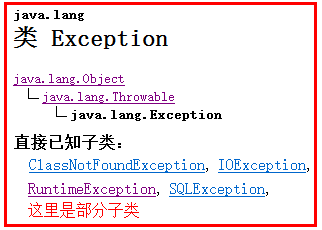
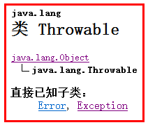
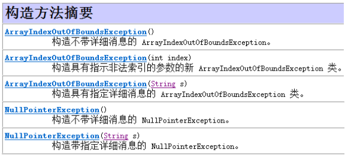

# 异常处理

什么是异常？Java代码在运行时期发生的问题就是异常。

在Java中，把异常信息封装成了一个类。当出现了问题时，就会创建异常类对象并抛出异常相关的信息（如异常出现的位置、原因等）。

### 异常的继承体系

在Java中使用Exception类来描述异常。

查看API中Exception的描述，Exception 类及其子类是 Throwable 的一种形式，它用来表示java程序中可能会产生的异常，并要求对产生的异常进行合理的异常处理。

Exception有继承关系，它的父类是Throwable。Throwable是Java 语言中所有错误或异常的超类，即祖宗类。

另外，在异常Exception类中，有一个子类要特殊说明一下，RuntimeException子类，RuntimeException及其它的子类只能在Java程序运行过程中出现。

我们再来观察Throwable类，能够发现与异常Exception平级的有一个Error，它是Throwable的子类，它用来表示java程序中可能会产生的严重错误。解决办法只有一个，修改代码避免Error错误的产生。






异常继承体系总结：

* Throwable: 它是所有错误与异常的超类（祖宗类）
* Error 错误
* Exception 编译期异常,进行编译JAVA程序时出现的问题
* RuntimeException 运行期异常, JAVA程序运行过程中出现的问题

异常与错误的区别

异常：指程序在编译、运行期间发生了某种异常(XxxException)，我们可以对异常进行具体的处理。若不处理异常，程序将会结束运行。

异常的产生演示如下：

```
  public static void main(String[] args) {
        int[] arr = new int[3];
        System.out.println(arr[0]);
        System.out.println(arr[3]);
// 该句运行时发生了数组索引越界异常ArrayIndexOutOfBoundsException，由于没有处理异常，导致程序无法继续执行，程序结束。
        System.out.println("over"); // 由于上面代码发生了异常，此句代码不会执行
    }
```

错误：指程序在运行期间发生了某种错误(XxxError)，Error错误通常没有具体的处理方式，程序将会结束运行。Error错误的发生往往都是系统级别的问题，都是jvm所在系统发生的，并反馈给jvm的。我们无法针对处理，只能修正代码。

错误的产生演示如下：

```
 public static void main(String[] args) {
        int[] arr = new int[1024*1024*100];
//该句运行时发生了内存溢出错误OutOfMemoryError，开辟了过大的数组空间，导致JVM在分配数组空间时超出了JVM内存空间，直接发生错误。
    }
```

异常的产生过程解析

先运行下面的程序，程序会产生一个数组索引越界异常ArrayIndexOfBoundsException。我们通过图解来解析下异常产生的过程。

工具类

```
class ArrayTools{
//对给定的数组通过给定的角标获取元素。
    public static int getElement(int[] arr,int index) {
        int element = arr[index];
        return element;
    }
}
```

测试类

```
class ExceptionDemo2 {
    public static void main(String[] args) {
        int[] arr = {34,12,67};
        int num = ArrayTools.getElement(arr,4)
        System.out.println("num="+num);
        System.out.println("over");
    }
}
```

上述程序执行过程图解：


### 抛出异常throw

在编写程序时，我们必须要考虑程序出现问题的情况。比如，在定义方法时，方法需要接受参数。那么，当调用方法使用接受到的参数时，首先需要先对参数数据进行合法的判断，数据若不合法，就应该告诉调用者，传递合法的数据进来。这时需要使用抛出异常的方式来告诉调用者。

在java中，提供了一个throw关键字，它用来抛出一个指定的异常对象。那么，抛出一个异常具体如何操作呢？

1、创建一个异常对象。封装一些提示信息(信息可以自己编写)。

2、需要将这个异常对象告知给调用者。怎么告知呢？怎么将这个异常对象传递到调用者处呢？通过关键字throw就可以完成。throw 异常对象；throw用在方法内，用来抛出一个异常对象，将这个异常对象传递到调用者处，并结束当前方法的执行。

使用格式： throw new **异常类名(参数);**

例如：

```
throw new NullPointerException("要访问的arr数组不存在");
throw new ArrayIndexOutOfBoundsException("该索引在数组中不存在，已超出范围");
```

下面是异常类ArrayIndexOutOfBoundsException与NullPointerException的构造方法



学习完抛出异常的格式后，我们通过下面程序演示下throw的使用。

编写工具类，提供获取数组指定索引处的元素值

```
class ArrayTools{
//通过给定的数组，返回给定的索引对应的元素值。
    public static int getElement(int[] arr,int index) {
/*
若程序出了异常，JVM它会打包异常对象并抛出。但是它所提供的信息不够给力。想要更清晰，需要自己抛出异常信息。
下面判断条件如果满足，当执行完throw抛出异常对象后，方法已经无法继续运算。这时就会结束当前方法的执行，并将异常告知给调用者。这时就需要通过异常来解决。
*/
        if(arr==null){
            throw new NullPointerException("arr指向的数组不存在");
        }
        if(index<0 || index>=arr.length){
            throw new ArrayIndexOutOfBoundsException("错误的角标，"+index+"索引在数组中不存在");
        }
        int element = arr[index];
        return element;
    }
}
```

测试类

```
class ExceptionDemo3 {
    public static void main(String[] args) {
        int[] arr = {34,12,67}; //创建数组
        int num = ArrayTools.getElement(null,2);// 调用方法，获取数组中指定索引处元素
//int num = ArrayTools.getElement(arr,5);// 调用方法，获取数组中指定索引处元素
        System.out.println("num="+num);//打印获取到的元素值
    }
}
```

### 声明异常throws

声明：将问题标识出来，报告给调用者。如果方法内通过throw抛出了编译时异常，而没有捕获处理（稍后讲解该方式），那么必须通过throws进行声明，让调用者去处理。

声明异常格式： **修饰符 返回值类型 方法名(参数)** throws **异常类名1,异常类名2… { }**

声明异常的代码演示：

```
class Demo{
/*
如果定义功能时有问题发生需要报告给调用者。可以通过在方法上使用throws关键字进行声明。
*/
    public void show(int x)throws Exception {
        if(x>0){
            throw new Exception();
        } else {
            System.out.println("show run");
        }
    }
}
```

throws用于进行异常类的声明，若该方法可能有多种异常情况产生，那么在throws后面可以写多个异常类，用逗号隔开。

多个异常的情况，例如:

```
public static int getElement(int[] arr,int index) throws NullPointerException, ArrayIndexOutOfBoundsException {
        if(arr==null){
            throw new NullPointerException("arr指向的数组不存在");
        }
        if(index<0 || index>=arr.length){
            throw new ArrayIndexOutOfBoundsException("错误的角标，"+index+"索引在数组中不存在");
        }
        int element = arr[index];
        return element;
    }
```

### 捕获异常try…catch…finally

捕获：Java中对异常有针对性的语句进行捕获，可以对出现的异常进行指定方式的处理

捕获异常格式：

```
try {
　　//需要被检测的语句。
}
catch(异常类 变量) { //参数。
　　//异常的处理语句。
}
finally {
　　//一定会被执行的语句。
}
```

try：该代码块中编写可能产生异常的代码。

catch：用来进行某种异常的捕获，实现对捕获到的异常进行处理。

finally：有一些特定的代码无论异常是否发生，都需要执行。另外，因为异常会引发程序跳转，导致有些语句执行不到。而finally就是解决这个问题的，在finally代码块中存放的代码都是一定会被执行的。

演示如下：

```
class ExceptionDemo{
    public static void main(String[] args){ //throws ArrayIndexOutOfBoundsException
        try{
            int[] arr = new int[3];
            System.out.println( arr[5] );// 会抛出ArrayIndexOutOfBoundsException
            //当产生异常时，必须有处理方式。要么捕获，要么声明。
        }
        catch (ArrayIndexOutOfBoundsException e) { //括号中需要定义什么呢？try中抛出的是什么异常，在括号中就定义什么异常类型。
            System.out.println("异常发生了");
        } finally {
            arr = null; //把数组指向null，通过垃圾回收器，进行内存垃圾的清除
        }
        System.out.println("程序运行结果");
    }
}
```

### try…catch…finally异常处理的组合方式

try catch finally组合：检测异常，并传递给catch处理，并在finally中进行资源释放。

try catch组合 : 对代码进行异常检测，并对检测的异常传递给catch处理。对异常进行捕获处理。

```
 void show(){ //不用throws
        try{
            throw new Exception();//产生异常，直接捕获处理
        }catch(Exception e){
        //处理方式
        }
    }
```

一个try 多个catch组合 : 对代码进行异常检测，并对检测的异常传递给catch处理。对每种异常信息进行不同的捕获处理。

```
 void show(){ //不用throws
        try{
            throw new Exception();//产生异常，直接捕获处理
        }catch(XxxException e){
    　　　　//处理方式
        }catch(YyyException e){
    　　　　//处理方式
        }catch(ZzzException e){
    　　　　//处理方式
        }
    }
```

注意:这种异常处理方式，要求多个catch中的异常不能相同，并且若catch中的多个异常之间有子父类异常的关系，那么子类异常要求在上面的catch处理，父类异常在下面的catch处理。

 try finally 组合: 对代码进行异常检测，检测到异常后因为没有catch，所以一样会被默认jvm抛出。异常是没有捕获处理的。但是功能所开启资源需要进行关闭，所有finally。只为关闭资源。

```
void show(){//需要throws
        try{
            throw new Exception();
        }finally {
        //释放资源
        }
    }
```

### 运行时期异常

RuntimeException和他的所有子类异常,都属于运行时期异常。NullPointerException,ArrayIndexOutOfBoundsException等都属于运行时期异常.

### 运行时期异常的特点

方法中抛出运行时期异常,方法定义中无需throws声明,调用者也无需处理此异常

运行时期异常一旦发生,需要程序人员修改源代码.

```
class ExceptionDemo{
    public static void main(String[] args){
         method();
    }

    public static void method(){
        throw new RuntimeException();
    }
}
```

### 异常在方法重写中细节

1、子类覆盖父类方法时，如果父类的方法声明异常，子类只能声明父类异常或者该异常的子类，或者不声明。

例如：

```
class Fu {
    public void method () throws RuntimeException {
    }
}
```

```
class Zi extends Fu {
    public void method() throws RuntimeException { }  //抛出父类一样的异常
    //public void method() throws NullPointerException{ } //抛出父类子异常
}
```

2、当父类方法声明多个异常时，子类覆盖时只能声明多个异常的子集。

例如：

```
class Fu {
    public void method () throws NullPointerException, ClassCastException{
    }
}
class Zi extends Fu {
    public void method()throws NullPointerException, ClassCastException { }   
    public void method() throws NullPointerException{ } //抛出父类异常中的一部分
    public void method() throws ClassCastException { } //抛出父类异常中的一部分
}
```

3、当被覆盖的方法没有异常声明时，子类覆盖是无法声明异常的。

例如：

```
class Fu {
    public void method (){
    }
}

class Zi extends Fu {
    public void method() throws Exception { }//错误的方式
}
```

举例：父类中会存在下列这种情况，接口也有这种情况

问题：接口中没有声明异常，而实现的子类覆盖方法时发生了异常，怎么办？

答：无法进行throws声明，只能catch的捕获。万一问题处理不了呢？catch中继续throw抛出，但是只能将异常转换成RuntimeException子类抛出。

```
interface Inter {
    public abstract void method();
}

class Zi implements Inter {
    public void method(){ //无法声明 throws Exception
        int[] arr = null;
        if (arr == null) {
　　　　　　　　//只能捕获处理
            try{
                throw new Exception(“哥们，你定义的数组arr是空的!”);
            } catch(Exception e){
                System.out.println(“父方法中没有异常抛出，子类中不能抛出Exception异常”);
                //我们把异常对象e，采用RuntimeException异常方式抛出
                throw new RuntimeException(e);
            }
        }
    }
}
```

### 异常中常用方法

在Throwable类中为我们提供了很多操作异常对象的方法，常用的如下：

* getMessage方法：返回该异常的详细信息字符串，即异常提示信息
* toString方法：返回该异常的名称与详细信息字符串
* printStackTrace：在控制台输出该异常的名称与详细信息字符串、异常出现的代码位置

异常的常用方法代码演示：

```
 try {
        Person p= null;
        if (p==null) {
            throw new NullPointerException(“出现空指针异常了，请检查对象是否为null”);
        }
    } catch (NullPointerException e) {
        String message = e.getMesage();
        System.out.println(message );
        String result = e.toString();
        System.out.println(result);
        e.printStackTrace();
    }
```

## 自定义异常

在上述代码中，发现这些异常都是JDK内部定义好的，并且这些异常不好找。书写时也很不方便，那么能不能自己定义异常呢？

之前的几个异常都是java通过类进行的描述。并将问题封装成对象，异常就是将问题封装成了对象。这些异常不好认，书写也很不方便，能不能定义一个符合我的程序要求的异常名称。既然JDK中是使用类在描述异常信息，那么我们也可以模拟Java的这种机制，我们自己定义异常的信息，异常的名字，让异常更符合自己程序的阅读。准确对自己所需要的异常进行类的描述。

### 自定义异常类的定义

通过阅读异常源代码：发现java中所有的异常类，都是继承Throwable，或者继承Throwable的子类。这样该异常才可以被throw抛出。说明这个异常体系具备一个特有的特性：可抛性：即可以被throw关键字操作。

并且查阅异常子类源码，发现每个异常中都调用了父类的构造方法，把异常描述信息传递给了父类，让父类帮我们进行异常信息的封装。

例如NullPointerException异常类源代码：

```
public class NullPointerException extends RuntimeException {
    public NullPointerException() {
        super();//调用父类构造方法
    }

    public NullPointerException(String s) {
        super(s);//调用父类具有异常信息的构造方法
    }

}
```

现在，我们来定义个自己的异常，即自定义异常。

格式：

```
Class 异常名 extends Exception{ //或继承RuntimeException
    public 异常名(){
    }

    public 异常名(String s){
   　　 super(s);
    }
}
```

自定义异常继承Exception演示

```
class MyException extends Exception{
/*
为什么要定义构造函数，因为看到Java中的异常描述类中有提供对异常对象的初始化方法。
*/
public MyException(){
    super();
}
public MyException(String message) {
    super(message);// 如果自定义异常需要异常信息，可以通过调用父类的带有字符串参数的构造函数即可。

    }
}
```

自定义异常继承RuntimeException演示

```
class MyException extends RuntimeException{
/*
为什么要定义构造函数，因为看到Java中的异常描述类中有提供对异常对象的初始化方法。
*/
    MyException(){
        super();
    }
    MyException(String message) {
        super(message);// 如果自定义异常需要异常信息，可以通过调用父类的带有字符串参数的构造函数即可。
    }
}
```

自定义异常的练习

定义Person类，包含name与age两个成员变量。在Person类的有参数构造方法中，进行年龄范围的判断，若年龄为负数或大于200岁，则抛出NoAgeException异常，异常提示信息“年龄数值非法”。

要求：在测试类中，调用有参数构造方法，完成Person对象创建，并进行异常的处理。

自定义异常类

```
class NoAgeException extends Exception{
    NoAgeException() {
        super();
    }

    NoAgeException(String message) {
        super(message);
    }
}
```

Person类

```
class Person{
    private String name;
    private int age;
    Person(String name,int age) throws NoAgeException {
//加入逻辑判断。
        if(age<0 || age>200) {
            throw new NoAgeException(age+",年龄数值非法");
        }
        this.name = name;
        this.age = age;
    }
//定义Person对象对应的字符串表现形式。覆盖Object中的toString方法。
    public String toString() {
        return "Person[name="+name+",age="+age+"]";
    }
}
```

测试类

```
class ExceptionDemo{
    public static void main(String[] args) {
        try {
            Person p = new Person("xiaoming",20);
            System.out.println(p);
        }
        catch (NoAgeException ex){
            System.out.println("年龄异常啦");
        }
        System.out.println("over");
    }
}
```

总结一下，构造函数到底抛出这个NoAgeException是继承Exception呢？还是继承RuntimeException呢？

继承Exception，必须要throws声明，一声明就告知调用者进行捕获，一旦问题处理了调用者的程序会继续执行。

继承RuntimeExcpetion,不需要throws声明的，这时调用是不需要编写捕获代码的，因为调用根本就不知道有问题。一旦发生NoAgeException，调用者程序会停掉，并有jvm将信息显示到屏幕，让调用者看到问题，修正代码。

## 总结

异常：就是程序中出现的不正常的现象(错误与异常)

### 异常的继承体系

* Throwable: 它是所有错误与异常的超类（祖宗类）
* |- Error 错误，修改java源代码
* |- Exception 编译期异常, javac.exe进行编译的时候报错
* |- RuntimeException 运行期异常, java出现运行过程中出现的问题

### 异常处理的两种方式

1、出现问题，自己解决 try…catch…finally

```
try{

    可能出现异常的代码

} catch(异常类名  对象名){

    异常处理代码

} finally {

    异常操作中一定要执行的代码

}
```

2、出现问题，别人解决 throws

格式：修饰符 返回值类型 方法名(参数) throws 异常类名1,异常类名2,...{}

比如：public void method() throws Exception{}

### 异常分类

异常的根类是Throwable，其下有两个子类：Error与Exception，平常所说的异常指Exception；严重错误Error，无法通过处理的错误。

* 编译时异常Exception，编译时无法编译通过。如日期格式化异常
* 运行时异常RuntimeException，是Exception的子类，运行时可能会报错，可以不处理。如空指针异常

**异常基本操作**

* 创建异常对象
* 抛出异常
* 处理异常：

1. 捕获处理，将异常获取，使用try/catch做分支处理
2. 声明抛出处理，出现异常后不处理，声明抛出给调用者处理。 方法声明上加throws  异常类名

注意：异常的处理，指处理异常的一种可能性，即有了异常处理的代码，不一定会产生异常。如果没有产生异常，则代码正常执行，如果产生了异常，则中断当前执行代码，执行异常处理代码。

### 多异常处理

**捕获处理**

* 多个异常可以分别处理
* 多个异常一次捕获多次处理
* 多个异常一次捕获，采用同一种方式处理

声明抛出异常：声明上使用,一次声明多个异常

运行时异常被抛出可以不处理。即不捕获也不声明抛出

如果父类抛出了多个异常,子类覆盖父类方法时,只能抛出相同的异常或者是他的子集

父类方法没有抛出异常，子类覆盖父类该方法时也不可抛出异常。此时子类产生该异常，只能捕获处理，不能声明抛出

当多异常处理时，捕获处理，前边的类不能是后边类的父类

### 自定义异常

如果Java没有提供你需要的异常，则可以自定义异常类。

定义方法：编译时异常继承Exception，运行时异常继承RuntimeException。

### throw 和throws 的区别是什么

throw
定义在方法中，后边跟的是异常对象
同时只能抛出一个异常对象

throws
定义在方法的声明上，后边跟的是异常的类型
后边同时可以跟多个数据类型

### finally 返回路径

finally ：在正常情况下，肯定执行的代码，在try中return，在finally中修改。每次碰到return就会在返回路径中临时存储这个被返回的值，无论方法内有任何的改变，返回路径中的这个值一致不变。

```
public class Demo {
    public static void main(String[] args) {
        Test t = new Test();
        int method = t.method();
        System.out.println(method);
    }
}

class Test {
    public int method() {
        int i = 0;
        try {
            System.out.println(1 / 0);
            return i;
        } catch (Exception e) {
            e.printStackTrace();
        } finally {
            i = 200;
            System.out.println("我一定会运行");
        }
        return i;
    }
    //返回路径：每次碰到return就会在返回路径中临时存储这个被返回的值，无论方法内有任何的改变，返回路径中的这个值一致不变。
}

//我一定会运行
//200
//java.lang.ArithmeticException: / by zero
//at inter.Test.method(Demo.java:15)
//at inter.Demo.main(Demo.java:6)
//
//Process finished with exit code 0
```

# Reference Links：

https://www.cnblogs.com/ginb/p/7187564.html
