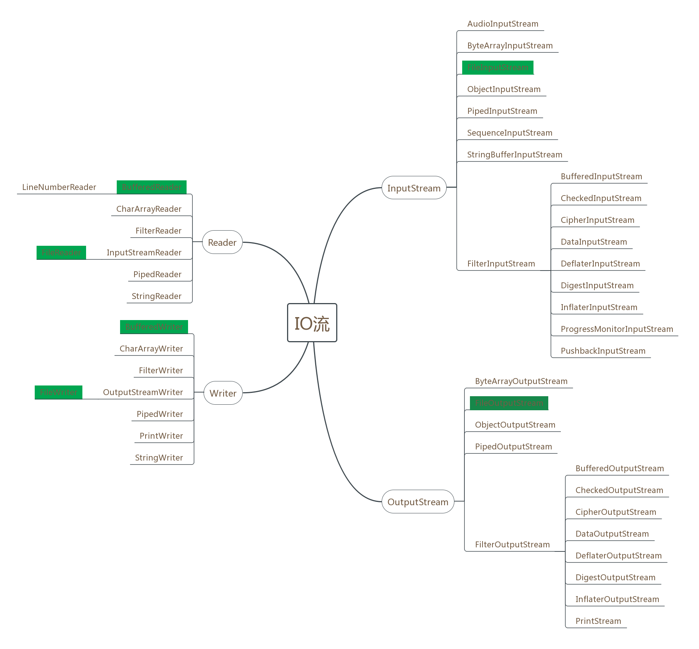

## java中流的体系结构

IO流主要是用来处理设备之间的数据传输。

流按操作的数据可分为字符流和字节流。字节流用于处理二进制文件，比如音频、视频等；字符流用于处理带有中文字符的文件，比如文本文件。

流按照数据的流向可分为输入流和输出流。输入输出是相对于内存来说的，输入就是把某个地方（比如磁盘）的数据读到内存中，输出就是把数据从内存中写到某个地方（比如磁盘）。
java中流的体系结构如下，由于实现类实在太多，标记颜色的为常用的类。



## 字节流

### `FileOutputStream`

`我们常用来向文件中写入数据的流是FileOutputStream` ，主要用于写入诸如图像数据之类的原始字节的流。

构造函数如下：

```
FileOutputStream(File file) 创建一个向指定 File 对象表示的文件中写入数据的文件输出流。
FileOutputStream(File file, boolean append)  创建一个向指定 File 对象表示的文件中写入数据的文件输出流。
FileOutputStream(FileDescriptor fdObj)  创建一个向指定文件描述符处写入数据的输出文件流，该文件描述符表示一个到文件系统中的某个实际文件的现有连接。
FileOutputStream(String name)  创建一个向具有指定名称的文件中写入数据的输出文件流。
FileOutputStream(String name, boolean append)  创建一个向具有指定 name 的文件中写入数据的输出文件流。
```

写入的方法有3个，具体如下：

```
 void    write(byte[] b)  将 b.length 个字节从指定 byte 数组写入此文件输出流中。
 void    write(byte[] b, int off, int len)  将指定 byte 数组中从偏移量 off 开始的 len 个字节写入此文件输出流。
 void    write(int b) 将指定字节写入此文件输出流。
```

举个例子：

```
 String filePath =  "D:\\Learning\\doc\\test.txt";
// 向test.txt文件中写入数据
 FileOutputStream fos=new FileOutputStream(filePath);
 fos.write("学习IO流".getBytes());
 fos.close();
```

### `FileInputStream`

和FileOutputStream对应的是 `FileInputStream` ，用于读取诸如图像数据之类的原始字节流，文件不存在会创建。

构造函数如下：

```
FileInputStream(File file)  通过打开一个到实际文件的连接来创建一个 FileInputStream，该文件通过文件系统中的 File 对象 file 指定。
FileInputStream(FileDescriptor fdObj)  通过使用文件描述符 fdObj 创建一个 FileInputStream，该文件描述符表示到文件系统中某个实际文件的现有连接。
FileInputStream(String name)  通过打开一个到实际文件的连接来创建一个 FileInputStream，该文件通过文件系统中的路径名 name 指定。
```

读取的方法如下，read方法从此输入流中读取数据字节。如果没有输入可用，则此方法将阻塞。如果因为已经到达文件末尾而没有更多的数据，则返回 `-1`。

```
 int    read()  从此输入流中读取一个数据字节。
 int    read(byte[] b)  从此输入流中将最多 b.length 个字节的数据读入一个 byte 数组中。
 int    read(byte[] b, int off, int len)  从此输入流中将最多 len 个字节的数据读入一个 byte 数组中。
```

举个例子：

```
String filePath =  "D:\\Learning\\doc\\test1.txt";
//读取test文件内容
FileInputStream fis=new FileInputStream(filePath);//方式一：一个字节一个字节的读取
int ch=0;
while ((ch=fis.read())!=-1) {
   System.out.print((char)ch);
}

//方式二：批量读取到缓冲区，推荐使用方式
int len=0;
byte[] buffer=new byte[1024];
while ((len=fis.read(buffer))!=-1){
    System.out.print(new String(buffer,0,len));
}

//方式三：一次性读取，不建议使用，如果文件过大，那么数组会非常大，可能内存不够，创建数组也会非常耗时
//fis.available()获取文件的字节数
byte[] buf = new byte[fis.available()];
fis.read(buf);
System.out.println(new String(buf));
fis.close();
```

下面代码演示了如何拷贝文件：

```
//需求：把vedio拷贝到vedio1
String sourceFilePath = "D:\\Learning\\doc\\vedio.avi";
String destFilePath = "D:\\Learning\\doc\\vedio1.avi";
//创建读取文件对象
FileInputStream fis=new FileInputStream(sourceFilePath);
//创建写入文件对象
FileOutputStream fos=new FileOutputStream(destFilePath);
//创建1M的缓冲区
byte[] buffer =new byte[1024*1024*1];
//每次读取的长度,可能最后一次的读取长度并没有buffer.length那么多
int len=0;
while ((len=fis.read(buffer))!=-1){
    fos.write(buffer,0,len);
}
fos.close();
fis.close();
```

当然，如果是很小的文件，也可以直接向下面这样，但对于大文件，禁止使用：

```
        //需求：把vedio拷贝到vedio1
        String sourceFilePath = "D:\\Learning\\doc\\vedio.avi";
        String destFilePath = "D:\\Learning\\doc\\vedio1.avi";
        //创建读取文件对象
        FileInputStream fis=new FileInputStream(sourceFilePath);
        //创建写入文件对象
        FileOutputStream fos=new FileOutputStream(destFilePath);
        byte[] buf = new byte[fis.available()];
        fis.read(buf);
        fos.write(buf);

        fos.close();
        fis.close();
```

上面我们手动创建了缓冲区用来提高字节读写效率，java也提供了同样的功能，即BufferInputStream，BufferOutputStream。

### BufferedInputStream

BufferedInputStream 为另一个输入流添加一些功能，即缓冲输入以及支持 mark 和 reset 方法的能力。在创建 BufferedInputStream 时，会创建一个内部缓冲区数组。

构造函数如下：

```
BufferedInputStream(InputStream in) 创建一个 BufferedInputStream 并保存其参数，即输入流 in，以便将来使用。
BufferedInputStream(InputStream in, int size) 创建具有指定缓冲区大小的 BufferedInputStream 并保存其参数，即输入流 in，以便将来使用。
```

读取方法如下：

```
 int    read()  参见 InputStream 的 read 方法的常规协定。
 int    read(byte[] b, int off, int len)  从此字节输入流中给定偏移量处开始将各字节读取到指定的 byte 数组中。
```

### BufferOutputStream

该类实现缓冲的输出流。通过设置这种输出流，应用程序就可以将各个字节写入底层输出流中，而不必针对每次字节写入调用底层系统。

构造方法如下：

```
BufferedOutputStream(OutputStream out)  创建一个新的缓冲输出流，以将数据写入指定的底层输出流。
BufferedOutputStream(OutputStream out, int size)  创建一个新的缓冲输出流，以将具有指定缓冲区大小的数据写入指定的底层输出流。
```

write方法如下：

```
 void    write(byte[] b, int off, int len)  将指定 byte 数组中从偏移量 off 开始的 len 个字节写入此缓冲的输出流。
 void    write(int b)  将指定的字节写入此缓冲的输出流。
```

下面来看看如何使用：

```
        //需求：把vedio拷贝到vedio1
        String sourceFilePath = "D:\\Learning\\doc\\vedio.avi";
        String destFilePath = "D:\\Learning\\doc\\vedio1.avi";
        //创建读取文件对象
        FileInputStream fis=new FileInputStream(sourceFilePath);
        //创建写入文件对象
        FileOutputStream fos=new FileOutputStream(destFilePath);
        BufferedInputStream bis=new BufferedInputStream(fis);
        BufferedOutputStream bos=new BufferedOutputStream(fos);

        int len =0;
        while ((len=bis.read())!=-1){
            bos.write(len);
        }
        //缓冲流是在普通流的基础上多了一个缓冲区  ,   
        // 当读或写的数据达到一定量,再自动往文件里进行读写,如果没有装满缓冲区文件就已经读(写)完毕 ,   
        // 那么这个时候已经读写到缓冲区的数据需要手动使其朝目标文件进行读写.
        //所以使用缓冲流一定要调用flush方法
        bos.flush();
        bis.close();
        bos.close();
```

当然，也可以自己再创建一个缓冲区进一步提高效率，也可以在构造函数的第二个参数传入缓冲区大小：

```
import java.io.*;

class Test {
    public static void main(String[]args) throws IOException {
        //测试拷贝一个大小为200M时的性能问题
        test1();
        test2();
        test3();
    }

    public static final int BUFFER_SIZE = 1024 * 1024 * 1;

    /**
     * 方式一：不加缓冲区的情况
     *
     * @throws IOException
     */
    public static void test1() throws IOException {
        //需求：把vedio拷贝到vedio1
        String sourceFilePath = "E:\\desktop.zip";
        String destFilePath = "E:\\desktop1.zip";
        //创建读取文件对象
        FileInputStream fis = new FileInputStream(sourceFilePath);
        //创建写入文件对象
        FileOutputStream fos = new FileOutputStream(destFilePath);
        BufferedInputStream bis = new BufferedInputStream(fis);
        BufferedOutputStream bos = new BufferedOutputStream(fos);

        long start = System.currentTimeMillis();
        int len = 0;
        while ((len = bis.read()) != -1) {
            bos.write(len);
        }
        long end = System.currentTimeMillis();
        System.out.println(end - start);//21365

        bos.flush();
        bis.close();
        bos.close();
    }

    /**
     * 方式二：加缓冲区的情况
     * @throws IOException
     */
    public static void test2() throws IOException {
        //需求：把vedio拷贝到vedio1
        String sourceFilePath = "E:\\desktop.zip";
        String destFilePath = "E:\\desktop2.zip";
        //创建读取文件对象
        FileInputStream fis = new FileInputStream(sourceFilePath);
        //创建写入文件对象
        FileOutputStream fos = new FileOutputStream(destFilePath);
        BufferedInputStream bis = new BufferedInputStream(fis);
        BufferedOutputStream bos = new BufferedOutputStream(fos);

        long start = System.currentTimeMillis();
        byte[] buffer = new byte[BUFFER_SIZE];
        int len = 0;
        while ((len = bis.read(buffer)) != -1) {
            bos.write(buffer, 0, len);
        }
        long end = System.currentTimeMillis();
        System.out.println(end - start);//975
        bos.flush();
        bis.close();
        bos.close();
    }

    /**
     * 方式3：构造函数加入缓冲大小的情况
     * @throws IOException
     */
    public static void test3() throws IOException {
        // 需求：把vedio拷贝到vedio1
        String sourceFilePath = "E:\\desktop.zip";
        String destFilePath = "E:\\desktop3.zip";
        //创建读取文件对象
        FileInputStream fis = new FileInputStream(sourceFilePath);
        //创建写入文件对象
        FileOutputStream fos = new FileOutputStream(destFilePath);
        BufferedInputStream bis = new BufferedInputStream(fis, BUFFER_SIZE);
        BufferedOutputStream bos = new BufferedOutputStream(fos, BUFFER_SIZE);

        long start = System.currentTimeMillis();
        int len = 0;
        while ((len = bis.read()) != -1) {
            bos.write(len);
        }
        long end = System.currentTimeMillis();
        System.out.println(end - start);//3036
        bos.flush();
        bis.close();
        bos.close();
    }
}
```

由此可见，手动加缓冲区的效率最高。

上面对于IO的异常处理是直接抛出，并未处理，下面介绍一下IO流的正确异常处理方式：

```
   String filePath = "D:\\Learning\\doc\\test.txt";
        FileOutputStream fos= null;
        try {
            fos = new FileOutputStream(filePath);
            fos.write("123456".getBytes());
        } catch (FileNotFoundException e) {
            e.printStackTrace();
        } catch (IOException e) {
            e.printStackTrace();
        }finally {
　　　　　　　if(fos!=null){　 
            　　try {
                　　//一定要记得关闭流，否则文件可能一直被占用而无法操作
                　　fos.close();
            　　} catch (IOException e) {
                　　e.printStackTrace();
            　　}
　　　　　　}
        }
```

## 字符流

上面介绍了字节流，如果我们写入的是中文，然后使用字节流读取出来，就会出现乱码。

```
        String filePath = "D:\\Learning\\doc\\test.txt";
        FileOutputStream fos= null;
        FileInputStream fis =null;
        try {
            fos = new FileOutputStream(filePath);
            fis=new FileInputStream(filePath);
            fos.write("学习IO流".getBytes());

            int ch;
            while ((ch=fis.read())!=-1){
                System.out.print((char)ch);//学习IO流
            }
        } catch (FileNotFoundException e) {
            e.printStackTrace();
        } catch (IOException e) {
            e.printStackTrace();
        }finally {
            try {
　　　　　　　　　　//忘了判断null
                fis.close();
                fos.close();
            } catch (IOException e) {
                e.printStackTrace();
            }
        }
    }
```

为什么会乱码呢?因为java中的char存的是Unicode字符，占用2个字节，而中文也是2个字节，上面的代码每次去一个字节区unicode字符集中查找，肯定找到的不是对应的中文，因此乱码。下面对上面的代码改造一下，手动指定编码方式，就可以解决乱码问题。关于字符的编码问题可以参考[这里](http://www.imkevinyang.com/2010/06/%E5%85%B3%E4%BA%8E%E5%AD%97%E7%AC%A6%E7%BC%96%E7%A0%81%EF%BC%8C%E4%BD%A0%E6%89%80%E9%9C%80%E8%A6%81%E7%9F%A5%E9%81%93%E7%9A%84.html)。

```
        String filePath = "D:\\Learning\\doc\\test.txt";
        FileOutputStream fos= null;
        FileInputStream fis =null;
        try {
            fos = new FileOutputStream(filePath);
            fis=new FileInputStream(filePath);
            fos.write("学习IO流".getBytes("UTF-8"));
            byte [] buffer =new byte[1024];
            int len;
            while ((len=fis.read(buffer))!=-1){
                System.out.print(new String(buffer,0,len,"UTF-8"));
            }
        } catch (FileNotFoundException e) {
            e.printStackTrace();
        } catch (IOException e) {
            e.printStackTrace();
        }finally {
            try {
　　　　　　　　　　//忘了判断null
                fis.close();
                fos.close();
            } catch (IOException e) {
                e.printStackTrace();
            }
        }
    }
```

上面的代码相对比较繁琐，java给我们提供了字符流，方便对中文等字符进行处理，下面来看看常用的FileReader和FileWriter。

### FileWriter

FileWriter 用于写入字符流。用来写入字符文件的便捷类。使用平台（操作系统）默认字符编码。比如Windows简体中文版操作系统使用的编码为gbk。

构造函数如下：

```
FileWriter(File file)  根据给定的 File 对象构造一个 FileWriter 对象。
FileWriter(File file, boolean append)  根据给定的 File 对象构造一个 FileWriter 对象。
FileWriter(FileDescriptor fd)  构造与某个文件描述符相关联的 FileWriter 对象。
FileWriter(String fileName)  根据给定的文件名构造一个 FileWriter 对象。
FileWriter(String fileName, boolean append)  根据给定的文件名以及指示是否附加写入数据的 boolean 值来构造 FileWriter 对象。
```

写入方法如下：

```
 void    write(char[] cbuf)  写入字符数组。
 void    write(int c)   写入单个字符。
 void    write(String str)  写入字符串。
 void    write(char[] cbuf, int off, int len)  写入字符数组的某一部分。
 void    write(String str, int off, int len)  写入字符串的某一部分。
```

举个例子：

```
    String filePath = "D:\\Learning\\doc\\test.txt";
        FileWriter fw= null;
        try {
            fw = new FileWriter(filePath);
            fw.write("学习IO流");
        } catch (IOException e) {
            e.printStackTrace();
        }finally {
            try {
                //字符流如果不关闭，写入不会成功，因为字符流关闭之前会先刷新一下
                //也可以手动刷新
　　　　　　　　　 //忘了判断null
                fw.flush();
                fw.close();
            } catch (IOException e) {
                e.printStackTrace();
            }
        }
```

### FileReader

`FileReader` 用于读取字符流。用来读取字符文件的便捷类。

构造方法如下：

```
FileReader(File file)  在给定从中读取数据的 File 的情况下创建一个新 FileReader。
FileReader(FileDescriptor fd)  在给定从中读取数据的 FileDescriptor 的情况下创建一个新 FileReader。
FileReader(String fileName)   在给定从中读取数据的文件名的情况下创建一个新 FileReader。
```

读取方法如下：

```
 int    read()  读取单个字符。
 int    read(char[] cbuf)  将字符读入数组。
 int    read(char[] cbuf, int off, int len)  将字符读入数组的某一部分。
 int    read(CharBuffer target)  试图将字符读入指定的字符缓冲区。
```

举个例子：

```
 String filePath = "D:\\Learning\\doc\\test.txt";
        FileReader fr = null;
        try {
            fr = new FileReader(filePath);
            //方式一：一次读取一个字符（2个字节）
//            int ch = 0;
//            while ((ch = fr.read()) != -1) {
　　　　　　　　　　 //此处如果不转为字符串，会查找Unicode，而字符串也是使用的平台默认编码，所以需要转成字符串才不会乱码
//                System.out.print((char) ch + "");
//            }

            //方式二：批量读取字符到缓冲区
           char[] buffer =new char[1024];
            int  len = 0;
            while ((len = fr.read(buffer)) != -1) {
                System.out.print(new String(buffer,0,len));
            }
        } catch (IOException e) {
            e.printStackTrace();
        } finally {
            try {
                if (fr != null) {
                    fr.close();
                }
            } catch (IOException e) {
                e.printStackTrace();
            }
        }
```

下面代码演示了如何复制文本文件：

```
 　　　　//复制文本文件
        String sourceFilePath = "D:\\Learning\\doc\\test.txt";
        String destFilePath = "D:\\Learning\\doc\\test1.txt";
        FileReader fr = null;
        FileWriter fw=null;
        try {
            fr = new FileReader(sourceFilePath);
            fw=new FileWriter(destFilePath);
           char[] buffer =new char[1024];
            int  len = 0;
            while ((len = fr.read(buffer)) != -1) {
                fw.write(buffer,0,len);
            }
        } catch (IOException e) {
            e.printStackTrace();
        } finally {
            try {
                if (fr != null) {
                    fr.close();
                }
                if (fw != null) {
                    fw.close();
                }
            } catch (IOException e) {
                e.printStackTrace();
            }
        }
```

上面我们手动创建了缓冲区用来提高字符读写效率，java也提供了同样的功能，即BufferReader，BufferWriter。

### BufferReader

从字符输入流中读取文本，缓冲各个字符，从而实现字符、数组和行的高效读取。可以指定缓冲区的大小，或者可使用默认的大小。大多数情况下，默认值就足够大了。

构造函数如下：

```
BufferedReader(Reader in)  创建一个使用默认大小输入缓冲区的缓冲字符输入流。
BufferedReader(Reader in, int sz)  创建一个使用指定大小输入缓冲区的缓冲字符输入流。
```

reader方法如下：

```
 int    read()  读取单个字符。
 int    read(char[] cbuf, int off, int len)  将字符读入数组的某一部分。
 String    readLine()  读取一个文本行。
```

### BufferWriter

将文本写入字符输出流，缓冲各个字符，从而提供单个字符、数组和字符串的高效写入。可以指定缓冲区的大小，或者接受默认的大小。在大多数情况下，默认值就足够大了。

构造方法如下：

```
BufferedWriter(Writer out)  创建一个使用默认大小输出缓冲区的缓冲字符输出流。
BufferedWriter(Writer out, int sz)  创建一个使用给定大小输出缓冲区的新缓冲字符输出流。
```

writer方法如下：

```
 void    newLine()  写入一个行分隔符。
 void    write(char[] cbuf, int off, int len)  写入字符数组的某一部分。
 void    write(int c)  写入单个字符。
 void    write(String s, int off, int len)  写入字符串的某一部分。
```

接下来看看如何使用：

```
　　　　 //复制文本文件
        String sourceFilePath = "D:\\Learning\\doc\\git简单操作.txt";
        String destFilePath = "D:\\Learning\\doc\\test1.txt";
        BufferedReader br = null;
        BufferedWriter bw = null;
        try {
            FileReader fr = new FileReader(sourceFilePath);
            FileWriter fw = new FileWriter(destFilePath);
            br = new BufferedReader(fr);
            bw = new BufferedWriter(fw);
            String line = null;//一行一行的读取和写入
            while ((line = br.readLine()) != null) {
                bw.write(line);
                bw.newLine();
            }
            //使用缓冲对象一定要flush
            bw.flush();
        } catch (IOException e) {
            e.printStackTrace();
        } finally {
            try {
                if (br != null) {
                    br.close();
                }
                if (bw != null) {
                    bw.close();
                }
            } catch (IOException e) {
                e.printStackTrace();
            }
        }
```

### LineNumberReader

跟踪行号的缓冲字符输入流。此类定义了方法 setLineNumber(int) 和 getLineNumber()，它们可分别用于设置和获取当前行号。

默认情况下，行编号从 0 开始。该行号随数据读取在每个行结束符处递增，并且可以通过调用 setLineNumber(int) 更改行号。

但要注意的是，setLineNumber(int) 不会实际更改流中的当前位置；它只更改将由 getLineNumber() 返回的值。

下面看看简单的使用方式：

```
　　　　 String sourceFilePath = "D:\\Learning\\doc\\git简单操作.txt";
        FileReader fr = null;
        LineNumberReader lnr =null;
        try {
            fr = new FileReader(sourceFilePath);
            lnr = new LineNumberReader(fr);
            String line = null;
            lnr.setLineNumber(100);//设置起始行号为100
            while((line=lnr.readLine())!=null){
                System.out.println(lnr.getLineNumber()+":"+line);
            }
        } catch (FileNotFoundException e) {
            e.printStackTrace();
        } catch (IOException e) {
            e.printStackTrace();
        }finally {
            if(lnr!=null){
                try {
                    lnr.close();
                } catch (IOException e) {
                    e.printStackTrace();
                }
            }
        }
```

## 转换流

### InputStreamReader

字节流通向字符流的桥梁：它使用指定的 charset 读取字节并将其解码为字符。它使用的字符集可以由名称指定或显式给定，或者可以接受平台默认的字符集。

为了达到最高效率，可要考虑在 BufferedReader 内包装 InputStreamReader。例如：

```
BufferedReader in= new BufferedReader(new InputStreamReader(System.in));
```

构造方法如下：

```
InputStreamReader(InputStream in)  创建一个使用默认字符集的 InputStreamReader。
InputStreamReader(InputStream in, Charset cs)  创建使用给定字符集的 InputStreamReader。
InputStreamReader(InputStream in, CharsetDecoder dec)  创建使用给定字符集解码器的 InputStreamReader。
InputStreamReader(InputStream in, String charsetName)  创建使用指定字符集的 InputStreamReader。
```

读取方法如下：

```
int    read() 读取单个字符。
int    read(char[] cbuf, int offset, int length)  将字符读入数组中的某一部分。
```

举个例子，比如获取键盘输入的内容，并打印在控制台上，要求不能用Scanner对象：

```
        //需求：把键盘输入的内容打印在控制台
        InputStreamReader isr = new InputStreamReader(System.in);
        //方式一：直接读取
//        int ch = 0;
//        while ((ch=isr.read())!=-1){
//            System.out.print((char) ch+"");
//        }

        //方式二：读到缓冲区
        int len = 0;
        char [] buffer =new char[1024];
        while ((len=isr.read(buffer))!=-1){
            System.out.print(new String(buffer,0,len));
        }

        //方式三：使用缓冲流提供的便捷方法
        BufferedReader br =new BufferedReader(isr) ;
        String line=null;
        while((line=br.readLine())!=null){
            System.out.print(line);
        }
    }
```

### OutputStreamWriter

是字符流通向字节流的桥梁：可使用指定的 charset 将要写入流中的字符编码成字节。它使用的字符集可以由名称指定或显式给定，否则将接受平台默认的字符集。
为了获得最高效率，可考虑将 OutputStreamWriter 包装到 BufferedWriter 中，以避免频繁调用转换器。例如：

```
Writer out = new BufferedWriter(new OutputStreamWriter(System.out));
```

构造方法如下：

```
OutputStreamWriter(OutputStream out)  创建使用默认字符编码的 OutputStreamWriter。
OutputStreamWriter(OutputStream out, Charset cs)  创建使用给定字符集的 OutputStreamWriter。
OutputStreamWriter(OutputStream out, CharsetEncoder enc)  创建使用给定字符集编码器的 OutputStreamWriter。
OutputStreamWriter(OutputStream out, String charsetName)  创建使用指定字符集的 OutputStreamWriter。
```

写入方法如下：

```
 void    write(char[] cbuf, int off, int len)  写入字符数组的某一部分。
 void    write(int c)  写入单个字符。
 void    write(String str, int off, int len)  写入字符串的某一部分。
```

举个例子，比如把文本文件的内容打印在控制台上，要求不能用print方法：

```
        OutputStreamWriter osw=new OutputStreamWriter(System.out);
        String line="学习IO流";
        //方式一：直接写入
//        osw.write(line);
//        osw.close();
        //方式二：使用缓冲流高效写入
        BufferedWriter bw=new BufferedWriter(osw);
        bw.write(line);
        bw.close();
```

再来个例子，将键盘录入的数据写入到一个文件中：

```
 　　　　String filePath="E:\\test.txt";
        //需求：将键盘录入的数据写入到一个文件中。
        BufferedReader bufr = new BufferedReader(new InputStreamReader(System.in));
        BufferedWriter bufw = new BufferedWriter(new OutputStreamWriter(new FileOutputStream(filePath)));
        String line = null;
        while((line=bufr.readLine())!=null){
            if(":wq".equals(line))
                break;
            bufw.write(line.toUpperCase());
            bufw.newLine();
            bufw.flush();
        }
```

上面的例子举得有点牵强，正在的用处在于上面这两个对象可以手动指定编码，比如读取文本文件，必须指定utf-8来编码。用FileReader是做不到的。

```
InputStreamReader isr = new InputStreamReader(new FileInputStream("E:\\test.txt"),"utf-8");
```

# Reference Links：

https://www.cnblogs.com/ginb/p/9371754.html

参考文档：http://tool.oschina.net/apidocs/apidoc?api=jdk-zh

参考代码：[毕老师35天](http://yun.itheima.com/course/7.html)
