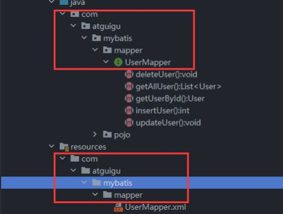
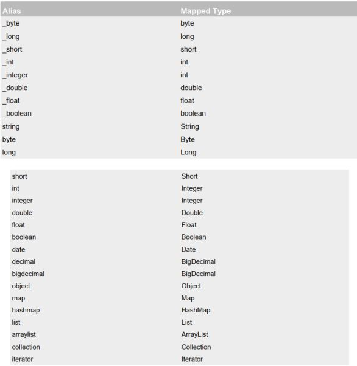

## 核心配置文件详解

> 核心配置文件中的标签必须按照固定的顺序(有的标签可以不写，但顺序一定不能乱)：
> properties、settings、typeAliases、typeHandlers、objectFactory、objectWrapperFactory、
> reflectorFactory、plugins、environments、databaseIdProvider、mappers

```
<?xml version="1.0" encoding="UTF-8" ?>
<!DOCTYPE configuration
        PUBLIC "-//MyBatis.org//DTD Config 3.0//EN"
        "http://MyBatis.org/dtd/MyBatis-3-config.dtd">
<configuration>
    <!--引入properties文件，此时就可以${属性名}的方式访问属性值-->
    <properties resource="jdbc.properties"></properties>
    <settings>
        <!--将表中字段的下划线自动转换为驼峰-->
        <setting name="mapUnderscoreToCamelCase" value="true"/>
        <!--开启延迟加载-->
        <setting name="lazyLoadingEnabled" value="true"/>
    </settings>
    <typeAliases>
        <!--
        typeAlias：设置某个具体的类型的别名
        属性：
        type：需要设置别名的类型的全类名
        alias：设置此类型的别名，且别名不区分大小写。若不设置此属性，该类型拥有默认的别名，即类
        名
        -->
        <!--<typeAlias type="com.atguigu.mybatis.bean.User"></typeAlias>-->
        <!--<typeAlias type="com.atguigu.mybatis.bean.User" alias="user">
        </typeAlias>-->
        <!--以包为单位，设置改包下所有的类型都拥有默认的别名，即类名且不区分大小写-->
        <package name="com.atguigu.mybatis.bean"/>
    </typeAliases>
    <!--
    environments：设置多个连接数据库的环境
    属性：
    default：设置默认使用的环境的id
    -->
    <environments default="mysql_test">
        <!--
        environment：设置具体的连接数据库的环境信息
        属性：
        id：设置环境的唯一标识，可通过environments标签中的default设置某一个环境的id，
        表示默认使用的环境
        -->
        <environment id="mysql_test">
            <!--
            transactionManager：设置事务管理方式
            属性：
            type：设置事务管理方式，type="JDBC|MANAGED"
            type="JDBC"：设置当前环境的事务管理都必须手动处理
            type="MANAGED"：设置事务被管理，例如spring中的AOP
            -->
            <transactionManager type="JDBC"/>
            <!--
            dataSource：设置数据源
            属性：
            type：设置数据源的类型，type="POOLED|UNPOOLED|JNDI"
            type="POOLED"：使用数据库连接池，即会将创建的连接进行缓存，下次使用可以从缓
            存中直接获取，不需要重新创建
            type="UNPOOLED"：不使用数据库连接池，即每次使用连接都需要重新创建
            type="JNDI"：调用上下文中的数据源
            -->
            <dataSource type="POOLED">
                <!--设置驱动类的全类名-->
                <property name="driver" value="${jdbc.driver}"/>
                <!--设置连接数据库的连接地址-->
                <property name="url" value="${jdbc.url}"/>
                <!--设置连接数据库的用户名-->
                <property name="username" value="${jdbc.username}"/>
                <!--设置连接数据库的密码-->
                <property name="password" value="${jdbc.password}"/>
            </dataSource>
        </environment>
    </environments>
    <!--引入映射文件-->
    <mappers>
        <!-- <mapper resource="UserMapper.xml"/> -->
        <!--
        以包为单位，将包下所有的映射文件引入核心配置文件
        注意：
        1. 此方式必须保证mapper接口和mapper映射文件必须在相同的包下
        2. mapper接口要和mapper映射文件的名字一致
        -->
        <package name="com.atguigu.mybatis.mapper"/>
    </mappers>
</configuration>
```



### 默认的类型别名



### MyBatis的增删改查

1. 添加

   ```
   <!--int insertUser();-->
   <insert id="insertUser">
       insert into t_user values(null,'admin','123456',23,'男','12345@qq.com')
   </insert>
   ```
2. 删除

   ```
   <!--int deleteUser();-->
   <delete id="deleteUser">
       delete from t_user where id = 6
   </delete>
   ```
3. 修改

   ```
   <!--int updateUser();-->
   <update id="updateUser">
       update t_user set username = '张三' where id = 5
   </update>
   ```
4. 查询一个实体类对象

   ```
   <!--User getUserById();-->
   <select id="getUserById" resultType="com.atguigu.mybatis.bean.User">
       select * from t_user where id = 2
   </select>
   ```
5. 查询集合

   ```
   <!--List<User> getUserList();-->
   <select id="getUserList" resultType="com.atguigu.mybatis.bean.User">
       select * from t_user
   </select>
   ```

> 注意：
>
> 查询的标签select必须设置属性resultType或resultMap，用于设置实体类和数据库表的映射关系
>
> - resultType：自动映射，用于属性名和表中字段名一致的情况
> - resultMap：自定义映射，用于一对多或多对一或字段名和属性名不一致的情况
>
> 当查询的数据为多条时，不能使用实体类作为返回值，只能使用集合，否则会抛出异常TooManyResultsException；但是若查询的数据只有一条，可以使用实体类或集合作为返回值

## MyBatis获取参数值的两种方式（重点）

* MyBatis获取参数值的两种方式：${}和#{}
* ${}的本质就是字符串拼接，#{}的本质就是占位符赋值
* ${}使用字符串拼接的方式拼接sql，若为字符串类型或日期类型的字段进行赋值时，需要手动加单引号；但是#{}使用占位符赋值的方式拼接sql，此时为字符串类型或日期类型的字段进行赋值时，可以自动添加单引号

### 单个字面量类型的参数

若mapper接口中的方法参数为单个的字面量类型，此时可以使用$${}需要手动加单引号

```
<!--User getUserByUsername(String username);-->
<select id="getUserByUsername" resultType="User">
    select * from t_user where username = #{username}
</select>
```

```
<!--User getUserByUsername(String username);-->
<select id="getUserByUsername" resultType="User">
    select * from t_user where username = '${username}'
</select>
```

### 多个字面量类型的参数

* 若mapper接口中的方法参数为多个时，此时MyBatis会自动将这些参数放在一个map集合中
  * 以arg0,arg1...为键，以参数为值；
  * 以param1,param2...为键，以参数为值；
* 因此只需要通过${}和#{}访问map集合的键就可以获取相对应的值，注意${}需要手动加单引号。
* 使用arg或者param都行，要注意的是，arg是从arg0开始的，param是从param1开始的

```
<!--User checkLogin(String username,String password);-->
<select id="checkLogin" resultType="User">
    select * from t_user where username = #{arg0} and password = #{arg1}
</select>
```

```
<!--User checkLogin(String username,String password);-->
<select id="checkLogin" resultType="User">
    select * from t_user where username = '${param1}' and password = '${param2}'
</select>
```

### map集合类型的参数

* 若mapper接口中的方法需要的参数为多个时，此时可以手动创建map集合，将这些数据放在map中只需要通过${}和#{}访问map集合的键就可以获取相对应的值，注意${}需要手动加单引号

```
<!--User checkLoginByMap(Map<String,Object> map);-->
<select id="checkLoginByMap" resultType="User">
    select * from t_user where username = #{username} and password = #{password}
</select>
```

```
@Test
public void checkLoginByMap() {
    SqlSession sqlSession = SqlSessionUtils.getSqlSession();
    ParameterMapper mapper = sqlSession.getMapper(ParameterMapper.class);
    Map<String,Object> map = new HashMap<>();
    map.put("usermane","admin");
    map.put("password","123456");
    User user = mapper.checkLoginByMap(map);
    System.out.println(user);
}
```

### 实体类类型的参数

* 若mapper接口中的方法参数为实体类对象时此时可以使用${}和#{}，通过访问实体类对象中的属性名获取属性值，注意${}需要手动加单引号

  ```
  <!--int insertUser(User user);-->
  <insert id="insertUser">
      insert into t_user values(null,#{username},#{password},#{age},#{sex},#{email})
  </insert>
  ```

  ```
  @Test
  public void insertUser() {
      SqlSession sqlSession = SqlSessionUtils.getSqlSession();
      ParameterMapper mapper = sqlSession.getMapper(ParameterMapper.class);
      User user = new User(null,"Tom","123456",12,"男","123@321.com");
      mapper.insertUser(user);
  }
  ```

### 使用@Param标识参数

* 可以通过@Param注解标识mapper接口中的方法参数，此时，会将这些参数放在map集合中

  * 以@Param注解的value属性值为键，以参数为值；
  * 以param1,param2...为键，以参数为值；
* 只需要通过${}和#{}访问map集合的键就可以获取相对应的值，注意${}需要手动加单引号

  ```
  <!--User CheckLoginByParam(@Param("username") String username, @Param("password") String password);-->
  <select id="CheckLoginByParam" resultType="User">
      select * from t_user where username = #{username} and password = #{password}
  </select>
  ```

  ```
  @Test
  public void checkLoginByParam() {
      SqlSession sqlSession = SqlSessionUtils.getSqlSession();
      ParameterMapper mapper = sqlSession.getMapper(ParameterMapper.class);
      mapper.CheckLoginByParam("admin","123456");
  }
  ```

### 总结

建议分成两种情况进行处理

* 实体类类型的参数
* 使用@Param标识参数
