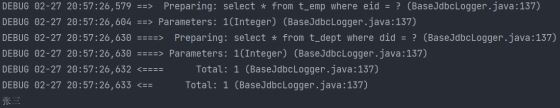
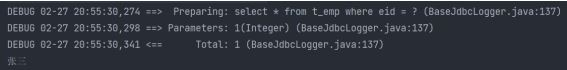
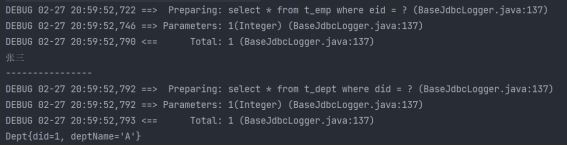

## MyBatis的各种查询功能

1. 如果查询出的数据只有一条，可以通过
   1. 实体类对象接收
   2. List集合接收
   3. Map集合接收，结果 ` {password=123456, sex=男, id=1, age=23, username=admin}`
2. 如果查询出的数据有多条，一定不能用实体类对象接收，会抛异常TooManyResultsException，可以通过
   1. 实体类类型的LIst集合接收
   2. Map类型的LIst集合接收
   3. 在mapper接口的方法上添加@MapKey注解

### 查询一个实体类对象

```
/**
* 根据用户id查询用户信息
* @param id
* @return
*/
User getUserById(@Param("id") int id);
```

```
<!--User getUserById(@Param("id") int id);-->
<select id="getUserById" resultType="User">
    select * from t_user where id = #{id}
</select>
```

### 查询一个List集合

```
/**
 * 查询所有用户信息
 * @return
 */
List<User> getUserList();
```

```
<!--List<User> getUserList();-->
<select id="getUserList" resultType="User">
    select * from t_user
</select>
```

### 查询单个数据

```
/**
 * 查询用户的总记录数
 * @return
 * 在MyBatis中，对于Java中常用的类型都设置了类型别名
 * 例如：java.lang.Integer-->int|integer
 * 例如：int-->_int|_integer
 * 例如：Map-->map,List-->list
 */
int getCount();
```

```
<!--int getCount();-->
<select id="getCount" resultType="_integer">
    select count(id) from t_user
</select>
```

### 查询一条数据为map集合

```
/**
 * 根据用户id查询用户信息为map集合
 * @param id
 * @return
 */
Map<String, Object> getUserToMap(@Param("id") int id);
```

```
<!--Map<String, Object> getUserToMap(@Param("id") int id);-->
<select id="getUserToMap" resultType="map">
    select * from t_user where id = #{id}
</select>
<!--结果：{password=123456, sex=男, id=1, age=23, username=admin}-->
```

### 查询多条数据为map集合

方法一

```
/**
 * 查询所有用户信息为map集合
 * @return
 * 将表中的数据以map集合的方式查询，一条数据对应一个map；若有多条数据，就会产生多个map集合，此时可以将这些map放在一个list集合中获取
 */
List<Map<String, Object>> getAllUserToMap();
```

```
<!--Map<String, Object> getAllUserToMap();-->
<select id="getAllUserToMap" resultType="map">
    select * from t_user
</select>
<!--
    结果：
    [{password=123456, sex=男, id=1, age=23, username=admin},
    {password=123456, sex=男, id=2, age=23, username=张三},
    {password=123456, sex=男, id=3, age=23, username=张三}]
-->
```

方法二

```
/**
 * 查询所有用户信息为map集合
 * @return
 * 将表中的数据以map集合的方式查询，一条数据对应一个map；若有多条数据，就会产生多个map集合，并
且最终要以一个map的方式返回数据，此时需要通过@MapKey注解设置map集合的键，值是每条数据所对应的
map集合
 */
@MapKey("id")
Map<String, Object> getAllUserToMap();
```

```
<!--Map<String, Object> getAllUserToMap();-->
<select id="getAllUserToMap" resultType="map">
    select * from t_user
</select>
<!--
        结果：
        {
        1={password=123456, sex=男, id=1, age=23, username=admin},
        2={password=123456, sex=男, id=2, age=23, username=张三},
        3={password=123456, sex=男, id=3, age=23, username=张三}
        }
-->
```

### 特殊SQL的执行

### 模糊查询

```
/**
 * 根据用户名进行模糊查询
 * @param username
 * @return java.util.List<com.atguigu.mybatis.pojo.User>
 * @date 2022/2/26 21:56
 */
List<User> getUserByLike(@Param("username") String username);
```

```
<!--List<User> getUserByLike(@Param("username") String username);-->
<select id="getUserByLike" resultType="User">
    <!--select * from t_user where username like '%${mohu}%'-->
    <!--select * from t_user where username like concat('%',#{mohu},'%')-->
    select * from t_user where username like "%"#{mohu}"%"
</select>
```

其中 `select * from t_user where username like "%"#{mohu}"%"` 是最常用的

### 批量删除

只能使用${}，如果使用#{}，则解析后的sql语句为 `delete from t_user where id in('1,2,3')` ，这样是将 1,2,3 看做是一个整体，只有id为 1,2,3 的数据会被删除。

正确的语句应该是 `delete from t_user where id in (1,2,3)` ，或者 `delete from t_user where id in('1','2','3')`

```
/*
 * 根据id批量删除
 * @param ids
 * @return int
 * @date 2022/2/26 22:06
 */
int deleteMore(@Param("ids") String ids);
```

```
<delete id="deleteMore">
    delete from t_user where id in (${ids})
</delete>
```

```
//测试类
@Test
public void deleteMore() {
    SqlSession sqlSession = SqlSessionUtils.getSqlSession();
    SQLMapper mapper = sqlSession.getMapper(SQLMapper.class);
    int result = mapper.deleteMore("1,2,3,8");
    System.out.println(result);
}
```

### 动态设置表名

只能使用${}，因为表名不能加单引号

```
/**
 * 查询指定表中的数据
 * @param tableName
 * @return java.util.List<com.atguigu.mybatis.pojo.User>
 * @date 2022/2/27 14:41
 */
List<User> getUserByTable(@Param("tableName") String tableName);
```

```
<!--List<User> getUserByTable(@Param("tableName") String tableName);-->
<select id="getUserByTable" resultType="User">
    select * from ${tableName}
</select>
```

### 添加功能获取自增的主键

* 使用场景
* `t_clazz(clazz_id,clazz_name)`
  * `t_student(student_id,student_name,clazz_id)`
    * 添加班级信息
    * 获取新添加的班级的id
    * 为班级分配学生，即将某学的班级id修改为新添加的班级的id
* 在mapper.xml中设置两个属性
* useGeneratedKeys：设置使用自增的主键
  * keyProperty：因为增删改有统一的返回值是受影响的行数，因此只能将获取的自增的主键放在传输的参数user对象的某个属性中

```
/**
 * 添加用户信息
 * @param user
 * @date 2022/2/27 15:04
 */
void insertUser(User user);
```

```
<!--void insertUser(User user);-->
<insert id="insertUser" useGeneratedKeys="true" keyProperty="id">
    insert into t_user values (null,#{username},#{password},#{age},#{sex},#{email})
</insert>
```

```
//测试类
@Test
public void insertUser() {
    SqlSession sqlSession = SqlSessionUtils.getSqlSession();
    SQLMapper mapper = sqlSession.getMapper(SQLMapper.class);
    User user = new User(null, "ton", "123", 23, "男", "123@321.com");
    mapper.insertUser(user);
    System.out.println(user);
    //输出：user{id=10, username='ton', password='123', age=23, sex='男',email='123@321.com'}，自增主键存放到了user的id属性中
}
```

## 自定义映射resultMap

### resultMap处理字段和属性的映射关系

resultMap：设置自定义映射

属性：

* id：表示自定义映射的唯一标识，不能重复
* type：查询的数据要映射的实体类的类型
* 子标签：
* id：设置主键的映射关系
  * result：设置普通字段的映射关系
  * 子标签属性：
  * property：设置映射关系中实体类中的属性名
    * column：设置映射关系中表中的字段名

若字段名和实体类中的属性名不一致，则可以通过resultMap设置自定义映射，即使字段名和属性名一致的属性也要映射，也就是全部属性都要列出来

```
<resultMap id="empResultMap" type="Emp">
    <id property="eid" column="eid"></id>
    <result property="empName" column="emp_name"></result>
    <result property="age" column="age"></result>
    <result property="sex" column="sex"></result>
    <result property="email" column="email"></result>
</resultMap>
<!--List<Emp> getAllEmp();-->
<select id="getAllEmp" resultMap="empResultMap">
    select * from t_emp
</select>
```

若字段名和实体类中的属性名不一致，但是字段名符合数据库的规则（使用_），实体类中的属性名符合Java的规则（使用驼峰）。此时也可通过以下两种方式处理字段名和实体类中的属性的映射关系

可以通过为字段起别名的方式，保证和实体类中的属性名保持一致

```
<!--List<Emp> getAllEmp();-->
<select id="getAllEmp" resultType="Emp">
    select eid,emp_name empName,age,sex,email from t_emp
</select>
```

可以在MyBatis的核心配置文件中的 `setting`标签中，设置一个全局配置信息
mapUnderscoreToCamelCase，可以在查询表中数据时，自动将_类型的字段名转换为驼峰，例如：字段名
user_name，设置了mapUnderscoreToCamelCase，此时字段名就会转换为userName。[核心配置文件详
解]（#核心配置文件详）

```
<settings>
    <setting name="mapUnderscoreToCamelCase" value="true"/>
</settings>
```

### 多对一映射处理

查询员工信息以及员工所对应的部门信息

```
public class Emp {
    private Integer eid;
    private String empName;
    private Integer age;
    private String sex;
    private String email;
    private Dept dept;
//...构造器、get、set方法等
}
```

#### 级联方式处理映射关系

```
<resultMap id="empAndDeptResultMapOne" type="Emp">
    <id property="eid" column="eid"></id>
    <result property="empName" column="emp_name"></result>
    <result property="age" column="age"></result>
    <result property="sex" column="sex"></result>
    <result property="email" column="email"></result>
    <result property="dept.did" column="did"></result>
    <result property="dept.deptName" column="dept_name"></result>
</resultMap>
<!--Emp getEmpAndDept(@Param("eid")Integer eid);-->
<select id="getEmpAndDept" resultMap="empAndDeptResultMapOne">
    select * from t_emp left join t_dept on t_emp.eid = t_dept.did where t_emp.eid = #{eid}
</select>
```

#### 使用association处理映射关系

* association：处理多对一的映射关系
* property：需要处理多对的映射关系的属性名
* javaType：该属性的类型

```
<resultMap id="empAndDeptResultMapTwo" type="Emp">
    <id property="eid" column="eid"></id>
    <result property="empName" column="emp_name"></result>
    <result property="age" column="age"></result>
    <result property="sex" column="sex"></result>
    <result property="email" column="email"></result>
    <association property="dept" javaType="Dept">
        <id property="did" column="did"></id>
        <result property="deptName" column="dept_name"></result>
    </association>
</resultMap>
<!--Emp getEmpAndDept(@Param("eid")Integer eid);-->
<select id="getEmpAndDept" resultMap="empAndDeptResultMapTwo">
    select * from t_emp left join t_dept on t_emp.eid = t_dept.did where t_emp.eid = #{eid}
</select>
```

### 分步查询

1. 查询员工信息
   select：设置分布查询的sql的唯一标识（namespace.SQLId或mapper接口的全类名.方法名）
   column：设置分步查询的条件

   ```
   //EmpMapper里的方法
   /**
    * 通过分步查询，员工及所对应的部门信息
    * 分步查询第一步：查询员工信息
    * @param
    * @return com.atguigu.mybatis.pojo.Emp
    * @date 2022/2/27 20:17
    */
   Emp getEmpAndDeptByStepOne(@Param("eid") Integer eid);
   ```

   ```
   <resultMap id="empAndDeptByStepResultMap" type="Emp">
       <id property="eid" column="eid"></id>
       <result property="empName" column="emp_name"></result>
       <result property="age" column="age"></result>
       <result property="sex" column="sex"></result>
       <result property="email" column="email"></result>
       <association property="dept" select="com.atguigu.mybatis.mapper.DeptMapper.getEmpAndDeptByStepTwo" column="did"></association>
   </resultMap>
   <!--Emp getEmpAndDeptByStepOne(@Param("eid") Integer eid);-->
   <select id="getEmpAndDeptByStepOne" resultMap="empAndDeptByStepResultMap">
       select * from t_emp where eid = #{eid}
   </select>
   ```
2. 查询部门信息

   ```
   //DeptMapper里的方法
   /**
    * 通过分步查询，员工及所对应的部门信息
    * 分步查询第二步：通过did查询员工对应的部门信息
    * @param
    * @return com.atguigu.mybatis.pojo.Emp
    * @date 2022/2/27 20:23
    */
   Dept getEmpAndDeptByStepTwo(@Param("did") Integer did);
   ```

   ```
   <!--此处的resultMap仅是处理字段和属性的映射关系-->
   <resultMap id="EmpAndDeptByStepTwoResultMap" type="Dept">
       <id property="did" column="did"></id>
       <result property="deptName" column="dept_name"></result>
   </resultMap>
   <!--Dept getEmpAndDeptByStepTwo(@Param("did") Integer did);-->
   <select id="getEmpAndDeptByStepTwo" resultMap="EmpAndDeptByStepTwoResultMap">
       select * from t_dept where did = #{did}
   </select>
   ```

### 一对多映射处理

```
public class Dept {
    private Integer did;
    private String deptName;
    private List<Emp> emps;
//...构造器、get、set方法等
}
```

**collection**

* collection：用来处理一对多的映射关系
* ofType：表示该属性对饮的集合中存储的数据的类型

```
<resultMap id="DeptAndEmpResultMap" type="Dept">
    <id property="did" column="did"></id>
    <result property="deptName" column="dept_name"></result>
    <collection property="emps" ofType="Emp">
        <id property="eid" column="eid"></id>
        <result property="empName" column="emp_name"></result>
        <result property="age" column="age"></result>
        <result property="sex" column="sex"></result>
        <result property="email" column="email"></result>
    </collection>
</resultMap>
<!--Dept getDeptAndEmp(@Param("did") Integer did);-->
<select id="getDeptAndEmp" resultMap="DeptAndEmpResultMap">
    select * from t_dept left join t_emp on t_dept.did = t_emp.did where t_dept.did = #{did}
</select>
```

### 分步查询

1. 查询部门信息

   ```
   /**
   * 通过分步查询，查询部门及对应的所有员工信息
   * 分步查询第一步：查询部门信息
   * @param did
   * @return com.atguigu.mybatis.pojo.Dept
   * @date 2022/2/27 22:04
   */
   Dept getDeptAndEmpByStepOne(@Param("did") Integer did);
   ```

   ```
   <resultMap id="DeptAndEmpByStepOneResultMap" type="Dept">
       <id property="did" column="did"></id>
       <result property="deptName" column="dept_name"></result>
       <collection property="emps" select="com.atguigu.mybatis.mapper.EmpMapper.getDeptAndEmpByStepTwo" column="did"></collection>
   </resultMap>
   <!--Dept getDeptAndEmpByStepOne(@Param("did") Integer did);-->
   <select id="getDeptAndEmpByStepOne" resultMap="DeptAndEmpByStepOneResultMap">
       select * from t_dept where did = #{did}
   </select>
   ```
2. 根据部门id查询部门中的所有员工

   ```
   /**
    * 通过分步查询，查询部门及对应的所有员工信息
    * 分步查询第二步：根据部门id查询部门中的所有员工
    * @param did
    * @return java.util.List<com.atguigu.mybatis.pojo.Emp>
    * @date 2022/2/27 22:10
    */
   List<Emp> getDeptAndEmpByStepTwo(@Param("did") Integer did);
   ```

   ```
   <!--List<Emp> getDeptAndEmpByStepTwo(@Param("did") Integer did);-->
   <select id="getDeptAndEmpByStepTwo" resultType="Emp">
       select * from t_emp where did = #{did}
   </select>
   ```

### 延迟加载

* 分步查询的优点：可以实现延迟加载，但是必须在核心配置文件中设置全局配置信息：
* lazyLoadingEnabled：延迟加载的全局开关。当开启时，所有关联对象都会延迟加载
  * aggressiveLazyLoading：当开启时，任何方法的调用都会加载该对象的所有属性。 否则，每个属性会按需加载
* 此时就可以实现按需加载，获取的数据是什么，就只会执行相应的sql。此时可通过association和collection中的fetchType属性设置当前的分步查询是否使用延迟加载，fetchType="lazy(延迟加载)|eager(立即加载)"

```
<settings>
    <!--开启延迟加载-->
    <setting name="lazyLoadingEnabled" value="true"/>
</settings>
```

```
@Test
public void getEmpAndDeptByStepOne() {
    SqlSession sqlSession = SqlSessionUtils.getSqlSession();
    EmpMapper mapper = sqlSession.getMapper(EmpMapper.class);
    Emp emp = mapper.getEmpAndDeptByStepOne(1);
    System.out.println(emp.getEmpName());
}
```

* 开启延迟加载，只运行获取emp的SQL语句

  
* 开启延迟加载，只运行获取emp的SQL语句

  

```
@Test
public void getEmpAndDeptByStepOne() {
    SqlSession sqlSession = SqlSessionUtils.getSqlSession();
    EmpMapper mapper = sqlSession.getMapper(EmpMapper.class);
    Emp emp = mapper.getEmpAndDeptByStepOne(1);
    System.out.println(emp.getEmpName());
    System.out.println("----------------");
    System.out.println(emp.getDept());
}
```

* 开启后，需要用到查询dept的时候才会调用相应的SQL语句

  
* fetchType：当开启了全局的延迟加载之后，可以通过该属性手动控制延迟加载的效果，
  fetchType="lazy(延迟加载)|eager(立即加载)"

  ```
  <resultMap id="empAndDeptByStepResultMap" type="Emp">
      <id property="eid" column="eid"></id>
      <result property="empName" column="emp_name"></result>
      <result property="age" column="age"></result>
      <result property="sex" column="sex"></result>
      <result property="email" column="email"></result>
      <association property="dept" select="com.atguigu.mybatis.mapper.DeptMapper.getEmpAndDeptByStepTwo" column="did" fetchType="lazy"></association>
  </resultMap>
  ```
