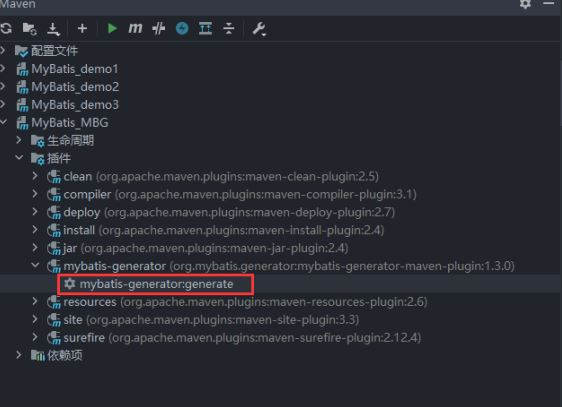

## 概念简介

* 正向工程：先创建Java实体类，由框架负责根据实体类生成数据库表。Hibernate是支持正向工程的
* 逆向工程：先创建数据库表，由框架负责根据数据库表，反向生成如下资源：
  * Java实体类
  * Mapper接口
  * Mapper映射文件

## 创建逆向工程的步骤

```
<dependencies>
    <!-- MyBatis核心依赖包 -->
    <dependency>
        <groupId>org.mybatis</groupId>
        <artifactId>mybatis</artifactId>
        <version>3.5.9</version>
    </dependency>
    <!-- junit测试 -->
    <dependency>
        <groupId>junit</groupId>
        <artifactId>junit</artifactId>
        <version>4.13.2</version>
        <scope>test</scope>
    </dependency>
    <!-- MySQL驱动 -->
    <dependency>
        <groupId>mysql</groupId>
        <artifactId>mysql-connector-java</artifactId>
        <version>8.0.27</version>
    </dependency>
    <!-- log4j日志 -->
    <dependency>
        <groupId>log4j</groupId>
        <artifactId>log4j</artifactId>
        <version>1.2.17</version>
    </dependency>
</dependencies>
        <!-- 控制Maven在构建过程中相关配置 -->
<build>
<!-- 构建过程中用到的插件 -->
<plugins>
    <!-- 具体插件，逆向工程的操作是以构建过程中插件形式出现的 -->
    <plugin>
        <groupId>org.mybatis.generator</groupId>
        <artifactId>mybatis-generator-maven-plugin</artifactId>
        <version>1.3.0</version>
        <!-- 插件的依赖 -->
        <dependencies>
            <!-- 逆向工程的核心依赖 -->
            <dependency>
                <groupId>org.mybatis.generator</groupId>
                <artifactId>mybatis-generator-core</artifactId>
                <version>1.3.2</version>
            </dependency>
            <!-- 数据库连接池 -->
            <dependency>
                <groupId>com.mchange</groupId>
                <artifactId>c3p0</artifactId>
                <version>0.9.2</version>
            </dependency>
            <!-- MySQL驱动 -->
            <dependency>
                <groupId>mysql</groupId>
                <artifactId>mysql-connector-java</artifactId>
                <version>8.0.27</version>
            </dependency>
        </dependencies>
    </plugin>
</plugins>
</build>

```

### 创建MyBatis的核心配置文件

```
<?xml version="1.0" encoding="UTF-8" ?>
<!DOCTYPE configuration
        PUBLIC "-//mybatis.org//DTD Config 3.0//EN"
        "http://mybatis.org/dtd/mybatis-3-config.dtd">
<configuration>
    <properties resource="jdbc.properties"/>
    <typeAliases>
        <package name=""/>
    </typeAliases>
    <environments default="development">
        <environment id="development">
            <transactionManager type="JDBC"/>
            <dataSource type="POOLED">
                <property name="driver" value="${jdbc.driver}"/>
                <property name="url" value="${jdbc.url}"/>
                <property name="username" value="${jdbc.username}"/>
                <property name="password" value="${jdbc.password}"/>
            </dataSource>
        </environment>
    </environments>
    <mappers>
        <package name=""/>
    </mappers>
</configuration>
```

### 创建逆向工程的配置文件

文件名必须是： generatorConfig.xml

```
<?xml version="1.0" encoding="UTF-8"?>
<!DOCTYPE generatorConfiguration
        PUBLIC "-//mybatis.org//DTD MyBatis Generator Configuration 1.0//EN"
        "http://mybatis.org/dtd/mybatis-generator-config_1_0.dtd">
<generatorConfiguration>
    <!--
    targetRuntime: 执行生成的逆向工程的版本
    MyBatis3Simple: 生成基本的CRUD（清新简洁版）
    MyBatis3: 生成带条件的CRUD（奢华尊享版）
    -->
    <context id="DB2Tables" targetRuntime="MyBatis3Simple">
        <!-- 数据库的连接信息 -->
        <jdbcConnection driverClass="com.mysql.cj.jdbc.Driver"
                        connectionURL="jdbc:mysql://localhost:3306/mybatis"
                        userId="root"
                        password="123456">
        </jdbcConnection>
        <!-- javaBean的生成策略-->
        <javaModelGenerator targetPackage="com.atguigu.mybatis.pojo"
                            targetProject=".\src\main\java">
            <property name="enableSubPackages" value="true" />
            <property name="trimStrings" value="true" />
        </javaModelGenerator>
        <!-- SQL映射文件的生成策略 -->
        <sqlMapGenerator targetPackage="com.atguigu.mybatis.mapper"
                         targetProject=".\src\main\resources">
            <property name="enableSubPackages" value="true" />
        </sqlMapGenerator>
        <!-- Mapper接口的生成策略 -->
        <javaClientGenerator type="XMLMAPPER"
                             targetPackage="com.atguigu.mybatis.mapper"
                             targetProject=".\src\main\java">
            <property name="enableSubPackages" value="true" />
        </javaClientGenerator>
        <!-- 逆向分析的表 -->
        <!-- tableName设置为*号，可以对应所有表，此时不写domainObjectName -->
        <!-- domainObjectName属性指定生成出来的实体类的类名 -->
        <table tableName="t_emp" domainObjectName="Emp"/>
        <table tableName="t_dept" domainObjectName="Dept"/>
    </context>
</generatorConfiguration>
```

### 执行MBG插件的generate目标



如果出现报错： Exception getting JDBC Driver ，可能是pom.xml中，数据库驱动配置错误。
dependency中的驱动


mybatis-generator-maven-plugin插件中的驱动


两者的驱动版本应该相同

执行结果


## QBC

### 查询

* selectByExample ：按条件查询，需要传入一个example对象或者null；如果传入一个null，则表示没有条件，也就是查询所有数据
* example.createCriteria().xxx ：创建条件对象，通过andXXX方法为SQL添加查询添加，每个条件之间是and关系
* example.or().xxx ：将之前添加的条件通过or拼接其他条件


```
@Test public void testMBG() throws IOException {
    InputStream is = Resources.getResourceAsStream("mybatis-config.xml");
    SqlSessionFactoryBuilder sqlSessionFactoryBuilder = new SqlSessionFactoryBuilder();
    SqlSessionFactory sqlSessionFactory = sqlSessionFactoryBuilder.build(is);
    SqlSession sqlSession = sqlSessionFactory.openSession(true);
    EmpMapper mapper = sqlSession.getMapper(EmpMapper.class);
    EmpExample example = new EmpExample();
    //名字为张三，且年龄大于等于20
    example.createCriteria().andEmpNameEqualTo("张三").andAgeGreaterThanOrEqualTo(20);
    //或者did不为空
    example.or().andDidIsNotNull();
    List<Emp> emps = mapper.selectByExample(example);
    emps.forEach(System.out::println);
}
```


### 增改

* updateByPrimaryKey ：通过主键进行数据修改，如果某一个值为null，也会将对应的字段改为null
* mapper.updateByPrimaryKey(new Emp(1,"admin",22,null,"456@qq.com",3));

  
* updateByPrimaryKeySelective() ：通过主键进行选择性数据修改，如果某个值为null，则不修改这个字段
* mapper.updateByPrimaryKeySelective(new Emp(2,"admin2",22,null,"456@qq.com",3));

  
