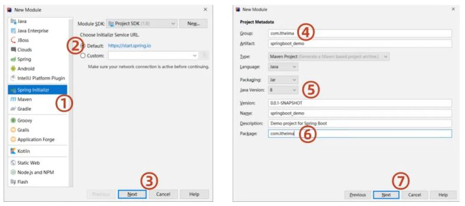
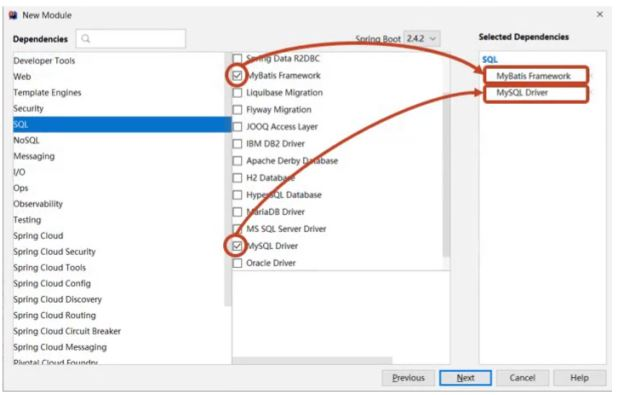
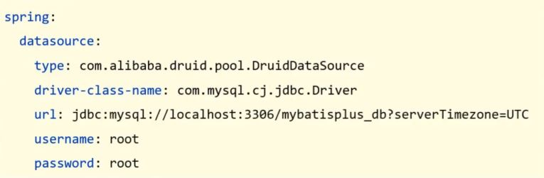
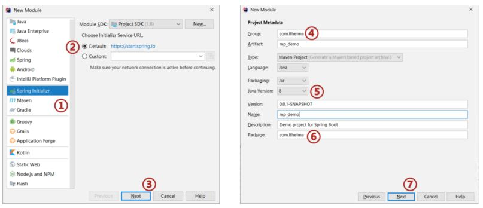
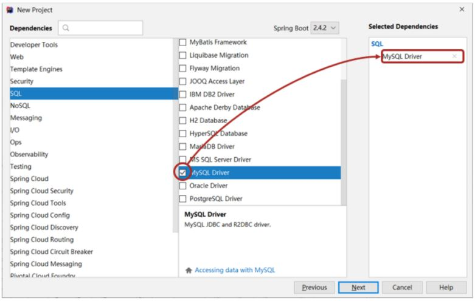
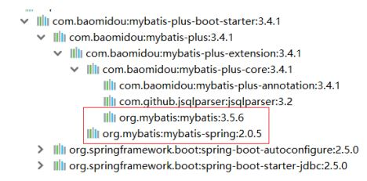
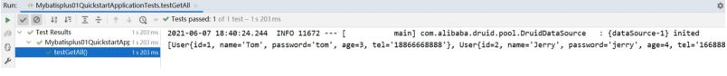

## 简介

MybatisPlus(简称MP)是基于MyBatis框架基础上开发的增强型工具，旨在简化开发、提供效
率。
开发方式：

* 基于MyBatis使用MyBatisPlus
* 基于Spring使用MyBatisPlus
* 基于SpringBoot使用MyBatisPlus

学习之前，我们先来回顾下，SpringBoot整合Mybatis的开发过程:

* 创建SpringBoot工程



* 勾选配置使用的技术，能够实现自动添加起步依赖包



* 设置dataSource相关属性(JDBC参数)



* 定义数据层接口映射配置


我们可以参考着上面的这个实现步骤把SpringBoot整合MyBatisPlus来快速实现下，具体的实现步
骤为:

## 步骤1:创建数据库及表

```
create database if not exists mybatisplus_db character set utf8;
use mybatisplus_db;
        CREATE TABLE user (
        id bigint(20) primary key auto_increment,
        name varchar(32) not null,
        password varchar(32) not null,
        age int(3) not null ,
        tel varchar(32) not null
        );
insert into user values(1,'Tom','tom',3,'18866668888');
insert into user values(2,'Jerry','jerry',4,'16688886666');
insert into user values(3,'Jock','123456',41,'18812345678');
insert into user values(4,'传智播客','itcast',15,'4006184000');
```

## 步骤2:创建SpringBoot工程



## 步骤3:勾选配置使用技术



> 说明:
> 由于MP并未被收录到idea的系统内置配置，无法直接选择加入，需要手动在pom.xml中配置添加

## 步骤4:pom.xml补全依赖

```
<dependency>
    <groupId>com.baomidou</groupId>
    <artifactId>mybatis-plus-boot-starter</artifactId>
    <version>3.4.1</version>
</dependency>
<dependency>
    <groupId>com.alibaba</groupId>
    <artifactId>druid</artifactId>
    <version>1.1.16</version>
</dependency>
```

> 说明:
> druid数据源可以加也可以不加，SpringBoot有内置的数据源，可以配置成使用Druid数据源
> 从MP的依赖关系可以看出，通过依赖传递已经将MyBatis与MyBatis整合Spring的jar包导入，我们不需要额外在添加MyBatis的相关jar包



## 步骤5:添加MP的相关配置信息

resources默认生成的是properties配置文件，可以将其替换成yml文件，并在文件中配置数据库
连接的相关信息: application.yml

```
spring:
  datasource:
  type: com.alibaba.druid.pool.DruidDataSource
  driver-class-name: com.mysql.cj.jdbc.Driver
  url: jdbc:mysql://localhost:3306/mybatisplus_db?serverTimezone=UTC
  username: root
  password: root
```

## 步骤6:根据数据库表创建实体类

```
public class User {
    private Long id;
    private String name;
    private String password;
    private Integer age;
    private String tel;
//setter...getter...toString方法略
}
```

## 步骤7:创建Dao接口

```
@Mapper
public interface UserDao extends BaseMapper<User>{
}
```

## 步骤8:编写引导类

```
@SpringBootApplication
//@MapperScan("com.itheima.dao")
public class Mybatisplus01QuickstartApplication {
    public static void main(String[] args) {
        SpringApplication.run(Mybatisplus01QuickstartApplication.class, args);
    }
}
```

Dao接口要想被容器扫描到，有两种解决方案:

* 在Dao接口上添加@Mapper注解，并且确保Dao处在引导类所在包或其子包中。
  * 该方案的缺点是需要在每一Dao接口中添加注解
* 在引导类上添加@MapperScan注解，其属性为所要扫描的Dao所在包。
  * 该方案的好处是只需要写一次，则指定包下的所有Dao接口都能被扫描到，@Mapper就可以不写。

## 步骤9:编写测试类

```
@SpringBootTest
class MpDemoApplicationTests {
    @Autowired
    private UserDao userDao;
    @Test
    public void testGetAll() {
        List<User> userList = userDao.selectList(null);
        System.out.println(userList);
    }
}
```

userDao注入的时候下面有红线提示的原因是什么?

* UserDao是一个接口，不能实例化对象
* 只有在服务器启动IOC容器初始化后，由框架创建DAO接口的代理对象来注入
* 现在服务器并未启动，所以代理对象也未创建，IDEA查找不到对应的对象注入，所以提示报红
* 一旦服务启动，就能注入其代理对象，所以该错误提示不影响正常运行。

查看运行结果:



跟之前整合MyBatis相比，你会发现我们不需要在DAO接口中编写方法和SQL语句了，只需要继承BaseMapper接口即可。整体来说简化很多。
