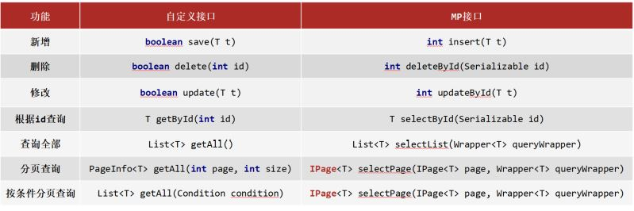
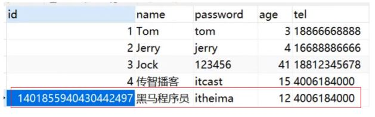
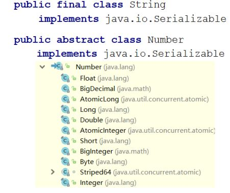

## 简介

MyBatisPlus（简称MP）是基于MyBatis框架基础上开发的增强型工具，旨在简化开发、提高效率。

官網是：https://baomidou.com/

MP旨在成为MyBatis的最好搭档，而不是替换MyBatis,所以可以理解为MP是MyBatis的一套增强工具，它是在MyBatis的基础上进行开发的，我们虽然使用MP但是底层依然是MyBatis的东西，也就是说我们也可以在MP中写MyBatis的内容。

对于MP的学习，大家可以参考着官方文档来进行学习，里面都有详细的代码案例。

* 无侵入：只做增强不做改变，不会对现有工程产生影响
* 强大的 CRUD 操作：内置通用 Mapper，少量配置即可实现单表CRUD 操作
* 支持 Lambda：编写查询条件无需担心字段写错
* 支持主键自动生成
* 内置分页插件
* ......

## 标准数据层开发

在这一节中我们重点学习的是数据层标准的CRUD(增删改查)的实现与分页功能。代码比较多，我们一
个个来学习。

### 标准CRUD使用

对于标准的CRUD功能都有哪些以及MP都提供了哪些方法可以使用呢?

我们先来看张图:



对于这张图的方法，我们挨个来演示下:
首先说下，案例中的环境就是咱们入门案例的内容，第一个先来完成新增功能

### 新增

在进行新增之前，我们可以分析下新增的方法:

```
int insert (T t)
```

* T : 泛型，新增用来保存新增数据
* int : 返回值，新增成功后返回1，没有新增成功返回的是0

在测试类中进行新增操作:

```
@SpringBootTest
class Mybatisplus01QuickstartApplicationTests {
    @Autowired
    private UserDao userDao;
    @Test
    void testSave() {
        User user = new User();
        user.setName("黑马程序员");
        user.setPassword("itheima");
        user.setAge(12);
        user.setTel("4006184000");
        userDao.insert(user);
    }
}
```

执行测试后，数据库表中就会添加一条数据。



但是数据中的主键ID，有点长，那这个主键ID是如何来的?我们更想要的是主键自增，应该是5才对，
这个是我们后面要学习的主键ID生成策略，这块的这个问题，我们暂时先放放。

### 删除

在进行删除之前，我们可以分析下删除的方法:

```
int deleteById (Serializable id)
```

Serializable：参数类型

> 思考:参数类型为什么是一个序列化类?



从这张图可以看出：

* String和Number是Serializable的子类，
* Number又是Float,Double,Integer等类的父类，
* 能作为主键的数据类型都已经是Serializable的子类，
* MP使用Serializable作为参数类型，就好比我们可以用Object接收任何数据类型一样。

int:返回值类型，数据删除成功返回1，未删除数据返回0。

在测试类中进行新增操作:

```
@SpringBootTest
class Mybatisplus01QuickstartApplicationTests {
    @Autowired
    private UserDao userDao;
    @Test
    void testDelete() {
        userDao.deleteById(1401856123725713409L);
    }
}
```

### 修改

在进行修改之前，我们可以分析下修改的方法:

```
int updateById(T t);
```

* T : 泛型，需要修改的数据内容，注意因为是根据ID进行修改，所以传入的对象中需要有ID属性值
* int : 返回值，修改成功后返回1，未修改数据返回0

在测试类中进行新增操作:

```
@SpringBootTest
class Mybatisplus01QuickstartApplicationTests {
    @Autowired
    private UserDao userDao;
    @Test
    void testUpdate() {
        User user = new User();
        user.setId(1L);
        user.setName("Tom888");
        user.setPassword("tom888");
        userDao.updateById(user);
    }
}
```

> 说明:修改的时候，只修改实体对象中有值的字段。

### 根据ID查询

在进行根据ID查询之前，我们可以分析下根据ID查询的方法:

```
T selectById (Serializable id)
```

* Serializable：参数类型,主键ID的值
* T : 根据ID查询只会返回一条数据

在测试类中进行新增操作:

```
@SpringBootTest
class Mybatisplus01QuickstartApplicationTests {
    @Autowired
    private UserDao userDao;
    @Test
    void testGetById() {
        User user = userDao.selectById(2L);
        System.out.println(user);
    }
}
```

### 查询所有

在进行查询所有之前，我们可以分析下查询所有的方法:

```
List<T> selectList(Wrapper<T> queryWrapper)
```

* Wrapper：用来构建条件查询的条件，目前我们没有可直接传为Null
* List : 因为查询的是所有，所以返回的数据是一个集合

在测试类中进行新增操作:

```
@SpringBootTest
class Mybatisplus01QuickstartApplicationTests {
    @Autowired
    private UserDao userDao;
    @Test
    void testGetAll() {
        List<User> userList = userDao.selectList(null);
        System.out.println(userList);
    }
}
```

我们所调用的方法都是来自于DAO接口继承的BaseMapper类中。里面的方法有很多，我们后面会慢慢
去学习里面的内容。
