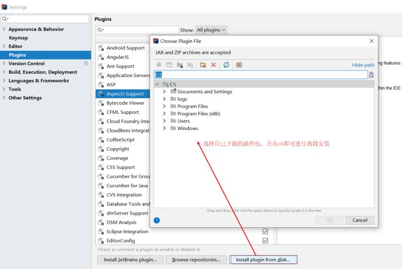

## 简单分析

代码写到这，我们会发现DAO接口类的编写现在变成最简单的了，里面什么都不用写。反过来看看模型
类的编写都需要哪些内容:

* 私有属性
* setter...getter...方法
* toString方法
* 构造函数

虽然这些内容不难，同时也都是通过IDEA工具生成的，但是过程还是必须得走一遍，那么对于模型类的编写有没有什么优化方法?就是我们接下来要学习的Lombok。

## **概念：**

* Lombok，一个Java类库，提供了一组注解，简化POJO实体类开发。

## 使用步骤

### 步骤1:添加lombok依赖

```
<dependency>
    <groupId>org.projectlombok</groupId>
    <artifactId>lombok</artifactId>
    <!--<version>1.18.12</version>-->
</dependency>
```

> 注意：版本可以不用写，因为SpringBoot中已经管理了lombok的版本。

### 步骤2:安装Lombok的插件

> 新版本IDEA已经内置了该插件，如果删除setter和getter方法程序有报红，则需要安装插件


如果在IDEA中找不到lombok插件，可以访问如下网站：https://plugins.jetbrains.com/plugin/6317-lombok/versions

根据自己IDEA的版本下载对应的lombok插件，下载成功后，在IDEA中采用离线安装的方式进行安装。



### 步骤3:模型类上添加注解

Lombok常见的注解有:

* @Setter:为模型类的属性提供setter方法
* @Getter:为模型类的属性提供getter方法
* @ToString:为模型类的属性提供toString方法
* @EqualsAndHashCode:为模型类的属性提供equals和hashcode方法
* @Data:是个组合注解，包含上面的注解的功能
* @NoArgsConstructor:提供一个无参构造函数
* @AllArgsConstructor:提供一个包含所有参数的构造函数

Lombok的注解还有很多，上面的是比较常用的，其他的大家后期用到了，再去补充学习。

```
@Data
@AllArgsConstructor
@NoArgsConstructor
public class User {
    private Long id;
    private String name;
    private String password;
    private Integer age;
    private String tel;
}
```

说明:
Lombok只是简化模型类的编写，我们之前的方法也能用，比如有人会问:我如果只想要有name和
password的构造函数，该如何编写?

```
@Data
@AllArgsConstructor
@NoArgsConstructor
public class User {
    private Long id;
    private String name;
    private String password;
    private Integer age;
    private String tel;
    public User(String name, String password) {
        this.name = name;
        this.password = password;
    }
}
```

这种方式是被允许的。
