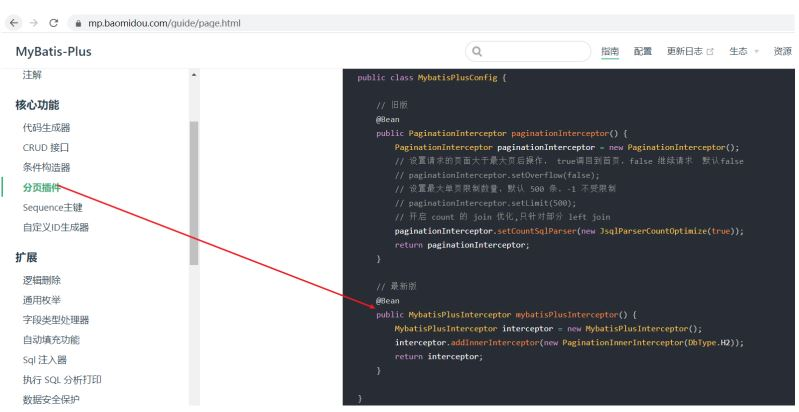
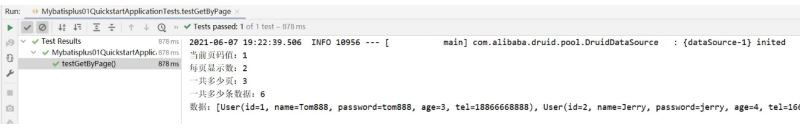
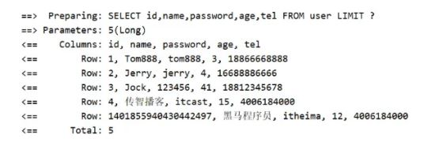

## 分页查询的方法

```
IPage<T> selectPage(IPage<T> page, Wrapper<T> queryWrapper)
```

* IPage:用来构建分页查询条件
* Wrapper：用来构建条件查询的条件，目前我们没有可直接传为Null
* IPage:返回值，你会发现构建分页条件和方法的返回值都是IPage

IPage是一个接口，我们需要找到它的实现类来构建它，具体的实现类，可以进入到IPage类中按ctrl+h,会找到其有一个实现类为Page。

## 步骤1:调用方法传入参数获取返回值

```
@SpringBootTest
class Mybatisplus01QuickstartApplicationTests {
    @Autowired
    private UserDao userDao;
    //分页查询
    @Test
    void testSelectPage(){
        //1 创建IPage分页对象,设置分页参数,1为当前页码，3为每页显示的记录数
        IPage<User> page=new Page<>(1,3);
        //2 执行分页查询
        userDao.selectPage(page,null);
        //3 获取分页结果
        System.out.println("当前页码值："+page.getCurrent());
        System.out.println("每页显示数："+page.getSize());
        System.out.println("一共多少页："+page.getPages());
        System.out.println("一共多少条数据："+page.getTotal());
        System.out.println("数据："+page.getRecords());
    }
}
```

## 步骤2:设置分页拦截器

这个拦截器MP已经为我们提供好了，我们只需要将其配置成Spring管理的bean对象即可。

```
@Configuration
public class MybatisPlusConfig {
    @Bean
    public MybatisPlusInterceptor mybatisPlusInterceptor(){
        //1 创建MybatisPlusInterceptor拦截器对象
        MybatisPlusInterceptor mpInterceptor=new MybatisPlusInterceptor();
        //2 添加分页拦截器
        mpInterceptor.addInnerInterceptor(new PaginationInnerInterceptor());
        return mpInterceptor;
    }
}
```

说明:上面的代码记不住咋办呢?
这些内容在MP的官方文档中有详细的说明，我们可以查看官方文档类配置



## 步骤3:运行测试程序



如果想查看MP执行的SQL语句，可以修改application.yml配置文件，

```
mybatis-plus:
  configuration:
    log-impl: org.apache.ibatis.logging.stdout.StdOutImpl #打印SQL日志到控制台
```

打开日志后，就可以在控制台打印出对应的SQL语句，开启日志功能性能就会受到影响，调试完后记得关闭。


