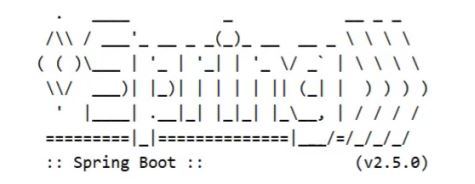

## 简介

这节主要学习的内容有:

* 条件查询方式
* 查询投影
* 查询条件设定
* 字段映射与表名映射

## 条件查询

### 条件查询的类

MyBatisPlus将书写复杂的SQL查询条件进行了封装，使用编程的形式完成查询条件的组合。

这个我们在前面都有见过，比如查询所有和分页查询的时候，都有看到过一个Wrapper类，这个类就
是用来构建查询条件的，如下图所示:


那么条件查询如何使用Wrapper来构建呢?

### 环境构建

在构建条件查询之前，我们先来准备下环境

* 创建一个SpringBoot项目
* pom.xml中添加对应的依赖

```
<?xml version="1.0" encoding="UTF-8"?>
<project xmlns="http://maven.apache.org/POM/4.0.0"
         xmlns:xsi="http://www.w3.org/2001/XMLSchema-instance"
         xsi:schemaLocation="http://maven.apache.org/POM/4.0.0
https://maven.apache.org/xsd/maven-4.0.0.xsd">
    <modelVersion>4.0.0</modelVersion>
    <parent>
        <groupId>org.springframework.boot</groupId>
        <artifactId>spring-boot-starter-parent</artifactId>
        <version>2.5.0</version>
    </parent>
    <groupId>com.itheima</groupId>
    <artifactId>mybatisplus_02_dql</artifactId>
    <version>0.0.1-SNAPSHOT</version>
    <properties>
        <java.version>1.8</java.version>
    </properties>
    <dependencies>
        <dependency>
            <groupId>com.baomidou</groupId>
            <artifactId>mybatis-plus-boot-starter</artifactId>
            <version>3.4.1</version>
        </dependency>
        <dependency>
            <groupId>org.springframework.boot</groupId>
            <artifactId>spring-boot-starter</artifactId>
        </dependency>
        <dependency>
            <groupId>com.alibaba</groupId>
            <artifactId>druid</artifactId>
            <version>1.1.16</version>
        </dependency>
        <dependency>
            <groupId>mysql</groupId>
            <artifactId>mysql-connector-java</artifactId>
            <scope>runtime</scope>
        </dependency>
        <dependency>
            <groupId>org.springframework.boot</groupId>
            <artifactId>spring-boot-starter-test</artifactId>
            <scope>test</scope>
        </dependency>
        <dependency>
            <groupId>org.projectlombok</groupId>
            <artifactId>lombok</artifactId>
        </dependency>
    </dependencies>
    <build>
        <plugins>
            <plugin>
                <groupId>org.springframework.boot</groupId>
                <artifactId>spring-boot-maven-plugin</artifactId>
            </plugin>
        </plugins>
    </build>
</project>
```

* 编写UserDao接口

```
@Mapper
public interface UserDao extends BaseMapper<User> {
}
```

* 编写模型类

```
@Data
public class User {
    private Long id;
    private String name;
    private String password;
    private Integer age;
    private String tel;
}
```

* 编写引导类

```
@SpringBootApplication
public class Mybatisplus02DqlApplication {
    public static void main(String[] args) {
        SpringApplication.run(Mybatisplus02DqlApplication.class, args);
    }
}
```

* 编写配置文件

```
# dataSource
spring:
  datasource:
    type: com.alibaba.druid.pool.DruidDataSource
    driver-class-name: com.mysql.cj.jdbc.Driver
    url: jdbc:mysql://localhost:3306/mybatisplus_db?serverTimezone=UTC
    username: root
    password: root
# mp日志
mybatis-plus:
  configuration:
    log-impl: org.apache.ibatis.logging.stdout.StdOutImpl
```

* 编写测试类

```
@SpringBootTest
class Mybatisplus02DqlApplicationTests {
    @Autowired
    private UserDao userDao;
    @Test
    void testGetAll(){
        List<User> userList = userDao.selectList(null);
        System.out.println(userList);
    }
}
```

最终创建的项目结构为:


测试的时候，控制台打印的日志比较多，速度有点慢而且不利于查看运行结果，所以接下来我们把这个日志处理下:

* 取消初始化spring日志打印，resources目录下添加logback.xml，名称固定，内容如下:

```
<?xml version="1.0" encoding="UTF-8"?>
<configuration>
</configuration>
```

> 说明:logback.xml的配置内容，不是我们学习的重点，如果有兴趣可以自行百度查询。

* 取消MybatisPlus启动banner图标。application.yml添加如下内容:


```
# mybatis-plus日志控制台输出
mybatis-plus:
  configuration:
    log-impl: org.apache.ibatis.logging.stdout.StdOutImpl
  global-config:
    banner: off # 关闭mybatisplus启动图标
```

* 取消SpringBoot的log打印。application.yml添加如下内容:



```
spring:
  main:
    banner-mode: off # 关闭SpringBoot启动图标(banner)
```

解决控制台打印日志过多的相关操作可以不用去做，一般会被用来方便我们查看程序运行的结果。

### 构建条件查询

在进行查询的时候，我们的入口是在Wrapper这个类上，因为它是一个接口，所以我们需要去找它对
应的实现类，关于实现类也有很多，说明我们有多种构建查询条件对象的方式，


#### 第一种:QueryWrapper

```
@SpringBootTest
class Mybatisplus02DqlApplicationTests {
    @Autowired
    private UserDao userDao;
    @Test
    void testGetAll(){
        QueryWrapper qw = new QueryWrapper();
        qw.lt("age",18);
        List<User> userList = userDao.selectList(qw);
        System.out.println(userList);
    }
}
```

* lt: 小于 `<`  ,最终的sql语句为

```
SELECT id,name,password,age,tel FROM user WHERE (age < ?)
```

第一种方式介绍完后，有个小问题就是在写条件的时候，容易出错，比如age写错，就会导致查询不成
功。

#### 第二种:QueryWrapper的基础上使用lambda

```
@SpringBootTest
class Mybatisplus02DqlApplicationTests {
    @Autowired
    private UserDao userDao;
    @Test
    void testGetAll(){
        QueryWrapper<User> qw = new QueryWrapper<User>();
        qw.lambda().lt(User::getAge, 10);//添加条件
        List<User> userList = userDao.selectList(qw);
        System.out.println(userList);
    }
}
```

User::getAget,为lambda表达式中的，类名::方法名，最终的sql语句为:

```
SELECT id,name,password,age,tel FROM user WHERE (age < ?)
```

> 注意:构建LambdaQueryWrapper的时候泛型不能省。

此时我们再次编写条件的时候，就不会存在写错名称的情况，但是qw后面多了一层lambda()调用

#### 第三种:LambdaQueryWrapper

```
@SpringBootTest
class Mybatisplus02DqlApplicationTests {
    @Autowired
    private UserDao userDao;
    @Test
    void testGetAll(){
        LambdaQueryWrapper<User> lqw = new LambdaQueryWrapper<User>();
        lqw.lt(User::getAge, 10);
        List<User> userList = userDao.selectList(lqw);
        System.out.println(userList);
    }
}
```

这种方式就解决了上一种方式所存在的问题。

### 多条件构建

学完了三种构建查询对象的方式，每一种都有自己的特点，所以用哪一种都行，刚才都是一个条件，
那如果有多个条件该如何构建呢?

需求:查询数据库表中，年龄在10岁到30岁之间的用户信息

```
@SpringBootTest
class Mybatisplus02DqlApplicationTests {
    @Autowired
    private UserDao userDao;
    @Test
    void testGetAll(){
        LambdaQueryWrapper<User> lqw = new LambdaQueryWrapper<User>();
        lqw.lt(User::getAge, 30);
        lqw.gt(User::getAge, 10);
        List<User> userList = userDao.selectList(lqw);
        System.out.println(userList);
    }
}
```

* gt：大于(>),最终的SQL语句为

  ```
  SELECT id,name,password,age,tel FROM user WHERE (age < ? AND age > ?)
  ```
* 构建多条件的时候，可以支持链式编程

  ```
  LambdaQueryWrapper<User> lqw = new LambdaQueryWrapper<User>();
  lqw.lt(User::getAge, 30).gt(User::getAge, 10);
  List<User> userList = userDao.selectList(lqw);
  System.out.println(userList);
  ```

需求:查询数据库表中，年龄小于10或年龄大于30的数据

```
@SpringBootTest
class Mybatisplus02DqlApplicationTests {
    @Autowired
    private UserDao userDao;
    @Test
    void testGetAll(){
        LambdaQueryWrapper<User> lqw = new LambdaQueryWrapper<User>();
        lqw.lt(User::getAge, 10).or().gt(User::getAge, 30);
        List<User> userList = userDao.selectList(lqw);
        System.out.println(userList);
    }
}
```

* or()就相当于我们sql语句中的or关键字,不加默认是and，最终的sql语句为:
  ```
  SELECT id,name,password,age,tel FROM user WHERE (age < ? OR age > ?)
  ```

### null判定

先来看一张图，


* 我们在做条件查询的时候，一般会有很多条件可以供用户进行选择查询。
* 这些条件用户可以选择使用也可以选择不使用，比如我要查询价格在8000以上的手机
* 在输入条件的时候，价格有一个区间范围，按照需求只需要在第一个价格输入框中输入8000
* 后台在做价格查询的时候，一般会让 `price>值1 and price <值2`
* 因为前端没有输入值2，所以如果不处理的话，就会出现 price>8000 and price < null问题
* 这个时候查询的结果就会出问题，具体该如何解决?


需求:查询数据库表中，根据输入年龄范围来查询符合条件的记录。

用户在输入值的时候，

* 如果只输入第一个框，说明要查询大于该年龄的用户
* 如果只输入第二个框，说明要查询小于该年龄的用户
* 如果两个框都输入了，说明要查询年龄在两个范围之间的用户

思考第一个问题：后台如果想接收前端的两个数据，该如何接收?
我们可以使用两个简单数据类型，也可以使用一个模型类，但是User类中目前只有一个age属性,如:

```
@Data
public class User {
    private Long id;
    private String name;
    private String password;
    private Integer age;
    private String tel;
}
```

使用一个age属性，如何去接收页面上的两个值呢?这个时候我们有两个解决方案

#### 方案一:添加属性age2,这种做法可以但是会影响到原模型类的属性内容

```
@Data
public class User {
    private Long id;
    private String name;
    private String password;
    private Integer age;
    private String tel;
    private Integer age2;
}
```

#### 方案二:新建一个模型类,让其继承User类，并在其中添加age2属性，UserQuery在拥有User属性后
同时添加了age2属性。

```
@Data
public class User {
    private Long id;
    private String name;
    private String password;
    private Integer age;
    private String tel;
}
@Data
public class UserQuery extends User {
    private Integer age2;
}
```

环境准备好后，我们来实现下刚才的需求：

```
@SpringBootTest
class Mybatisplus02DqlApplicationTests {
    @Autowired
    private UserDao userDao;
    @Test
    void testGetAll(){
        //模拟页面传递过来的查询数据
        UserQuery uq = new UserQuery();
        uq.setAge(10);
        uq.setAge2(30);
        LambdaQueryWrapper<User> lqw = new LambdaQueryWrapper<User>();
        if(null != uq.getAge2()){
            lqw.lt(User::getAge, uq.getAge2());
        }
        if( null != uq.getAge()) {
            lqw.gt(User::getAge, uq.getAge());
        }
        List<User> userList = userDao.selectList(lqw);
        System.out.println(userList);
    }
}
```

上面的写法可以完成条件为非空的判断，但是问题很明显，如果条件多的话，每个条件都需要判断，
代码量就比较大，来看MP给我们提供的简化方式：

```
@SpringBootTest
class Mybatisplus02DqlApplicationTests {
    @Autowired
    private UserDao userDao;
    @Test
    void testGetAll(){
        //模拟页面传递过来的查询数据
        UserQuery uq = new UserQuery();
        uq.setAge(10);
        uq.setAge2(30);
        LambdaQueryWrapper<User> lqw = new LambdaQueryWrapper<User>();
        lqw.lt(null!=uq.getAge2(),User::getAge, uq.getAge2());
        lqw.gt(null!=uq.getAge(),User::getAge, uq.getAge());
        List<User> userList = userDao.selectList(lqw);
        System.out.println(userList);
    }
}
```

* lt()方法

  

  condition为boolean类型，返回true，则添加条件，返回false则不添加条件

## 查询投影

### 查询指定字段

目前我们在查询数据的时候，什么都没有做默认就是查询表中所有字段的内容，我们所说的查询投影即不查询所有字段，只查询出指定内容的数据。具体如何来实现?

```
@SpringBootTest
class Mybatisplus02DqlApplicationTests {
    @Autowired
    private UserDao userDao;
    @Test
    void testGetAll(){
        LambdaQueryWrapper<User> lqw = new LambdaQueryWrapper<User>();
        lqw.select(User::getId,User::getName,User::getAge);
        List<User> userList = userDao.selectList(lqw);
        System.out.println(userList);
    }
}
```

* select(...)方法用来设置查询的字段列，可以设置多个，最终的sql语句为:

  ```
  SELECT id,name,age FROM user
  ```
* 如果使用的不是lambda，就需要手动指定字段

  ```
  @SpringBootTest
  class Mybatisplus02DqlApplicationTests {
      @Autowired
      private UserDao userDao;
      @Test
      void testGetAll(){
          QueryWrapper<User> lqw = new QueryWrapper<User>();
          lqw.select("id","name","age","tel");
          List<User> userList = userDao.selectList(lqw);
          System.out.println(userList);
      }
  }
  ```

  最终的sql语句为:SELECT id,name,age,tel FROM user

## 聚合查询

需求:聚合函数查询，完成count、max、min、avg、sum的使用

* count:总记录数
* max:最大值
* min:最小值
* avg:平均值
* sum:求和

```
@SpringBootTest
class Mybatisplus02DqlApplicationTests {
    @Autowired
    private UserDao userDao;
    @Test
    void testGetAll() {
        QueryWrapper<User> lqw = new QueryWrapper<User>();
        //lqw.select("count(*) as count");
        //SELECT count(*) as count FROM user
        //lqw.select("max(age) as maxAge");
        //SELECT max(age) as maxAge FROM user
        //lqw.select("min(age) as minAge");
        //SELECT min(age) as minAge FROM user
        //lqw.select("sum(age) as sumAge");
        //SELECT sum(age) as sumAge FROM user
        lqw.select("avg(age) as avgAge");
        //SELECT avg(age) as avgAge FROM user
        List<Map<String, Object>> userList = userDao.selectMaps(lqw);
        System.out.println(userList);
    }
}
```

为了在做结果封装的时候能够更简单，我们将上面的聚合函数都起了个名称，方面后期来获取这些数
据。

## 分组查询

需求:分组查询，完成 group by的查询使用

```
@SpringBootTest
class Mybatisplus02DqlApplicationTests {
    @Autowired
    private UserDao userDao;
    @Test
    void testGetAll(){
        QueryWrapper<User> lqw = new QueryWrapper<User>();
        lqw.select("count(*) as count,tel");
        lqw.groupBy("tel");
        List<Map<String, Object>> list = userDao.selectMaps(lqw);
        System.out.println(list);
    }
}
```

* groupBy为分组，最终的sql语句为

  ```
  SELECT count(*) as count,tel FROM user GROUP BY tel
  ```

注意:

* 聚合与分组查询，无法使用lambda表达式来完成
* MP只是对MyBatis的增强，如果MP实现不了，我们可以直接在DAO接口中使用MyBatis的方式实现

## 查询条件

前面我们只使用了lt()和gt(),除了这两个方法外，MP还封装了很多条件对应的方法，这一节我们重
点把MP提供的查询条件方法进行学习下。

MP的查询条件有很多:

* 范围匹配（> 、 = 、between）
* 模糊匹配（like）
* 空判定（null）
* 包含性匹配（in）
* 分组（group）
* 排序（order）
* ……

### 等值查询

需求:根据用户名和密码查询用户信息

```
@SpringBootTest
class Mybatisplus02DqlApplicationTests {
    @Autowired
    private UserDao userDao;
    @Test
    void testGetAll(){
        LambdaQueryWrapper<User> lqw = new LambdaQueryWrapper<User>();
        lqw.eq(User::getName, "Jerry").eq(User::getPassword, "jerry");
        User loginUser = userDao.selectOne(lqw);
        System.out.println(loginUser);
    }
}
```

* eq()： 相当于 = ,对应的sql语句为

  ```
  SELECT id,name,password,age,tel FROM user WHERE (name = ? AND password = ?)
  ```
* selectList：查询结果为多个或者单个
* selectOne:查询结果为单个

### 范围查询

需求:对年龄进行范围查询，使用lt()、le()、gt()、ge()、between()进行范围查询

```
@SpringBootTest
class Mybatisplus02DqlApplicationTests {
    @Autowired
    private UserDao userDao;

    @Test
    void testGetAll() {
        LambdaQueryWrapper<User> lqw = new LambdaQueryWrapper<User>();
        lqw.between(User::getAge, 10, 30);
        //SELECT id,name,password,age,tel FROM user WHERE (age BETWEEN ? AND?)
        List<User> userList = userDao.selectList(lqw);
        System.out.println(userList);
    }
}
```

* gt():大于(>)
* ge():大于等于(>=)
* lt():小于 `(<)`
* lte():小于等于 `(<=)`
* between():between ? and ?

### 模糊查询

需求:查询表中name属性的值以J开头的用户信息,使用like进行模糊查询

```
@SpringBootTest
class Mybatisplus02DqlApplicationTests {
    @Autowired
    private UserDao userDao;
    @Test
    void testGetAll(){
        LambdaQueryWrapper<User> lqw = new LambdaQueryWrapper<User>();
        lqw.likeLeft(User::getName, "J");
        //SELECT id,name,password,age,tel FROM user WHERE (name LIKE ?)
        List<User> userList = userDao.selectList(lqw);
        System.out.println(userList);
    }
}
```

* like():前后加百分号,如 %J%
* likeLeft():前面加百分号,如 %J
* likeRight():后面加百分号,如 J%

### 排序查询

需求:查询所有数据，然后按照id降序

```
@SpringBootTest
class Mybatisplus02DqlApplicationTests {
    @Autowired
    private UserDao userDao;
    @Test
    void testGetAll(){
        LambdaQueryWrapper<User> lwq = new LambdaQueryWrapper<>();
        /** 
         * condition ：条件，返回boolean，当condition为true，进行排序，如果为false，则不排序
         * isAsc:是否为升序，true为升序，false为降序
         * columns：需要操作的列
         */
        lwq.orderBy(true,false, User::getId);
        userDao.selectList(lwq)
    }
}
```

除了上面演示的这种实现方式，还有很多其他的排序方法可以被调用，如图:


* orderBy排序
* condition:条件，true则添加排序，false则不添加排序
* isAsc:是否为升序，true升序，false降序
* columns:排序字段，可以有多个
* orderByAsc/Desc(单个column):按照指定字段进行升序/降序
* orderByAsc/Desc(多个column):按照多个字段进行升序/降序
* orderByAsc/Desc
* condition:条件，true添加排序，false不添加排序
* 多个columns：按照多个字段进行排序

除了上面介绍的这几种查询条件构建方法以外还会有很多其他的方法，比如isNull,isNotNull,in,notIn等等方法可供选择，具体参考官方文档的条件构造器来学习使用。

## 映射匹配兼容性

前面我们已经能从表中查询出数据，并将数据封装到模型类中，这整个过程涉及到一张表和一个模型
类:


之所以数据能够成功的从表中获取并封装到模型对象中，原因是表的字段列名和模型类的属性名一样。

那么问题就来了:

### 问题1:表字段与编码属性设计不同步

当表的列名和模型类的属性名发生不一致，就会导致数据封装不到模型对象，这个时候就需要其中一
方做出修改，那如果前提是两边都不能改又该如何解决?
MP给我们提供了一个注解@TableField ,使用该注解可以实现模型类属性名和表的列名之间的映射关
系。


### 问题2:编码中添加了数据库中未定义的属性

当模型类中多了一个数据库表不存在的字段，就会导致生成的sql语句中在select的时候查询了数据
库不存在的字段，程序运行就会报错，错误信息为:

`Unknown column '多出来的字段名称' in 'field list'`

具体的解决方案用到的还是@TableField注解，它有一个属性叫exist，设置该字段是否在数据库表
中存在，如果设置为false则不存在，生成sql语句查询的时候，就不会再查询该字段了。


### 问题3：采用默认查询开放了更多的字段查看权限

查询表中所有的列的数据，就可能把一些敏感数据查询到返回给前端，这个时候我们就需要限制哪些
字段默认不要进行查询。解决方案是@TableField注解的一个属性叫select，该属性设置默认是否需
要查询该字段的值，true(默认值)表示默认查询该字段，false表示默认不查询该字段。


知识点1：@TableField

| 名称     | @TableField                                                                                                                                                                           |
| -------- | ------------------------------------------------------------------------------------------------------------------------------------------------------------------------------------- |
| 类型     | 属性注解                                                                                                                                                                              |
| 位置     | 模型类属性定义上方                                                                                                                                                                    |
| 作用     | 设置当前属性对应的数据库表中的字段关系                                                                                                                                                |
| 相关属性 | value(默认)：设置数据库表字段名称<br />exist:设置属性在数据库表字段中是否存在，默认为true，此属性不能与value合并使用<br />select:设置属性是否参与查询，此属性与select()映射配置不冲突 |

### 问题4:表名与编码开发设计不同步

该问题主要是表的名称和模型类的名称不一致，导致查询失败，这个时候通常会报如下错误信息:

`Table 'databaseName.tableNaem' doesn't exist`,翻译过来就是数据库中的表不存在。


解决方案是使用MP提供的另外一个注解@TableName来设置表与模型类之间的对应关系。


知识点2：@TableName

| 名称     | @TableNamecol2                |
| -------- | ----------------------------- |
| 类型     | 类注解                        |
| 位置     | 模型类定义上方                |
| 作用     | 设置当前类对应于数据库表关系  |
| 相关属性 | value(默认)：设置数据库表名称 |

代码演示

##### 步骤1:修改数据库表user为tbl_user

直接查询会报错，原因是MP默认情况下会使用模型类的类名首字母小写当表名使用。


##### 步骤2:模型类添加@TableName注解

```
@Data
@TableName("tbl_user")
public class User {
    private Long id;
    private String name;
    private String password;
    private Integer age;
    private String tel;
}
```

##### 步骤3:将字段password修改成pwd

直接查询会报错，原因是MP默认情况下会使用模型类的属性名当做表的列名使用


##### 步骤4：使用@TableField映射关系

```
@Data
@TableName("tbl_user")
public class User {
    private Long id;
    private String name;
    @TableField(value="pwd")
    private String password;
    private Integer age;
    private String tel;
}
```

##### 步骤5:添加一个数据库表不存在的字段

```
@Data
@TableName("tbl_user")
public class User {
    private Long id;
    private String name;
    @TableField(value="pwd")
    private String password;
    private Integer age;
    private String tel;
    private Integer online;
}
```

直接查询会报错，原因是MP默认情况下会查询模型类的所有属性对应的数据库表的列，而online不存在


##### 步骤6：使用@TableField排除字段

```
@Data
@TableName("tbl_user")
public class User {
    private Long id;
    private String name;
    @TableField(value="pwd")
    private String password;
    private Integer age;
    private String tel;
    @TableField(exist=false)
    private Integer online;
}
```

**步骤7:查询时将pwd隐藏**

```
@Data
@TableName("tbl_user")
public class User {
    private Long id;
    private String name;
    @TableField(value="pwd",select=false)
    private String password;
    private Integer age;
    private String tel;
    @TableField(exist=false)
    private Integer online;
}
```
