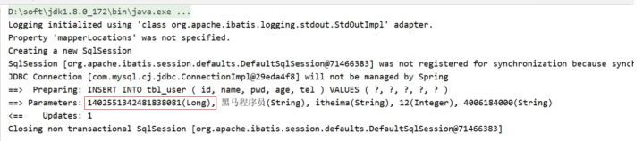

## 简介

查询相关的操作我们已经介绍完了，紧接着我们需要对另外三个，增删改进行内容的讲解。挨个来说明下，首先是新增(insert)中的内容。

## id生成策略控制

前面我们在新增的时候留了一个问题，就是新增成功后，主键ID是一个很长串的内容，我们更想要的是按照数据库表字段进行自增长，在解决这个问题之前，我们先来分析下ID该如何选择:

* 不同的表应用不同的id生成策略
  * 日志：自增（1,2,3,4，……）
  * 购物订单：特殊规则（FQ23948AK3843）
  * 外卖单：关联地区日期等信息（10 04 20200314 34 91）
  * 关系表：可省略id
  * ……

不同的业务采用的ID生成方式应该是不一样的，那么在MP中都提供了哪些主键生成策略，以及我们该如何进行选择?

在这里我们又需要用到MP的一个注解叫@TableId

**知识点1：@TableId**

| 名称     | @TableId                                                                                 |
| -------- | ---------------------------------------------------------------------------------------- |
| 类型     | 属性注解                                                                                 |
| 位置     | 模型类中用于表示主键的属性定义上方                                                       |
| 作用     | 设置当前类中主键属性的生成策略                                                           |
| 相关属性 | value(默认)：设置数据库表主键名称<br />type:设置主键属性的生成策略，值查照IdType的枚举值 |

## 环境构建

在构建条件查询之前，我们先来准备下环境

* 创建一个SpringBoot项目
* pom.xml中添加对应的依赖

```
<?xml version="1.0" encoding="UTF-8"?>
<project xmlns="http://maven.apache.org/POM/4.0.0"
         xmlns:xsi="http://www.w3.org/2001/XMLSchema-instance"
         xsi:schemaLocation="http://maven.apache.org/POM/4.0.0
https://maven.apache.org/xsd/maven-4.0.0.xsd">
    <modelVersion>4.0.0</modelVersion>
    <parent>
        <groupId>org.springframework.boot</groupId>
        <artifactId>spring-boot-starter-parent</artifactId>
        <version>2.5.0</version>
        <relativePath/> <!-- lookup parent from repository -->
    </parent>
    <groupId>com.itheima</groupId>
    <artifactId>mybatisplus_03_dml</artifactId>
    <version>0.0.1-SNAPSHOT</version>
    <properties>
        <java.version>1.8</java.version>
    </properties>
    <dependencies>
        <dependency>
            <groupId>com.baomidou</groupId>
            <artifactId>mybatis-plus-boot-starter</artifactId>
            <version>3.4.1</version>
        </dependency>
        <dependency>
            <groupId>org.springframework.boot</groupId>
            <artifactId>spring-boot-starter</artifactId>
        </dependency>
        <dependency>
            <groupId>com.alibaba</groupId>
            <artifactId>druid</artifactId>
            <version>1.1.16</version>
        </dependency>
        <dependency>
            <groupId>mysql</groupId>
            <artifactId>mysql-connector-java</artifactId>
            <scope>runtime</scope>
        </dependency>
        <dependency>
            <groupId>org.springframework.boot</groupId>
            <artifactId>spring-boot-starter-test</artifactId>
            <scope>test</scope>
        </dependency>
        <dependency>
            <groupId>org.projectlombok</groupId>
            <artifactId>lombok</artifactId>
            <version>1.18.12</version>
        </dependency>
    </dependencies>
    <build>
        <plugins>
            <plugin>
                <groupId>org.springframework.boot</groupId>
                <artifactId>spring-boot-maven-plugin</artifactId>
            </plugin>
        </plugins>
    </build>
</project> 
```

* 编写UserDao接口

```
@Mapper
public interface UserDao extends BaseMapper<User> {
}
```

* 编写模型类

```
@Data
@TableName("tbl_user")
public class User {
    private Long id;
    private String name;
    @TableField(value="pwd",select=false)
    private String password;
    private Integer age;
    private String tel;
    @TableField(exist=false)
    private Integer online;
}
```

* 编写引导类

```
@SpringBootApplication
public class Mybatisplus03DqlApplication {
    public static void main(String[] args) {
        SpringApplication.run(Mybatisplus03DqlApplication.class, args);
    }
}
```

* 编写配置文件

```
# dataSource
spring:
  datasource:
    type: com.alibaba.druid.pool.DruidDataSource
    driver-class-name: com.mysql.cj.jdbc.Driver
    url: jdbc:mysql://localhost:3306/mybatisplus_db?serverTimezone=UTC
    username: root
    password: root
# mp日志
mybatis-plus:
  configuration:
    log-impl: org.apache.ibatis.logging.stdout.StdOutImpl
```

* 编写测试类

```
@SpringBootTest
class Mybatisplus02DqlApplicationTests {
    @Autowired
    private UserDao userDao;
    @Test
    void testGetAll(){
        List<User> userList = userDao.selectList(null);
        System.out.println(userList);
    }
}
```

* 测试

```
@SpringBootTest
class Mybatisplus03DqlApplicationTests {
    @Autowired
    private UserDao userDao;
    @Test
    void testSave(){
        User user = new User();
        user.setName("黑马程序员");
        user.setPassword("itheima");
        user.setAge(12);
        user.setTel("4006184000");
        userDao.insert(user);
    }
    @Test
    void testDelete(){
        userDao.deleteById(1401856123925713409L)
    }
    @Test
    void testUpdate(){
        User user = new User();
        user.setId(3L);
        user.setName("Jock666");
        user.setVersion(1);
        userDao.updateById(user);
    }
}

```

最终创建的项目结构为:


## 策略种类

### AUTO策略

#### 步骤1:设置生成策略为AUTO

```
@Data
@TableName("tbl_user")
public class User {
    @TableId(type = IdType.AUTO)
    private Long id;
    private String name;
    @TableField(value="pwd",select=false)
    private String password;
    private Integer age;
    private String tel;
    @TableField(exist=false)
    private Integer online;
}
```

#### 步骤2:删除测试数据并修改自增值

* 删除测试数据


因为之前生成主键ID的值比较长，会把MySQL的自动增长的值变的很大，所以需要将其调整为目前最新的id值。


#### 步骤3:运行新增方法

会发现，新增成功，并且主键id也是从5开始


经过这三步的演示，会发现AUTO的作用是使用数据库ID自增，在使用该策略的时候一定要确保对应数据库表设置了ID主键自增，否则无效。

接下来，我们可以进入源码查看下ID的生成策略有哪些?

打开源码后，你会发现并没有看到中文注释，这就需要我们点击右上角的Download Sources ,会自动帮你把这个类的java文件下载下来，我们就能看到具体的注释内容。因为这个技术是国人制作的，所以他代码中的注释还是比较容易看懂的。


当把源码下载完后，就可以看到如下内容:


从源码中可以看到，除了AUTO这个策略以外，还有如下几种生成策略:

* NONE: 不设置id生成策略
* INPUT:用户手工输入id
* ASSIGN_ID:雪花算法生成id(可兼容数值型与字符串型)
* ASSIGN_UUID:以UUID生成算法作为id生成策略
* 其他的几个策略均已过时，都将被ASSIGN_ID和ASSIGN_UUID代替掉。

#### 拓展:

分布式ID是什么?

* 当数据量足够大的时候，一台数据库服务器存储不下，这个时候就需要多台数据库服务器进行存储
* 比如订单表就有可能被存储在不同的服务器上
* 如果用数据库表的自增主键，因为在两台服务器上所以会出现冲突
* 这个时候就需要一个全局唯一ID,这个ID就是分布式ID。

### INPUT策略

#### 步骤1:设置生成策略为INPUT

```
@Data
@TableName("tbl_user")
public class User {
    @TableId(type = IdType.INPUT)
    private Long id;
    private String name;
    @TableField(value="pwd",select=false)
    private String password;
    private Integer age;
    private String tel;
    @TableField(exist=false)
    private Integer online;
}
```

注意:这种ID生成策略，需要将表的自增策略删除掉


#### 步骤2:添加数据手动设置ID

```
@SpringBootTest
class Mybatisplus03DqlApplicationTests {
    @Autowired
    private UserDao userDao;
    @Test
    void testSave(){
        User user = new User();
        //设置主键ID的值
        user.setId(666L);
        user.setName("黑马程序员");
        user.setPassword("itheima");
        user.setAge(12);
        user.setTel("4006184000");
        userDao.insert(user);
    }
}
```

#### 步骤3:运行新增方法

如果没有设置主键ID的值，则会报错，错误提示就是主键ID没有给值:


如果设置了主键ID,则数据添加成功，如下:


### ASSIGN_ID策略

#### 步骤1:设置生成策略为ASSIGN_ID

```
@Data
@TableName("tbl_user")
public class User {
    @TableId(type = IdType.ASSIGN_ID)
    private Long id;
    private String name;
    @TableField(value="pwd",select=false)
    private String password;
    private Integer age;
    private String tel;
    @TableField(exist=false)
    private Integer online;
}
```

#### 步骤2:添加数据不设置ID

```
@SpringBootTest
class Mybatisplus03DqlApplicationTests {
    @Autowired
    private UserDao userDao;
    @Test
    void testSave(){
        User user = new User();
        user.setName("黑马程序员");
        user.setPassword("itheima");
        user.setAge(12);
        user.setTel("4006184000");
        userDao.insert(user);
    }
}
```

注意:这种生成策略，不需要手动设置ID，如果手动设置ID，则会使用自己设置的值。

#### 步骤3:运行新增方法



生成的ID就是一个Long类型的数据。

### ASSIGN_UUID策略

#### 步骤1:设置生成策略为ASSIGN_UUID

使用uuid需要注意的是，主键的类型不能是Long，而应该改成String类型

```
@Data
@TableName("tbl_user")
public class User {
    @TableId(type = IdType.ASSIGN_UUID)
    private String id;
    private String name;
    @TableField(value="pwd",select=false)
    private String password;
    private Integer age;
    private String tel;
    @TableField(exist=false)
    private Integer online;
}
```

#### 步骤2:修改表的主键类型


主键类型设置为varchar，长度要大于32，因为UUID生成的主键为32位，如果长度小的话就会导致插入失败。

#### 步骤3:添加数据不设置ID

```
@SpringBootTest
class Mybatisplus03DqlApplicationTests {
    @Autowired
    private UserDao userDao;
    @Test
    void testSave(){
        User user = new User();
        user.setName("黑马程序员");
        user.setPassword("itheima");
        user.setAge(12);
        user.setTel("4006184000");
        userDao.insert(user);
    }
}
```

#### 步骤4:运行新增方法


接下来我们来聊一聊雪花算法:

雪花算法(SnowFlake),是Twitter官方给出的算法实现 是用Scala写的。其生成的结果是一个64bit大小整数，它的结构如下图:


* 1bit,不用,因为二进制中最高位是符号位，1表示负数，0表示正数。生成的id一般都是用整数，所以最高位固定为0。
* 41bit-时间戳，用来记录时间戳，毫秒级
* 10bit-工作机器id，用来记录工作机器id,其中高位5bit是数据中心ID其取值范围0-31，低位5bit是工作节点ID其取值范围0-31，两个组合起来最多可以容纳1024个节点
* 序列号占用12bit，每个节点每毫秒0开始不断累加，最多可以累加到4095，一共可以产生4096个ID

## ID生成策略对比

介绍了这些主键ID的生成策略，我们以后该用哪个呢?

* NONE: 不设置id生成策略，MP不自动生成，约等于INPUT,所以这两种方式都需要用户手动设置，但是手动设置第一个问题是容易出现相同的ID造成主键冲突，为了保证主键不冲突就需要做很多判定，实现起来比较复杂
* AUTO:数据库ID自增,这种策略适合在数据库服务器只有1台的情况下使用,不可作为分布式ID使用
* ASSIGN_UUID:可以在分布式的情况下使用，而且能够保证唯一，但是生成的主键是32位的字符串，长度过长占用空间而且还不能排序，查询性能也慢
* ASSIGN_ID:可以在分布式的情况下使用，生成的是Long类型的数字，可以排序性能也高，但是生成的策略和服务器时间有关，如果修改了系统时间就有可能导致出现重复主键
* 综上所述，每一种主键策略都有自己的优缺点，根据自己项目业务的实际情况来选择使用才是最明智的选择。

### 简化配置

前面我们已经完成了表关系映射、数据库主键策略的设置，接下来对于这两个内容的使用，我们再讲下他们的简化配置:

#### 模型类主键策略设置

对于主键ID的策略已经介绍完，但是如果要在项目中的每一个模型类上都需要使用相同的生成策略，如:


确实是稍微有点繁琐，我们能不能在某一处进行配置，就能让所有的模型类都可以使用该主键ID策略呢?

答案是肯定有，我们只需要在配置文件中添加如下内容:

```
mybatis-plus:
  global-config:
    db-config:
      id-type: assign_id
```

配置完成后，每个模型类的主键ID策略都将成为assign_id.

#### 数据库表与模型类的映射关系

MP会默认将模型类的类名名首字母小写作为表名使用，假如数据库表的名称都以tbl_开头，那么我们就需要将所有的模型类上添加@TableName，如:


配置起来还是比较繁琐，简化方式为在配置文件中配置如下内容:

```
mybatis-plus:
  global-config:
    db-config:
      table-prefix: tbl_
```

设置表的前缀内容，这样MP就会拿 tbl_加上模型类的首字母小写，就刚好组装成数据库的表名。

## 多记录操作

先来看下问题:


之前添加了很多商品到购物车，过了几天发现这些东西又不想要了，该怎么办呢?

很简单删除掉，但是一个个删除的话还是比较慢和费事的，所以一般会给用户一个批量操作，也就是前面有一个复选框，用户一次可以勾选多个也可以进行全选，然后删一次就可以将购物车清空，这个就需要用到批量删除的操作了。

具体该如何实现多条删除，我们找找对应的API方法

```
int deleteBatchIds(@Param(Constants.COLLECTION) Collection<? extends Serializable> idList);
```

翻译方法的字面意思为:删除（根据ID 批量删除）,参数是一个集合，可以存放多个id值。

需求:根据传入的id集合将数据库表中的数据删除掉。

```
@SpringBootTest
class Mybatisplus03DqlApplicationTests {
    @Autowired
    private UserDao userDao;
    @Test
    void testDelete(){
        //删除指定多条数据
        List<Long> list = new ArrayList<>();
        list.add(1402551342481838081L);
        list.add(1402553134049501186L);
        list.add(1402553619611430913L);
        userDao.deleteBatchIds(list);
    }
}
```

执行成功后，数据库表中的数据就会按照指定的id进行删除。

除了按照id集合进行批量删除，也可以按照id集合进行批量查询，还是先来看下API

```
List<T> selectBatchIds(@Param(Constants.COLLECTION) Collection<? extends Serializable> idList);
```

方法名称翻译为:查询（根据ID 批量查询），参数是一个集合，可以存放多个id值。

需求：根据传入的ID集合查询用户信息

```
@SpringBootTest
class Mybatisplus03DqlApplicationTests {
    @Autowired
    private UserDao userDao;
    @Test
    void testGetByIds(){
        //查询指定多条数据
        List<Long> list = new ArrayList<>();
        list.add(1L);
        list.add(3L);
        list.add(4L);
        userDao.selectBatchIds(list);
    }
}
```

查询结果就会按照指定传入的id值进行查询


## 逻辑删除

接下来要讲解是删除中比较重要的一个操作，逻辑删除，先来分析下问题:


* 这是一个员工和其所签的合同表，关系是一个员工可以签多个合同，是一个一(员工)对多(合同)的表
* 员工ID为1的张业绩，总共签了三个合同，如果此时他离职了，我们需要将员工表中的数据进行删除，会执行delete操作
* 如果表在设计的时候有主外键关系，那么同时也得将合同表中的前三条数据也删除掉


* 后期要统计所签合同的总金额，就会发现对不上，原因是已经将员工1签的合同信息删除掉了。
* 如果只删除员工不删除合同表数据，那么合同的员工编号对应的员工信息不存在，那么就会出现垃
  圾数据，就会出现无主合同，根本不知道有张业绩这个人的存在。
* 所以经过分析，我们不应该将表中的数据删除掉，而是需要进行保留，但是又得把离职的人和在职的人进行区分，这样就解决了上述问题，如:


* 区分的方式，就是在员工表中添加一列数据deleted，如果为0说明在职员工，如果离职则将其改完1，（0和1所代表的含义是可以自定义的）

所以对于删除操作业务问题来说有:

* 物理删除:业务数据从数据库中丢弃，执行的是delete操作
* 逻辑删除:为数据设置是否可用状态字段，删除时设置状态字段为不可用状态，数据保留在数据库中，执行的是update操作

MP中逻辑删除具体该如何实现?

### 步骤1:修改数据库表添加deleted列

字段名可以任意，内容也可以自定义，比如0代表正常，1代表删除，可以在添加列的同时设置其默认值为0正常。


### 步骤2:实体类添加属性

(1)添加与数据库表的列对应的一个属性名，名称可以任意，如果和数据表列名对不上，可以使用@TableField进行关系映射，如果一致，则会自动对应。

(2)标识新增的字段为逻辑删除字段，使用@TableLogic

```
@Data
//@TableName("tbl_user") 可以不写是因为配置了全局配置
public class User {
    @TableId(type = IdType.ASSIGN_UUID)
    private String id;
    private String name;
    @TableField(value="pwd",select=false)
    private String password;
    private Integer age;
    private String tel;
    @TableField(exist=false)
    private Integer online;
    @TableLogic(value="0",delval="1")
    //value为正常数据的值，delval为删除数据的值
    private Integer deleted;
}
```

### 步骤3:运行删除方法

```
@SpringBootTest
class Mybatisplus03DqlApplicationTests {
    @Autowired
    private UserDao userDao;
    @Test
    void testDelete(){
        userDao.deleteById(1L);
    }
}
```


从测试结果来看，逻辑删除最后走的是update操作，会将指定的字段修改成删除状态对应的值。

**思考**

逻辑删除，对查询有没有影响呢?

* 执行查询操作

```
@SpringBootTest
class Mybatisplus03DqlApplicationTests {
    @Autowired
    private UserDao userDao;
    @Test
    void testFind(){
        System.out.println(userDao.selectList(null));
    }
}
```

运行测试，会发现打印出来的sql语句中会多一个查询条件，如:


可想而知，MP的逻辑删除会将所有的查询都添加一个未被删除的条件，也就是已经被删除的数据是不应该被查询出来的。

* 如果还是想把已经删除的数据都查询出来该如何实现呢?

```
@Mapper
public interface UserDao extends BaseMapper<User> {
    //查询所有数据包含已经被删除的数据
    @Select("select * from tbl_user")
    public List<User> selectAll();
}
```

* 如果每个表都要有逻辑删除，那么就需要在每个模型类的属性上添加@TableLogic注解，如何优化?
* 在配置文件中添加全局配置，如下:

```
mybatis-plus:
  global-config:
    db-config:
      # 逻辑删除字段名
      logic-delete-field: deleted
      # 逻辑删除字面值：未删除为0
      logic-not-delete-value: 0
      # 逻辑删除字面值：删除为1
      logic-delete-value: 1
```

介绍完逻辑删除，逻辑删除的本质为:

**逻辑删除的本质其实是修改操作。如果加了逻辑删除字段，查询数据时也会自动带上逻辑删除字段。**

执行的SQL语句为:

```
UPDATE tbl_user SET deleted=1 where id = ? AND deleted=0
```

执行数据结果为:


**知识点1：@TableLogic**

| 名称     | @TableLogic                                 |
| -------- | ------------------------------------------- |
| 类型     | 属性注解                                    |
| 位置     | 模型类中用于表示删除字段的属性定义上方      |
| 作用     | 标识该字段为进行逻辑删除的字段              |
| 相关属性 | value：逻辑未删除值<br />delval：逻辑删除值 |
