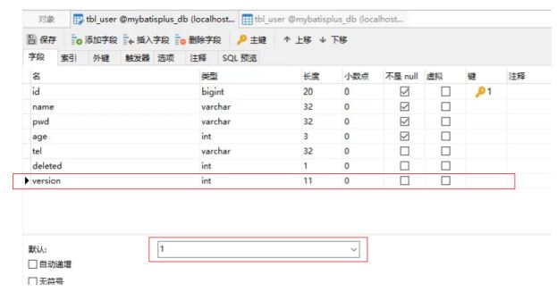
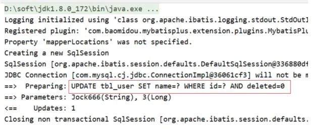
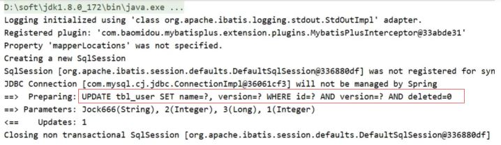
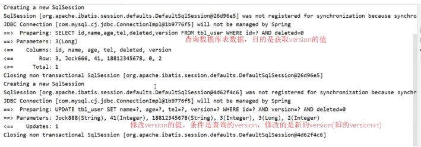
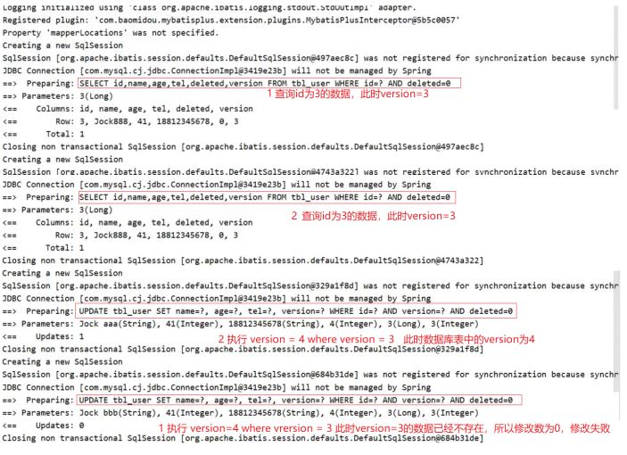

## 概念

在讲解乐观锁之前，我们还是先来分析下问题:

业务并发现象带来的问题:秒杀

* 假如有100个商品或者票在出售，为了能保证每个商品或者票只能被一个人购买，如何保证不会出现超买或者重复卖
* 对于这一类问题，其实有很多的解决方案可以使用
  * 第一个最先想到的就是锁，锁在一台服务器中是可以解决的，但是如果在多台服务器下锁就没有办法控制，比如12306有两台服务器在进行卖票，在两台服务器上都添加锁的话，那也有可能会导致在同一时刻有两个线程在进行卖票，还是会出现并发问题
* 我们接下来介绍的这种方式是针对于小型企业的解决方案，因为数据库本身的性能就是个瓶颈，如果对其并发量超过2000以上的就需要考虑其他的解决方案了。

简单来说，乐观锁主要解决的问题是当要更新一条记录的时候，希望这条记录没有被别人更新。

## 实现思路

乐观锁的实现方式:

* 数据库表中添加version列，比如默认值给1
* 第一个线程要修改数据之前，取出记录时，获取当前数据库中的version=1
* 第二个线程要修改数据之前，取出记录时，获取当前数据库中的version=1
* 第一个线程执行更新时，set version = newVersion where version = oldVersion

  * newVersion = version+1 [2]
  * oldVersion = version [1]
* 第二个线程执行更新时，set version = newVersion where version = oldVersion

  * newVersion = version+1 [2]
  * oldVersion = version [1]
* 假如这两个线程都来更新数据，第一个和第二个线程都可能先执行

  * 假如第一个线程先执行更新，会把version改为2，
* 第二个线程再更新的时候，set version = 2 where version = 1,此时数据库表的数据version已经为2，所以第二个线程会修改失败
* 假如第二个线程先执行更新，会把version改为2，第一个线程再更新的时候，set version = 2 where version = 1,此时数据库表的数据version已经为2，所以第一个线程会修改失败
* 不管谁先执行都会确保只能有一个线程更新数据，这就是MP提供的乐观锁的实现原理分析。

  上面所说的步骤具体该如何实现呢?

## 实现步骤

### 步骤1:数据库表添加列

列名可以任意，比如使用version ,给列设置默认值为1



### 步骤2:在模型类中添加对应的属性

根据添加的字段列名，在模型类中添加对应的属性值

```
@Data
//@TableName("tbl_user") 可以不写是因为配置了全局配置
public class User {
    @TableId(type = IdType.ASSIGN_UUID)
    private String id;
    private String name;
    @TableField(value="pwd",select=false)
    private String password;
    private Integer age;
    private String tel;
    @TableField(exist=false)
    private Integer online;
    private Integer deleted;
    @Version
    private Integer version;
}
```

### 步骤3:添加乐观锁的拦截器

```
@Configuration
public class MpConfig {
    @Bean
    public MybatisPlusInterceptor mpInterceptor() {
        //1.定义Mp拦截器
        MybatisPlusInterceptor mpInterceptor = new MybatisPlusInterceptor();
        //2.添加乐观锁拦截器
        mpInterceptor.addInnerInterceptor(new OptimisticLockerInnerInterceptor());
        return mpInterceptor;
    }
}
```

### 步骤4:执行更新操作

```
@SpringBootTest
class Mybatisplus03DqlApplicationTests {
    @Autowired
    private UserDao userDao;
    @Test
    void testUpdate(){
        User user = new User();
        user.setId(3L);
        user.setName("Jock666");
        userDao.updateById(user);
    }
}
```



你会发现，这次修改并没有更新version字段，原因是没有携带version数据。

添加version数据

```
@SpringBootTest
class Mybatisplus03DqlApplicationTests {
    @Autowired
    private UserDao userDao;
    @Test
    void testUpdate(){
        User user = new User();
        user.setId(3L);
        user.setName("Jock666");
        user.setVersion(1);
        userDao.updateById(user);
    }
}
```



你会发现，我们传递的是1，MP会将1进行加1，然后，更新回到数据库表中。

所以要想实现乐观锁，首先第一步应该是拿到表中的version，然后拿version当条件在将version加1更新回到数据库表中，所以我们在查询的时候，需要对其进行查询

```
@SpringBootTest
class Mybatisplus03DqlApplicationTests {
    @Autowired
    private UserDao userDao;
    @Test
    void testUpdate(){
        //1.先通过要修改的数据id将当前数据查询出来
        User user = userDao.selectById(3L);
        //2.将要修改的属性逐一设置进去
        user.setName("Jock888");
        userDao.updateById(user);
    }
}
```



大概分析完乐观锁的实现步骤以后，我们来模拟一种加锁的情况，看看能不能实现多个人修改同一个数据的时候，只能有一个人修改成功。

```
@SpringBootTest
class Mybatisplus03DqlApplicationTests {
    @Autowired
    private UserDao userDao;
    @Test
    void testUpdate(){
        //1.先通过要修改的数据id将当前数据查询出来
        User user = userDao.selectById(3L); //version=3
        User user2 = userDao.selectById(3L); //version=3
        user2.setName("Jock aaa");
        userDao.updateById(user2); //version=>4
        user.setName("Jock bbb");
        userDao.updateById(user); //verion=3?条件还成立吗？
    }
}
```

运行程序，分析结果：



乐观锁就已经实现完成了，如果对于上面的这些步骤记不住咋办呢?

参考官方文档来实现: 一个插件就搞定。

https://baomidou.com/pages/0d93c0/#optimisticlockerinnerinterceptor

## 注解实现

官方的注解演示非常简单，乐观锁配置只需两步

### 步骤

1. 配置插件

   ```
   #spring xml 方式:
   <bean class="com.baomidou.mybatisplus.extension.plugins.inner.OptimisticLockerInnerInterceptor" id="optimisticLockerInnerInterceptor"/>

   <bean id="mybatisPlusInterceptor" class="com.baomidou.mybatisplus.extension.plugins.MybatisPlusInterceptor">
       <property name="interceptors">
           <list>
               <ref bean="optimisticLockerInnerInterceptor"/>
           </list>
       </property>
   </bean>

   #spring boot 注解方式:
   @Bean
   public MybatisPlusInterceptor mybatisPlusInterceptor() {
       MybatisPlusInterceptor interceptor = new MybatisPlusInterceptor();
       interceptor.addInnerInterceptor(new OptimisticLockerInnerInterceptor());
       return interceptor;
   }
   ```
2. 在实体类的字段上加上 `@Version`注解

   ```
   @Version
   private Integer version;
   ```

> 说明:
>
> * 支持的数据类型只有:int,Integer,long,Long,Date,Timestamp,LocalDateTime
> * 整数类型下 `newVersion = oldVersion + 1`
> * `newVersion` 会回写到 `entity` 中
> * 仅支持 `updateById(id)` 与 `update(entity, wrapper)` 方法

### 示例

```
// Spring Boot 方式
@Configuration
@MapperScan("按需修改")
public class MybatisPlusConfig {
    /**
     * 旧版
     */
    @Bean
    public OptimisticLockerInterceptor optimisticLockerInterceptor() {
        return new OptimisticLockerInterceptor();
    }

    /**
     * 新版
     */
    @Bean
    public MybatisPlusInterceptor mybatisPlusInterceptor() {
        MybatisPlusInterceptor mybatisPlusInterceptor = new MybatisPlusInterceptor();
        mybatisPlusInterceptor.addInnerInterceptor(new OptimisticLockerInnerInterceptor());
        return mybatisPlusInterceptor;
    }
}
```
