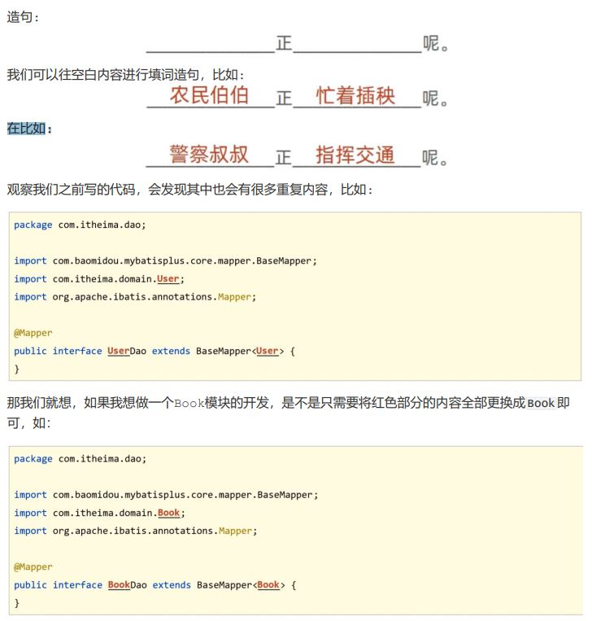
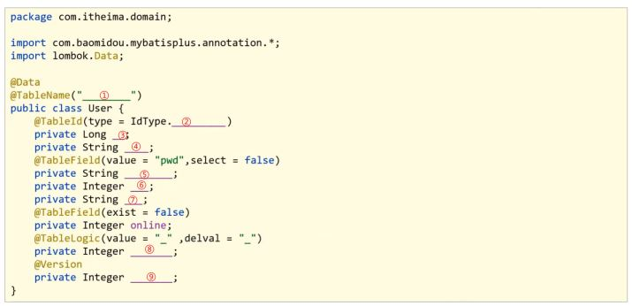
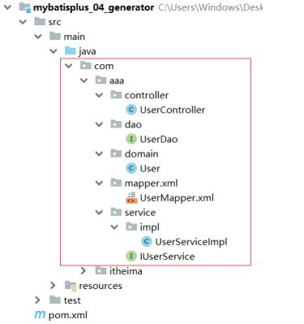

### 代码生成器原理分析



所以我们会发现，做任何模块的开发，对于这段代码，基本上都是对红色部分的调整，所以我们把去掉红色内容的东西称之为模板，红色部分称之为参数，以后只需要传入不同的参数，就可以根据模板创建出不同模块的dao代码。

除了Dao可以抽取模块，其实我们常见的类都可以进行抽取，只要他们有公共部分即可。再来看下模型类的模板：



① 可以根据数据库表的表名来填充

② 可以根据用户的配置来生成ID生成策略

③到⑨可以根据数据库表字段名称来填充

所以只要我们知道是对哪张表进行代码生成，这些内容我们都可以进行填充。

分析完后，我们会发现，要想完成代码自动生成，我们需要有以下内容:

* 模板: MyBatisPlus提供，可以自己提供，但是麻烦，不建议
* 数据库相关配置:读取数据库获取表和字段信息
* 开发者自定义配置:手工配置，比如ID生成策略

## 代码生成器实现

### 步骤1:创建一个Maven项目

### 步骤2:导入对应的jar包

```
<?xml version="1.0" encoding="UTF-8"?>
<project xmlns="http://maven.apache.org/POM/4.0.0"
         xmlns:xsi="http://www.w3.org/2001/XMLSchema-instance"
         xsi:schemaLocation="http://maven.apache.org/POM/4.0.0
https://maven.apache.org/xsd/maven-4.0.0.xsd">
    <modelVersion>4.0.0</modelVersion>
    <parent>
        <groupId>org.springframework.boot</groupId>
        <artifactId>spring-boot-starter-parent</artifactId>
        <version>2.5.1</version>
    </parent>
    <groupId>com.itheima</groupId>
    <artifactId>mybatisplus_04_generator</artifactId>
    <version>0.0.1-SNAPSHOT</version>
    <properties>
        <java.version>1.8</java.version>
    </properties>
    <dependencies>
        <!--spring webmvc-->
        <dependency>
            <groupId>org.springframework.boot</groupId>
            <artifactId>spring-boot-starter-web</artifactId>
        </dependency>
        <!--mybatisplus-->
        <dependency>
            <groupId>com.baomidou</groupId>
            <artifactId>mybatis-plus-boot-starter</artifactId>
            <version>3.4.1</version>
        </dependency>
        <!--druid-->
        <dependency>
            <groupId>com.alibaba</groupId>
            <artifactId>druid</artifactId>
            <version>1.1.16</version>
        </dependency>
        <!--mysql-->
        <dependency>
            <groupId>mysql</groupId>
            <artifactId>mysql-connector-java</artifactId>
            <scope>runtime</scope>
        </dependency>
        <!--test-->
        <dependency>
            <groupId>org.springframework.boot</groupId>
            <artifactId>spring-boot-starter-test</artifactId>
            <scope>test</scope>
        </dependency>
        <!--lombok-->
        <dependency>
            <groupId>org.projectlombok</groupId>
            <artifactId>lombok</artifactId>
            <version>1.18.12</version>
        </dependency>
        <!--代码生成器-->
        <dependency>
            <groupId>com.baomidou</groupId>
            <artifactId>mybatis-plus-generator</artifactId>
            <version>3.4.1</version>
        </dependency>
        <!--velocity模板引擎-->
        <dependency>
            <groupId>org.apache.velocity</groupId>
            <artifactId>velocity-engine-core</artifactId>
            <version>2.3</version>
        </dependency>
    </dependencies>
    <build>
        <plugins>
            <plugin>
                <groupId>org.springframework.boot</groupId>
                <artifactId>spring-boot-maven-plugin</artifactId>
            </plugin>
        </plugins>
    </build>
</project>
```

### 步骤3:编写引导类

```
@SpringBootApplication
public class Mybatisplus04GeneratorApplication {
    public static void main(String[] args) {
        SpringApplication.run(Mybatisplus04GeneratorApplication.class, args);
    }
}
```

### 步骤4:创建代码生成类

```
public class CodeGenerator {
    public static void main(String[] args) {
        //1.获取代码生成器的对象
        AutoGenerator autoGenerator = new AutoGenerator();
        //设置数据库相关配置
        DataSourceConfig dataSource = new DataSourceConfig();
        dataSource.setDriverName("com.mysql.cj.jdbc.Driver");
        dataSource.setUrl("jdbc:mysql://localhost:3306/mybatisplus_db?serverTimezone = UTC");
        dataSource.setUsername("root");
        dataSource.setPassword("root");
        autoGenerator.setDataSource(dataSource);
        //设置全局配置
        GlobalConfig globalConfig = new GlobalConfig();
        globalConfig.setOutputDir(System.getProperty("user.dir") + "/mybatisplus_04_generator / src / main / java"); //设置代码生成位置
        globalConfig.setOpen(false); //设置生成完毕后是否打开生成代码所在的目录
        globalConfig.setAuthor("黑马程序员"); //设置作者
        globalConfig.setFileOverride(true); //设置是否覆盖原始生成的文件
        globalConfig.setMapperName("%sDao"); //设置数据层接口名，%s为占位符，指代模块名称
        globalConfig.setIdType(IdType.ASSIGN_ID); //设置Id生成策略
        autoGenerator.setGlobalConfig(globalConfig);
        //设置包名相关配置
        PackageConfig packageInfo = new PackageConfig();
        packageInfo.setParent("com.aaa"); //设置生成的包名，与代码所在位置不冲突，二者叠加组成完整路径
        packageInfo.setEntity("domain"); //设置实体类包名
        packageInfo.setMapper("dao"); //设置数据层包名
        autoGenerator.setPackageInfo(packageInfo);
        //策略设置
        StrategyConfig strategyConfig = new StrategyConfig();
        strategyConfig.setInclude("tbl_user"); //设置当前参与生成的表名，参数为可变参数
        strategyConfig.setTablePrefix("tbl_"); //设置数据库表的前缀名称，模块名 =数据库表名 - 前缀名 例如：User = tbl_user - tbl_
        strategyConfig.setRestControllerStyle(true); //设置是否启用Rest风格
        strategyConfig.setVersionFieldName("version"); //设置乐观锁字段名
        strategyConfig.setLogicDeleteFieldName("deleted"); //设置逻辑删除字段名
        strategyConfig.setEntityLombokModel(true); //设置是否启用lombok
        autoGenerator.setStrategy(strategyConfig);
        //2.执行生成操作
        autoGenerator.execute();
    }
}
```

对于代码生成器中的代码内容，我们可以直接从官方文档中获取代码进行修改

### 步骤5:运行程序

运行成功后，会在当前项目中生成很多代码，代码包含controller , service，mapper和entity



至此代码生成器就已经完成工作，我们能快速根据数据库表来创建对应的类，简化我们的代码开发。
