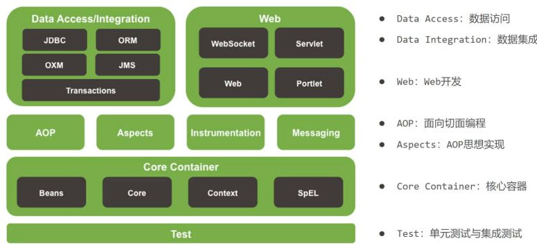

> Spring框架笔记主要内容来自尚硅谷，相关学习视频地址：
>
> https://www.bilibili.com/video/BV1Ya411S7aT

到Spring框架主要的优势是在简化开发和框架整合上，至于如何实现就是要学习Spring框架的主要内容:

* 简化开发: Spring框架中提供了两个大的核心技术，分别是:
  * IOC
  * AOP
    * 事务处理
  * Spring的简化操作都是基于这两块内容,所以这也是Spring学习中最为重要的两个知识点。
  * 事务处理属于Spring中AOP的具体应用，可以简化项目中的事务管理，也是Spring技术中的一大亮点。
* 框架整合: Spring在框架整合这块已经做到了极致，它可以整合市面上几乎所有主流框架，比如:
  * MyBatis
  * MyBatis-plus
  * Struts
  * Struts2
  * Hibernate
  * ……

这些框架中，我们目前只学习了MyBatis，所以在Spring框架的学习中，主要是学习如何整合MyBatis。

综上所述，对于Spring的学习，主要学习四块内容:

* IOC
* 整合Mybatis(IOC的具体应用)
* AOP
* 声明式事务(AOP的具体应用)

## 怎么学?

* 学习Spring框架设计思想

  * 对于Spring来说，它能迅速占领全球市场，不只是说它的某个功能比较强大，更重要是在它的思想上。
* 学习基础操作，思考操作与思想间的联系

  * 掌握了Spring的设计思想，然后就需要通过一些基础操作来思考操作与思想之间的关联关系
* 学习案例，熟练应用操作的同时，体会思想

  * 会了基础操作后，就需要通过大量案例来熟练掌握框架的具体应用，加深对设计思想的理解。

介绍完为什么要学、学什么和怎么学Spring框架后，大家需要重点掌握的是:

* Spring很优秀，需要认真重点的学习
* Spring的学习主线是IOC、AOP、声明式事务和整合MyBais

接下来，咱们就开始进入Spring框架的学习。

## Spring相关概念

### Spring家族

官网：`https://spring.io`，从官网我们可以大概了解到：

* Spring能做什么:用以开发web、微服务以及分布式系统等,光这三块就已经占了JavaEE开发的九成多。
* Spring并不是单一的一个技术，而是一个大家族，可以从官网的Projects中查看其包含的所有技术。

Spring发展到今天已经形成了一种开发的生态圈,Spring提供了若干个项目,每个项目用于完成特定的功能。

* Spring已形成了完整的生态圈，也就是说我们可以完全使用Spring技术完成整个项目的构建、设计与开发。
* Spring有若干个项目，可以根据需要自行选择，把这些个项目组合起来，起了一个名称叫全家桶，如下图所示

说明:

图中的图标都代表什么含义，可以进入https://spring.io/projects网站进行对比查看。这些技术并不是所有的都需要学习，额外需要重点关注Spring Framework、SpringBoot和SpringCloud :

* Spring Framework : Spring框架，是Spring中最早最核心的技术，也是所有其他技术的基础。
* SpringBoot : Spring是来简化开发，而SpringBoot是来帮助Spring在简化的基础上能更快速进行开发。
* SpringCloud : 这个是用来做分布式之微服务架构的相关开发。

除了上面的这三个技术外，还有很多其他的技术，也比较流行，如SpringData,SpringSecurity等，这些都可以被应用在我们的项目中。我们今天所学习的Spring其实指的是Spring Framework。

## Spring系统架构

### 系统架构图

Spring Framework是Spring生态圈中最基础的项目，是其他项目的根基。

Spring Framework的发展也经历了很多版本的变更，每个版本都有相应的调整。

Spring Framework的5版本目前没有最新的架构图，而最新的是4版本，所以接下来主要研究的是4的架构图

#### 核心层

* Core Container:核心容器，这个模块是Spring最核心的模块，其他的都需要依赖该模块

#### AOP层

* AOP:面向切面编程，它依赖核心层容器，目的是在不改变原有代码的前提下对其进行功能增强
* Aspects : AOP是思想,Aspects是对AOP思想的具体实现

#### 数据层

* Data Access : 数据访问，Spring全家桶中有对数据访问的具体实现技术
* Data Integration : 数据集成，Spring支持整合其他的数据层解决方案，比如Mybatis
* Transactions : 事务，Spring中事务管理是Spring AOP的一个具体实现，也是后期学习的重点内容

#### Web层

* 这一层的内容将在SpringMVC框架具体学习

#### Test层

* Spring主要整合了Junit来完成单元测试和集成测试

### 课程学习路线

* Spring的IOC/DI
* Spring的AOP
* AOP的具体应用,事务管理
* IOC/DI的具体应用,整合Mybatis

## Spring核心概念

### 目前项目中的问题

要想解答这个问题，就需要先分析下目前咱们代码在编写过程中遇到的问题:

* 业务层需要调用数据层的方法，就需要在业务层new数据层的对象
* 如果数据层的实现类发生变化，那么业务层的代码也需要跟着改变，发生变更后，都需要进行编译打包和重部署
* 所以，现在代码在编写的过程中存在的问题是：耦合度偏高

针对这个问题，该如何解决呢?

我们就想，如果能把框中的内容给去掉，不就可以降低依赖了么，但是又会引入新的问题，去掉以后程序能运行么?

答案肯定是不行，因为bookDao没有赋值为Null，强行运行就会出空指针异常。

所以现在的问题就是，业务层不想new对象，运行的时候又需要这个对象，该咋办呢?

针对这个问题，Spring就提出了一个解决方案:

* 使用对象时，在程序中不要主动使用new产生对象，转换为由外部提供对象

这种实现思就是Spring的一个核心概念

### IOC、IOC容器、Bean、DI

#### IOC（Inversion of Control）控制反转

什么是控制反转呢？

* 使用对象时，由主动new产生对象转换为由外部提供对象，此过程中对象创建控制权由程序转移到外部，此思想称为控制反转。
  * 业务层要用数据层的类对象，以前是自己new的
  * 现在自己不new了，交给别人[外部]来创建对象
  * 别人[外部]就反转控制了数据层对象的创建权
  * 这种思想就是控制反转
  * 别人[外部]指定是什么呢?继续往下学

Spring和IOC之间的关系是什么呢?

* Spring技术对IOC思想进行了实现
* Spring提供了一个容器，称为IOC容器，用来充当IOC思想中的"外部"
* IOC思想中的别人[外部]指的就是Spring的IOC容器

IOC容器的作用以及内部存放的是什么?

* IOC容器负责对象的创建、初始化等一系列工作，其中包含了数据层和业务层的类对象
* 被创建或被管理的对象在IOC容器中统称为Bean
* IOC容器中放的就是一个个的Bean对象

当IOC容器中创建好service和dao对象后，程序能正确执行么?

* 不行，因为service运行需要依赖dao对象
* IOC容器中虽然有service和dao对象
* 但是service对象和dao对象没有任何关系
* 需要把dao对象交给service,也就是说要绑定service和dao对象之间的关系

像这种在容器中建立对象与对象之间的绑定关系就要用到DI:

#### DI（Dependency Injection）依赖注入

**什么是依赖注入呢?**

在容器中建立bean与bean之间的依赖关系的整个过程，称为依赖注入

* 业务层要用数据层的类对象，以前是自己new的
* 现在自己不new了，靠别人[外部其实指的就是IOC容器]来给注入进来
* 这种思想就是依赖注入

**IOC容器中哪些bean之间要建立依赖关系呢?**

这个需要程序员根据业务需求提前建立好关系，如业务层需要依赖数据层，service就要和dao建立依赖关系

介绍完Spring的IOC和DI的概念后，我们会发现这两个概念的最终目标就是:充分解耦，具体实现靠:

* 使用IOC容器管理bean（IOC)
* 在IOC容器内将有依赖关系的bean进行关系绑定（DI）
* 最终结果为:使用对象时不仅可以直接从IOC容器中获取，并且获取到的bean已经绑定了所有的依赖关系.

### 核心概念小结

这节比较重要，重点要理解什么是IOC/DI思想、什么是IOC容器和什么是Bean：

什么IOC/DI思想?

* IOC:控制反转，控制反转的是对象的创建权
* DI:依赖注入，绑定对象与对象之间的依赖关系

什么是IOC容器?

* Spring创建了一个容器用来存放所创建的对象，这个容器就叫IOC容器

什么是Bean?

* 容器中所存放的一个个对象就叫Bean或Bean对象
