通过前面两个案例，我们已经学习了bean如何定义配置，DI如何定义配置以及容器对象如何获取的内容，接下来主要是把这三块内容展开进行详细的讲解，深入的学习下这三部分的内容，首先是bean基础配置。

对于bean的配置中，主要会讲解bean基础配置, bean的别名配置, bean的作用范围配置(重点),这三部分内容：

## bean基础配置(id与class)

对于bean的基础配置，在前面的案例中已经使用过:

```
<bean id="" class=""/>
```

其中，bean标签的功能、使用方式以及id和class属性的作用，我们通过一张图来描述下

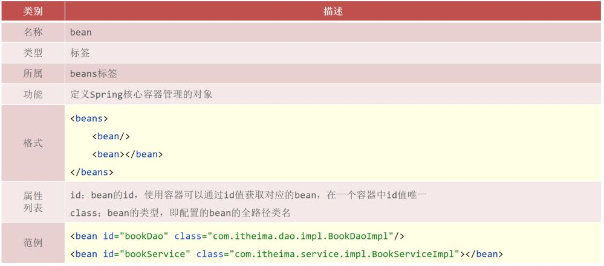

这其中需要大家重点掌握的是:bean标签的id和class属性的使用。

**思考：**

class属性能不能写接口如BookDao的类全名呢?

* 答案肯定是不行，因为接口是没办法创建对象的。

前面提过为bean设置id时，id必须唯一，但是如果由于命名习惯而产生了分歧后，该如何解决?

* 在解决这个问题之前，我们需要准备下开发环境，对于开发环境我们可以有两种解决方案:
  * 使用前面IOC和DI的案例
  * 重新搭建一个新的案例环境,目的是方便大家查阅代码

搭建的内容和前面的案例是一样的，内容如下：

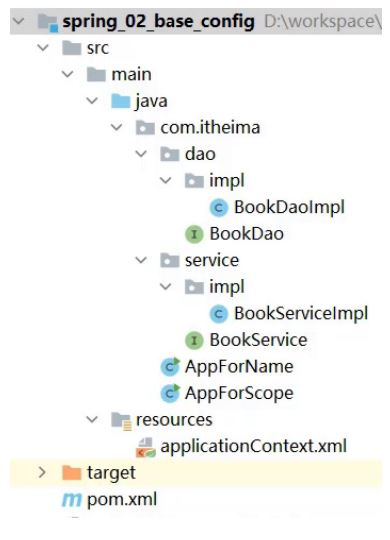

## bean的name属性

环境准备好后，接下来就可以在这个环境的基础上来学习下bean的别名配置，

首先来看下别名的配置说明:

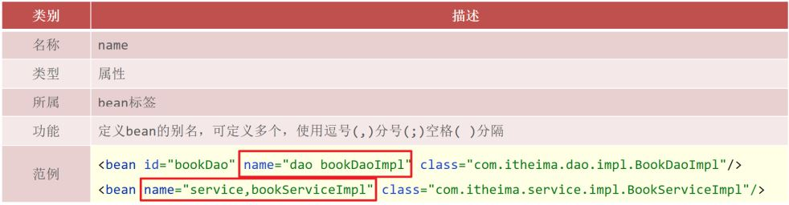

### 步骤1：配置别名

打开spring的配置文件applicationContext.xml

```
<?xml version="1.0" encoding="UTF-8"?>
<beans xmlns="http://www.springframework.org/schema/beans"
       xmlns:xsi="http://www.w3.org/2001/XMLSchema-instance"
       xsi:schemaLocation="http://www.springframework.org/schema/beans
http://www.springframework.org/schema/beans/spring-beans.xsd">
    <!--name:为bean指定别名，别名可以有多个，使用逗号，分号，空格进行分隔-->
    <bean id="bookService" name="service service4 bookEbi"
          class="com.itheima.service.impl.BookServiceImpl">
        <property name="bookDao" ref="bookDao"/>
    </bean>
    <!--scope：为bean设置作用范围，可选值为单例singloton，非单例prototype-->
    <bean id="bookDao" name="dao" class="com.itheima.dao.impl.BookDaoImpl"/>
</beans>
```

> 说明:Ebi全称Enterprise Business Interface，翻译为企业业务接口

### 步骤2:根据名称容器中获取bean对象

```
public class AppForName {
    public static void main(String[] args) {
        ApplicationContext ctx = new
                ClassPathXmlApplicationContext("applicationContext.xml");
        //此处根据bean标签的id属性和name属性的任意一个值来获取bean对象
        BookService bookService = (BookService) ctx.getBean("service4");
        bookService.save();
    }
}
```

### 步骤3:运行程序

测试结果为：

```
book service save ...
book dao save ...
```

**注意事项:**

bean依赖注入的ref属性指定bean，必须在容器中存在

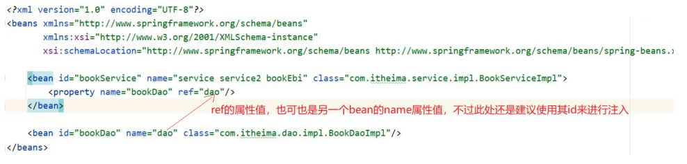

如果不存在,则会报错，如下:

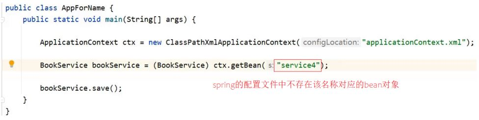

这个错误大家需要特别关注下:

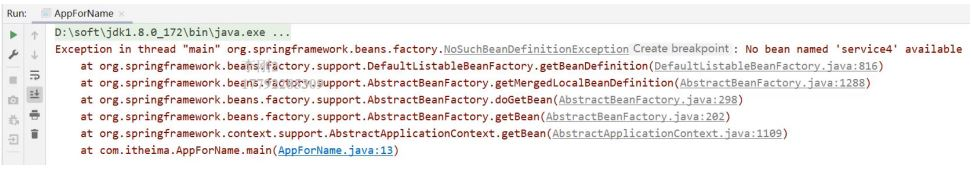

获取bean无论是通过id还是name获取，如果无法获取到，将抛出异常NoSuchBeanDefinitionException

## bean作用范围scope配置

关于bean的作用范围是bean属性配置的一个重点内容。

看到这个作用范围，我们就得思考bean的作用范围是来控制bean哪块内容的?

我们先来看下bean作用范围的配置属性:

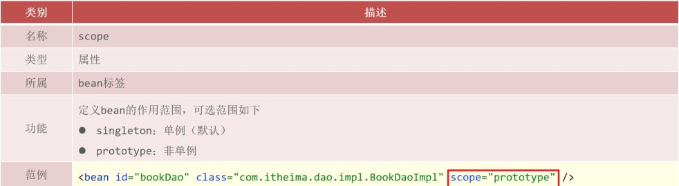

### 验证IOC容器中对象是否为单例

#### 验证思路

同一个bean获取两次，将对象打印到控制台，看打印出的地址值是否一致。

#### 具体实现

创建一个AppForScope的类，在其main方法中来验证

```
public class AppForScope {
    public static void main(String[] args) {
        ApplicationContext ctx = new
                ClassPathXmlApplicationContext("applicationContext.xml");
        BookDao bookDao1 = (BookDao) ctx.getBean("bookDao");
        BookDao bookDao2 = (BookDao) ctx.getBean("bookDao");
        System.out.println(bookDao1);
        System.out.println(bookDao2);
    }
}
```

打印，观察控制台的打印结果

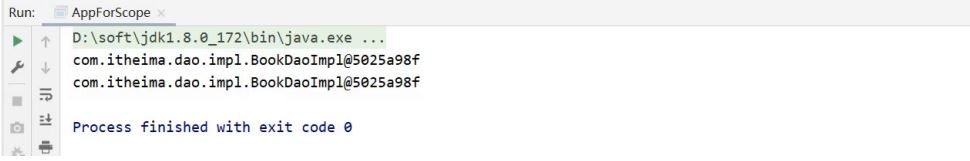

结论 : 默认情况下，Spring创建的bean对象都是单例的

获取到结论后，问题就来了，那如果我想创建出来非单例的bean对象，该如何实现呢?

### 配置bean为非单例

在Spring配置文件中，配置scope属性来实现bean的非单例创建

* 在Spring的配置文件中，修改的scope属性

```
<bean id="bookDao" name="dao" class="com.itheima.dao.impl.BookDaoImpl" scope=""/>
```

* 将scope设置为singleton

```
<bean id="bookDao" name="dao" class="com.itheima.dao.impl.BookDaoImpl" scope="singleton"/>
```

运行AppForScope，打印看结果

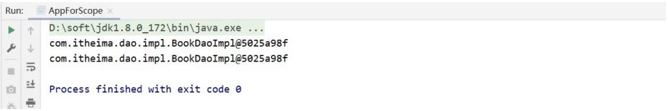

* 将scope设置为prototype

```
<bean id="bookDao" name="dao" class="com.itheima.dao.impl.BookDaoImpl" scope="prototype"/>
```

运行AppForScope，打印看结果

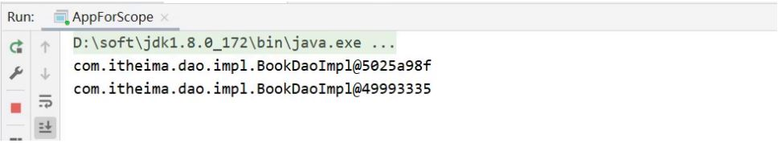

* 结论，使用bean的scope属性可以控制bean的创建是否为单例：
  * singleton默认为单例
  * prototype为非单例

### scope使用后续思考

介绍完scope属性以后，我们来思考几个问题:

* 为什么bean默认为单例?
  * bean为单例的意思是在Spring的IOC容器中只会有该类的一个对象
  * bean对象只有一个就避免了对象的频繁创建与销毁，达到了bean对象的复用，性能高
* bean在容器中是单例的，会不会产生线程安全问题?
  * 如果对象是有状态对象，即该对象有成员变量可以用来存储数据的，
  * 因为所有请求线程共用一个bean对象，所以会存在线程安全问题。
  * 如果对象是无状态对象，即该对象没有成员变量没有进行数据存储的，
  * 因方法中的局部变量在方法调用完成后会被销毁，所以不会存在线程安全问题。
* 哪些bean对象适合交给容器进行管理?
  * 表现层对象
  * 业务层对象
  * 数据层对象
  * 工具对象
* 哪些bean对象不适合交给容器进行管理?
  * 封装实例的域对象，因为会引发线程安全问题，所以不适合。

## bean基础配置小结

关于bean的基础配置中，需要大家掌握以下属性:

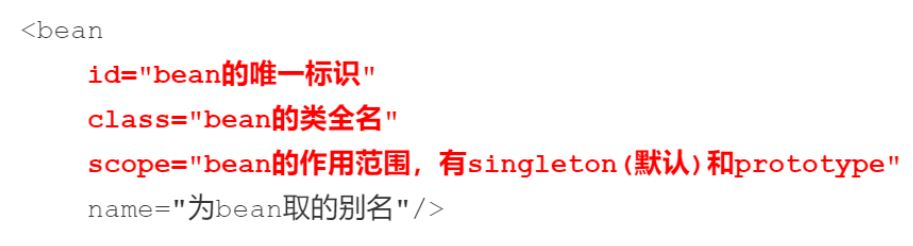
