## 思考

对象已经能交给Spring的IOC容器来创建了，但是容器是如何来创建对象的呢?

就需要研究下bean的实例化过程，在这块内容中主要解决两部分内容，分别是

* bean是如何创建的
* 实例化bean的三种方式
  * 构造方法
  * 静态工厂
  * 实例工厂

在讲解这三种创建方式之前，我们需要先确认一件事:

bean本质上就是对象，对象在new的时候会使用构造方法完成，那创建bean也是使用构造方法完成的。

基于这个知识点出发，我们来验证spring中bean的三种创建方式，

## 环境准备

为了方便大家阅读代码，重新准备个开发环境

* 创建一个Maven项目
* pom.xml添加依赖
* resources下添加spring的配置文件applicationContext.xml

这些步骤和前面的都一致，大家可以快速的拷贝即可，最终项目的结构如下:

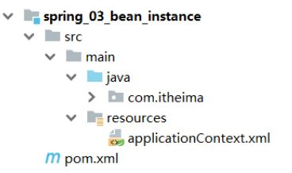

## 构造方法实例化

在上述的环境下，我们来研究下Spring中的第一种bean的创建方式构造方法实例化:

### 步骤1:准备需要被创建的类

准备一个BookDao和BookDaoImpl类

```
public interface BookDao {
    public void save();
}
public class BookDaoImpl implements BookDao {
    public void save() {
        System.out.println("book dao save ...");
    }
}
```

### 步骤2:将类配置到Spring容器

```
<?xml version="1.0" encoding="UTF-8"?>
<beans xmlns="http://www.springframework.org/schema/beans"
       xmlns:xsi="http://www.w3.org/2001/XMLSchema-instance"
       xsi:schemaLocation="http://www.springframework.org/schema/beans
http://www.springframework.org/schema/beans/spring-beans.xsd">
    <bean id="bookDao" class="com.itheima.dao.impl.BookDaoImpl"/>
</beans>
```

### 步骤3:编写运行程序

```
public class AppForInstanceBook {
    public static void main(String[] args) {
        ApplicationContext ctx = new
                ClassPathXmlApplicationContext("applicationContext.xml");
        BookDao bookDao = (BookDao) ctx.getBean("bookDao");
        bookDao.save();
    }
}
```

### 步骤4:类中提供构造函数测试

在BookDaoImpl类中添加一个无参构造函数，并打印一句话，方便观察结果。

```
public class BookDaoImpl implements BookDao {
    public BookDaoImpl() {
        System.out.println("book dao constructor is running ....");
    }
    public void save() {
        System.out.println("book dao save ...");
    }
}
```

运行程序，如果控制台有打印构造函数中的输出，说明Spring容器在创建对象的时候也走的是构造函数

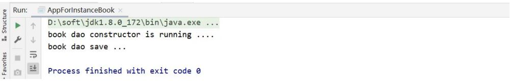

### 步骤5:将构造函数改成private测试

```
public class BookDaoImpl implements BookDao {
    private BookDaoImpl() {
        System.out.println("book dao constructor is running ....");
    }
    public void save() {
        System.out.println("book dao save ...");
    }
}
```

运行程序，能执行成功,说明内部走的依然是构造函数,能访问到类中的私有构造方法,显而易见Spring底层用的是反射

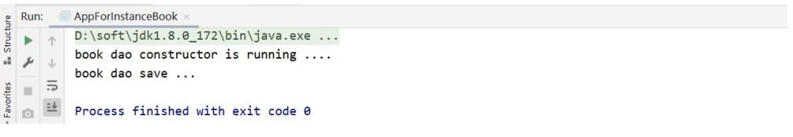

### 步骤6:构造函数中添加一个参数测试

```
public class BookDaoImpl implements BookDao {
    private BookDaoImpl(int i) {
        System.out.println("book dao constructor is running ....");
    }
    public void save() {
        System.out.println("book dao save ...");
    }
}
```

运行程序，程序会报错，说明Spring底层使用的是类的无参构造方法。


### 分析Spring的错误信息

接下来，我们主要研究下Spring的报错信息来学一学如阅读。

* 错误信息从下往上依次查看，因为上面的错误大都是对下面错误的一个包装，最核心错误是在最下面
* Caused by: java.lang.NoSuchMethodException:
* com.itheima.dao.impl.BookDaoImpl.  `<init>`()
  * Caused by 翻译为引起，即出现错误的原因
  * java.lang.NoSuchMethodException:抛出的异常为没有这样的方法异常
  * com.itheima.dao.impl.BookDaoImpl. `<init>` ():哪个类的哪个方法没有被找到导致的异常， ()指定是类的构造方法，即该类的无参构造方法

如果最后一行错误获取不到错误信息，接下来查看第二层:

```
Caused by: org.springframework.beans.BeanInstantiationException: Failed to
instantiate [com.itheima.dao.impl.BookDaoImpl]: No default constructor
found; nested exception is java.lang.NoSuchMethodException:
com.itheima.dao.impl.BookDaoImpl. <init> ()
```

* nested:嵌套的意思，后面的异常内容和最底层的异常是一致的
* Caused by: org.springframework.beans.BeanInstantiationException: Failed to instantiate [com.itheima.dao.impl.BookDaoImpl]: No default constructor found;
  * Caused by: 引发
  * BeanInstantiationException:翻译为bean实例化异常
  * No default constructor found:没有一个默认的构造函数被发现

看到这其实错误已经比较明显，给大家个练习，把倒数第三层的错误分析下吧:

```
Exception in thread "main"
org.springframework.beans.factory.BeanCreationException: Error creating
bean with name 'bookDao' defined in class path resource
[applicationContext.xml]: Instantiation of bean failed; nested exception
is org.springframework.beans.BeanInstantiationException: Failed to
instantiate [com.itheima.dao.impl.BookDaoImpl]: No default constructor
found; nested exception is java.lang.NoSuchMethodException:
com.itheima.dao.impl.BookDaoImpl. <init> ()。
```

至此，关于Spring的构造方法实例化就已经学习完了，因为每一个类默认都会提供一个无参构造函数，所以其实真正在使用这种方式的时候，我们什么也不需要做。这也是我们以后比较常用的一种方式。

## 静态工厂实例化

接下来研究Spring中的第二种bean的创建方式静态工厂实例化:

### 工厂方式创建bean

在讲这种方式之前，我们需要先回顾一个知识点是使用工厂来创建对象的方式:

准备一个OrderDao和OrderDaoImpl类

```
public interface OrderDao {
    public void save();
}
public class OrderDaoImpl implements OrderDao {
    public void save() {
        System.out.println("order dao save ...");
    }
}
```

创建一个工厂类OrderDaoFactory并提供一个静态方法

```
//静态工厂创建对象
public class OrderDaoFactory {
    public static OrderDao getOrderDao(){
        return new OrderDaoImpl();
    }
}
```

编写AppForInstanceOrder运行类，在类中通过工厂获取对象

```
public class AppForInstanceOrder {
    public static void main(String[] args) {
	//通过静态工厂创建对象
        OrderDao orderDao = OrderDaoFactory.getOrderDao();
        orderDao.save();
    }
}
```

运行后，可以查看到结果

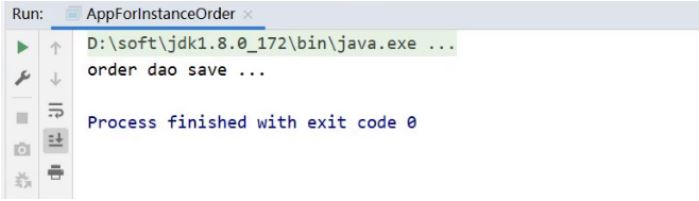

如果代码中对象是通过上面的这种方式来创建的，如何将其交给Spring来管理呢?

### 静态工厂实例化

这就要用到Spring中的静态工厂实例化的知识了，具体实现步骤为:

在spring的配置文件application.properties中添加以下内容:

```
<bean id="orderDao" class="com.itheima.factory.OrderDaoFactory" factorymethod="getOrderDao"/>
```

* class:工厂类的类全名
* factory-mehod:具体工厂类中创建对象的方法名

对应关系如下图:

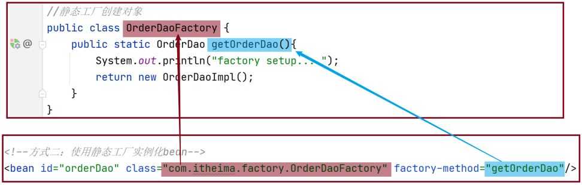

在AppForInstanceOrder运行类，使用从IOC容器中获取bean的方法进行运行测试

```
public class AppForInstanceOrder {
    public static void main(String[] args) {
        ApplicationContext ctx = new
                ClassPathXmlApplicationContext("applicationContext.xml");
        OrderDao orderDao = (OrderDao) ctx.getBean("orderDao");
        orderDao.save();
    }
}
```

运行后，可以查看到结果

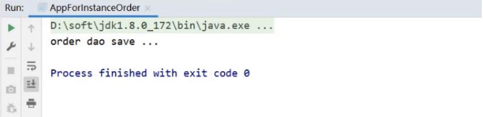

看到这，可能有人会问了，你这种方式在工厂类中不也是直接new对象的，和我自己直接new没什么太大的区别，而且静态工厂的方式反而更复杂，这种方式的意义是什么?

主要的原因是:

在工厂的静态方法中，我们除了new对象还可以做其他的一些业务操作，这些操作必不可少,如:

```
public class OrderDaoFactory {
    public static OrderDao getOrderDao(){
        System.out.println("factory setup....");//模拟必要的业务操作
        return new OrderDaoImpl();
    }
}
```

之前new对象的方式就无法添加其他的业务内容，重新运行，查看结果:

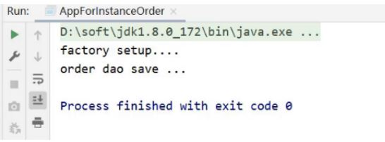

介绍完静态工厂实例化后，这种方式一般是用来兼容早期的一些老系统，所以了解为主。

## 实例工厂与FactoryBean

接下来继续来研究Spring的第三种bean的创建方式实例工厂实例化:

### 环境准备

准备一个UserDao和UserDaoImpl类

```
public interface UserDao {
    public void save();
}
public class UserDaoImpl implements UserDao {
    public void save() {
        System.out.println("user dao save ...");
    }
}
```

创建一个工厂类OrderDaoFactory并提供一个普通方法，注意此处和静态工厂的工厂类不一样的地方是方法不是静态方法

```
public class UserDaoFactory {
    public UserDao getUserDao(){
        return new UserDaoImpl();
    }
}
```

编写AppForInstanceUser运行类，在类中通过工厂获取对象

```
public class AppForInstanceUser {
    public static void main(String[] args) {
        //创建实例工厂对象
        UserDaoFactory userDaoFactory = new UserDaoFactory();
        //通过实例工厂对象创建对象
        UserDao userDao = userDaoFactory.getUserDao();
        userDao.save();
    }
```

运行后，可以查看到结果

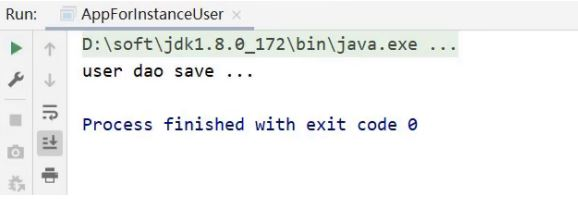

对于上面这种实例工厂的方式如何交给Spring管理呢?

### 实例工厂实例化

具体实现步骤为:

在spring的配置文件中添加以下内容:

```
<bean id="userFactory" class="com.itheima.factory.UserDaoFactory"/>
<bean id="userDao" factory-method="getUserDao" factory-bean="userFactory"/>
```

实例化工厂运行的顺序是:

* 创建实例化工厂对象,对应的是第一行配置
* 调用对象中的方法来创建bean，对应的是第二行配置

  * factory-bean:工厂的实例对象
  * factory-method:工厂对象中的具体创建对象的方法名,对应关系如下:

    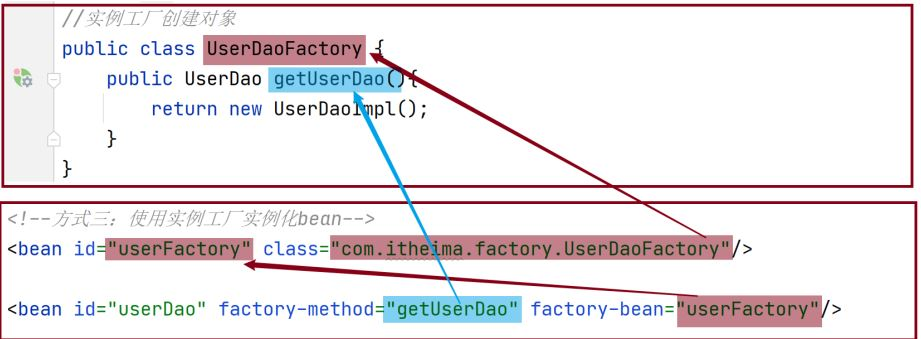
  * factory-mehod:具体工厂类中创建对象的方法名

在AppForInstanceUser运行类，使用从IOC容器中获取bean的方法进行运行测试

```
public class AppForInstanceUser {
    public static void main(String[] args) {
        ApplicationContext ctx = new
                ClassPathXmlApplicationContext("applicationContext.xml");
        UserDao userDao = (UserDao) ctx.getBean("userDao");
        userDao.save();
    }
}
```

运行后，可以查看到结果

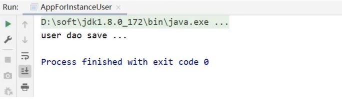

实例工厂实例化的方式就已经介绍完了，配置的过程还是比较复杂，所以Spring为了简化这种配置方式就提供了一种叫FactoryBean的方式来简化开发。

### FactoryBean的使用

具体的使用步骤为:

创建一个UserDaoFactoryBean的类，实现FactoryBean接口，重写接口的方法

```
public class UserDaoFactoryBean implements FactoryBean<UserDao> {
    //代替原始实例工厂中创建对象的方法
    public UserDao getObject() throws Exception {
        return new UserDaoImpl();
    }
    //返回所创建类的Class对象
    public Class<?> getObjectType() {
        return UserDao.class;
    }
}
```

在Spring的配置文件中进行配置

```
<bean id="userDao" class="com.itheima.factory.UserDaoFactoryBean"/>
```

AppForInstanceUser运行类不用做任何修改，直接运行

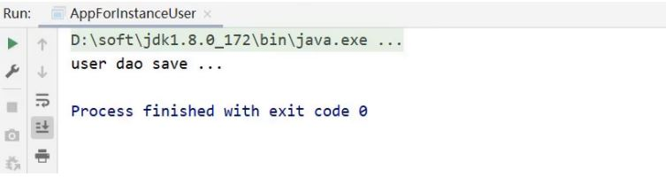

这种方式在Spring去整合其他框架的时候会被用到，所以这种方式需要大家理解掌握。

查看源码会发现，FactoryBean接口其实会有三个方法，分别是:

```
T getObject() throws Exception;

Class<?> getObjectType();

default boolean isSingleton() {
        return true;
}
```

* 方法一:getObject()，被重写后，在方法中进行对象的创建并返回
* 方法二:getObjectType(),被重写后，主要返回的是被创建类的Class对象
* 方法三:没有被重写，因为它已经给了默认值，从方法名中可以看出其作用是设置对象是否为单例，默认true，从意思上来看，我们猜想默认应该是单例，如何来验证呢?

思路很简单，就是从容器中获取该对象的多个值，打印到控制台，查看是否为同一个对象。

```
public class AppForInstanceUser {
    public static void main(String[] args) {
        ApplicationContext ctx = new
                ClassPathXmlApplicationContext("applicationContext.xml");
        UserDao userDao1 = (UserDao) ctx.getBean("userDao");
        UserDao userDao2 = (UserDao) ctx.getBean("userDao");
        System.out.println(userDao1);
        System.out.println(userDao2);
    }
}
```

打印结果，如下:

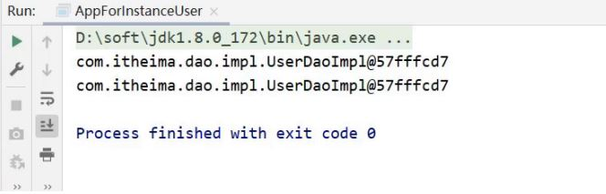

通过验证，会发现默认是单例，那如果想改成单例具体如何实现?

只需要将isSingleton()方法进行重写，修改返回为false，即可

```
public class UserDaoFactoryBean implements FactoryBean<UserDao> {
    //代替原始实例工厂中创建对象的方法
    public UserDao getObject() throws Exception {
        return new UserDaoImpl();
    }
    public Class<?> getObjectType() {
        return UserDao.class;
    }
    public boolean isSingleton() {
        return false;
    }
}
```

重新运行AppForInstanceUser，查看结果

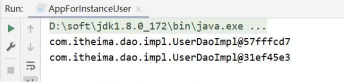

从结果中可以看出现在已经是非单例了，但是一般情况下我们都会采用单例，也就是采用默认即可。所以isSingleton()方法一般不需要进行重写。

## bean实例化小结

通过这一节的学习，需要掌握:

bean是如何创建的呢?

* 构造方法

Spring的IOC实例化对象的三种方式分别是:

* 构造方法(常用)
* 静态工厂(了解)
* 实例工厂(了解)
  * FactoryBean(使用)

这些方式中，重点掌握构造方法和FactoryBean即可。

需要注意的一点是，构造方法在类中默认会提供，但是如果重写了构造方法，默认的就会消失，在使用的过程中需要注意，如果需要重写构造方法，最好把默认的构造方法也重写下。
