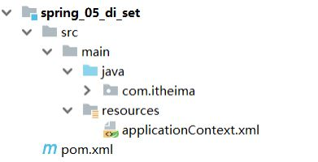
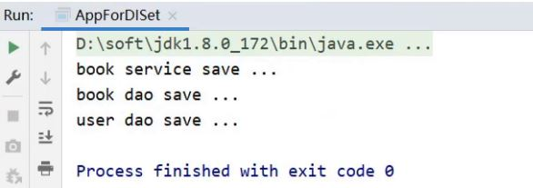
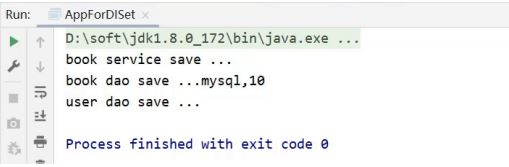

## DI注入方式

前面我们已经完成了bean相关操作的讲解，接下来就进入第二个大的模块DI依赖注入，首先来绍下Spring中有哪些注入方式?

我们先来思考

* 向一个类中传递数据的方式有几种?
  * 普通方法(set方法)
  * 构造方法
* 依赖注入描述了在容器中建立bean与bean之间的依赖关系的过程，如果bean运行需要的是数字或字符串呢?
  * 引用类型
  * 简单类型(基本数据类型与String)

Spring就是基于上面这些知识点，为我们提供了两种注入方式，分别是:

* setter注入
  * 简单类型
  * 引用类型
* 构造器注入
  * 简单类型
  * 引用类型

依赖注入的方式已经介绍完，接下来挨个学习下:

## setter注入

对于setter方式注入引用类型的方式之前已经学习过，快速回顾下:

在bean中定义引用类型属性，并提供可访问的set方法

```
public class BookServiceImpl implements BookService {
    private BookDao bookDao;
    public void setBookDao(BookDao bookDao) {
        this.bookDao = bookDao;
    }
}
```

配置中使用property标签ref属性注入引用类型对象

```
<bean id="bookService" class="com.itheima.service.impl.BookServiceImpl">
    <property name="bookDao" ref="bookDao"/>
</bean>
<bean id="bookDao" class="com.itheima.dao.imipl.BookDaoImpl"/>
```

## 环境准备

为了更好的学习下面内容，我们依旧准备一个新环境:

* 创建一个Maven项目
* pom.xml添加依赖
* resources下添加spring的配置文件

这些步骤和前面的都一致，大家可以快速的拷贝即可，最终项目的结构如下:



项目中添加BookDao、BookDaoImpl、UserDao、UserDaoImpl、BookService和BookServiceImpl类

```
public interface BookDao {
    public void save();
}
public class BookDaoImpl implements BookDao {
    public void save() {
        System.out.println("book dao save ...");
    }
}
public interface UserDao {
    public void save();
}
public class UserDaoImpl implements UserDao {
    public void save() {
        System.out.println("user dao save ...");
    }
}
public interface BookService {
    public void save();
}
public class BookServiceImpl implements BookService{
    private BookDao bookDao;
    public void setBookDao(BookDao bookDao) {
        this.bookDao = bookDao;
    }
    public void save() {
        System.out.println("book service save ...");
        bookDao.save();
    }
}
```

resources下提供spring的配置文件

```
<?xml version="1.0" encoding="UTF-8"?>
<beans xmlns="http://www.springframework.org/schema/beans"
       xmlns:xsi="http://www.w3.org/2001/XMLSchema-instance"
       xsi:schemaLocation="http://www.springframework.org/schema/beans
http://www.springframework.org/schema/beans/spring-beans.xsd">
    <bean id="bookDao" class="com.itheima.dao.impl.BookDaoImpl"/>
    <bean id="bookService" class="com.itheima.service.impl.BookServiceImpl">
        <property name="bookDao" ref="bookDao"/>
    </bean>
</beans>
```

编写AppForDISet运行类，加载Spring的IOC容器，并从中获取对应的bean对象

```
public class AppForDISet {
    public static void main( String[] args ) {
        ApplicationContext ctx = new
                ClassPathXmlApplicationContext("applicationContext.xml");
        BookService bookService = (BookService) ctx.getBean("bookService");
        bookService.save();
    }
}
```

接下来，在上面这个环境中来完成setter注入的学习:

## 注入引用数据类型

需求:在bookServiceImpl对象中注入userDao

1.在BookServiceImpl中声明userDao属性

2.为userDao属性提供setter方法

3.在配置文件中使用property标签注入

### 步骤1:声明属性并提供setter方法

在BookServiceImpl中声明userDao属性，并提供setter方法

```
public class BookServiceImpl implements BookService{
    private BookDao bookDao;
    private UserDao userDao;
    public void setUserDao(UserDao userDao) {
        this.userDao = userDao;
    }
    public void setBookDao(BookDao bookDao) {
        this.bookDao = bookDao;
    }
    public void save() {
        System.out.println("book service save ...");
        bookDao.save();
        userDao.save();
    }
}
```

### 步骤2:配置文件中进行注入配置

在applicationContext.xml配置文件中使用property标签注入

```
<?xml version="1.0" encoding="UTF-8"?>
<beans xmlns="http://www.springframework.org/schema/beans"
       xmlns:xsi="http://www.w3.org/2001/XMLSchema-instance"
       xsi:schemaLocation="http://www.springframework.org/schema/beans
http://www.springframework.org/schema/beans/spring-beans.xsd">
    <bean id="bookDao" class="com.itheima.dao.impl.BookDaoImpl"/>
    <bean id="userDao" class="com.itheima.dao.impl.UserDaoImpl"/>
    <bean id="bookService" class="com.itheima.service.impl.BookServiceImpl">
        <property name="bookDao" ref="bookDao"/>
        <property name="userDao" ref="userDao"/>
    </bean>
</beans>
```

### 步骤3:运行程序

运行AppForDISet类，查看结果，说明userDao已经成功注入。



## 注入简单数据类型

需求：给BookDaoImpl注入一些简单数据类型的数据

参考引用数据类型的注入，我们可以推出具体的步骤为:

1.在BookDaoImpl类中声明对应的简单数据类型的属性

2.为这些属性提供对应的setter方法

3.在applicationContext.xml中配置

**思考:**

引用类型使用的是 ,简单数据类型还是使用ref么?

ref是指向Spring的IOC容器中的另一个bean对象的，对于简单数据类型，没有对应的bean象，该如何配置?

### 步骤1:声明属性并提供setter方法

在BookDaoImpl类中声明对应的简单数据类型的属性,并提供对应的setter方法

```
public class BookDaoImpl implements BookDao {
    private String databaseName;
    private int connectionNum;
    public void setConnectionNum(int connectionNum) {
        this.connectionNum = connectionNum;
    }
    public void setDatabaseName(String databaseName) {
        this.databaseName = databaseName;
    }
    public void save() {
        System.out.println("book dao save
        ..."+databaseName+","+connectionNum);
    }
}
```

### 步骤2:配置文件中进行注入配置

在applicationContext.xml配置文件中使用property标签注入

```
<?xml version="1.0" encoding="UTF-8"?>
<beans xmlns="http://www.springframework.org/schema/beans"
       xmlns:xsi="http://www.w3.org/2001/XMLSchema-instance"
       xsi:schemaLocation="http://www.springframework.org/schema/beans
http://www.springframework.org/schema/beans/spring-beans.xsd">
    <bean id="bookDao" class="com.itheima.dao.impl.BookDaoImpl">
        <property name="databaseName" value="mysql"/>
        <property name="connectionNum" value="10"/>
    </bean>
    <bean id="userDao" class="com.itheima.dao.impl.UserDaoImpl"/>
    <bean id="bookService" class="com.itheima.service.impl.BookServiceImpl">
        <property name="bookDao" ref="bookDao"/>
        <property name="userDao" ref="userDao"/>
    </bean>
</beans>
```

**说明:**

value:后面跟的是简单数据类型，对于参数类型，Spring在注入的时候会自动转换，但是不能写成

```
<property name="connectionNum" value="abc"/>
```

这样的话，spring在将abc转换成int类型的时候就会报错。

### 步骤3:运行程序

运行AppForDISet类，查看结果，说明userDao已经成功注入。



注意 : 两个property注入标签的顺序可以任意。

对于setter注入方式的基本使用就已经介绍完了，

* 对于引用数据类型使用的是 `<property name="" ref=""/>`
* 对于简单数据类型使用的是 `<property name="" value=""/>`
