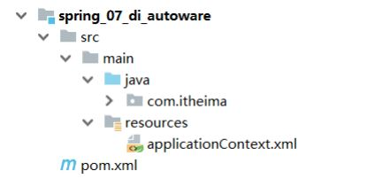
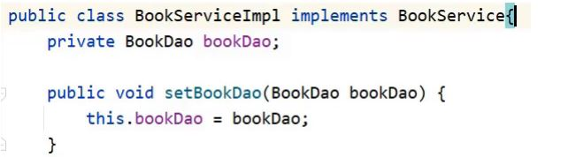

## 思考

前面花了大量的时间把Spring的注入去学习了下，总结起来就一个字麻烦。

问:麻烦在哪?

* 答:配置文件的编写配置上。

问:有更简单方式么?

* 答:有，自动配置

什么是自动配置以及如何实现自动配置，就是接下来要学习的内容：

## 什么是依赖自动装配?

IoC容器根据bean所依赖的资源在容器中自动查找并注入到bean中的过程称为自动装配

## 自动装配方式有哪些?

* 按类型（常用）
* 按名称
* 按构造方法
* 不启用自动装配

## 准备下案例环境

* 创建一个Maven项目
* pom.xml添加依赖
* resources下添加spring的配置文件

这些步骤和前面的都一致，大家可以快速的拷贝即可，最终项目的结构如下:



项目中添加BookDao、BookDaoImpl、BookService和BookServiceImpl类

```
public interface BookDao {
    public void save();
}
public class BookDaoImpl implements BookDao {
    private String databaseName;
    private int connectionNum;
    public void save() {
        System.out.println("book dao save ...");
    }
}
public interface BookService {
    public void save();
}
public class BookServiceImpl implements BookService{
    private BookDao bookDao;
    public void setBookDao(BookDao bookDao) {
        this.bookDao = bookDao;
    }
    public void save() {
        System.out.println("book service save ...");
        bookDao.save();
    }
}
```

resources下提供spring的配置文件

```
<?xml version="1.0" encoding="UTF-8"?>
<beans xmlns="http://www.springframework.org/schema/beans"
       xmlns:xsi="http://www.w3.org/2001/XMLSchema-instance"
       xsi:schemaLocation="http://www.springframework.org/schema/beans
http://www.springframework.org/schema/beans/spring-beans.xsd">
    <bean id="bookDao" class="com.itheima.dao.impl.BookDaoImpl"/>
    <bean id="bookService" class="com.itheima.service.impl.BookServiceImpl">
        <property name="bookDao" ref="bookDao"/>
    </bean>
</beans>
```

编写AppForAutoware运行类，加载Spring的IOC容器，并从中获取对应的bean对象

```
public class AppForAutoware {
    public static void main( String[] args ) {
        ApplicationContext ctx = new
                ClassPathXmlApplicationContext("applicationContext.xml");
        BookService bookService = (BookService) ctx.getBean("bookService");
        bookService.save();
    }
}
```

## 完成自动装配的配置

接下来，在上面这个环境中来完成自动装配的学习:

自动装配只需要修改applicationContext.xml配置文件即可:

* 将标签删除
* 在标签中添加autowire属性

首先来实现按照类型注入的配置

```
<?xml version="1.0" encoding="UTF-8"?>
<beans xmlns="http://www.springframework.org/schema/beans"
       xmlns:xsi="http://www.w3.org/2001/XMLSchema-instance"
       xsi:schemaLocation="http://www.springframework.org/schema/beans
http://www.springframework.org/schema/beans/spring-beans.xsd">
    <bean class="com.itheima.dao.impl.BookDaoImpl"/>
    <!--autowire属性：开启自动装配，通常使用按类型装配-->
    <bean id="bookService" class="com.itheima.service.impl.BookServiceImpl"
          autowire="byType"/>
</beans>
```

**注意事项:**

* 需要注入属性的类中对应属性的setter方法不能省略
* 被注入的对象必须要被Spring的IOC容器管理
* 按照类型在Spring的IOC容器中如果找到多个对象，会报NoUniqueBeanDefinitionException

一个类型在IOC中有多个对象，还想要注入成功，这个时候就需要按照名称注入，配置方式为:

```
<?xml version="1.0" encoding="UTF-8"?>
<beans xmlns="http://www.springframework.org/schema/beans"
xmlns:xsi="http://www.w3.org/2001/XMLSchema-instance"
xsi:schemaLocation="http://www.springframework.org/schema/beans
http://www.springframework.org/schema/beans/spring-beans.xsd">
<bean class="com.itheima.dao.impl.BookDaoImpl"/>
<!--autowire属性：开启自动装配，通常使用按类型装配-->
<bean id="bookService" class="com.itheima.service.impl.BookServiceImpl"
autowire="byName"/>
</beans>
```

```
<?xml version="1.0" encoding="UTF-8"?>
<beans xmlns="http://www.springframework.org/schema/beans"
       xmlns:xsi="http://www.w3.org/2001/XMLSchema-instance"
       xsi:schemaLocation="http://www.springframework.org/schema/beans
http://www.springframework.org/schema/beans/spring-beans.xsd">
    <bean class="com.itheima.dao.impl.BookDaoImpl"/>
    <!--autowire属性：开启自动装配，通常使用按类型装配-->
    <bean id="bookService" class="com.itheima.service.impl.BookServiceImpl"
          autowire="byName"/>
</beans>
```

**注意事项:**

* 按照名称注入中的名称指的是什么?



* bookDao是private修饰的，外部类无法直接方法
* 外部类只能通过属性的set方法进行访问
* 对外部类来说，setBookDao方法名，去掉set后首字母小写是其属性名

  * 为什么是去掉set首字母小写?
  * 这个规则是set方法生成的默认规则，set方法的生成是把属性名首字母大写前面加set形成的方法名
* 所以按照名称注入，其实是和对应的set方法有关，但是如果按照标准起名称，属性名和set对应的名是一致的

如果按照名称去找对应的bean对象，找不到则注入Null

当某一个类型在IOC容器中有多个对象，按照名称注入只找其指定名称对应的bean对象，不会报错两种方式介绍完后，以后用的更多的是按照类型注入。

最后对于依赖注入，需要注意一些其他的配置特征:

* 自动装配用于引用类型依赖注入，不能对简单类型进行操作
* 使用按类型装配时（byType）必须保障容器中相同类型的bean唯一，推荐使用
* 使用按名称装配时（byName）必须保障容器中具有指定名称的bean，因变量名与配置耦合，不推荐使用
* 自动装配优先级低于setter注入与构造器注入，同时出现时自动装配配置失效
