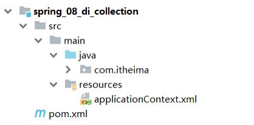
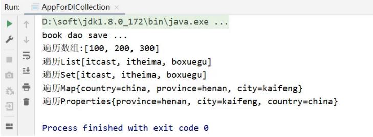

前面我们已经能完成引入数据类型和简单数据类型的注入，但是还有一种数据类型集合，集合中既可以装简单数据类型也可以装引用数据类型，对于集合，在Spring中该如何注入呢?

先来回顾下，常见的集合类型有哪些?

* 数组
* List
* Set
* Map
* Properties

针对不同的集合类型，该如何实现注入呢?

## 环境准备

* 创建一个Maven项目
* pom.xml添加依赖
* resources下添加spring的配置文件applicationContext.xml

这些步骤和前面的都一致，大家可以快速的拷贝即可，最终项目的结构如下:



项目中添加添加BookDao、BookDaoImpl类

```
public interface BookDao {
    public void save();
}
public class BookDaoImpl implements BookDao {
    public class BookDaoImpl implements BookDao {
        private int[] array;
        private List<String> list;
        private Set<String> set;
        private Map<String, String> map;
        private Properties properties;

        public void save() {
            System.out.println("book dao save ...");
            System.out.println("遍历数组:" + Arrays.toString(array));
            System.out.println("遍历List" + list);
            System.out.println("遍历Set" + set);
            System.out.println("遍历Map" + map);
            System.out.println("遍历Properties" + properties);
        }
        //setter....方法省略，自己使用工具生成
    }
}
```

resources下提供spring的配置文件，applicationContext.xml

```
<?xml version="1.0" encoding="UTF-8"?>
<beans xmlns="http://www.springframework.org/schema/beans"
       xmlns:xsi="http://www.w3.org/2001/XMLSchema-instance"
       xsi:schemaLocation="http://www.springframework.org/schema/beans
http://www.springframework.org/schema/beans/spring-beans.xsd">
    <bean id="bookDao" class="com.itheima.dao.impl.BookDaoImpl"/>
</beans>
```

编写AppForDICollection运行类，加载Spring的IOC容器，并从中获取对应的bean对象

```
public class AppForDICollection {
    public static void main( String[] args ) {
        ApplicationContext ctx = new
                ClassPathXmlApplicationContext("applicationContext.xml");
        BookDao bookDao = (BookDao) ctx.getBean("bookDao");
        bookDao.save();
    }
}
```

接下来，在上面这个环境中来完成集合注入的学习：

下面的所以配置方式，都是在bookDao的bean标签中使用进行注入

```
<?xml version="1.0" encoding="UTF-8"?>
<beans xmlns="http://www.springframework.org/schema/beans"
       xmlns:xsi="http://www.w3.org/2001/XMLSchema-instance"
       xsi:schemaLocation="http://www.springframework.org/schema/beans
http://www.springframework.org/schema/beans/spring-beans.xsd">
    <bean id="bookDao" class="com.itheima.dao.impl.BookDaoImpl">
    </bean>
</beans>
```

## 注入数组类型数据

```
<property name="array">
    <array>
        <value>100</value>
        <value>200</value>
        <value>300</value>
    </array>
</property>
```

## 注入List类型数据

```
<property name="list">
    <list>
        <value>itcast</value>
        <value>itheima</value>
        <value>boxuegu</value>
        <value>chuanzhihui</value>
    </list>
</property>
```

## 注入Set类型数据

```
<property name="set">
    <set>
        <value>itcast</value>
        <value>itheima</value>
        <value>boxuegu</value>
        <value>boxuegu</value>
    </set>
</property>
```

## 注入Map类型数据

```
<property name="map">
    <map>
        <entry key="country" value="china"/>
        <entry key="province" value="henan"/>
        <entry key="city" value="kaifeng"/>
    </map>
</property>
```

## 注入Properties类型数据

```
<property name="properties">
    <props>
        <prop key="country">china</prop>
        <prop key="province">henan</prop>
        <prop key="city">kaifeng</prop>
    </props>
</property>
```

配置完成后，运行下看结果:



说明：

* property标签表示setter方式注入，构造方式注入constructor-arg标签内部也可以写
  `<array>`、`<list>`、`<set>`、`<map>`、`<props>`标签
* List的底层也是通过数组实现的，所以 `<list>`和 `<array>`标签是可以混用
* 集合中要添加引用类型，只需要把 `<value>`标签改成 `<ref>`标签，这种方式用的比较少
