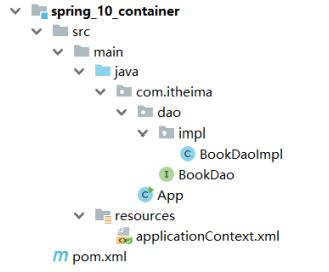
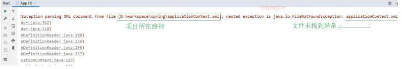
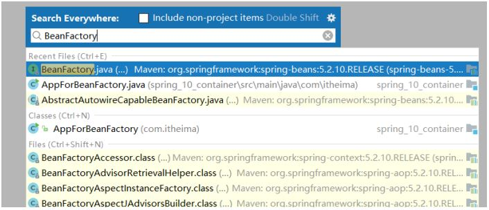
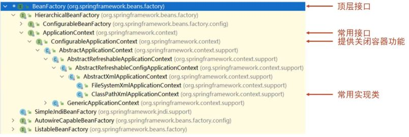
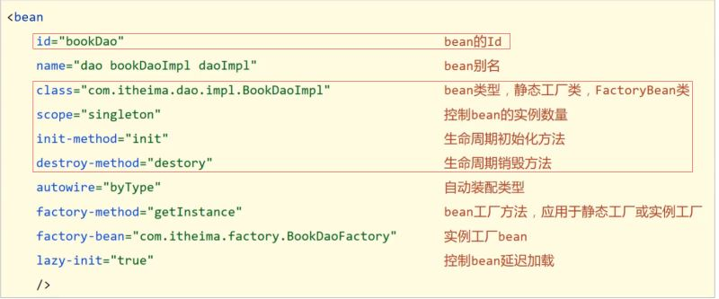
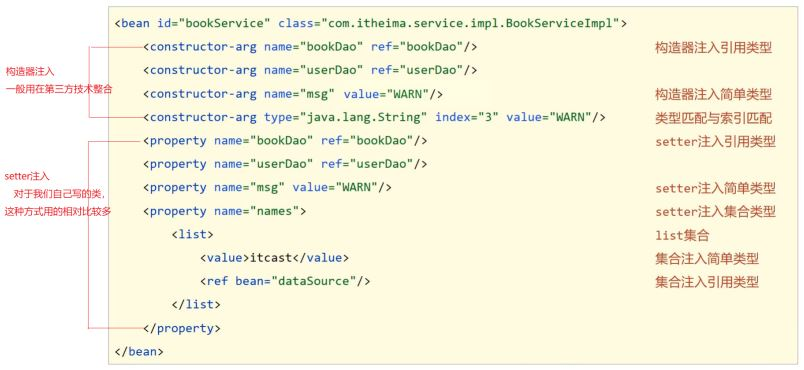

## 简介

前面已经完成bean与依赖注入的相关知识学习，接下来我们主要学习的是IOC容器中的核心容器。

这里所说的核心容器，大家可以把它简单的理解为ApplicationContext，前面虽然已经用到过，但是并没有系统的学习，接下来咱们从以下几个问题入手来学习下容器的相关知识:

* 如何创建容器?
* 创建好容器后，如何从容器中获取bean对象?
* 容器类的层次结构是什么?
* BeanFactory是什么?

## 环境准备

在学习和解决上述问题之前，先来准备下案例环境:

* 创建一个Maven项目
* pom.xml添加Spring的依赖

  ```
  <dependencies>
      <dependency>
          <groupId>org.springframework</groupId>
          <artifactId>spring-context</artifactId>
          <version>5.2.10.RELEASE</version>
      </dependency>
  </dependencies>
  ```
* resources下添加applicationContext.xml

  ```
  <?xml version="1.0" encoding="UTF-8"?>
  <beans xmlns="http://www.springframework.org/schema/beans"
         xmlns:xsi="http://www.w3.org/2001/XMLSchema-instance"
         xsi:schemaLocation="
  http://www.springframework.org/schema/beans
  http://www.springframework.org/schema/beans/spring-beans.xsd">
      <bean id="bookDao" class="com.itheima.dao.impl.BookDaoImpl"/>
  </beans>
  ```
* 添加BookDao和BookDaoImpl类

  ```
  public interface BookDao {
      public void save();
  }
  public class BookDaoImpl implements BookDao {
      public void save() {
          System.out.println("book dao save ..." );
      }
  }
  ```
* 创建运行类App

  ```
  public class App {
      public static void main(String[] args) {
          ApplicationContext ctx = new
                  ClassPathXmlApplicationContext("applicationContext.xml");
          BookDao bookDao = (BookDao) ctx.getBean("bookDao");
          bookDao.save();
      }
  }
  ```

最终创建好的项目结构如下:



## 容器

### 容器的创建方式

案例中创建ApplicationContext的方式为:

```
ApplicationContext ctx = new
        ClassPathXmlApplicationContext("applicationContext.xml");
```

这种方式翻译为:类路径下的XML配置文件

除了上面这种方式，Spring还提供了另外一种创建方式为:

```
ApplicationContext ctx = new
        FileSystemXmlApplicationContext("applicationContext.xml")
```

这种方式翻译为:文件系统下的XML配置文件

使用这种方式，运行，会出现如下错误:



从错误信息中能发现，这种方式是从项目路径下开始查找applicationContext.xml配置文件的，所
以需要将其修改为:

```
ApplicationContext ctx = new FileSystemXmlApplicationContext("D:\\workspace\\spring\\spring_10_container\\src\\main\\resources\\applicationContext.xml");
```

说明:大家练习的时候，写自己的具体路径。

这种方式虽能实现，但是当项目的位置发生变化后,代码也需要跟着改,耦合度较高,不推荐使用。

### Bean的三种获取方式

方式一，就是目前案例中获取的方式:

```
BookDao bookDao = (BookDao) ctx.getBean("bookDao");
```

这种方式存在的问题是每次获取的时候都需要进行类型转换，有没有更简单的方式呢?

方式二：

```
BookDao bookDao = ctx.getBean("bookDao"，BookDao.class);
```

这种方式可以解决类型强转问题，但是参数又多加了一个，相对来说没有简化多少。

方式三:

```
BookDao bookDao = ctx.getBean(BookDao.class);
```

这种方式就类似我们之前所学习依赖注入中的按类型注入。必须要确保IOC容器中该类型对应的bean
对象只能有一个。

### 容器类层次结构

在IDEA中双击shift ,输入BeanFactory



点击进入BeanFactory类，ctrl+h,就能查看到如下结构的层次关系



从图中可以看出，容器类也是从无到有根据需要一层层叠加上来的，大家重点理解下这种设计思想。

### BeanFactory的使用

使用BeanFactory来创建IOC容器的具体实现方式为:

```
public class AppForBeanFactory {
    public static void main(String[] args) {
        Resource resources = new ClassPathResource("applicationContext.xml");
        BeanFactory bf = new XmlBeanFactory(resources);
        BookDao bookDao = bf.getBean(BookDao.class);
        bookDao.save();
    }
}
```

为了更好的看出BeanFactory和ApplicationContext之间的区别，在BookDaoImpl添加如下构造函数:

```
public class BookDaoImpl implements BookDao {
    public BookDaoImpl() {
        System.out.println("constructor");
    }
    public void save() {
        System.out.println("book dao save ..." );
    }
}
```

如果不去获取bean对象，打印会发现：

* BeanFactory是延迟加载，只有在获取bean对象的时候才会去创建
* ApplicationContext是立即加载，容器加载的时候就会创建bean对象
* ApplicationContext要想成为延迟加载，只需要按照如下方式进行配置

```
<?xml version="1.0" encoding="UTF-8"?>
<beans xmlns="http://www.springframework.org/schema/beans"
       xmlns:xsi="http://www.w3.org/2001/XMLSchema-instance"
       xsi:schemaLocation="
http://www.springframework.org/schema/beans
http://www.springframework.org/schema/beans/spring-beans.xsd">
    <bean id="bookDao" class="com.itheima.dao.impl.BookDaoImpl" lazyinit="true"/>
</beans>
```

### 小结

这一节中所讲的知识点包括:

* 容器创建的两种方式

  * ClassPathXmlApplicationContext
  * FileSystemXmlApplicationContext
* 获取Bean的三种方式

  * getBean("名称"):需要类型转换
  * getBean("名称",类型.class):多了一个参数
  * getBean(类型.class):容器中不能有多个该类的bean对象

  上述三种方式，各有各的优缺点，用哪个都可以。
* 容器类层次结构

  * 只需要知晓容器的最上级的父接口为 BeanFactory即可
* BeanFactory

  * 使用BeanFactory创建的容器是延迟加载
  * 使用ApplicationContext创建的容器是立即加载
  * 具体BeanFactory如何创建只需要了解即可。

## 核心容器总结

这节中没有新的知识点，只是对前面知识的一个大总结，共包含如下内容:

### 容器相关

* BeanFactory是IoC容器的顶层接口，初始化BeanFactory对象时，加载的bean延迟加载
* ApplicationContext接口是Spring容器的核心接口，初始化时bean立即加载
* ApplicationContext接口提供基础的bean操作相关方法，通过其他接口扩展其功能
* ApplicationContext接口常用初始化类
  * ClassPathXmlApplicationContext(常用)
  * FileSystemXmlApplicationContext

### bean相关



其实整个配置中最常用的就两个属性id和class。

把scope、init-method、destroy-method框起来的原因是，后面注解在讲解的时候还会用到，所以大家对这三个属性关注下。

### 依赖注入相关


