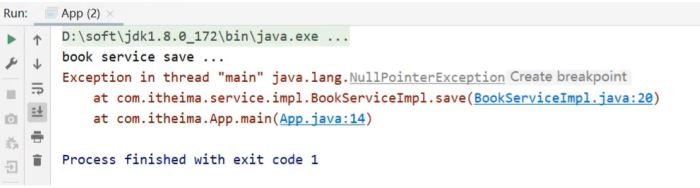

## 注解开发简介

Spring的IOC/DI对应的配置开发就已经讲解完成，但是使用起来相对来说还是比较复杂的，复杂的地方在配置文件。

前面咱们聊Spring的时候说过，Spring可以简化代码的开发，到现在并没有体会到。所以Spring到底是如何简化代码开发的呢?

要想真正简化开发，就需要用到Spring的注解开发，Spring对注解支持的版本历程:

* 2.0版开始支持注解
* 2.5版注解功能趋于完善
* 3.0版支持纯注解开发

关于注解开发，我们会讲解两块内容注解开发定义bean和纯注解开发。

注解开发定义bean用的是2.5版提供的注解，纯注解开发用的是3.0版提供的注解。

## 环境准备

在学习注解开发之前，先来准备下案例环境:

* 创建一个Maven项目
* pom.xml添加Spring的依赖

  ```
  <dependencies>
      <dependency>
          <groupId>org.springframework</groupId>
          <artifactId>spring-context</artifactId>
          <version>5.2.10.RELEASE</version>
      </dependency>
  </dependencies>
  ```
* resources下添加applicationContext.xml

  ```
  <?xml version="1.0" encoding="UTF-8"?>
  <beans xmlns="http://www.springframework.org/schema/beans"
         xmlns:xsi="http://www.w3.org/2001/XMLSchema-instance"
         xsi:schemaLocation="
  http://www.springframework.org/schema/beans
  http://www.springframework.org/schema/beans/spring-beans.xsd">
      <bean id="bookDao" class="com.itheima.dao.impl.BookDaoImpl"/>
  </beans>
  ```
* 添加BookDao、BookDaoImpl、BookService、BookServiceImpl类

  ```
  public interface BookDao {
      public void save();
  }
  public class BookDaoImpl implements BookDao {
      public void save() {
          System.out.println("book dao save ..." );
      }
  }
  public interface BookService {
      public void save();
  }
  public class BookServiceImpl implements BookService {
      public void save() {
          System.out.println("book service save ...");
      }
  }
  ```
* 创建运行类App

  ```
  public class App {
      public static void main(String[] args) {
          ApplicationContext ctx = new
                  ClassPathXmlApplicationContext("applicationContext.xml");
          BookDao bookDao = (BookDao) ctx.getBean("bookDao");
          bookDao.save();
      }
  }
  ```

最终创建好的项目结构如下:


## 注解开发定义bean

在上述环境的基础上，我们来学一学Spring是如何通过注解实现bean的定义开发?

### 步骤1:删除原XML配置

将配置文件中的标签删除掉

```
<bean id="bookDao" class="com.itheima.dao.impl.BookDaoImpl"/>
```

### 步骤2:Dao上添加注解

在BookDaoImpl类上添加@Component注解

```
@Component("bookDao")
public class BookDaoImpl implements BookDao {
    public void save() {
        System.out.println("book dao save ..." );
    }
}
```

> 注意:@Component注解不可以添加在接口上，因为接口是无法创建对象的。

XML与注解配置的对应关系:


### 步骤3:配置Spring的注解包扫描

为了让Spring框架能够扫描到写在类上的注解，需要在配置文件上进行包扫描

```
<?xml version="1.0" encoding="UTF-8"?>
<beans xmlns="http://www.springframework.org/schema/beans"
       xmlns:xsi="http://www.w3.org/2001/XMLSchema-instance"
       xsi:schemaLocation="
http://www.springframework.org/schema/beans
http://www.springframework.org/schema/beans/spring-beans.xsd">
    <context:component-scan base-package="com.itheima"/>
</beans>
```

**说明:**

component-scan

* component:组件,Spring将管理的bean视作自己的一个组件
* scan:扫描

base-package指定Spring框架扫描的包路径，它会扫描指定包及其子包中的所有类上的注解。

* 包路径越多[如:com.itheima.dao.impl]，扫描的范围越小速度越快
* 包路径越少[如:com.itheima],扫描的范围越大速度越慢
* 一般扫描到项目的组织名称即Maven的groupId下[如:com.itheima]即可。

### 步骤4：运行程序

运行App类查看打印结果


### 步骤5:Service上添加注解

在BookServiceImpl类上也添加@Component交给Spring框架管理

```
@Component
public class BookServiceImpl implements BookService {
    private BookDao bookDao;
    public void setBookDao(BookDao bookDao) {
        this.bookDao = bookDao;
    }
    public void save() {
        System.out.println("book service save ...");
        bookDao.save();
    }
}
```

### 步骤6:运行程序

在App类中，从IOC容器中获取BookServiceImpl对应的bean对象，打印

```
public class App {
    public static void main(String[] args) {
        ApplicationContext ctx = new
                ClassPathXmlApplicationContext("applicationContext.xml");
        BookDao bookDao = (BookDao) ctx.getBean("bookDao");
        System.out.println(bookDao);
        //按类型获取bean
        BookService bookService = ctx.getBean(BookService.class);
        System.out.println(bookService);
    }
}
```

打印观察结果，两个bean对象都已经打印到控制台


**说明:**

BookServiceImpl类没有起名称，所以在App中是按照类型来获取bean对象

@Component注解如果不起名称，会有一个默认值就是当前类名首字母小写，所以也可以按照名称
获取，如

```
BookService bookService = (BookService)ctx.getBean("bookServiceImpl");
        System.out.println(bookService);
```

对于@Component注解，还衍生出了其他三个注解@Controller、@Service、@Repository通过查看源码会发现:


这三个注解和@Component注解的作用是一样的，为什么要衍生出这三个呢?

方便我们后期在编写类的时候能很好的区分出这个类是属于表现层、业务层还是数据层的类。

**知识点1:@Component等**

| 名称 | @Component/@Controller/@Service/@Repository |
| ---- | ------------------------------------------- |
| 类型 | 类注解                                      |
| 位置 | 类定义上方                                  |
| 作用 | 设置该类为spring管理的bean                  |
| 属性 | value（默认）：定义bean的id                 |

## 纯注解开发模式

上面已经可以使用注解来配置bean,但是依然有用到配置文件，在配置文件中对包进行了扫描，Spring在3.0版已经支持纯注解开发

* Spring3.0开启了纯注解开发模式，使用Java类替代配置文件，开启了Spring快速开发赛道

具体如何实现?

### 思路分析

实现思路为:

将配置文件applicationContext.xml删除掉，使用类来替换。

### 实现步骤

#### 步骤1:创建配置类

创建一个配置类SpringConfig

```
public class SpringConfig {
}
```

#### 步骤2:标识该类为配置类

在配置类上添加@Configuration注解，将其标识为一个配置类,替换applicationContext.xml

```
@Configuration
public class SpringConfig {
}
```

#### 步骤3:用注解替换包扫描配置

在配置类上添加包扫描注解@ComponentScan替换<context:component-scan base-package=""/>

```
@Configuration
@ComponentScan("com.itheima")
public class SpringConfig {
}
```

#### 步骤4:创建运行类并执行

创建一个新的运行类AppForAnnotation

```
public class AppForAnnotation {
    public static void main(String[] args) {
        ApplicationContext ctx = new
                AnnotationConfigApplicationContext(SpringConfig.class);
        BookDao bookDao = (BookDao) ctx.getBean("bookDao");
        System.out.println(bookDao);
        BookService bookService = ctx.getBean(BookService.class);
        System.out.println(bookService);
    }
}
```

运行AppForAnnotation,可以看到两个对象依然被获取成功


至此，纯注解开发的方式就已经完成了，主要内容包括:

* Java类替换Spring核心配置文件

  
* @Configuration注解用于设定当前类为配置类
* @ComponentScan注解用于设定扫描路径，此注解只能添加一次，多个数据请用数组格式

  ```
  @ComponentScan({com.itheima.service","com.itheima.dao"})
  ```
* 读取Spring核心配置文件初始化容器对象切换为读取Java配置类初始化容器对象

  ```
  //加载配置文件初始化容器
  ApplicationContext ctx = new ClassPathXmlApplicationContext("applicationContext.xml");

  //加载配置类初始化容器
  ApplicationContext ctx = new AnnotationConfigApplicationContext(SpringConfig.class);
  ```

**知识点1：@Configuration**

| 名称 | @Configuration              |
| ---- | --------------------------- |
| 类型 | 类注解                      |
| 位置 | 类定义上方                  |
| 作用 | 设置该类为spring配置类      |
| 属性 | value（默认）：定义bean的id |

**知识点2：@ComponentScan**

| 名称 | @ComponentScan                                           |
| ---- | -------------------------------------------------------- |
| 类型 | 类注解                                                   |
| 位置 | 类定义上方                                               |
| 作用 | 设置spring配置类扫描路径，用于加载使用注解格式定义的bean |
| 属性 | value（默认）：扫描路径，此路径可以逐层向下扫描          |

**小结:**

这一节重点掌握的是使用注解完成Spring的bean管理，需要掌握的内容为:

* 记住@Component、@Controller、@Service、@Repository这四个注解
* applicationContext.xml中的作用是指定扫描包路径，注解为@ComponentScan
* @Configuration标识该类为配置类，使用类替换applicationContext.xml文件
* ClassPathXmlApplicationContext是加载XML配置文件
* AnnotationConfigApplicationContext是加载配置类

## 注解开发bean作用范围与生命周期管理

使用注解已经完成了bean的管理，接下来按照前面所学习的内容，将通过配置实现的内容都换成对应的注解实现，包含两部分内容: bean作用范围和bean生命周期。

### 环境准备

* 创建一个Maven项目
* pom.xml添加Spring的依赖

  ```
  <dependencies>
      <dependency>
          <groupId>org.springframework</groupId>
          <artifactId>spring-context</artifactId>
          <version>5.2.10.RELEASE</version>
      </dependency>
  </dependencies>
  ```
* 添加一个配置类SpringConfig

  ```
  @Configuration
  @ComponentScan("com.itheima")
  public class SpringConfig {
  }
  ```
* 添加BookDao、BookDaoImpl类

  ```
  public interface BookDao {
      public void save();
  }
  @Repository
  public class BookDaoImpl implements BookDao {
      public void save() {
          System.out.println("book dao save ..." );
      }
  }
  ```
* 创建运行类App

  ```
  public class App {
      public static void main(String[] args) {
          AnnotationConfigApplicationContext ctx = new
                  AnnotationConfigApplicationContext(SpringConfig.class);
          BookDao bookDao1 = ctx.getBean(BookDao.class);
          BookDao bookDao2 = ctx.getBean(BookDao.class);
          System.out.println(bookDao1);
          System.out.println(bookDao2);
      }
  }
  ```

最终创建好的项目结构如下:


### Bean的作用范围

先运行App类,在控制台打印两个一摸一样的地址，说明默认情况下bean是单例


要想将BookDaoImpl变成非单例，只需要在其类上添加@scope注解

```
@Repository
//@Scope设置bean的作用范围
@Scope("prototype")
public class BookDaoImpl implements BookDao {
    public void save() {
        System.out.println("book dao save ...");
    }
}
```

再次执行App类，打印结果:


**知识点1：@Scope**

| 名称 | @Scope                                                                                    |
| ---- | ----------------------------------------------------------------------------------------- |
| 类型 | 类注解                                                                                    |
| 位置 | 类定义上方                                                                                |
| 作用 | 设置该类创建对象的作用范围<br />可用于设置创建出的bean是否为单例对象                      |
| 属性 | value（默认）：定义bean作用范围，<br />默认值singleton（单例），可选值prototype（非单例） |

### Bean的生命周期

在BookDaoImpl中添加两个方法，init和destroy ,方法名可以任意

```
@Repository
public class BookDaoImpl implements BookDao {
    public void save() {
        System.out.println("book dao save ...");
    }
    public void init() {
        System.out.println("init ...");
    }
    public void destroy() {
        System.out.println("destroy ...");
    }
}
```

如何对方法进行标识，哪个是初始化方法，哪个是销毁方法?

只需要在对应的方法上添加@PostConstruct和@PreDestroy注解即可。

```
@Repository
public class BookDaoImpl implements BookDao {
    public void save() {
        System.out.println("book dao save ...");
    }
    @PostConstruct //在构造方法之后执行，替换 init-method
    public void init() {
        System.out.println("init ...");
    }
    @PreDestroy //在销毁方法之前执行,替换 destroy-method
    public void destroy() {
        System.out.println("destroy ...");
    }
}
```

要想看到两个方法执行，需要注意的是destroy只有在容器关闭的时候，才会执行，所以需要修改App的类

```
public class App {
    public static void main(String[] args) {
        AnnotationConfigApplicationContext ctx = new
                AnnotationConfigApplicationContext(SpringConfig.class);
        BookDao bookDao1 = ctx.getBean(BookDao.class);
        BookDao bookDao2 = ctx.getBean(BookDao.class);
        System.out.println(bookDao1);
        System.out.println(bookDao2);
        ctx.close(); //关闭容器
    }
}
```

运行App,类查看打印结果，证明init和destroy方法都被执行了。


> 注意:@PostConstruct和@PreDestroy注解如果找不到，需要导入下面的jar包

```
<dependency>
    <groupId>javax.annotation</groupId>
    <artifactId>javax.annotation-api</artifactId>
    <version>1.3.2</version>
</dependency>
```

找不到的原因是，从JDK9以后jdk中的javax.annotation包被移除了，这两个注解刚好就在这个包中.

**知识点1：@PostConstruct**

| 名称 | @PostConstruct         |
| ---- | ---------------------- |
| 类型 | 方法注解               |
| 位置 | 方法上                 |
| 作用 | 设置该方法为初始化方法 |
| 属性 | 无                     |

**知识点2：@PreDestroy**

| 名称 | @PreDestroy          |
| ---- | -------------------- |
| 类型 | 方法注解             |
| 位置 | 方法上               |
| 作用 | 设置该方法为销毁方法 |
| 属性 | 无                   |

**小结**


## 注解开发依赖注入

Spring为了使用注解简化开发，并没有提供构造函数注入、setter注入对应的注解，只提供了自动装配的注解实现。

### 环境准备

在学习之前，把案例环境介绍下:

* 创建一个Maven项目
* pom.xml添加Spring的依赖

  ```
  <dependencies>
      <dependency>
          <groupId>org.springframework</groupId>
          <artifactId>spring-context</artifactId>
          <version>5.2.10.RELEASE</version>
      </dependency>
  </dependencies>
  ```
* 添加一个配置类SpringConfig

  ```
  @Configuration
  @ComponentScan("com.itheima")
  public class SpringConfig {
  }
  ```
* 添加BookDao、BookDaoImpl、BookService、BookServiceImpl类

  ```
  public interface BookDao {
      public void save();
  }
  @Repository
  public class BookDaoImpl implements BookDao {
      public void save() {
          System.out.println("book dao save ..." );
      }
  }
  public interface BookService {
      public void save();
  }
  @Service
  public class BookServiceImpl implements BookService {
      private BookDao bookDao;
      public void setBookDao(BookDao bookDao) {
          this.bookDao = bookDao;
      }
      public void save() {
          System.out.println("book service save ...");
          bookDao.save();
      }
  }
  ```
* 创建运行类App

  ```
  public class App {
      public static void main(String[] args) {
          AnnotationConfigApplicationContext ctx = new
                  AnnotationConfigApplicationContext(SpringConfig.class);
          BookService bookService = ctx.getBean(BookService.class);
          bookService.save();
      }
  }
  ```
* 最终创建好的项目结构如下:

  

环境准备好后，运行后会发现有问题



出现问题的原因是，在BookServiceImpl类中添加了BookDao的属性，并提供了setter方法，但是目前是没有提供配置注入BookDao的，所以bookDao对象为Null,调用其save方法就会报控指针异常。

### 注解实现按照类型注入

对于这个问题使用注解该如何解决?

在BookServiceImpl类的bookDao属性上添加@Autowired注解

```
@Service
public class BookServiceImpl implements BookService {
    @Autowired
    private BookDao bookDao;
    // public void setBookDao(BookDao bookDao) {
    // this.bookDao = bookDao;
    // }
    public void save() {
        System.out.println("book service save ...");
        bookDao.save();
    }
}
```

**注意:**

* @Autowired可以写在属性上，也可也写在setter方法上，最简单的处理方式是写在属性上并将setter方法删除掉
* 为什么setter方法可以删除呢?
  * 自动装配基于反射设计创建对象并通过暴力反射为私有属性进行设值
  * 普通反射只能获取public修饰的内容
  * 暴力反射除了获取public修饰的内容还可以获取private修改的内容
  * 所以此处无需提供setter方法

@Autowired是按照类型注入，那么对应BookDao接口如果有多个实现类，比如添加BookDaoImpl2

```
@Repository
public class BookDaoImpl2 implements BookDao {
    public void save() {
        System.out.println("book dao save ...2");
    }
}
```

这个时候再次运行App，就会报错


此时，按照类型注入就无法区分到底注入哪个对象，解决方案:按照名称注入

* 先给两个Dao类分别起个名称

  ```
  @Repository("bookDao")
  public class BookDaoImpl implements BookDao {
      public void save() {
          System.out.println("book dao save ..." );
      }
  }
  @Repository("bookDao2")
  public class BookDaoImpl2 implements BookDao {
      public void save() {
          System.out.println("book dao save ...2" );
      }
  }
  ```

  此时就可以注入成功，但是得思考个问题:
* @Autowired是按照类型注入的，给BookDao的两个实现起了名称，它还是有两个bean对象，为什么不报错?
* @Autowired默认按照类型自动装配，如果IOC容器中同类的Bean找到多个，就按照变量名和Bean的名称匹配。因为变量名叫bookDao而容器中也有一个booDao，所以可以成功注入。
* 分析下面这种情况是否能完成注入呢?


* 不行，因为按照类型会找到多个bean对象，此时会按照bookDao名称去找，因为IOC容器只有名称叫bookDao1和bookDao2 ,所以找不到，会报NoUniqueBeanDefinitionException

### 注解实现按照名称注入

当根据类型在容器中找到多个bean,注入参数的属性名又和容器中bean的名称不一致，这个时候该如何解决，就需要使用到@Qualifier来指定注入哪个名称的bean对象。

```
@Service
public class BookServiceImpl implements BookService {
    @Autowired
    @Qualifier("bookDao1")
    private BookDao bookDao;
    public void save() {
        System.out.println("book service save ...");
        bookDao.save();
    }
}
```

@Qualifier注解后的值就是需要注入的bean的名称。

注意:@Qualifier不能独立使用，必须和@Autowired一起使用

### 简单数据类型注入

引用类型看完，简单类型注入就比较容易懂了。简单类型注入的是基本数据类型或者字符串类型，下面在BookDaoImpl类中添加一个name属性，用其进行简单类型注入

```
@Repository("bookDao")
public class BookDaoImpl implements BookDao {
    private String name;
    public void save() {
        System.out.println("book dao save ..." + name);
    }
}
```

数据类型换了，对应的注解也要跟着换，这次使用@Value注解，将值写入注解的参数中就行了

```
@Repository("bookDao")
public class BookDaoImpl implements BookDao {
    @Value("itheima")
    private String name;
    public void save() {
        System.out.println("book dao save ..." + name);
    }
}
```

注意数据格式要匹配，如将"abc"注入给int值，这样程序就会报错。

介绍完后，会有一种感觉就是这个注解好像没什么用，跟直接赋值是一个效果，还没有直接赋值简单，所以这个注解存在的意义是什么?

### 注解读取properties配置文件

@Value一般会被用在从properties配置文件中读取内容进行使用，具体如何实现?

#### 步骤1：resource下准备properties文件

jdbc.properties

```
name=itheima888
```

#### 步骤2: 使用注解加载properties配置文件

在配置类上添加@PropertySource注解

```
@Configuration
@ComponentScan("com.itheima")
@PropertySource("jdbc.properties")
public class SpringConfig {
}
```

#### 步骤3：使用@Value读取配置文件中的内容

```
@Repository("bookDao")
public class BookDaoImpl implements BookDao {
    @Value("${name}")
    private String name;
    public void save() {
        System.out.println("book dao save ..." + name);
    }
}
```

#### 步骤4:运行程序

运行App类，查看运行结果，说明配置文件中的内容已经被加载到


**注意:**

如果读取的properties配置文件有多个，可以使用@PropertySource的属性来指定多个

```
@PropertySource({"jdbc.properties","xxx.properties"})
```

@PropertySource注解属性中不支持使用通配符*,运行会报错

```
@PropertySource({"*.properties"})
```

@PropertySource注解属性中可以把classpath:加上,代表从当前项目的根路径找文件

```
@PropertySource({"classpath:jdbc.properties"})
```

**知识点1：@Autowired**

| 名称 | @Autowired                                                       |
| ---- | ---------------------------------------------------------------- |
| 类型 | 属性注解 或 方法注解（了解） 或 方法形参注解（了解）             |
| 位置 | 属性定义上方 或 标准set方法上方 或 类set方法上方 或 方法形参前面 |
| 作用 | 为引用类型属性设置值                                             |
| 属性 | required：true/false，定义该属性是否允许为null                   |

**知识点2：@Qualifier**

| 名称 | @Qualifier                                       |
| ---- | ------------------------------------------------ |
| 类型 | 属性注解 或 方法注解（了解）                     |
| 位置 | 属性定义上方 或 标准set方法上方 或 类set方法上方 |
| 作用 | 为引用类型属性指定注入的beanId                   |
| 属性 | value（默认）：设置注入的beanId                  |

**知识点3：@Value**

| 名称 | @Value                                           |
| ---- | ------------------------------------------------ |
| 类型 | 属性注解 或 方法注解（了解）                     |
| 位置 | 属性定义上方 或 标准set方法上方 或 类set方法上方 |
| 作用 | 为 基本数据类型 或 字符串类型 属性设置值         |
| 属性 | value（默认）：要注入的属性值                    |

**知识点4：@PropertySource**

| 名称 | @PropertySource                                                       |
| ---- | --------------------------------------------------------------------- |
| 类型 | 类注解                                                                |
| 位置 | 类定义上方                                                            |
| 作用 | 加载properties文件中的属性值                                          |
| 属性 | value（默认）：设置加载的properties文件对应的文件名或文件名组成的数组 |
