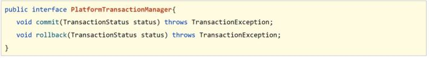
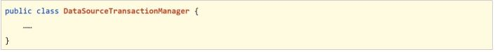
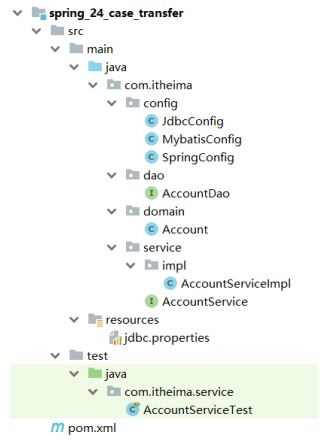
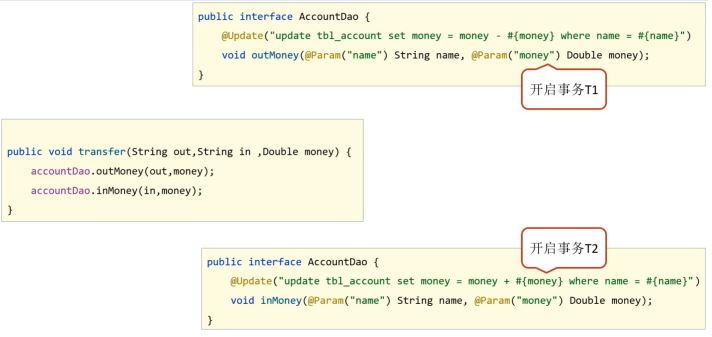
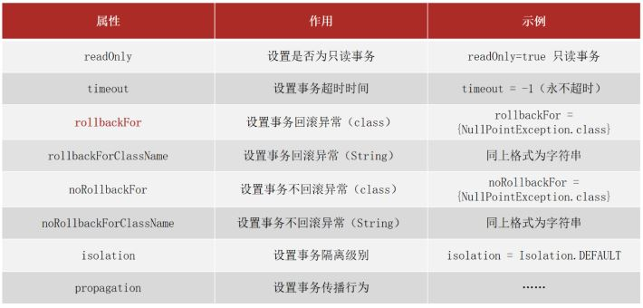
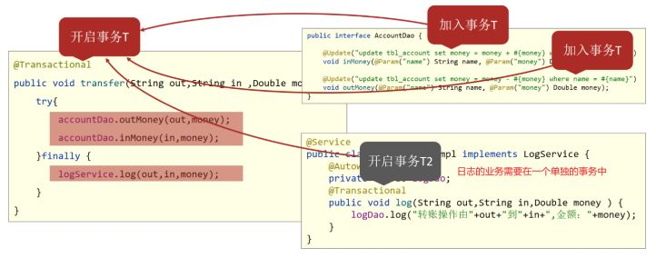
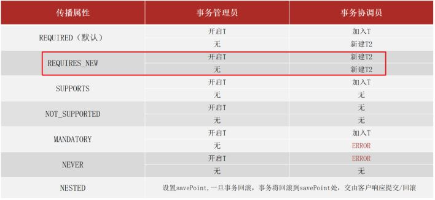

## Spring事务简介

### 相关概念介绍

* 事务作用：在数据层保障一系列的数据库操作同成功同失败
* Spring事务作用：在数据层或业务层保障一系列的数据库操作同成功同失败

数据层有事务我们可以理解，为什么业务层也需要处理事务呢?

举个简单的例子

* 转账业务会有两次数据层的调用，一次是加钱一次是减钱
* 把事务放在数据层，加钱和减钱就有两个事务
* 没办法保证加钱和减钱同时成功或者同时失败
* 这个时候就需要将事务放在业务层进行处理。

Spring为了管理事务，提供了一个平台事务管理器PlatformTransactionManager



commit是用来提交事务，rollback是用来回滚事务。

PlatformTransactionManager只是一个接口，Spring还为其提供了一个具体的实现:



从名称上可以看出，我们只需要给它一个DataSource对象，它就可以帮你去在业务层管理事务。其内部采用的是JDBC的事务。所以说如果你持久层采用的是JDBC相关的技术，就可以采用这个事务管理器来管理你的事务。而Mybatis内部采用的就是JDBC的事务，所以后期我们Spring整合Mybatis就采用的这个DataSourceTransactionManager事务管理器。

### 转账案例-需求分析

接下来通过一个案例来学习下Spring是如何来管理事务的。

先来分析下需求:

需求: 实现任意两个账户间转账操作

需求微缩: A账户减钱，B账户加钱

为了实现上述的业务需求，我们可以按照下面步骤来实现下:

1. 数据层提供基础操作，指定账户减钱（outMoney），指定账户加钱（inMoney）
2. 业务层提供转账操作（transfer），调用减钱与加钱的操作
3. 提供2个账号和操作金额执行转账操作
4. 基于Spring整合MyBatis环境搭建上述操作

### 转账案例-环境搭建

#### 步骤1:准备数据库表

之前我们在整合Mybatis的时候已经创建了这个表,可以直接使用

```
create database spring_db character set utf8;
use spring_db;
create table tbl_account(
    id int primary key auto_increment,
    name varchar(35),
    money double
);
insert into tbl_account values(1,'Tom',1000);
insert into tbl_account values(2,'Jerry',1000);
```

#### 步骤2:创建项目导入jar包

项目的pom.xml添加相关依赖

```
<dependencies>
    <dependency>
        <groupId>org.springframework</groupId>
        <artifactId>spring-context</artifactId>
        <version>5.2.10.RELEASE</version>
    </dependency>
    <dependency>
        <groupId>com.alibaba</groupId>
        <artifactId>druid</artifactId>
        <version>1.1.16</version>
    </dependency>
    <dependency>
        <groupId>org.mybatis</groupId>
        <artifactId>mybatis</artifactId>
        <version>3.5.6</version>
    </dependency>
    <dependency>
        <groupId>mysql</groupId>
        <artifactId>mysql-connector-java</artifactId>
        <version>5.1.47</version>
    </dependency>
    <dependency>
        <groupId>org.springframework</groupId>
        <artifactId>spring-jdbc</artifactId>
        <version>5.2.10.RELEASE</version>
    </dependency>
    <dependency>
        <groupId>org.mybatis</groupId>
        <artifactId>mybatis-spring</artifactId>
        <version>1.3.0</version>
    </dependency>
    <dependency>
        <groupId>junit</groupId>
        <artifactId>junit</artifactId>
        <version>4.12</version>
        <scope>test</scope>
    </dependency>
    <dependency>
        <groupId>org.springframework</groupId>
        <artifactId>spring-test</artifactId>
        <version>5.2.10.RELEASE</version>
    </dependency>
</dependencies>
```

#### 步骤3:根据表创建模型类

```
public class Account implements Serializable {
    private Integer id;
    private String name;
    private Double money;
//setter...getter...toString...方法略
}
```

#### 步骤4:创建Dao接口

```
public interface AccountDao {
    @Update("update tbl_account set money = money + #{money} where name = # {name}")
    void inMoney(@Param("name") String name, @Param("money") Double money);
    @Update("update tbl_account set money = money - #{money} where name = # {name}")
    void outMoney(@Param("name") String name, @Param("money") Double money);
}
```

#### 步骤5:创建Service接口和实现类

```
public interface AccountService {
    /**
     * 转账操作
     * @param out 传出方
     * @param in 转入方
     * @param money 金额
     */
    public void transfer(String out,String in ,Double money) ;
}
@Service
public class AccountServiceImpl implements AccountService {
    @Autowired
    private AccountDao accountDao;
    public void transfer(String out,String in ,Double money) {
        accountDao.outMoney(out,money);
        accountDao.inMoney(in,money);
    }
}
```

#### 步骤6:添加jdbc.properties文件

```
jdbc.driver=com.mysql.jdbc.Driver
jdbc.url=jdbc:mysql://localhost:3306/spring_db?useSSL=false
jdbc.username=root
jdbc.password=root
```

#### 步骤7:创建JdbcConfig配置类

```
public class JdbcConfig {
    @Value("${jdbc.driver}")
    private String driver;
    @Value("${jdbc.url}")
    private String url;
    @Value("${jdbc.username}")
    private String userName;
    @Value("${jdbc.password}")
    private String password;
    @Bean
    public DataSource dataSource(){
        DruidDataSource ds = new DruidDataSource();
        ds.setDriverClassName(driver);
        ds.setUrl(url);
        ds.setUsername(userName);
        ds.setPassword(password);
        return ds;
    }
}
```

#### 步骤8:创建MybatisConfig配置类

```
public class MybatisConfig {
    @Bean
    public SqlSessionFactoryBean sqlSessionFactory(DataSource dataSource){
        SqlSessionFactoryBean ssfb = new SqlSessionFactoryBean();
        ssfb.setTypeAliasesPackage("com.itheima.domain");
        ssfb.setDataSource(dataSource);
        return ssfb;
    }
    @Bean
    public MapperScannerConfigurer mapperScannerConfigurer(){
        MapperScannerConfigurer msc = new MapperScannerConfigurer();
        msc.setBasePackage("com.itheima.dao");
        return msc;
    }
}
```

#### 步骤9:创建SpringConfig配置类

```
@Configuration
@ComponentScan("com.itheima")
@PropertySource("classpath:jdbc.properties")
@Import({JdbcConfig.class,MybatisConfig.class})
public class SpringConfig {
}
```

#### 步骤10:编写测试类

```
@RunWith(SpringJUnit4ClassRunner.class)
@ContextConfiguration(classes = SpringConfig.class)
public class AccountServiceTest {
    @Autowired
    private AccountService accountService;
    @Test
    public void testTransfer() throws IOException {
        accountService.transfer("Tom","Jerry",100D);
    }
}
```

最终创建好的项目结构如下:



### 事务管理

上述环境，运行单元测试类，会执行转账操作，Tom的账户会减少100，Jerry的账户会加100。

这是正常情况下的运行结果，但是如果在转账的过程中出现了异常，如:

```
@Service
public class AccountServiceImpl implements AccountService {
    @Autowired
    private AccountDao accountDao;
    public void transfer(String out,String in ,Double money) {
        accountDao.outMoney(out,money);
        int i = 1/0;
        accountDao.inMoney(in,money);
    }
}
```

这个时候就模拟了转账过程中出现异常的情况，正确的操作应该是转账出问题了，Tom应该还是900，Jerry应该还是1100，但是真正运行后会发现，并没有像我们想象的那样，Tom账户为800而Jerry还是1100,100块钱凭空消息了，银行乐疯了。如果把转账换个顺序，银行就该哭了。

不管哪种情况，都是不允许出现的，对刚才的结果我们做一个分析:

1. 程序正常执行时，账户金额A减B加，没有问题
2. 程序出现异常后，转账失败，但是异常之前操作成功，异常之后操作失败，整体业务失败

当程序出问题后，我们需要让事务进行回滚，而且这个事务应该是加在业务层上，而Spring的事务管理就是用来解决这类问题的。

Spring事务管理具体的实现步骤为:

#### 步骤1:在需要被事务管理的方法上添加注解

```
public interface AccountService {
    /**
     * 转账操作
     * @param out 传出方
     * @param in 转入方
     * @param money 金额
     */
    //配置当前接口方法具有事务
    public void transfer(String out,String in ,Double money) ;
}
@Service
public class AccountServiceImpl implements AccountService {
    @Autowired
    private AccountDao accountDao;
    @Transactional
    public void transfer(String out,String in ,Double money) {
        accountDao.outMoney(out,money);
        int i = 1/0;
        accountDao.inMoney(in,money);
    }
}
```

**注意:**

@Transactional可以写在接口类上、接口方法上、实现类上和实现类方法上

* 写在接口类上，该接口的所有实现类的所有方法都会有事务
* 写在接口方法上，该接口的所有实现类的该方法都会有事务
* 写在实现类上，该类中的所有方法都会有事务
* 写在实现类方法上，该方法上有事务
* 建议写在实现类或实现类的方法上

#### 步骤2:在JdbcConfig类中配置事务管理器

```
public class JdbcConfig {
    @Value("${jdbc.driver}")
    private String driver;
    @Value("${jdbc.url}")
    private String url;
    @Value("${jdbc.username}")
    private String userName;
    @Value("${jdbc.password}")
    private String password;
    @Bean
    public DataSource dataSource(){
        DruidDataSource ds = new DruidDataSource();
        ds.setDriverClassName(driver);
        ds.setUrl(url);
        ds.setUsername(userName);
        ds.setPassword(password);
        return ds;
    }
    //配置事务管理器，mybatis使用的是jdbc事务
    @Bean
    public PlatformTransactionManager transactionManager(DataSource dataSource){
        DataSourceTransactionManager transactionManager = new DataSourceTransactionManager();
        transactionManager.setDataSource(dataSource);
        return transactionManager;
    }
}
```

注意：事务管理器要根据使用技术进行选择，Mybatis框架使用的是JDBC事务，可以直接使用DataSourceTransactionManager

#### 步骤3：开启事务注解

在SpringConfig的配置类中开启

```
@Configuration
@ComponentScan("com.itheima")
@PropertySource("classpath:jdbc.properties")
@Import({JdbcConfig.class,MybatisConfig.class
        //开启注解式事务驱动
        @EnableTransactionManagement
        public class SpringConfig {
}
```

#### 步骤4:运行测试类

会发现在转换的业务出现错误后，事务就可以控制回顾，保证数据的正确性。

**知识点1：@EnableTransactionManagement**

| 名称 | @EnableTransactionManagement           |
| ---- | -------------------------------------- |
| 类型 | 配置类注解                             |
| 位置 | 配置类定义上方                         |
| 作用 | 设置当前Spring环境中开启注解式事务支持 |

**知识点1：@Transactional**

| 名称 | @Transactional                                                                   |
| ---- | -------------------------------------------------------------------------------- |
| 类型 | 接口注解 类注解 方法注解                                                         |
| 位置 | 业务层接口上方 业务层实现类上方 业务方法上方                                     |
| 作用 | 为当前业务层方法添加事务（如果设置在类或接口上方则类或接口中所有方法均添加事务） |

## Spring事务角色

这节中我们重点要理解两个概念，分别是事务管理员和事务协调员。

未开启Spring事务之前:



* AccountDao的outMoney因为是修改操作，会开启一个事务T1
* AccountDao的inMoney因为是修改操作，会开启一个事务T2
* AccountService的transfer没有事务，
  * 运行过程中如果没有抛出异常，则T1和T2都正常提交，数据正确
  * 如果在两个方法中间抛出异常，T1因为执行成功提交事务，T2因为抛异常不会被执行
  * 就会导致数据出现错误

开启Spring的事务管理后


* transfer上添加了@Transactional注解，在该方法上就会有一个事务T
* AccountDao的outMoney方法的事务T1加入到transfer的事务T中
* AccountDao的inMoney方法的事务T2加入到transfer的事务T中
* 这样就保证他们在同一个事务中，当业务层中出现异常，整个事务就会回滚，保证数据的准确性。

通过上面例子的分析，我们就可以得到如下概念:

* 事务管理员：发起事务方，在Spring中通常指代业务层开启事务的方法
* 事务协调员：加入事务方，在Spring中通常指代数据层方法，也可以是业务层方法

**注意:**

目前的事务管理是基于DataSourceTransactionManager和SqlSessionFactoryBean使用的是同一个数据源。

## Spring事务属性

上一节我们介绍了两个概念，事务的管理员和事务的协同员，对于这两个概念具体做什么的，我们待会通过案例来使用下。除了这两个概念，还有就是事务的其他相关配置都有哪些，就是我们接下来要学习的内容。

在这一节中，我们主要学习三部分内容事务配置、转账业务追加日志、事务传播行为。

### 事务配置



上面这些属性都可以在@Transactional注解的参数上进行设置。

* readOnly：true只读事务，false读写事务，增删改要设为false,查询设为true。
* timeout:设置超时时间单位秒，在多长时间之内事务没有提交成功就自动回滚，-1表示不设置超时时间。
* rollbackFor:当出现指定异常进行事务回滚
* noRollbackFor:当出现指定异常不进行事务回滚
  * 思考:出现异常事务会自动回滚，这个是我们之前就已经知道的
  * noRollbackFor是设定对于指定的异常不回滚，这个好理解
  * rollbackFor是指定回滚异常，对于异常事务不应该都回滚么，为什么还要指定?
    * 这块需要更正一个知识点，并不是所有的异常都会回滚事务，比如下面的代码就不会回滚

      ```
      public interface AccountService {
          /**
           * 转账操作
           * @param out 传出方
           * @param in 转入方
           * @param money 金额
           */
          //配置当前接口方法具有事务
          public void transfer(String out,String in ,Double money) throws
                  IOException;
      }
      @Service
      public class AccountServiceImpl implements AccountService {
          @Autowired
          private AccountDao accountDao;
          @Transactional
          public void transfer(String out,String in ,Double money) throws
                  IOException{
              accountDao.outMoney(out,money);
              //int i = 1/0; //这个异常事务会回滚
              if(true){
                  throw new IOException(); //这个异常事务就不会回滚
              }
              accountDao.inMoney(in,money);
          }
      }
      ```

      出现这个问题的原因是，Spring的事务只会对Error异常和RuntimeException异常及其子类进行事务回顾，其他的异常类型是不会回滚的，对应IOException不符合上述条件所以不回滚
    * 此时就可以使用rollbackFor属性来设置出现IOException异常不回滚

      ```
      @Service
      public class AccountServiceImpl implements AccountService {
          @Autowired
          private AccountDao accountDao;
          @Transactional(rollbackFor = {IOException.class})
          public void transfer(String out,String in ,Double money) throws
                  IOException{
              accountDao.outMoney(out,money);
              //int i = 1/0; //这个异常事务会回滚
              if(true){
                  throw new IOException(); //这个异常事务就不会回滚
              }
              accountDao.inMoney(in,money);
          }
      }
      ```
* rollbackForClassName等同于rollbackFor,只不过属性为异常的类全名字符串
* noRollbackForClassName等同于noRollbackFor，只不过属性为异常的类全名字符串
* isolation设置事务的隔离级别
  * DEFAULT :默认隔离级别, 会采用数据库的隔离级别
  * READ_UNCOMMITTED : 读未提交
  * READ_COMMITTED : 读已提交
  * REPEATABLE_READ : 重复读取
  * SERIALIZABLE: 串行化

介绍完上述属性后，还有最后一个事务的传播行为，为了讲解该属性的设置，我们需要完成下面的案例。

### 转账业务追加日志案例

#### 需求分析

在前面的转案例的基础上添加新的需求，完成转账后记录日志。

* 需求：实现任意两个账户间转账操作，并对每次转账操作在数据库进行留痕
* 需求微缩：A账户减钱，B账户加钱，数据库记录日志

基于上述的业务需求，我们来分析下该如何实现:

1. 基于转账操作案例添加日志模块，实现数据库中记录日志
2. 业务层转账操作（transfer），调用减钱、加钱与记录日志功能

需要注意一点就是，我们这个案例的预期效果为:

**无论转账操作是否成功，均进行转账操作的日志留痕**

#### 环境准备

该环境是基于转账环境来完成的，所以环境的准备可以参考6.1.3的环境搭建步骤，在其基础上，我们
继续往下写

#### 步骤1:创建日志表

```
create table tbl_log(
    id int primary key auto_increment,
    info varchar(255),
    createDate datetime
)
```

#### 步骤2:添加LogDao接口

```
public interface LogDao {
    @Insert("insert into tbl_log (info,createDate) values(#{info},now())")
    void log(String info);
}
```

#### 步骤3:添加LogService接口与实现类

```
public interface LogService {
    void log(String out, String in, Double money);
}
@Service
public class LogServiceImpl implements LogService {
    @Autowired
    private LogDao logDao;
    @Transactional
    public void log(String out,String in,Double money ) {
        logDao.log("转账操作由"+out+"到"+in+",金额："+money);
    }
}
```

#### 步骤4:在转账的业务中添加记录日志

```
public interface AccountService {
    /**
     * 转账操作
     * @param out 传出方
     * @param in 转入方
     * @param money 金额
     */
//配置当前接口方法具有事务
    public void transfer(String out,String in ,Double money)throws
            IOException ;
}
@Service
public class AccountServiceImpl implements AccountService {
    @Autowired
    private AccountDao accountDao;
    @Autowired
    private LogService logService;
    @Transactional
    public void transfer(String out,String in ,Double money) {
        try{
            accountDao.outMoney(out,money);
            accountDao.inMoney(in,money);
        }finally {
            logService.log(out,in,money);
        }
    }
}
```

#### 步骤5:运行程序

* 当程序正常运行，tbl_account表中转账成功，tbl_log表中日志记录成功
* 当转账业务之间出现异常(int i =1/0),转账失败，tbl_account成功回滚，但是tbl_log表未添加数据
* 这个结果和我们想要的不一样，什么原因?该如何解决?
* 失败原因:日志的记录与转账操作隶属同一个事务，同成功同失败
* 最终效果:无论转账操作是否成功，日志必须保留

### 事务传播行为



对于上述案例的分析:

* log方法、inMoney方法和outMoney方法都属于增删改，分别有事务T1,T2,T3
* transfer因为加了@Transactional注解，也开启了事务T
* 前面我们讲过Spring事务会把T1,T2,T3都加入到事务T中
* 所以当转账失败后，所有的事务都回滚，导致日志没有记录下来
* 这和我们的需求不符，这个时候我们就想能不能让log方法单独是一个事务呢?

要想解决这个问题，就需要用到事务传播行为，所谓的事务传播行为指的是:

事务传播行为：事务协调员对事务管理员所携带事务的处理态度。

具体如何解决，就需要用到之前我们没有说的propagation属性。

#### 修改logService改变事务的传播行为

```
@Service
public class LogServiceImpl implements LogService {
    @Autowired
    private LogDao logDao;
    //propagation设置事务属性：传播行为设置为当前操作需要新事务
    @Transactional(propagation = Propagation.REQUIRES_NEW)
    public void log(String out,String in,Double money ) {
        logDao.log("转账操作由"+out+"到"+in+",金额："+money);
    }
}
```

运行后，就能实现我们想要的结果，不管转账是否成功，都会记录日志。

#### 事务传播行为的可选值



对于我们开发实际中使用的话，因为默认值需要事务是常态的。根据开发过程选择其他的就可以了，例如案例中需要新事务就需要手工配置。其实入账和出账操作上也有事务，采用的就是默认值。
