## 学习内容总结

SpringMVC是隶属于Spring框架的一部分，主要是用来进行Web开发，是对Servlet进行了封装。对于SpringMVC我们主要学习如下内容:

* SpringMVC简介
* 请求与响应
* REST风格
* SSM整合(注解版)
* 拦截器

SpringMVC是处于Web层的框架，所以其主要的作用就是用来接收前端发过来的请求和数据然后经过处理并将处理的结果响应给前端，所以如何处理请求和响应是SpringMVC中非常重要的一块内容。

REST是一种软件架构风格，可以降低开发的复杂性，提高系统的可伸缩性，后期的应用也是非常广泛。

SSM整合是把咱们所学习的SpringMVC+Spring+Mybatis整合在一起来完成业务开发，是对我们所学习这三个框架的一个综合应用。

对于SpringMVC的学习，最终要达成的目标:

* 掌握基于SpringMVC获取请求参数和响应json数据操作
* 熟练应用基于REST风格的请求路径设置与参数传递
* 能够根据实际业务建立前后端开发通信协议并进行实现
* 基于SSM整合技术开发任意业务模块功能

## SpringMVC概述

学习SpringMVC我们先来回顾下现在web程序是如何做的，咱们现在web程序大都基于三层架构来实现。

三层架构

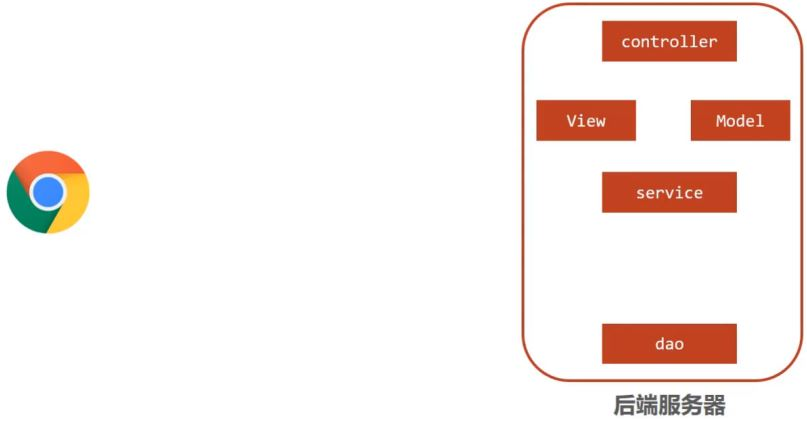

* 浏览器发送一个请求给后端服务器，后端服务器现在是使用Servlet来接收请求和数据
* 如果所有的处理都交给Servlet来处理的话，所有的东西都耦合在一起，对后期的维护和扩展极为不利
* 将后端服务器Servlet拆分成三层，分别是web、service和dao
  * web层主要由servlet来处理，负责页面请求和数据的收集以及响应结果给前端
  * service层主要负责业务逻辑的处理
  * dao层主要负责数据的增删改查操作
* servlet处理请求和数据的时候，存在的问题是一个servlet只能处理一个请求
* 针对web层进行了优化，采用了MVC设计模式，将其设计为controller、view和Model
  * controller负责请求和数据的接收，接收后将其转发给service进行业务处理
  * service根据需要会调用dao对数据进行增删改查
  * dao把数据处理完后将结果交给service,service再交给controller
  * controller根据需求组装成Model和View,Model和View组合起来生成页面转发给前端浏览器
  * 这样做的好处就是controller可以处理多个请求，并对请求进行分发，执行不同的业务操作。

随着互联网的发展，上面的模式因为是同步调用，性能慢慢的跟不是需求，所以异步调用慢慢的走到了前台，是现在比较流行的一种处理方式。

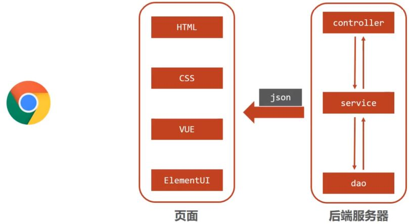

* 因为是异步调用，所以后端不需要返回view视图，将其去除
* 前端如果通过异步调用的方式进行交互，后台就需要将返回的数据转换成json格式进行返回
* SpringMVC主要负责的就是
  * controller如何接收请求和数据
  * 如何将请求和数据转发给业务层
  * 如何将响应数据转换成json发回到前端

介绍了这么多，对SpringMVC进行一个定义

* SpringMVC是一种基于Java实现MVC模型的轻量级Web框架
* 优点
  * 使用简单、开发便捷(相比于Servlet)
  * 灵活性强

这里所说的优点，就需要我们在使用的过程中慢慢体会。

## SpringMVC入门案例

因为SpringMVC是一个Web框架，将来是要替换Servlet,所以先来回顾下以前Servlet是如何进行开发的?

* 创建web工程(Maven结构)
* 设置tomcat服务器，加载web工程(tomcat插件)
* 导入坐标(Servlet)
* 定义处理请求的功能类(UserServlet)
* 设置请求映射(配置映射关系)

SpringMVC的制作过程和上述流程几乎是一致的，具体的实现流程是什么?

* 创建web工程(Maven结构)
* 设置tomcat服务器，加载web工程(tomcat插件)
* 导入坐标(SpringMVC+Servlet)
* 定义处理请求的功能类(UserController)
* 设置请求映射(配置映射关系)
* 将SpringMVC设定加载到Tomcat容器中

### 需求分析

#### 案例制作

##### 步骤1:创建Maven项目

打开IDEA,创建一个新的web项目

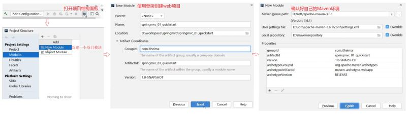

##### 步骤2:补全目录结构

因为使用骨架创建的项目结构不完整，需要手动补全

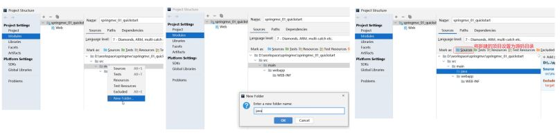

##### 步骤3:导入jar包

将pom.xml中多余的内容删除掉，再添加SpringMVC需要的依赖

```
<?xml version="1.0" encoding="UTF-8"?>
<project xmlns="http://maven.apache.org/POM/4.0.0"
         xmlns:xsi="http://www.w3.org/2001/XMLSchema-instance"
         xsi:schemaLocation="http://maven.apache.org/POM/4.0.0
http://maven.apache.org/xsd/maven-4.0.0.xsd">
    <modelVersion>4.0.0</modelVersion>
    <groupId>com.itheima</groupId>
    <artifactId>springmvc_01_quickstart</artifactId>
    <version>1.0-SNAPSHOT</version>
    <packaging>war</packaging>
    <dependencies>
        <dependency>
            <groupId>javax.servlet</groupId>
            <artifactId>javax.servlet-api</artifactId>
            <version>3.1.0</version>
            <scope>provided</scope>
        </dependency>
        <dependency>
            <groupId>org.springframework</groupId>
            <artifactId>spring-webmvc</artifactId>
            <version>5.2.10.RELEASE</version>
        </dependency>
    </dependencies>
    <build>
        <plugins>
            <plugin>
                <groupId>org.apache.tomcat.maven</groupId>
                <artifactId>tomcat7-maven-plugin</artifactId>
                <version>2.1</version>
                <configuration>
                    <port>80</port>
                    <path>/</path>
                </configuration>
            </plugin>
        </plugins>
    </build>
</project>
```

说明:servlet的坐标为什么需要添加provided ?

* scope是maven中jar包依赖作用范围的描述，
* 如果不设置默认是compile在在编译、运行、测试时均有效
* 如果运行有效的话就会和tomcat中的servlet-api包发生冲突，导致启动报错
* provided代表的是该包只在编译和测试的时候用，运行的时候无效直接使用tomcat中的，就避免冲突

##### 步骤4:创建配置类

```
@Configuration
@ComponentScan("com.itheima.controller")
public class SpringMvcConfig {
}
```

##### 步骤5:创建Controller类

```
@Controller
public class UserController {
    @RequestMapping("/save")
    public void save(){
        System.out.println("user save ...");
    }
}
```

##### 步骤6:使用配置类替换web.xml

将web.xml删除，换成ServletContainersInitConfig

```
public class ServletContainersInitConfig extends AbstractDispatcherServletInitializer {
    //加载springmvc配置类
    protected WebApplicationContext createServletApplicationContext() {
        //初始化WebApplicationContext对象
        AnnotationConfigWebApplicationContext ctx = new AnnotationConfigWebApplicationContext();
        //加载指定配置类
        ctx.register(SpringMvcConfig.class);
        return ctx;
    }
    //设置由springmvc控制器处理的请求映射路径
    protected String[] getServletMappings() {
        return new String[]{"/"};
    }
    //加载spring配置类
    protected WebApplicationContext createRootApplicationContext() {
        return null;
    }
}
```

##### 步骤7:配置Tomcat环境

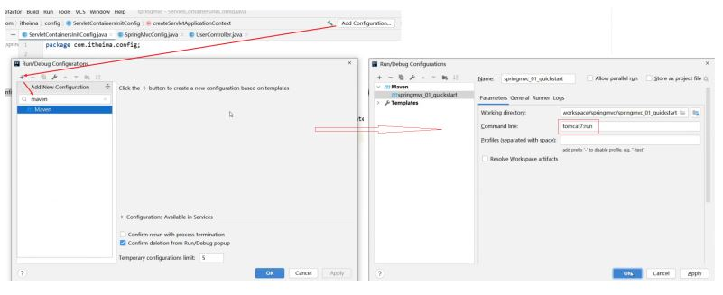

##### 步骤8:启动运行项目

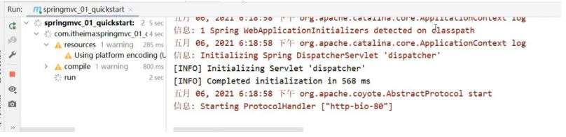

##### 步骤9:浏览器访问

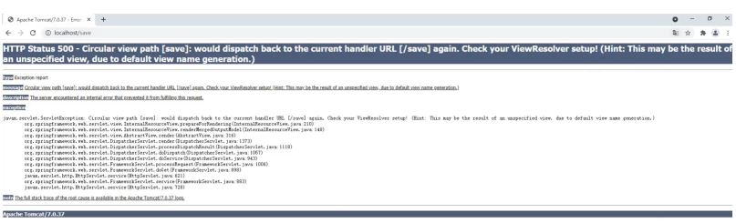

页面报错的原因是后台没有指定返回的页面，目前只需要关注控制台看user save ...有没有被执行即可。

##### 步骤10:修改Controller返回值解决上述问题

前面我们说过现在主要的是前端发送异步请求，后台响应json数据，所以接下来我们把Controller类的save方法进行修改

```
@Controller
public class UserController {
    @RequestMapping("/save")
    public String save(){
        System.out.println("user save ...");
        return "{'info':'springmvc'}";
    }
}
```

再次重启tomcat服务器，然后重新通过浏览器测试访问,会发现还是会报错，这次的错是404

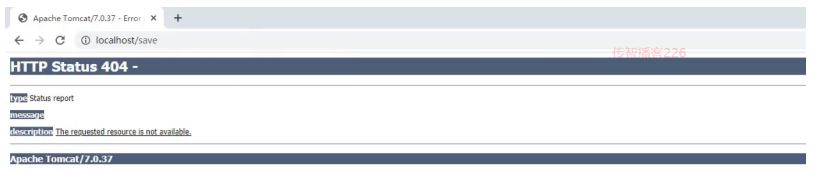

出错的原因是，如果方法直接返回字符串，springmvc会把字符串当成页面的名称在项目中进行查找返回，因为不存在对应返回值名称的页面，所以会报404错误，找不到资源。而我们其实是想要直接返回的是json数据，具体如何修改呢?

##### 步骤11:设置返回数据为json

```
@Controller
public class UserController {
    @RequestMapping("/save")
    @ResponseBody
    public String save(){
        System.out.println("user save ...");
        return "{'info':'springmvc'}";
    }
}
```

再次重启tomcat服务器，然后重新通过浏览器测试访问，就能看到返回的结果数据

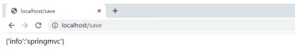

至此SpringMVC的入门案例就已经完成。

**注意事项**

* SpringMVC是基于Spring的，在pom.xml只导入了spring-webmvc jar包的原因是它会自动依赖spring相关坐标
* AbstractDispatcherServletInitializer类是SpringMVC提供的快速初始化Web3.0容器的抽象类
* AbstractDispatcherServletInitializer提供了三个接口方法供用户实现
  * createServletApplicationContext方法，创建Servlet容器时，加载SpringMVC对应的bean并放入WebApplicationContext对象范围中，而WebApplicationContext的作用范围为ServletContext范围，即整个web容器范围
  * getServletMappings方法，设定SpringMVC对应的请求映射路径，即SpringMVC拦截哪些请求
  * createRootApplicationContext方法，如果创建Servlet容器时需要加载非SpringMVC对应的bean,使用当前方法进行，使用方式和createServletApplicationContext相同。
  * createServletApplicationContext用来加载SpringMVC环境
  * createRootApplicationContext用来加载Spring环境

**知识点1：@Controller**

| 名称 | @Controller                   |
| ---- | ----------------------------- |
| 类型 | 类注解                        |
| 位置 | SpringMVC控制器类定义上方     |
| 作用 | 设定SpringMVC的核心控制器bean |

**知识点2：@RequestMapping**

| 名称     | @RequestMapping                 |
| -------- | ------------------------------- |
| 类型     | 类注解或方法注解                |
| 位置     | SpringMVC控制器类或方法定义上方 |
| 作用     | 设置当前控制器方法请求访问路径  |
| 相关属性 | value(默认)，请求访问路径       |

**知识点3：@ResponseBody**

| 名称 | @ResponseBody                                    |
| ---- | ------------------------------------------------ |
| 类型 | 类注解或方法注解                                 |
| 位置 | SpringMVC控制器类或方法定义上方                  |
| 作用 | 设置当前控制器方法响应内容为当前返回值，无需解析 |

## 入门案例总结

* 一次性工作
  * 创建工程，设置服务器，加载工程
  * 导入坐标
  * 创建web容器启动类，加载SpringMVC配置，并设置SpringMVC请求拦截路径
  * SpringMVC核心配置类（设置配置类，扫描controller包，加载Controller控制器bean）
* 多次工作
  * 定义处理请求的控制器类
  * 定义处理请求的控制器方法，并配置映射路径（@RequestMapping）与返回json数据@ResponseBody）

## 工作流程解析

为了更好的使用SpringMVC,我们将SpringMVC的使用过程总共分两个阶段来分析，分别是启动服务器初始化过程和单次请求过程

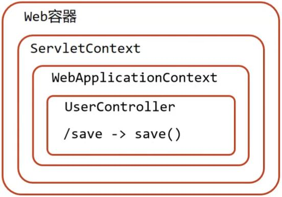

### 启动服务器初始化过程

1. 服务器启动，执行ServletContainersInitConfig类，初始化web容器
   功能类似于以前的web.xml
2. 执行createServletApplicationContext方法，创建了WebApplicationContext对象
   该方法加载SpringMVC的配置类SpringMvcConfig来初始化SpringMVC的容器
3. 加载SpringMvcConfig配置类
4. 执行@ComponentScan加载对应的bean
   扫描指定包及其子包下所有类上的注解，如Controller类上的@Controller注解
5. 加载UserController，每个@RequestMapping的名称对应一个具体的方法

   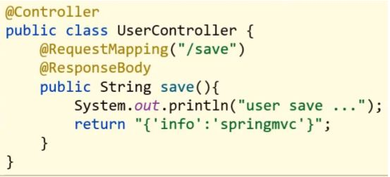

   此时就建立了 /save 和 save方法的对应关系
6. 执行getServletMappings方法，设定SpringMVC拦截请求的路径规则

   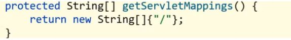

   /代表所拦截请求的路径规则，只有被拦截后才能交给SpringMVC来处理请求

### 单次请求过程

1. 发送请求http://localhost/save
2. web容器发现该请求满足SpringMVC拦截规则，将请求交给SpringMVC处理
3. 解析请求路径/save
4. 由/save匹配执行对应的方法save(）上面的第五步已经将请求路径和方法建立了对应关系，通过/save就能找到对应的save方法
5. 执行save()
6. 检测到有@ResponseBody直接将save()方法的返回值作为响应体返回给请求方

## bean加载控制

### 问题分析

入门案例的内容已经做完了，在入门案例中我们创建过一个SpringMvcConfig的配置类，再回想前面咱们学习Spring的时候也创建过一个配置类SpringConfig。这两个配置类都需要加载资源，那么它们分别都需要加载哪些内容?

我们先来看下目前我们的项目目录结构:

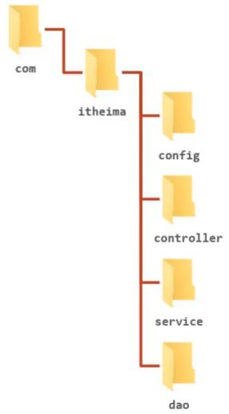

* config目录存入的是配置类,写过的配置类有:
  * ServletContainersInitConfig
  * SpringConfig
  * SpringMvcConfig
  * JdbcConfig
  * MybatisConfig
* controller目录存放的是SpringMVC的controller类
* service目录存放的是service接口和实现类
* dao目录存放的是dao/Mapper接口

controller、service和dao这些类都需要被容器管理成bean对象，那么到底是该让SpringMVC加载还是让Spring加载呢?

* SpringMVC加载其相关bean(表现层bean),也就是controller包下的类
* Spring控制的bean
  * 业务bean(Service)
  * 功能bean(DataSource,SqlSessionFactoryBean,MapperScannerConfigurer等)

分析清楚谁该管哪些bean以后，接下来要解决的问题是如何让Spring和SpringMVC分开加载各自的内容。

在SpringMVC的配置类SpringMvcConfig中使用注解@ComponentScan，我们只需要将其扫描范围设置到controller即可，如

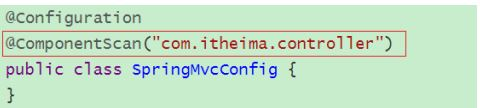

在Spring的配置类SpringConfig中使用注解@ComponentScan ,当时扫描的范围中其实是已经包含了controller,如:

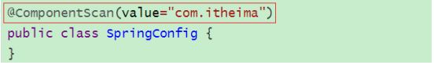

从包结构来看的话，Spring已经多把SpringMVC的controller类也给扫描到，所以针对这个问题

该如何解决，就是咱们接下来要学习的内容。

概括的描述下咱们现在的问题就是因为功能不同，如何避免Spring错误加载到SpringMVC的bean?

### 思路分析

针对上面的问题，解决方案也比较简单，就是:

* 加载Spring控制的bean的时候排除掉SpringMVC控制的bean

具体该如何排除：

* 方式一:Spring加载的bean设定扫描范围为精准范围，例如service包、dao包等
* 方式二:Spring加载的bean设定扫描范围为com.itheima,排除掉controller包中的bean
* 方式三:不区分Spring与SpringMVC的环境，加载到同一个环境中[了解即可]

### **环境准备**

* 创建一个Web的Maven项目
* pom.xml添加Spring依赖

  ```
  <?xml version="1.0" encoding="UTF-8"?>
  <project xmlns="http://maven.apache.org/POM/4.0.0"
           xmlns:xsi="http://www.w3.org/2001/XMLSchema-instance"
           xsi:schemaLocation="http://maven.apache.org/POM/4.0.0
  http://maven.apache.org/xsd/maven-4.0.0.xsd">
      <modelVersion>4.0.0</modelVersion>
      <groupId>com.itheima</groupId>
      <artifactId>springmvc_02_bean_load</artifactId>
      <version>1.0-SNAPSHOT</version>
      <packaging>war</packaging>
      <dependencies>
          <dependency>
              <groupId>javax.servlet</groupId>
              <artifactId>javax.servlet-api</artifactId>
              <version>3.1.0</version>
              <scope>provided</scope>
          </dependency>
          <dependency>
              <groupId>org.springframework</groupId>
              <artifactId>spring-webmvc</artifactId>
              <version>5.2.10.RELEASE</version>
          </dependency>
          <dependency>
              <groupId>com.alibaba</groupId>
              <artifactId>druid</artifactId>
              <version>1.1.16</version>
          </dependency>
          <dependency>
              <groupId>org.mybatis</groupId>
              <artifactId>mybatis</artifactId>
              <version>3.5.6</version>
          </dependency>
          <dependency>
              <groupId>mysql</groupId>
              <artifactId>mysql-connector-java</artifactId>
              <version>5.1.47</version>
          </dependency>
          <dependency>
              <groupId>org.springframework</groupId>
              <artifactId>spring-jdbc</artifactId>
              <version>5.2.10.RELEASE</version>
          </dependency>
          <dependency>
              <groupId>org.mybatis</groupId>
              <artifactId>mybatis-spring</artifactId>
              <version>1.3.0</version>
          </dependency>
      </dependencies>
      <build>
          <plugins>
              <plugin>
                  <groupId>org.apache.tomcat.maven</groupId>
                  <artifactId>tomcat7-maven-plugin</artifactId>
                  <version>2.1</version>
                  <configuration>
                      <port>80</port>
                      <path>/</path>
                  </configuration>
              </plugin>
          </plugins>
      </build>
  </project>
  ```
* 创建对应的配置类

  ```
  public class ServletContainersInitConfig extends
          AbstractDispatcherServletInitializer {
      protected WebApplicationContext createServletApplicationContext() {
          AnnotationConfigWebApplicationContext ctx = new
                  AnnotationConfigWebApplicationContext();
          ctx.register(SpringMvcConfig.class);
          return ctx;
      }
      protected String[] getServletMappings() {
          return new String[]{"/"};
      }
      protected WebApplicationContext createRootApplicationContext() {
          return null;
      }
  }
  @Configuration
  @ComponentScan("com.itheima.controller")
  public class SpringMvcConfig {
  }
  @Configuration
  @ComponentScan("com.itheima")
  public class SpringConfig {
  }
  ```
* 编写Controller，Service，Dao，Domain类

  ```
  @Controller
  public class UserController {
      @RequestMapping("/save")
      @ResponseBody
      public String save(){
          System.out.println("user save ...");
          return "{'info':'springmvc'}";
      }
  }
  public interface UserService {
      public void save(User user);
  }
  @Service
  public class UserServiceImpl implements UserService {
      public void save(User user) {
          System.out.println("user service ...");
      }
  }
  public interface UserDao {
      @Insert("insert into tbl_user(name,age)values(#{name},#{age})")
      public void save(User user);
  }
  public class User {
      private Integer id;
      private String name;
      private Integer age;
  //setter..getter..toString略
  }
  ```

最终创建好的项目结构如下:

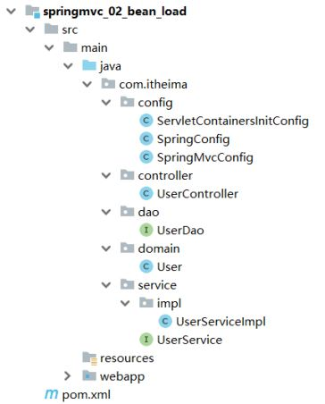

### 设置bean加载控制

方式一:修改Spring配置类，设定扫描范围为精准范围。

```
@Configuration
@ComponentScan({"com.itheima.service","comitheima.dao"})
public class SpringConfig {
}
```

**说明:**

上述只是通过例子说明可以精确指定让Spring扫描对应的包结构，真正在做开发的时候，因为Dao最终是交给MapperScannerConfigurer对象来进行扫描处理的，我们只需要将其扫描到service包即可。

方式二:修改Spring配置类，设定扫描范围为com.itheima,排除掉controller包中的bean

```
@Configuration
@ComponentScan(value="com.itheima",
        excludeFilters=@ComponentScan.Filter(
                type = FilterType.ANNOTATION,
                classes = Controller.class
        )
)
public class SpringConfig {
}
```

* excludeFilters属性：设置扫描加载bean时，排除的过滤规则
* type属性：设置排除规则，当前使用按照bean定义时的注解类型进行排除
  * ANNOTATION：按照注解排除
  * ASSIGNABLE_TYPE:按照指定的类型过滤
  * ASPECTJ:按照Aspectj表达式排除，基本上不会用
  * REGEX:按照正则表达式排除
  * CUSTOM:按照自定义规则排除
* classes属性：设置排除的具体注解类，当前设置排除@Controller定义的bean

如何测试controller类已经被排除掉了?

```
public class App{
    public static void main (String[] args){
        AnnotationConfigApplicationContext ctx = new
                AnnotationConfigApplicationContext(SpringConfig.class);
        System.out.println(ctx.getBean(UserController.class));
    }
}
```

如果被排除了，该方法执行就会报bean未被定义的错误

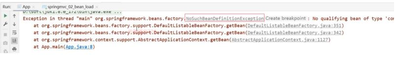

> 注意:测试的时候，需要把SpringMvcConfig配置类上的@ComponentScan注解注释掉，否则不会报错

出现问题的原因是，

* Spring配置类扫描的包是com.itheima
* SpringMVC的配置类，SpringMvcConfig上有一个@Configuration注解，也会被Spring扫描到
* SpringMvcConfig上又有一个@ComponentScan，把controller类又给扫描进来了
* 所以如果不把@ComponentScan注释掉，Spring配置类将Controller排除，但是因为扫描到
* SpringMVC的配置类，又将其加载回来，演示的效果就出不来
* 解决方案，也简单，把SpringMVC的配置类移出Spring配置类的扫描范围即可。

最后一个问题，有了Spring的配置类，要想在tomcat服务器启动将其加载，我们需要修改ServletContainersInitConfig

```
public class ServletContainersInitConfig extends
        AbstractDispatcherServletInitializer {
    protected WebApplicationContext createServletApplicationContext() {
        AnnotationConfigWebApplicationContext ctx = new
                AnnotationConfigWebApplicationContext();
        ctx.register(SpringMvcConfig.class);
        return ctx;
    }
    protected String[] getServletMappings() {
        return new String[]{"/"};
    }
    protected WebApplicationContext createRootApplicationContext() {
        AnnotationConfigWebApplicationContext ctx = new
                AnnotationConfigWebApplicationContext();
        ctx.register(SpringConfig.class);
        return ctx;
    }
}
```

对于上述的配置方式，Spring还提供了一种更简单的配置方式，可以不用再去创建AnnotationConfigWebApplicationContext对象，不用手动register对应的配置类，如何实现?

```
public class ServletContainersInitConfig extends
        AbstractAnnotationConfigDispatcherServletInitializer {
    protected Class<?>[] getRootConfigClasses() {
        return new Class[]{SpringConfig.class};
    }
    protected Class<?>[] getServletConfigClasses() {
        return new Class[]{SpringMvcConfig.class};
    }
    protected String[] getServletMappings() {
        return new String[]{"/"};
    }
}
```

**知识点1：@ComponentScan**

| 名称     | @ComponentScan                                                                                                                                      |
| -------- | --------------------------------------------------------------------------------------------------------------------------------------------------- |
| 类型     | 类注解                                                                                                                                              |
| 位置     | 类定义上方                                                                                                                                          |
| 作用     | 设置spring配置类扫描路径，用于加载使用注解格式定义的bean                                                                                            |
| 相关属性 | excludeFilters:排除扫描路径中加载的bean,需要指定类别(type)和具体项(classes)<br />includeFilters:加载指定的bean，需要指定类别(type)和具体项(classes) |
