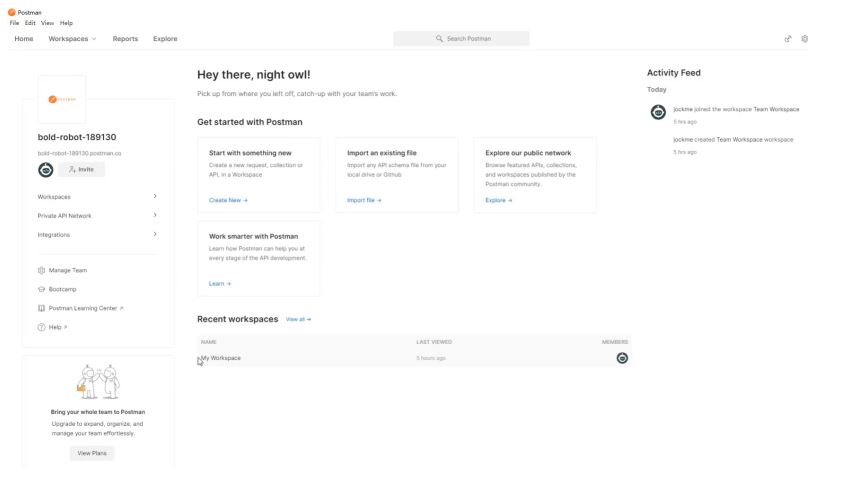
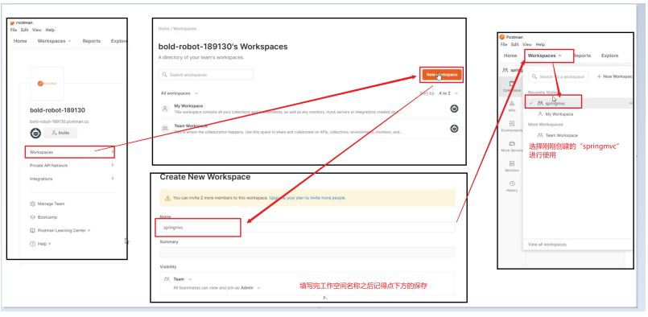
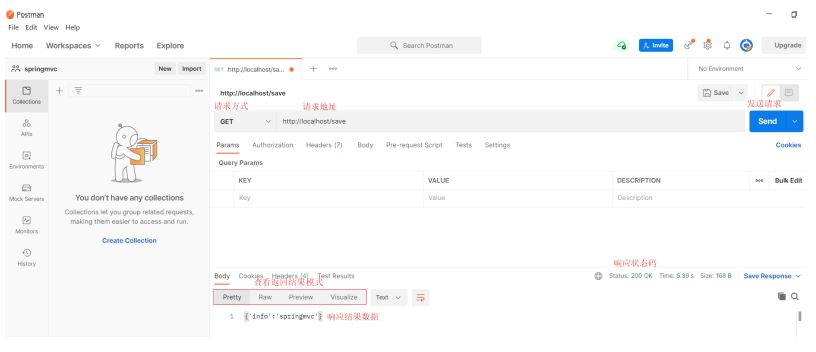
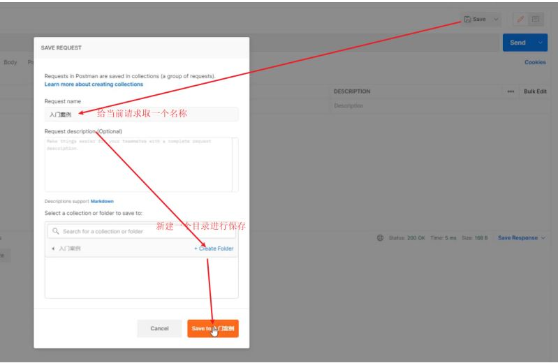

## PostMan简介

代码编写完后，我们要想测试，只需要打开浏览器直接输入地址发送请求即可。发送的是GET请求可以直接使用浏览器，但是如果要发送的是POST请求呢?

如果要求发送的是post请求，我们就得准备页面在页面上准备form表单，测试起来比较麻烦。所以我们就需要借助一些第三方工具，如PostMan.

* PostMan是一款功能强大的网页调试与发送网页HTTP请求的Chrome插件。
* 作用：常用于进行接口测试

## PostMan安装

下载地址：`https://www.postman.com/downloads/`

看到如下界面，就说明已经安装成功。

## PostMan使用

### 创建WorkSpace工作空间

### 发送请求

### 保存当前请求

注意:第一次请求需要创建一个新的目录，后面就不需要创建新目录，直接保存到已经创建好的目录即可。
