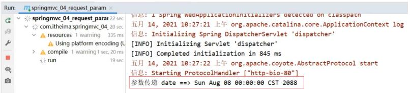

前面我们已经完成了入门案例相关的知识学习，接来了我们就需要针对SpringMVC相关的知识点进行系统的学习，之前我们提到过，SpringMVC是web层的框架，主要的作用是接收请求、接收数据、响应结果，所以这一章节是学习SpringMVC的重点内容，我们主要会讲解四部分内容:

* 请求映射路径
* 请求参数
* 日期类型参数传递
* 响应json数据

## 设置请求映射路径

### 环境准备

* 创建一个Web的Maven项目
* pom.xml添加Spring依赖

  ```
  <?xml version="1.0" encoding="UTF-8"?>
  <project xmlns="http://maven.apache.org/POM/4.0.0"
           xmlns:xsi="http://www.w3.org/2001/XMLSchema-instance"
           xsi:schemaLocation="http://maven.apache.org/POM/4.0.0
  http://maven.apache.org/xsd/maven-4.0.0.xsd">
      <modelVersion>4.0.0</modelVersion>
      <groupId>com.itheima</groupId>
      <artifactId>springmvc_03_request_mapping</artifactId>
      <version>1.0-SNAPSHOT</version>
      <packaging>war</packaging>
      <dependencies>
          <dependency>
              <groupId>javax.servlet</groupId>
              <artifactId>javax.servlet-api</artifactId>
              <version>3.1.0</version>
              <scope>provided</scope>
          </dependency>
          <dependency>
              <groupId>org.springframework</groupId>
              <artifactId>spring-webmvc</artifactId>
              <version>5.2.10.RELEASE</version>
          </dependency>
      </dependencies>
      <build>
          <plugins>
              <plugin>
                  <groupId>org.apache.tomcat.maven</groupId>
                  <artifactId>tomcat7-maven-plugin</artifactId>
                  <version>2.1</version>
                  <configuration>
                      <port>80</port>
                      <path>/</path>
                  </configuration>
              </plugin>
          </plugins>
      </build>
  </project>
  ```
* 创建对应的配置类

  ```
  public class ServletContainersInitConfig extends
          AbstractAnnotationConfigDispatcherServletInitializer {
      protected Class<?>[] getServletConfigClasses() {
          return new Class[]{SpringMvcConfig.class};
      }
      protected String[] getServletMappings() {
          return new String[]{"/"};
      }
      protected Class<?>[] getRootConfigClasses() {
          return new Class[0];
      }
  }
  @Configuration
  @ComponentScan("com.itheima.controller")
  public class SpringMvcConfig {
  }
  ```
* 编写BookController和UserController

  ```
  @Controller
  public class UserController {
      @RequestMapping("/save")
      @ResponseBody
      public String save(){
          System.out.println("user save ...");
          return "{'module':'user save'}";
      }
      @RequestMapping("/delete")
      @ResponseBody
      public String save(){
          System.out.println("user delete ...");
          return "{'module':'user delete'}";
      }
  }
  @Controller
  public class BookController {
      @RequestMapping("/save")
      @ResponseBody
      public String save(){
          System.out.println("book save ...");
          return "{'module':'book save'}";
      }
  }
  ```

最终创建好的项目结构如下:


把环境准备好后，启动Tomcat服务器，后台会报错：


从错误信息可以看出:

* UserController有一个save方法，访问路径为http://localhost/save
* BookController也有一个save方法，访问路径为http://localhost/save
* 当访问http://localhost/saved的时候，到底是访问UserController还是BookController?

### 问题分析

团队多人开发，每人设置不同的请求路径，冲突问题该如何解决?

解决思路:为不同模块设置模块名作为请求路径前置

对于Book模块的save,将其访问路径设置http://localhost/book/save

对于User模块的save,将其访问路径设置http://localhost/user/save

这样在同一个模块中出现命名冲突的情况就比较少了。

### 设置映射路径

#### 步骤1:修改Controller

```
@Controller
public class UserController {
    @RequestMapping("/user/save")
    @ResponseBody
    public String save(){
        System.out.println("user save ...");
        return "{'module':'user save'}";
    }
    @RequestMapping("/user/delete")
    @ResponseBody
    public String save(){
        System.out.println("user delete ...");
        return "{'module':'user delete'}";
    }
}
@Controller
public class BookController {
    @RequestMapping("/book/save")
    @ResponseBody
    public String save(){
        System.out.println("book save ...");
        return "{'module':'book save'}";
    }
}
```

问题是解决了，但是每个方法前面都需要进行修改，写起来比较麻烦而且还有很多重复代码，如果/user后期发生变化，所有的方法都需要改，耦合度太高。

#### 步骤2:优化路径配置

优化方案:

```
@Controller
@RequestMapping("/user")
public class UserController {
    @RequestMapping("/save")
    @ResponseBody
    public String save(){
        System.out.println("user save ...");
        return "{'module':'user save'}";
    }
    @RequestMapping("/delete")
    @ResponseBody
    public String save(){
        System.out.println("user delete ...");
        return "{'module':'user delete'}";
    }
}
@Controller
@RequestMapping("/book")
public class BookController {
    @RequestMapping("/save")
    @ResponseBody
    public String save(){
        System.out.println("book save ...");
        return "{'module':'book save'}";
    }
}
```

**注意:**

* 当类上和方法上都添加了@RequestMapping注解，前端发送请求的时候，要和两个注解的value值相加匹配才能访问到。
* @RequestMapping注解value属性前面加不加/都可以

扩展小知识:

对于PostMan如何觉得字小不好看，可以使用ctrl+=调大，ctrl+-调小。

## 请求参数

请求路径设置好后，只要确保页面发送请求地址和后台Controller类中配置的路径一致，就可以接收到前端的请求，接收到请求后，如何接收页面传递的参数?

关于请求参数的传递与接收是和请求方式有关系的，目前比较常见的两种请求方式为：

* GET
* POST

针对于不同的请求前端如何发送，后端如何接收?

### 环境准备

* 创建一个Web的Maven项目
* pom.xml添加Spring依赖

  ```
  <?xml version="1.0" encoding="UTF-8"?>
  <project xmlns="http://maven.apache.org/POM/4.0.0"
           xmlns:xsi="http://www.w3.org/2001/XMLSchema-instance"
           xsi:schemaLocation="http://maven.apache.org/POM/4.0.0
  http://maven.apache.org/xsd/maven-4.0.0.xsd">
      <modelVersion>4.0.0</modelVersion>
      <groupId>com.itheima</groupId>
      <artifactId>springmvc_03_request_mapping</artifactId>
      <version>1.0-SNAPSHOT</version>
      <packaging>war</packaging>
      <dependencies>
          <dependency>
              <groupId>javax.servlet</groupId>
              <artifactId>javax.servlet-api</artifactId>
              <version>3.1.0</version>
              <scope>provided</scope>
          </dependency>
          <dependency>
              <groupId>org.springframework</groupId>
              <artifactId>spring-webmvc</artifactId>
              <version>5.2.10.RELEASE</version>
          </dependency>
      </dependencies>
      <build>
          <plugins>
              <plugin>
                  <groupId>org.apache.tomcat.maven</groupId>
                  <artifactId>tomcat7-maven-plugin</artifactId>
                  <version>2.1</version>
                  <configuration>
                      <port>80</port>
                      <path>/</path>
                  </configuration>
              </plugin>
          </plugins>
      </build>
  </project>
  ```
* 创建对应的配置类

  ```
  public class ServletContainersInitConfig extends
          AbstractAnnotationConfigDispatcherServletInitializer {
      protected Class<?>[] getServletConfigClasses() {
          return new Class[]{SpringMvcConfig.class};
      }
      protected String[] getServletMappings() {
      return new String[]{"/"};
      }
      protected Class<?>[] getRootConfigClasses() {
          return new Class[0];
      }
  }
  @Configuration
  @ComponentScan("com.itheima.controller")
  public class SpringMvcConfig {
  }
  ```
* 编写UserController

  ```
  @Controller
  public class UserController {
      @RequestMapping("/commonParam")
      @ResponseBody
      public String commonParam(){
          return "{'module':'commonParam'}";
      }
  }
  ```
* 编写模型类，User和Address

  ```public
  public class Address {
      private String province;
      private String city;
  //setter...getter...略
  }
  public class User {
      private String name;
      private int age;
  //setter...getter...略
  }
  ```

最终创建好的项目结构如下:


### 参数传递

#### GET发送单个参数

发送请求与参数:

```
http://localhost/commonParam?name=itcast
```


接收参数：

```
@Controller
public class UserController {
    @RequestMapping("/commonParam")
    @ResponseBody
    public String commonParam(String name){
        System.out.println("普通参数传递 name ==> "+name);
        return "{'module':'commonParam'}";
    }
}
```

#### GET发送多个参数

发送请求与参数:

```
http://localhost/commonParam?name=itcast&age=15
```


接收参数：

```
@Controller
public class UserController {
    @RequestMapping("/commonParam")
    @ResponseBody
    public String commonParam(String name,int age){
        System.out.println("普通参数传递 name ==> "+name);
        System.out.println("普通参数传递 age ==> "+age);
        return "{'module':'commonParam'}";
    }
}
```

#### GET请求中文乱码

如果我们传递的参数中有中文，你会发现接收到的参数会出现中文乱码问题。

发送请求: `http://localhost/commonParam?name=张三&age=18`

控制台:


出现乱码的原因相信大家都清楚，Tomcat8.5以后的版本已经处理了中文乱码的问题，但是IDEA中的Tomcat插件目前只到Tomcat7，所以需要修改pom.xml来解决GET请求中文乱码问题

```
<build>
    <plugins>
        <plugin>
            <groupId>org.apache.tomcat.maven</groupId>
            <artifactId>tomcat7-maven-plugin</artifactId>
            <version>2.1</version>
            <configuration>
                <port>80</port><!--tomcat端口号-->
                <path>/</path> <!--虚拟目录-->
                <uriEncoding>UTF-8</uriEncoding><!--访问路径编解码字符集-->
            </configuration>
        </plugin>
    </plugins>
</build>
```

#### POST发送参数

发送请求与参数:


接收参数：

和GET一致，不用做任何修改

```
@Controller
public class UserController {
    @RequestMapping("/commonParam")
    @ResponseBody
    public String commonParam(String name,int age){
        System.out.println("普通参数传递 name ==> "+name);
        System.out.println("普通参数传递 age ==> "+age);
        return "{'module':'commonParam'}";
    }
}
```

#### POST请求中文乱码

发送请求与参数:


接收参数:

控制台打印，会发现有中文乱码问题。


解决方案:配置过滤器

```
public class ServletContainersInitConfig extends
        AbstractAnnotationConfigDispatcherServletInitializer {
    protected Class<?>[] getRootConfigClasses() {
        return new Class[0];
    }
    protected Class<?>[] getServletConfigClasses() {
        return new Class[]{SpringMvcConfig.class};
    }
    protected String[] getServletMappings() {
        return new String[]{"/"};
    }
    //乱码处理
    @Override
    protected Filter[] getServletFilters() {
        CharacterEncodingFilter filter = new CharacterEncodingFilter();
        filter.setEncoding("UTF-8");
        return new Filter[]{filter};
    }
}
```

CharacterEncodingFilter是在spring-web包中，所以用之前需要导入对应的jar包。

## 五种类型参数传递

前面我们已经能够使用GET或POST来发送请求和数据，所携带的数据都是比较简单的数据，接下来在这个基础上，我们来研究一些比较复杂的参数传递，常见的参数种类有:

* 普通参数
* POJO类型参数
* 嵌套POJO类型参数
* 数组类型参数
* 集合类型参数

这些参数如何发送，后台改如何接收?我们一个个来学习。

### 普通参数

普通参数:url地址传参，地址参数名与形参变量名相同，定义形参即可接收参数。


如果形参与地址参数名不一致该如何解决?

发送请求与参数:

```
http://localhost/commonParamDifferentName?name=张三&age=18
```

后台接收参数:

```
@RequestMapping("/commonParamDifferentName")
@ResponseBody
public String commonParamDifferentName(String userName , int age){
    System.out.println("普通参数传递 userName ==> "+userName);
    System.out.println("普通参数传递 age ==> "+age);
    return "{'module':'common param different name'}";
}
```

因为前端给的是name ,后台接收使用的是userName ,两个名称对不上，导致接收数据失败:


解决方案:使用@RequestParam注解

```
@RequestMapping("/commonParamDifferentName")
@ResponseBody
public String commonParamDifferentName(@RequestPaam("name") String userName , int age){
    System.out.println("普通参数传递 userName ==> "+userName);
    System.out.println("普通参数传递 age ==> "+age);
    return "{'module':'common param different name'}";
}
```

**注意:写上@RequestParam注解框架就不需要自己去解析注入，能提升框架处理性能**

### POJO数据类型

简单数据类型一般处理的是参数个数比较少的请求，如果参数比较多，那么后台接收参数的时候就比较复杂，这个时候我们可以考虑使用POJO数据类型。

* POJO参数：请求参数名与形参对象属性名相同，定义POJO类型形参即可接收参数

此时需要使用前面准备好的POJO类，先来看下User

```
public class User {
    private String name;
    private int age;
//setter...getter...略
}
```

发送请求和参数:


后台接收参数:

```
//POJO参数：请求参数与形参对象中的属性对应即可完成参数传递
@RequestMapping("/pojoParam")
@ResponseBody
public String pojoParam(User user){
    System.out.println("pojo参数传递 user ==> "+user);
    return "{'module':'pojo param'}";
}
```

**注意:**

* POJO参数接收，前端GET和POST发送请求数据的方式不变。
* 请求参数key的名称要和POJO中属性的名称一致，否则无法封装。

### 嵌套POJO类型参数

如果POJO对象中嵌套了其他的POJO类，如

```
public class Address {
    private String province;
    private String city;
//setter...getter...略
}
public class User {
    private String name;
    private int age;
    private Address address;
//setter...getter...略
}
```

* 嵌套POJO参数：请求参数名与形参对象属性名相同，按照对象层次结构关系即可接收嵌套POJO属性参数

发送请求和参数:


后台接收参数:

```
//POJO参数：请求参数与形参对象中的属性对应即可完成参数传递
@RequestMapping("/pojoParam")
@ResponseBody
public String pojoParam(User user){
    System.out.println("pojo参数传递 user ==> "+user);
    return "{'module':'pojo param'}";
}
```

**注意:**

**请求参数key的名称要和POJO中属性的名称一致，否则无法封装**

### 数组类型参数

举个简单的例子，如果前端需要获取用户的爱好，爱好绝大多数情况下都是多个，如何发送请求数据和接收数据呢?

数组参数：请求参数名与形参对象属性名相同且请求参数为多个，定义数组类型即可接收参数

发送请求和参数:


后台接收参数:

```
//数组参数：同名请求参数可以直接映射到对应名称的形参数组对象中
@RequestMapping("/arrayParam")
@ResponseBody
public String arrayParam(String[] likes){
    System.out.println("数组参数传递 likes ==> "+ Arrays.toString(likes));
    return "{'module':'array param'}";
}
```

### 集合类型参数

数组能接收多个值，那么集合是否也可以实现这个功能呢?

发送请求和参数:


后台接收参数:

```
//集合参数：同名请求参数可以使用@RequestParam注解映射到对应名称的集合对象中作为数据
@RequestMapping("/listParam")
@ResponseBody
public String listParam(List<String> likes){
    System.out.println("集合参数传递 likes ==> "+ likes);
    return "{'module':'list param'}";
}
```

运行会报错，


错误的原因是:SpringMVC将List看做是一个POJO对象来处理，将其创建一个对象并准备把前端的数据封装到对象中，但是List是一个接口无法创建对象，所以报错。

解决方案是:使用@RequestParam注解

```
//集合参数：同名请求参数可以使用@RequestParam注解映射到对应名称的集合对象中作为数据
@RequestMapping("/listParam")
@ResponseBody
public String listParam(@RequestParam List<String> likes){
    System.out.println("集合参数传递 likes ==> "+ likes);
    return "{'module':'list param'}";
}
```

* 集合保存普通参数：请求参数名与形参集合对象名相同且请求参数为多个，@RequestParam绑定参数关系
* 对于简单数据类型使用数组会比集合更简单些。

**知识点1：@RequestParam**

| 名称     | @RequestParam                                          |
| -------- | ------------------------------------------------------ |
| 类型     | 形参注解                                               |
| 位置     | SpringMVC控制器方法形参定义前面                        |
| 作用     | 绑定请求参数与处理器方法形参间的关系                   |
| 相关参数 | required：是否为必传参数<br />defaultValue：参数默认值 |

## JSON数据传输参数

前面我们说过，现在比较流行的开发方式为异步调用。前后台以异步方式进行交换，传输的数据使用的是JSON,所以前端如果发送的是JSON数据，后端该如何接收?

对于JSON数据类型，我们常见的有三种:

* json普通数组 `（["value1","value2","value3",...]）`
* json对象 `（{key1:value1,key2:value2,...}）`
* json对象数组 `（[{key1:value1,...},{key2:value2,...}]）`

对于上述数据，前端如何发送，后端如何接收?

### JSON普通数组

#### 步骤1:pom.xml添加依赖

SpringMVC默认使用的是jackson来处理json的转换，所以需要在pom.xml添加jackson依赖

```
<dependency>
    <groupId>com.fasterxml.jackson.core</groupId>
    <artifactId>jackson-databind</artifactId>
    <version>2.9.0</version>
</dependency>
```

#### 步骤2:PostMan发送JSON数据


#### 步骤3:开启SpringMVC注解支持

在SpringMVC的配置类中开启SpringMVC的注解支持，这里面就包含了将JSON转换成对象的功能。

```
@Configuration
@ComponentScan("com.itheima.controller")
//开启json数据类型自动转换
@EnableWebMvc
public class SpringMvcConfig {
}
```

#### 步骤4:参数前添加@RequestBody

```
//使用@RequestBody注解将外部传递的json数组数据映射到形参的集合对象中作为数据
@RequestMapping("/listParamForJson")
@ResponseBody
public String listParamForJson(@RequestBody List<String> likes){
    System.out.println("list common(json)参数传递 list ==> "+likes);
    return "{'module':'list common for json param'}";
}
```

#### 步骤5:启动运行程序


JSON普通数组的数据就已经传递完成，下面针对JSON对象数据和JSON对象数组的数据该如何传递呢?

### JSON对象数据

我们会发现，只需要关注请求和数据如何发送?后端数据如何接收?

请求和数据的发送:

```
{
  "name":"itcast",
  "age":15
}
```


后端接收数据：

```
@RequestMapping("/pojoParamForJson")
@ResponseBody
public String pojoParamForJson(@RequestBody User user){
    System.out.println("pojo(json)参数传递 user ==> "+user);
    return "{'module':'pojo for json param'}";
}
```

启动程序访问测试


**说明:**

address为null的原因是前端没有传递数据给后端。

如果想要address也有数据，我们需求修改前端传递的数据内容:

```
{
  "name":"itcast",
  "age":15,
  "address":{
    "province":"beijing",
    "city":"beijing"
  }
}
```

再次发送请求，就能看到address中的数据


#### JSON对象数组

集合中保存多个POJO该如何实现?

请求和数据的发送

```
[
  {"name":"itcast","age":15},
  {"name":"itheima","age":12}
]
```


后端接收数据:

```
@RequestMapping("/listPojoParamForJson")
@ResponseBody
public String listPojoParamForJson(@RequestBody List<User> list){
    System.out.println("list pojo(json)参数传递 list ==> "+list);
    return "{'module':'list pojo for json param'}";
}
```

启动程序访问测试


**小结**

SpringMVC接收JSON数据的实现步骤为:

* 导入jackson包
* 使用PostMan发送JSON数据
* 开启SpringMVC注解驱动，在配置类上添加@EnableWebMvc注解
* Controller方法的参数前添加@RequestBody注解

**知识点1：@EnableWebMvc**

| 名称 | @EnableWebMvc             |
| ---- | ------------------------- |
| 类型 | 配置类注解                |
| 位置 | SpringMVC配置类定义上方   |
| 作用 | 开启SpringMVC多项辅助功能 |

**知识点2：@RequestBody**

| 名称 | @RequestBody                                                               |
| ---- | -------------------------------------------------------------------------- |
| 类型 | 形参注解                                                                   |
| 位置 | SpringMVC控制器方法形参定义前面                                            |
| 作用 | 将请求中请求体所包含的数据传递给请求参数，此注解一个处理器方法只能使用一次 |

**@RequestBody与@RequestParam区别**

* 区别
  * @RequestParam用于接收url地址传参，表单传参【application/x-www-formurlencoded】
  * @RequestBody用于接收json数据【application/json】
* 应用
  * 后期开发中，发送json格式数据为主，@RequestBody应用较广
  * 如果发送非json格式数据，选用@RequestParam接收请求参数

## 日期类型参数传递

前面我们处理过简单数据类型、POJO数据类型、数组和集合数据类型以及JSON数据类型，接下来我们
还得处理一种开发中比较常见的一种数据类型，日期类型

日期类型比较特殊，因为对于日期的格式有N多中输入方式，比如:

* 2088-08-18
* 2088/08/18
* 08/18/2088
* ......

针对这么多日期格式，SpringMVC该如何接收，它能很好的处理日期类型数据么?

### 步骤1:编写方法接收日期数据

在UserController类中添加方法，把参数设置为日期类型

```
@RequestMapping("/dataParam")
@ResponseBody
public String dataParam(Date date)
    System.out.println("参数传递 date ==> "+date);
    return "{'module':'data param'}";
}
```

### 步骤2:启动Tomcat服务器

查看控制台是否报错，如果有错误，先解决错误。

### 步骤3:使用PostMan发送请求

使用PostMan发送GET请求，并设置date参数

```
http://localhost/dataParam?date=2088/08/08
```


### 步骤4:查看控制台



通过打印，我们发现SpringMVC可以接收日期数据类型，并将其打印在控制台。

这个时候，我们就想如果把日期参数的格式改成其他的，SpringMVC还能处理么?

### 步骤5:更换日期格式

为了能更好的看到程序运行的结果，我们在方法中多添加一个日期参数

```
@RequestMapping("/dataParam")
@ResponseBody
public String dataParam(Date date,Date date1)
    System.out.println("参数传递 date ==> "+date);
    return "{'module':'data param'}";
}
```

使用PostMan发送请求，携带两个不同的日期格式，

```
http://localhost/dataParam?date=2088/08/08&date1=2088-08-08
```


发送请求和数据后，页面会报400，控制台会报出一个错误

```
Resolved
[org.springframework.web.method.annotation.MethodArgumentTypeMismatchExcep
tion: Failed to convert value of type 'java.lang.String' to required type
'java.util.Date'; nested exception is
org.springframework.core.convert.ConversionFailedException: Failed to
convert from type [java.lang.String] to type [java.util.Date] for value
'2088-08-08'; nested exception is java.lang.IllegalArgumentException]
```

从错误信息可以看出，错误的原因是在将2088-08-08转换成日期类型的时候失败了，原因是
SpringMVC默认支持的字符串转日期的格式为yyyy/MM/dd ,而我们现在传递的不符合其默认格式，
SpringMVC就无法进行格式转换，所以报错。

解决方案也比较简单，需要使用@DateTimeFormat

```
@RequestMapping("/dataParam")
@ResponseBody
public String dataParam(Date date,
@DateTimeFormat(pattern="yyyy-MM-dd") Date date1)
    System.out.println("参数传递 date ==> "+date);
    System.out.println("参数传递 date1(yyyy-MM-dd) ==> "+date1);
    return "{'module':'data param'}";
}
```

重新启动服务器，重新发送请求测试，SpringMVC就可以正确的进行日期转换了


### 步骤6:携带时间的日期

接下来我们再来发送一个携带时间的日期，看下SpringMVC该如何处理?

先修改UserController类，添加第三个参数

```
@RequestMapping("/dataParam")
@ResponseBody
public String dataParam(Date date,
@DateTimeFormat(pattern="yyyy-MM-dd") Date date1,
@DateTimeFormat(pattern="yyyy/MM/dd HH:mm:ss") Date date2)
    System.out.println("参数传递 date ==> "+date);
    System.out.println("参数传递 date1(yyyy-MM-dd) ==> "+date1);
    System.out.println("参数传递 date2(yyyy/MM/dd HH:mm:ss) ==> "+date2);
    return "{'module':'data param'}";
}
```

使用PostMan发送请求，携带两个不同的日期格式，

```
http://localhost/dataParam?date=2088/08/08&date1=2088-08-08&date2=2088/08/08
```


重新启动服务器，重新发送请求测试，SpringMVC就可以将日期时间的数据进行转换


**知识点1：@DateTimeFormat**

| 名称     | @DateTimeFormat                 |
| -------- | ------------------------------- |
| 类型     | 形参注解                        |
| 位置     | SpringMVC控制器方法形参前面     |
| 作用     | 设定日期时间型数据格式          |
| 相关属性 | pattern：指定日期时间格式字符串 |

### 内部实现原理

讲解内部原理之前，我们需要先思考个问题:

* 前端传递字符串，后端使用日期Date接收
* 前端传递JSON数据，后端使用对象接收
* 前端传递字符串，后端使用Integer接收
* 后台需要的数据类型有很多中
* 在数据的传递过程中存在很多类型的转换

问:谁来做这个类型转换?

* 答:SpringMVC

问:SpringMVC是如何实现类型转换的?

* 答:SpringMVC中提供了很多类型转换接口和实现类

在框架中，有一些类型转换接口，其中有:

#### Converter接口

```
/**
 * S: the source type
 * T: the target type
 */
public interface Converter<S, T> {
    @Nullable
    //该方法就是将从页面上接收的数据(S)转换成我们想要的数据类型(T)返回
    T convert(S source);
}
```

注意:Converter所属的包为org.springframework.core.convert.converter

#### Converter接口的实现类


框架中有提供很多对应Converter接口的实现类，用来实现不同数据类型之间的转换,如:

* 请求参数年龄数据（String→Integer）
* 日期格式转换（String → Date）

#### HttpMessageConverter接口

该接口是实现对象与JSON之间的转换工作

> 注意:SpringMVC的配置类把@EnableWebMvc当做标配配置上去，不要省略
