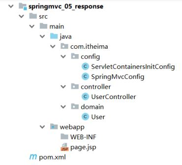
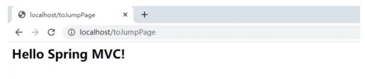
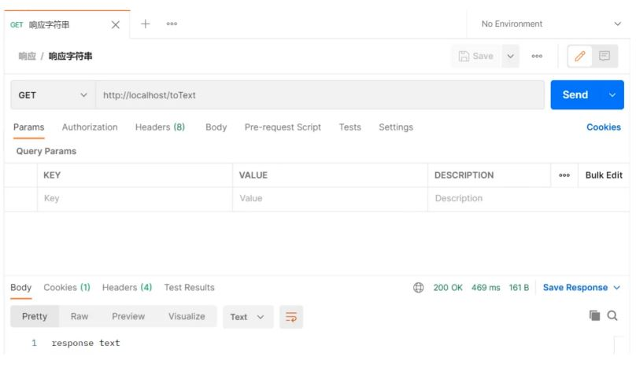
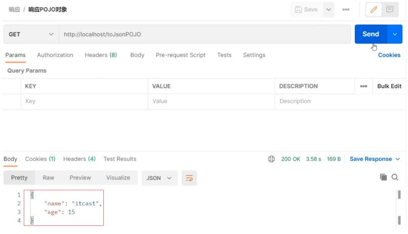
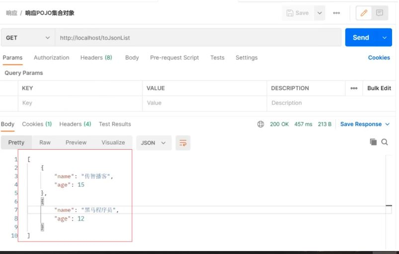

## 响应

SpringMVC接收到请求和数据后，进行一些了的处理，当然这个处理可以是转发给Service，Service层再调用Dao层完成的，不管怎样，处理完以后，都需要将结果告知给用户。

比如:根据用户 `ID`查询用户信息、查询用户列表、新增用户等。

对于响应，主要就包含两部分内容：

* 响应页面
* 响应数据
  * 文本数据
  * json数据

因为异步调用是目前常用的主流方式，所以我们需要更关注的就是如何返回JSON数据，对于其他只需要认识了解即可。

## 环境准备

* 创建一个Web的Maven项目
* pom.xml添加Spring依赖

  ```
  <?xml version="1.0" encoding="UTF-8"?>
  <project xmlns="http://maven.apache.org/POM/4.0.0"
           xmlns:xsi="http://www.w3.org/2001/XMLSchema-instance"
           xsi:schemaLocation="http://maven.apache.org/POM/4.0.0
  http://maven.apache.org/xsd/maven-4.0.0.xsd">
      <modelVersion>4.0.0</modelVersion>
      <groupId>com.itheima</groupId>
      <artifactId>springmvc_05_response</artifactId>
      <version>1.0-SNAPSHOT</version>
      <packaging>war</packaging>
      <dependencies>
          <dependency>
              <groupId>javax.servlet</groupId>
              <artifactId>javax.servlet-api</artifactId>
              <version>3.1.0</version>
              <scope>provided</scope>
          </dependency>
          <dependency>
              <groupId>org.springframework</groupId>
              <artifactId>spring-webmvc</artifactId>
              <version>5.2.10.RELEASE</version>
          </dependency>
          <dependency>
              <groupId>com.fasterxml.jackson.core</groupId>
              <artifactId>jackson-databind</artifactId>
              <version>2.9.0</version>
          </dependency>
      </dependencies>
      <build>
          <plugins>
              <plugin>
                  <groupId>org.apache.tomcat.maven</groupId>
                  <artifactId>tomcat7-maven-plugin</artifactId>
                  <version>2.1</version>
                  <configuration>
                      <port>80</port>
                      <path>/</path>
                  </configuration>
              </plugin>
          </plugins>
      </build>
  </project>
  ```
* 创建对应的配置类

  ```
  public class ServletContainersInitConfig extends
          AbstractAnnotationConfigDispatcherServletInitializer {
      protected Class<?>[] getRootConfigClasses() {
          return new Class[0];
      }
      protected Class<?>[] getServletConfigClasses() {
          return new Class[]{SpringMvcConfig.class};
      }
      protected String[] getServletMappings() {
          return new String[]{"/"};
      }
      //乱码处理
      @Override
      protected Filter[] getServletFilters() {
          CharacterEncodingFilter filter = new CharacterEncodingFilter();
          filter.setEncoding("UTF-8");
          return new Filter[]{filter};
      }
  }
  @Configuration
  @ComponentScan("com.itheima.controller")
  //开启json数据类型自动转换
  @EnableWebMvc
  public class SpringMvcConfig {
  }
  ```
* 编写模型类User

  ```
  public class User {
      private String name;
      private int age;
  //getter...setter...toString省略
  }
  ```
* webapp下创建page.jsp

  ```
  <html>
  <body>
  <h2>Hello Spring MVC!</h2>
  </body>
  </html>
  ```
* 编写UserController

  ```
  @Controller
  public class UserController {
  }
  ```

最终创建好的项目结构如下:



## 响应页面

**步骤1:设置返回页面**

```
@Controller
public class UserController {
    @RequestMapping("/toJumpPage")
//注意
//1.此处不能添加@ResponseBody,如果加了该注入，会直接将page.jsp当字符串返回前端
//2.方法需要返回String
    public String toJumpPage(){
        System.out.println("跳转页面");
        return "page.jsp";
    }
}
```

**步骤2:启动程序测试**

此处涉及到页面跳转，所以不适合采用PostMan进行测试，直接打开浏览器，输入

```
http://localhost/toJumpPage
```



### 返回文本数据

#### 步骤1:设置返回文本内容

```
@Controller
public class UserController {
    @RequestMapping("/toText")
//注意此处该注解就不能省略，如果省略了,会把response text当前页面名称去查找，如果没有
    回报404错误
    @ResponseBody
    public String toText(){
        System.out.println("返回纯文本数据");
        return "response text";
    }
}
```

#### 步骤2:启动程序测试

此处不涉及到页面跳转，因为我们现在发送的是GET请求，可以使用浏览器也可以使用PostMan进行测试，输入地址http://localhost/toText访问



### 响应JSON数据

#### 响应POJO对象

```
@Controller
public class UserController {
    @RequestMapping("/toJsonPOJO")
    @ResponseBody
    public User toJsonPOJO(){
        System.out.println("返回json对象数据");
        User user = new User();
        user.setName("itcast");
        user.setAge(15);
        return user;
    }
}
```

返回值为实体类对象，设置返回值为实体类类型，即可实现返回对应对象的json数据，需要依赖
@ResponseBody注解和@EnableWebMvc注解

重新启动服务器，访问 `http://localhost/toJsonPOJO`



#### 响应POJO集合对象

```
@Controller
public class UserController {
    @RequestMapping("/toJsonList")
    @ResponseBody
    public List<User> toJsonList(){
        System.out.println("返回json集合数据");
        User user1 = new User();
        user1.setName("传智播客");
        user1.setAge(15);
        User user2 = new User();
        user2.setName("黑马程序员");
        user2.setAge(12);
        List<User> userList = new ArrayList<User>();
        userList.add(user1);
        userList.add(user2);
        return userList;
    }
}
```

重新启动服务器，访问 `http://localhost/toJsonList`



**知识点1：@ResponseBody**

| 名称     | @ResponseBody                                                               |
| -------- | --------------------------------------------------------------------------- |
| 类型     | 方法\类注解                                                                 |
| 位置     | SpringMVC控制器方法定义上方和控制类上                                       |
| 作用     | 设置当前控制器返回值作为响应体,<br />写在类上，该类的所有方法都有该注解功能 |
| 相关属性 | pattern：指定日期时间格式字符串                                             |

**说明:**

* 该注解可以写在类上或者方法上
* 写在类上就是该类下的所有方法都有@ReponseBody功能
* 当方法上有@ReponseBody注解后
  * 方法的返回值为字符串，会将其作为文本内容直接响应给前端
  * 方法的返回值为对象，会将对象转换成JSON响应给前端

此处又使用到了类型转换，内部还是通过Converter接口的实现类完成的，所以Converter除了前面所说的功能外，它还可以实现:

* 对象转Json数据(POJO -> json)
* 集合转Json数据(Collection -> json)
