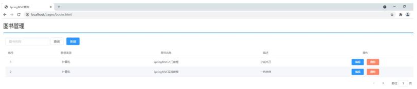

对于Rest风格，我们需要学习的内容包括:

* REST简介
* REST入门案例
* REST快速开发
* 案例:基于RESTful页面数据交

## REST简介

* REST（Representational State Transfer），表现形式状态转换,它是一种软件架构风格。当我们想表示一个网络资源的时候，可以使用两种方式:
  * 传统风格资源描述形式
    * `http://localhost/user/getById?id=1` 查询 `id`为1的用户信息
    * `http://localhost/user/saveUser`保存用户信息
  * REST风格描述形式
    * `http://localhost/user/1`
    * `http://localhost/user`

传统方式一般是一个请求url对应一种操作，这样做不仅麻烦，也不安全，因为会程序的人读取了你的请求url地址，就大概知道该url实现的是一个什么样的操作。

查看REST风格的描述，你会发现请求地址变的简单了，并且光看请求URL并不是很能猜出来该URL的具体功能所以REST的优点有:

* 隐藏资源的访问行为，无法通过地址得知对资源是何种操作
* 书写简化

但是我们的问题也随之而来了，一个相同的url地址即可以是新增也可以是修改或者查询，那么到底我们该如何区分该请求到底是什么操作呢?

* 按照REST风格访问资源时使用行为动作区分对资源进行了何种操作
  * http://localhost/users 查询全部用户信息 GET（查询）
  * http://localhost/users/1 查询指定用户信息 GET（查询）
  * http://localhost/users 添加用户信息 POST（新增/保存）
  * http://localhost/users 修改用户信息 PUT（修改/更新）
  * http://localhost/users/1 删除用户信息 DELETE（删除）

请求的方式比较多，但是比较常用的就4种，分别是GET , POST , PUT , DELETE。

按照不同的请求方式代表不同的操作类型。

* 发送GET请求是用来做查询
* 发送POST请求是用来做新增
* 发送PUT请求是用来做修改
* 发送DELETE请求是用来做删除

但是注意:

* 上述行为是约定方式，约定不是规范，可以打破，所以称REST风格，而不是REST规范
  * REST提供了对应的架构方式，按照这种架构设计项目可以降低开发的复杂性，提高系统的可伸缩性
  * REST中规定GET/POST/PUT/DELETE针对的是查询/新增/修改/删除，但是我们如果非要用GET请求做删除，这点在程序上运行是可以实现的
  * 但是如果绝大多数人都遵循这种风格，你写的代码让别人读起来就有点莫名其妙了。
* 描述模块的名称通常使用复数，也就是加s的格式描述，表示此类资源，而非单个资源，例如:users、books、accounts......

清楚了什么是REST风格后，我们后期会经常提到一个概念叫RESTful，那什么又是RESTful呢?

* 根据REST风格对资源进行访问称为RESTful。

后期我们在进行开发的过程中，大多是都是遵从REST风格来访问我们的后台服务，所以可以说咱们以后都是基于RESTful来进行开发的。

## RESTful入门案例

### 环境准备

* 创建一个Web的Maven项目
* pom.xml添加Spring依赖

  ```
  <?xml version="1.0" encoding="UTF-8"?>
  <project xmlns="http://maven.apache.org/POM/4.0.0"
           xmlns:xsi="http://www.w3.org/2001/XMLSchema-instance"
           xsi:schemaLocation="http://maven.apache.org/POM/4.0.0
  http://maven.apache.org/xsd/maven-4.0.0.xsd">
      <modelVersion>4.0.0</modelVersion>
      <groupId>com.itheima</groupId>
      <artifactId>springmvc_06_rest</artifactId>
      <version>1.0-SNAPSHOT</version>
      <packaging>war</packaging>
      <dependencies>
          <dependency>
              <groupId>javax.servlet</groupId>
              <artifactId>javax.servlet-api</artifactId>
              <version>3.1.0</version>
              <scope>provided</scope>
          </dependency>
          <dependency>
              <groupId>org.springframework</groupId>
              <artifactId>spring-webmvc</artifactId>
              <version>5.2.10.RELEASE</version>
          </dependency>
          <dependency>
              <groupId>com.fasterxml.jackson.core</groupId>
              <artifactId>jackson-databind</artifactId>
              <version>2.9.0</version>
          </dependency>
      </dependencies>
      <build>
          <plugins>
              <plugin>
                  <groupId>org.apache.tomcat.maven</groupId>
                  <artifactId>tomcat7-maven-plugin</artifactId>
                  <version>2.1</version>
                  <configuration>
                      <port>80</port>
                      <path>/</path>
                  </configuration>
              </plugin>
          </plugins>
      </build>
  </project>
  ```
* 创建对应的配置类

  ```
  public class ServletContainersInitConfig extends
          AbstractAnnotationConfigDispatcherServletInitializer {
      protected Class<?>[] getRootConfigClasses() {
          return new Class[0];
      }
      protected Class<?>[] getServletConfigClasses() {
          return new Class[]{SpringMvcConfig.class};
      }
      protected String[] getServletMappings() {
          return new String[]{"/"};
      }
      //乱码处理
      @Override
      protected Filter[] getServletFilters() {
          CharacterEncodingFilter filter = new CharacterEncodingFilter();
          filter.setEncoding("UTF-8");
          return new Filter[]{filter};
      }
  }
  @Configuration
  @ComponentScan("com.itheima.controller")
  //开启json数据类型自动转换
  @EnableWebMvc
  public class SpringMvcConfig {
  }
  ```
* 编写模型类User和Book

  ```
  public class User {
      private String name;
      private int age;
  //getter...setter...toString省略
  }
  public class Book {
      private String name;
      private double price;
  //getter...setter...toString省略
  }
  ```
* 编写UserController和BookController

  ```
  @Controller
  public class UserController {
      @RequestMapping("/save")
      @ResponseBody
      public String save(@RequestBody User user) {
          System.out.println("user save..."+user);
          return "{'module':'user save'}";
      }
      @RequestMapping("/delete")
      @ResponseBody
      public String delete(Integer id) {
          System.out.println("user delete..." + id);
          return "{'module':'user delete'}";
      }
      @RequestMapping("/update")
      @ResponseBody
      public String update(@RequestBody User user) {
          System.out.println("user update..." + user);
          return "{'module':'user update'}";
      }
      @RequestMapping("/getById")
      @ResponseBody
      public String getById(Integer id) {
          System.out.println("user getById..." + id);
          return "{'module':'user getById'}";
      }
      @RequestMapping("/findAll")
      @ResponseBody
      public String getAll() {
          System.out.println("user getAll...");
          return "{'module':'user getAll'}";
      }
  }
  @Controller
  public class BookController {
      @RequestMapping(value = "/books",method = RequestMethod.POST)
      @ResponseBody
      public String save(@RequestBody Book book){
          System.out.println("book save..." + book);
          return "{'module':'book save'}";
      }
      @RequestMapping(value = "/books/{id}",method = RequestMethod.DELETE)
      @ResponseBody
      public String delete(@PathVariable Integer id){
          System.out.println("book delete..." + id);
          return "{'module':'book delete'}";
      }
      @RequestMapping(value = "/books",method = RequestMethod.PUT)
      @ResponseBody
      public String update(@RequestBody Book book){
          System.out.println("book update..." + book);
          return "{'module':'book update'}";
      }
      @RequestMapping(value = "/books/{id}",method = RequestMethod.GET)
      @ResponseBody
      public String getById(@PathVariable Integer id){
          System.out.println("book getById..." + id);
          return "{'module':'book getById'}";
      }
      @RequestMapping(value = "/books",method = RequestMethod.GET)
      @ResponseBody
      public String getAll(){
          System.out.println("book getAll...");
          return "{'module':'book getAll'}";
      }
  }
  ```

最终创建好的项目结构如下:


### 思路分析

需求:将之前的增删改查替换成RESTful的开发方式。

1.之前不同的请求有不同的路径,现在要将其修改为统一的请求路径

* 修改前: 新增: /save ,修改: /update,删除 /delete...
* 修改后: 增删改查: /users

2.根据GET查询、POST新增、PUT修改、DELETE删除对方法的请求方式进行限定

3.发送请求的过程中如何设置请求参数?

### 修改RESTful风格

#### 新增

```
@Controller
public class UserController {
    //设置当前请求方法为POST，表示REST风格中的添加操作
    @RequestMapping(value = "/users",method = RequestMethod.POST)
    @ResponseBody
    public String save() {
        System.out.println("user save...");
        return "{'module':'user save'}";
    }
}
```

* 将请求路径更改为/users
  * 访问该方法使用 POST: http://localhost/users
* 使用method属性限定该方法的访问方式为POST
  * 如果发送的不是POST请求，比如发送GET请求，则会报错

    

#### 删除

```
@Controller
public class UserController {
    //设置当前请求方法为DELETE，表示REST风格中的删除操作
    @RequestMapping(value = "/users",method = RequestMethod.DELETE)
    @ResponseBody
    public String delete(Integer id) {
        System.out.println("user delete..." + id);
        return "{'module':'user delete'}";
    }
}
```

* 将请求路径更改为/users
  * 访问该方法使用 DELETE: http://localhost/users

访问成功，但是删除方法没有携带所要删除数据的 `id`,所以针对RESTful的开发，如何携带数据参数?

#### 传递路径参数

前端发送请求的时候使用: http://localhost/users/1 ,路径中的1就是我们想要传递的参数。

后端获取参数，需要做如下修改:

* 修改@RequestMapping的value属性，将其中修改为 `/users/{id}`，目的是和路径匹配
* 在方法的形参前添加@PathVariable注解

```
@Controller
public class UserController {
    //设置当前请求方法为DELETE，表示REST风格中的删除操作
    @RequestMapping(value = "/users/{id}",method = RequestMethod.DELETE)
    @ResponseBody
    public String delete(@PathVariable Integer id) {
        System.out.println("user delete..." + id);
        return "{'module':'user delete'}";
    }
}
```

**思考如下两个问题:**

如果方法形参的名称和路径{}中的值不一致，该怎么办?


如果有多个参数需要传递该如何编写?

前端发送请求的时候使用: http://localhost/users/1/tom ,路径中的1和tom就是我们想要传递的两个参数。

后端获取参数，需要做如下修改:

```
@Controller
public class UserController {
    //设置当前请求方法为DELETE，表示REST风格中的删除操作
    @RequestMapping(value = "/users/{id}/{name}",method =
            RequestMethod.DELETE)
    @ResponseBody
    public String delete(@PathVariable Integer id,@PathVariable String name)
    {
        System.out.println("user delete..." + id+","+name);
        return "{'module':'user delete'}";
    }
}
```

#### 修改

```
@Controller
public class UserController {
    //设置当前请求方法为PUT，表示REST风格中的修改操作
    @RequestMapping(value = "/users",method = RequestMethod.PUT)
    @ResponseBody
    public String update(@RequestBody User user) {
        System.out.println("user update..." + user);
        return "{'module':'user update'}";
    }
}
```

* 将请求路径更改为/users

  * 访问该方法使用 PUT: http://localhost/users
* 访问并携带参数:

  

#### 根据ID查询

```
@Controller
public class UserController {
    //设置当前请求方法为GET，表示REST风格中的查询操作
    @RequestMapping(value = "/users/{id}" ,method = RequestMethod.GET)
    @ResponseBody
    public String getById(@PathVariable Integer id){
        System.out.println("user getById..."+id);
        return "{'module':'user getById'}";
    }
}
```

将请求路径更改为/users

* 访问该方法使用 GET: http://localhost/users/666

#### 查询所有

```
@Controller
public class UserController {
    //设置当前请求方法为GET，表示REST风格中的查询操作
    @RequestMapping(value = "/users" ,method = RequestMethod.GET)
    @ResponseBody
    public String getAll() {
        System.out.println("user getAll...");
        return "{'module':'user getAll'}";
    }
}
```

将请求路径更改为/users

* 访问该方法使用 GET: http://localhost/users

#### 小结

RESTful入门案例，我们需要学习的内容如下:

设定Http请求动作(动词)

```
@RequestMapping(value="",method = RequestMethod.POST|GET|PUT|DELETE)
```

设定请求参数(路径变量)

```
@RequestMapping(value="/users/{id}",method = RequestMethod.DELETE)
@ReponseBody
public String delete(@PathVariable Integer id){
}
```

**知识点1：@PathVariable**

| 名称 | @PathVariable                                                        |
| ---- | -------------------------------------------------------------------- |
| 类型 | 形参注解                                                             |
| 位置 | SpringMVC控制器方法形参定义前面                                      |
| 作用 | 绑定路径参数与处理器方法形参间的关系，要求路径参数名与形参名一一对应 |

关于接收参数，我们学过三个注解@RequestBody、@RequestParam、@PathVariable ,这三个注之间的区别和应用分别是什么?

* 区别
  * @RequestParam用于接收url地址传参或表单传参
  * @RequestBody用于接收json数据
  * @PathVariable用于接收路径参数，使用 `{参数名称}`描述路径参数
* 应用
  * 后期开发中，发送请求参数超过1个时，以json格式为主，@RequestBody应用较广
  * 如果发送非json格式数据，选用@RequestParam接收请求参数
  * 采用RESTful进行开发，当参数数量较少时，例如1个，可以采用@PathVariable接收请求路径变量，通常用于传递id值

## RESTful快速开发

做完了RESTful的开发，你会发现好麻烦，麻烦在哪?


* 问题1：每个方法的@RequestMapping注解中都定义了访问路径/books，重复性太高。
* 问题2：每个方法的@RequestMapping注解中都要使用method属性定义请求方式，重复性太高。
* 问题3：每个方法响应json都需要加上@ResponseBody注解，重复性太高。

对于上面所提的这三个问题，具体该如何解决?

```
@RestController //@Controller + ReponseBody
@RequestMapping("/books")
public class BookController {
    //@RequestMapping(method = RequestMethod.POST)
    @PostMapping
    public String save(@RequestBody Book book){
        System.out.println("book save..." + book);
        return "{'module':'book save'}";
    }
    //@RequestMapping(value = "/{id}",method = RequestMethod.DELETE)
    @DeleteMapping("/{id}")
    public String delete(@PathVariable Integer id){
        System.out.println("book delete..." + id);
        return "{'module':'book delete'}";
    }
    //@RequestMapping(method = RequestMethod.PUT)
    @PutMapping
    public String update(@RequestBody Book book){
        System.out.println("book update..." + book);
        return "{'module':'book update'}";
    }
    //@RequestMapping(value = "/{id}",method = RequestMethod.GET)
    @GetMapping("/{id}")
    public String getById(@PathVariable Integer id){
        System.out.println("book getById..." + id);
        return "{'module':'book getById'}";
    }
    //@RequestMapping(method = RequestMethod.GET)
    @GetMapping
    public String getAll(){
        System.out.println("book getAll...");
        return "{'module':'book getAll'}";
    }
}
```

对于刚才的问题，我们都有对应的解决方案：

问题1：每个方法的@RequestMapping注解中都定义了访问路径/books，重复性太高。

* 将@RequestMapping提到类上面，用来定义所有方法共同的访问路径。

问题2：每个方法的@RequestMapping注解中都要使用method属性定义请求方式，重复性太高。

* 使用@GetMapping @PostMapping @PutMapping @DeleteMapping代替

问题3：每个方法响应json都需要加上@ResponseBody注解，重复性太高。

* 将ResponseBody提到类上面，让所有的方法都有@ResponseBody的功能
* 使用@RestController注解替换@Controller与@ResponseBody注解，简化书写

**知识点1：@RestController**

| 名称 | @RestController                                                                       |
| ---- | ------------------------------------------------------------------------------------- |
| 类型 | 类注解                                                                                |
| 位置 | 基于SpringMVC的RESTful开发控制器类定义上方                                            |
| 作用 | 设置当前控制器类为RESTful风格，<br />等同于@Controller与@ResponseBody两个注解组合功能 |

**知识点2：@GetMapping @PostMapping @PutMapping @DeleteMapping**

| 名称     | @GetMapping @PostMapping @PutMapping @DeleteMapping                                              |
| -------- | ------------------------------------------------------------------------------------------------ |
| 类型     | 方法注解                                                                                         |
| 位置     | 基于SpringMVC的RESTful开发控制器方法定义上方                                                     |
| 作用     | 设置当前控制器方法请求访问路径与请求动作，每种对应一个请求动作，<br />例如@GetMapping对应GET请求 |
| 相关属性 | value（默认）：请求访问路径                                                                      |

## RESTful案例

### 需求分析

需求一:图片列表查询，从后台返回数据，将数据展示在页面上



需求二:新增图片，将新增图书的数据传递到后台，并在控制台打印


说明:此次案例的重点是在SpringMVC中如何使用RESTful实现前后台交互，所以本案例并没有和数据库进行交互，所有数据使用假数据来完成开发。

#### 步骤分析

* 搭建项目导入jar包
* 编写Controller类，提供两个方法，一个用来做列表查询，一个用来做新增
* 在方法上使用RESTful进行路径设置
* 完成请求、参数的接收和结果的响应
* 使用PostMan进行测试
* 将前端页面拷贝到项目中
* 页面发送ajax请求
* 完成页面数据的展示

### 环境准备

* 创建一个Web的Maven项目
* pom.xml添加Spring依赖

  ```
  <?xml version="1.0" encoding="UTF-8"?>
  <project xmlns="http://maven.apache.org/POM/4.0.0"
           xmlns:xsi="http://www.w3.org/2001/XMLSchema-instance"
           xsi:schemaLocation="http://maven.apache.org/POM/4.0.0
  http://maven.apache.org/xsd/maven-4.0.0.xsd">
      <modelVersion>4.0.0</modelVersion>
      <groupId>com.itheima</groupId>
      <artifactId>springmvc_07_rest_case</artifactId>
      <version>1.0-SNAPSHOT</version>
      <packaging>war</packaging>
      <dependencies>
          <dependency>
              <groupId>javax.servlet</groupId>
              <artifactId>javax.servlet-api</artifactId>
              <version>3.1.0</version>
              <scope>provided</scope>
          </dependency>
          <dependency>
              <groupId>org.springframework</groupId>
              <artifactId>spring-webmvc</artifactId>
              <version>5.2.10.RELEASE</version>
          </dependency>
          <dependency>
              <groupId>com.fasterxml.jackson.core</groupId>
              <artifactId>jackson-databind</artifactId>
              <version>2.9.0</version>
          </dependency>
      </dependencies>
      <build>
          <plugins>
              <plugin>
                  <groupId>org.apache.tomcat.maven</groupId>
                  <artifactId>tomcat7-maven-plugin</artifactId>
                  <version>2.1</version>
                  <configuration>
                      <port>80</port>
                      <path>/</path>
                  </configuration>
              </plugin>
          </plugins>
      </build>
  </project>
  ```
* 创建对应的配置类

  ```
  public class ServletContainersInitConfig extends
          AbstractAnnotationConfigDispatcherServletInitializer {
      protected Class<?>[] getRootConfigClasses() {
          return new Class[0];
      }
      protected Class<?>[] getServletConfigClasses() {
          return new Class[]{SpringMvcConfig.class};
      }
      protected String[] getServletMappings() {
          return new String[]{"/"};
      }
      //乱码处理
      @Override
      protected Filter[] getServletFilters() {
          CharacterEncodingFilter filter = new CharacterEncodingFilter();
          filter.setEncoding("UTF-8");
          return new Filter[]{filter};
      }
  }
  @Configuration
  @ComponentScan("com.itheima.controller")
  //开启json数据类型自动转换
  @EnableWebMvc
  public class SpringMvcConfig {
  }
  ```
* 编写模型类Book

  ```
  public class Book {
      private Integer id;
      private String type;
      private String name;
      private String description;
  //setter...getter...toString略
  }
  ```
* 编写BookController

  ```
  @Controller
  public class BookController {
  }
  ```

最终创建好的项目结构如下:


### 后台接口开发

#### 步骤1:编写Controller类并使用RESTful进行配置

```
@RestController
@RequestMapping("/books")
public class BookController {
    @PostMapping
    public String save(@RequestBody Book book){
        System.out.println("book save ==> "+ book);
        return "{'module':'book save success'}";
    }
    @GetMapping
    public List<Book> getAll(){
        System.out.println("book getAll is running ...");
        List<Book> bookList = new ArrayList<Book>();
        Book book1 = new Book();
        book1.setType("计算机");
        book1.setName("SpringMVC入门教程");
        book1.setDescription("小试牛刀");
        bookList.add(book1);
        Book book2 = new Book();
        book2.setType("计算机");
        book2.setName("SpringMVC实战教程");
        book2.setDescription("一代宗师");
        bookList.add(book2);
        Book book3 = new Book();
        book3.setType("计算机丛书");
        book3.setName("SpringMVC实战教程进阶");
        book3.setDescription("一代宗师呕心创作");
        bookList.add(book3);
        return bookList;
    }
}
```

#### 步骤2：使用PostMan进行测试

##### 测试新增

```
{
  "type":"计算机丛书",
  "name":"SpringMVC终极开发",
  "description":"这是一本好书"
}
```


##### 测试查询


### 页面访问处理

#### 步骤1:拷贝静态页面

将静态功能页面下的所有内容拷贝到项目的webapp目录下。


#### 步骤2:访问pages目录下的books.html

打开浏览器输入http://localhost/pages/books.html


出现错误的原因?


SpringMVC拦截了静态资源，根据/pages/books.html去controller找对应的方法，找不到所以会报404的错误。

SpringMVC为什么会拦截静态资源呢?


解决方案?

* SpringMVC需要将静态资源进行放行。

  ```
  @Configuration
  public class SpringMvcSupport extends WebMvcConfigurationSupport {
    //设置静态资源访问过滤，当前类需要设置为配置类，并被扫描加载
    @Override
    protected void addResourceHandlers(ResourceHandlerRegistry registry) {
    //当访问/pages/????时候，从/pages目录下查找内容
    registry.addResourceHandler("/pages/**").addResourceLocations("/pages/");
    registry.addResourceHandler("/js/**").addResourceLocations("/js/");
    registry.addResourceHandler("/css/**").addResourceLocations("/css/");
    registry.addResourceHandler("/plugins/**").addResourceLocations("/plugins/")
    ;
  }
  }
  ```
* 该配置类是在config目录下，SpringMVC扫描的是controller包，所以该配置类还未生效，要想生效需要将SpringMvcConfig配置类进行修改

  ```
  @Configuration
  @ComponentScan({"com.itheima.controller","com.itheima.config"})
  @EnableWebMvc
  public class SpringMvcConfig {
  }
  或者
  @Configuration
  @ComponentScan("com.itheima")
  @EnableWebMvc
  public class SpringMvcConfig {
  }
  ```

#### 步骤3:修改books.html页面

```
<!DOCTYPE html>
<html>
<head>
    <!-- 页面meta -->
    <meta charset="utf-8">
    <title>SpringMVC案例</title>
    <!-- 引入样式 -->
    <link rel="stylesheet" href="../plugins/elementui/index.css">
    <link rel="stylesheet" href="../plugins/font-awesome/css/fontawesome.min.css">
    <link rel="stylesheet" href="../css/style.css">
</head>
<body class="hold-transition">
<div id="app">
    <div class="content-header">
        <h1>图书管理</h1>
    </div>
    <div class="app-container">
        <div class="box">
            <div class="filter-container">
                <el-input placeholder="图书名称" style="width:
200px;" class="filter-item"></el-input>
                <el-button class="dalfBut">查询</el-button>
                <el-button type="primary" class="butT"
                           @click="openSave()">新建</el-button>
            </div>
            <el-table size="small" current-row-key="id"
                      :data="dataList" stripe highlight-current-row>
                <el-table-column type="index" align="center"
                                 label="序号"></el-table-column>
                <el-table-column prop="type" label="图书类别"
                                 align="center"></el-table-column>
                <el-table-column prop="name" label="图书名称"
                                 align="center"></el-table-column>
                <el-table-column prop="description" label="描述"
                                 align="center"></el-table-column>
                <el-table-column label="操作" align="center">
                    <template slot-scope="scope">
                        <el-button type="primary" size="mini">编辑
                        </el-button>
                        <el-button size="mini" type="danger">删除
                        </el-button>
                    </template>
                </el-table-column>
            </el-table>
            <div class="pagination-container">
                <el-pagination
                        class="pagiantion"
                        @current-change="handleCurrentChange"
                        :current-page="pagination.currentPage"
                        :page-size="pagination.pageSize"
                        layout="total, prev, pager, next, jumper"
                        :total="pagination.total">
                </el-pagination>
            </div>
            <!-- 新增标签弹层 -->
            <div class="add-form">
                <el-dialog title="新增图书"
                           :visible.sync="dialogFormVisible">
                    <el-form ref="dataAddForm" :model="formData"
                             :rules="rules" label-position="right" label-width="100px">
                        <el-row>
                            <el-col :span="12">
                                <el-form-item label="图书类别"
                                              prop="type">
                                    <el-input vmodel="formData.type"/>
                                </el-form-item>
                            </el-col>
                            <el-col :span="12">
                                <el-form-item label="图书名称"
                                              prop="name">
                                    <el-input vmodel="formData.name"/>
                                </el-form-item>
                            </el-col>
                        </el-row>
                        <el-row>
                            <el-col :span="24">
                                <el-form-item label="描述">
                                    <el-input vmodel="formData.description" type="textarea"></el-input>
                                </el-form-item>
                            </el-col>
                        </el-row>
                    </el-form>
                    <div slot="footer" class="dialog-footer">
                        <el-button @click="dialogFormVisible =
false">取消</el-button>
                        <el-button type="primary"
                                   @click="saveBook()">确定</el-button>
                    </div>
                </el-dialog>
            </div>
        </div>
    </div>
</div>
</body>
<!-- 引入组件库 -->
<script src="../js/vue.js"></script>
<script src="../plugins/elementui/index.js"></script>
<script type="text/javascript" src="../js/jquery.min.js"></script>
<script src="../js/axios-0.18.0.js"></script>
<script>
    var vue = new Vue({
    el: '#app',
    data:{
    dataList: [],//当前页要展示的分页列表数据
    formData: {},//表单数据
    dialogFormVisible: false,//增加表单是否可见
    dialogFormVisible4Edit:false,//编辑表单是否可见
    pagination: {},//分页模型数据，暂时弃用
    },
//钩子函数，VUE对象初始化完成后自动执行
created() {
this.getAll();
},
methods: {
// 重置表单
resetForm() {
//清空输入框
this.formData = {};
},
// 弹出添加窗口
openSave() {
this.dialogFormVisible = true;
this.resetForm();
},
//添加
saveBook () {
axios.post("/books",this.formData).then((res)=>{
});
},
//主页列表查询
getAll() {
axios.get("/books").then((res)=>{
this.dataList = res.data;
});
},
}
})
</script>
</html>
```
