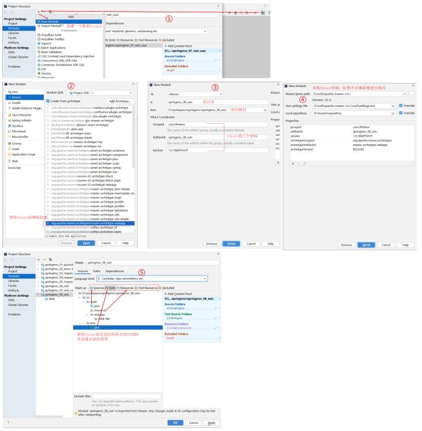
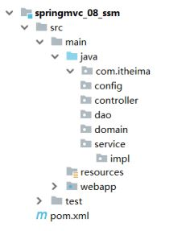
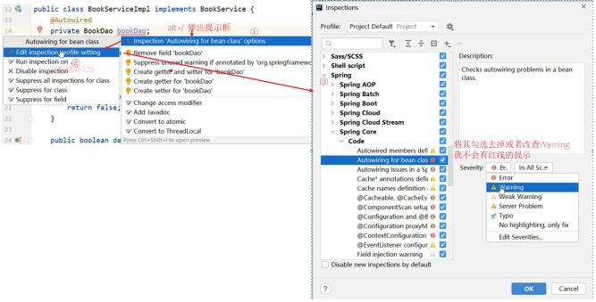
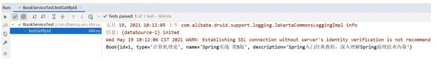
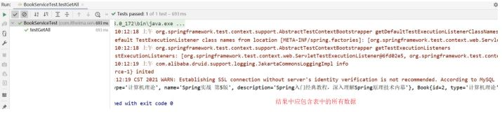
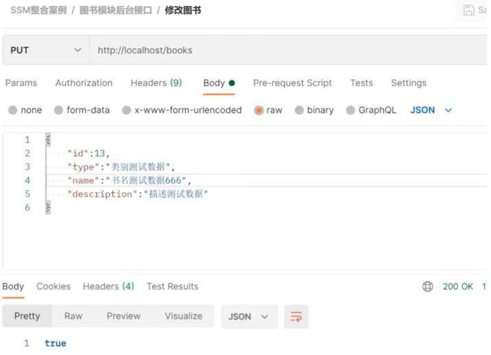
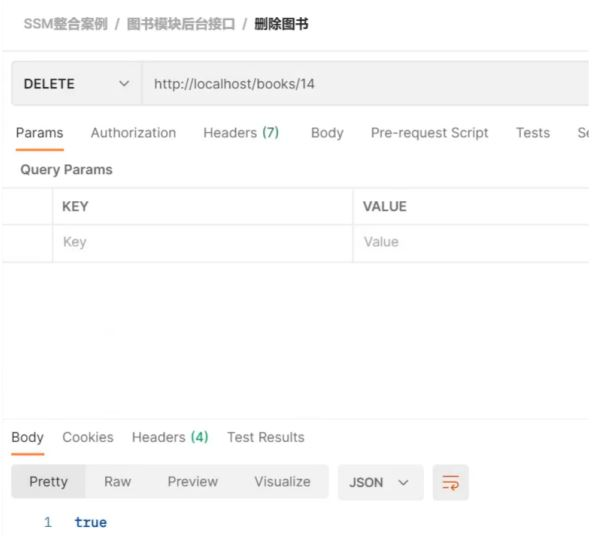
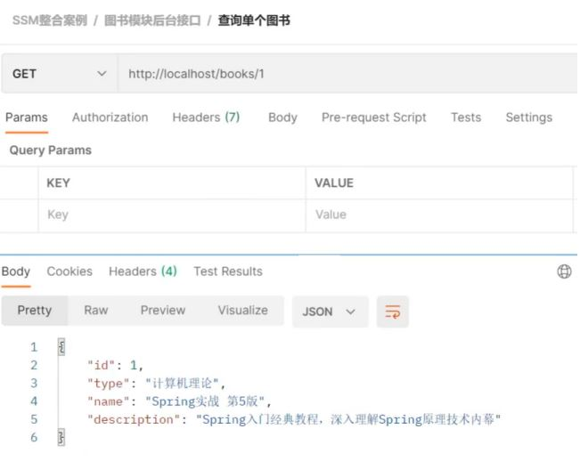
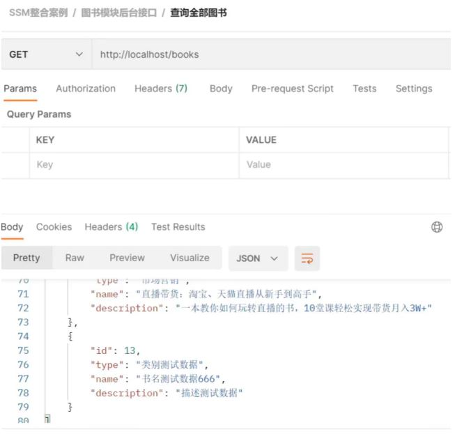

前面我们已经把Mybatis、Spring和SpringMVC三个框架进行了学习，今天主要的内容就是把这三个框架整合在一起完成我们的业务功能开发，具体如何来整合，我们一步步来学习。

## 流程分析

### 创建工程

* 创建一个Maven的web工程
* pom.xml添加SSM需要的依赖jar包
* 编写Web项目的入口配置类，实现AbstractAnnotationConfigDispatcherServletInitializer重写以下方法
  * getRootConfigClasses() ：返回Spring的配置类->需要SpringConfig配置类
  * getServletConfigClasses() ：返回SpringMVC的配置类->需要SpringMvcConfig配置类
  * getServletMappings() : 设置SpringMVC请求拦截路径规则
  * getServletFilters() ：设置过滤器，解决POST请求中文乱码问题

### SSM整合[重点是各个配置的编写]

#### SpringConfig

* 标识该类为配置类 @Configuration
* 扫描Service所在的包 @ComponentScan
* 在Service层要管理事务 @EnableTransactionManagement
* 读取外部的properties配置文件 @PropertySource
* 整合Mybatis需要引入Mybatis相关配置类 @Import
  * 第三方数据源配置类 JdbcConfig
    * 构建DataSource数据源，DruidDataSouroce,需要注入数据库连接四要素， @Bean @Value
    * 构建平台事务管理器，DataSourceTransactionManager,@Bean
    * Mybatis配置类 MybatisConfig
      * 构建SqlSessionFactoryBean并设置别名扫描与数据源，@Bean
      * 构建MapperScannerConfigurer并设置DAO层的包扫描
* SpringMvcConfig
  * 标识该类为配置类 @Configuration
  * 扫描Controller所在的包 @ComponentScan
  * 开启SpringMVC注解支持 @EnableWebMvc

#### 功能模块[与具体的业务模块有关]

* 创建数据库表
* 根据数据库表创建对应的模型类
* 通过Dao层完成数据库表的增删改查(接口+自动代理)
* 编写Service层[Service接口+实现类]

  * @Service
  * @Transactional
  * 整合Junit对业务层进行单元测试
    * @RunWith
    * @ContextConfiguration
    * @Test
* 编写Controller层

  * 接收请求 @RequestMapping @GetMapping @PostMapping @PutMapping @DeleteMapping
  * 接收数据 简单、POJO、嵌套POJO、集合、数组、JSON数据类型
    * @RequestParam
    * @PathVariable
    * @RequestBody
  * 转发业务层
    * @Autowired
  * 响应结果
    * @ResponseBody

## 整合配置

掌握上述的知识点后，接下来，我们就可以按照上述的步骤一步步的来完成SSM的整合

### 环境搭建

#### 步骤1:创建Maven的web项目

可以使用Maven的骨架创建



#### 步骤2:添加依赖

pom.xml添加SSM所需要的依赖jar包

```
<?xml version="1.0" encoding="UTF-8"?>
<project xmlns="http://maven.apache.org/POM/4.0.0"
         xmlns:xsi="http://www.w3.org/2001/XMLSchema-instance"
         xsi:schemaLocation="http://maven.apache.org/POM/4.0.0
http://maven.apache.org/xsd/maven-4.0.0.xsd">
    <modelVersion>4.0.0</modelVersion>
    <groupId>com.itheima</groupId>
    <artifactId>springmvc_08_ssm</artifactId>
    <version>1.0-SNAPSHOT</version>
    <packaging>war</packaging>
    <dependencies>
        <dependency>
            <groupId>org.springframework</groupId>
            <artifactId>spring-webmvc</artifactId>
            <version>5.2.10.RELEASE</version>
        </dependency>
        <dependency>
            <groupId>org.springframework</groupId>
            <artifactId>spring-jdbc</artifactId>
            <version>5.2.10.RELEASE</version>
        </dependency>
        <dependency>
            <groupId>org.springframework</groupId>
            <artifactId>spring-test</artifactId>
            <version>5.2.10.RELEASE</version>
        </dependency>
        <dependency>
            <groupId>org.mybatis</groupId>
            <artifactId>mybatis</artifactId>
            <version>3.5.6</version>
        </dependency>
        <dependency>
            <groupId>org.mybatis</groupId>
            <artifactId>mybatis-spring</artifactId>
            <version>1.3.0</version>
        </dependency>
        <dependency>
            <groupId>mysql</groupId>
            <artifactId>mysql-connector-java</artifactId>
            <version>5.1.47</version>
        </dependency>
        <dependency>
            <groupId>com.alibaba</groupId>
            <artifactId>druid</artifactId>
            <version>1.1.16</version>
        </dependency>
        <dependency>
            <groupId>junit</groupId>
            <artifactId>junit</artifactId>
            <version>4.12</version>
            <scope>test</scope>
        </dependency>
        <dependency>
            <groupId>javax.servlet</groupId>
            <artifactId>javax.servlet-api</artifactId>
            <version>3.1.0</version>
            <scope>provided</scope>
        </dependency>
        <dependency>
            <groupId>com.fasterxml.jackson.core</groupId>
            <artifactId>jackson-databind</artifactId>
            <version>2.9.0</version>
        </dependency>
    </dependencies>
    <build>
        <plugins>
            <plugin>
                <groupId>org.apache.tomcat.maven</groupId>
                <artifactId>tomcat7-maven-plugin</artifactId>
                <version>2.1</version>
                <configuration>
                    <port>80</port>
                    <path>/</path>
                </configuration>
            </plugin>
        </plugins>
    </build>
</project>
```

#### 步骤3:创建项目包结构



* config目录存放的是相关的配置类
* controller编写的是Controller类
* dao存放的是Dao接口，因为使用的是Mapper接口代理方式，所以没有实现类包
* service存的是Service接口，impl存放的是Service实现类
* resources:存入的是配置文件，如Jdbc.properties
* webapp:目录可以存放静态资源
* test/java:存放的是测试类

#### 步骤4:创建SpringConfig配置类

```
@Configuration
@ComponentScan({"com.itheima.service"})
@PropertySource("classpath:jdbc.properties")
@Import({JdbcConfig.class,MyBatisConfig.class})
@EnableTransactionManagement
public class SpringConfig {
}
```

#### 步骤5:创建JdbcConfig配置类

```
public class JdbcConfig {
    @Value("${jdbc.driver}")
    private String driver;
    @Value("${jdbc.url}")
    private String url;
    @Value("${jdbc.username}")
    private String username;
    @Value("${jdbc.password}")
    private String password;
    @Bean
    public DataSource dataSource(){
        DruidDataSource dataSource = new DruidDataSource();
        dataSource.setDriverClassName(driver);
        dataSource.setUrl(url);
        dataSource.setUsername(username);
        dataSource.setPassword(password);
        return dataSource;
    }
    @Bean
    public PlatformTransactionManager transactionManager(DataSource
                                                                 dataSource){
        DataSourceTransactionManager ds = new DataSourceTransactionManager();
        ds.setDataSource(dataSource);
        return ds;
    }
}
```

#### 步骤6:创建MybatisConfig配置类

```
public class MyBatisConfig {
    @Bean
    public SqlSessionFactoryBean sqlSessionFactory(DataSource dataSource){
        SqlSessionFactoryBean factoryBean = new SqlSessionFactoryBean();
        factoryBean.setDataSource(dataSource);
        factoryBean.setTypeAliasesPackage("com.itheima.domain");
        return factoryBean;
    }
    @Bean
    public MapperScannerConfigurer mapperScannerConfigurer(){
        MapperScannerConfigurer msc = new MapperScannerConfigurer();
        msc.setBasePackage("com.itheima.dao");
        return msc;
    }
}
```

#### 步骤7:创建jdbc.properties

在resources下提供jdbc.properties,设置数据库连接四要素

```
jdbc.driver=com.mysql.jdbc.Driver
jdbc.url=jdbc:mysql://localhost:3306/ssm_db
jdbc.username=root
jdbc.password=root
```

#### 步骤8:创建SpringMVC配置类

```
@Configuration
@ComponentScan("com.itheima.controller")
@EnableWebMvc
public class SpringMvcConfig {
}
```

#### 步骤9:创建Web项目入口配置类

```
public class ServletConfig extends
        AbstractAnnotationConfigDispatcherServletInitializer {
    //加载Spring配置类
    protected Class<?>[] getRootConfigClasses() {
        return new Class[]{SpringConfig.class};
    }
    //加载SpringMVC配置类
    protected Class<?>[] getServletConfigClasses() {
        return new Class[]{SpringMvcConfig.class};
    }
    //设置SpringMVC请求地址拦截规则
    protected String[] getServletMappings() {
        return new String[]{"/"};
    }
    //设置post请求中文乱码过滤器
    @Override
    protected Filter[] getServletFilters() {
        CharacterEncodingFilter filter = new CharacterEncodingFilter();
        filter.setEncoding("utf-8");
        return new Filter[]{filter};
    }
}
```

至此SSM整合的环境就已经搭建好了。在这个环境上，我们如何进行功能模块的开发呢?

### 功能模块开发

需求:对表tbl_book进行新增、修改、删除、根据ID查询和查询所有

#### 步骤1:创建数据库及表

```
create database ssm_db character set utf8;
use ssm_db;
create table tbl_book(
    id int primary key auto_increment,
    type varchar(20),
    name varchar(50),
    description varchar(255)
)
insert into `tbl_book`(`id`,`type`,`name`,`description`) values (1,'计算机理
论','Spring实战 第五版','Spring入门经典教程，深入理解Spring原理技术内幕'),(2,'计算机理
论','Spring 5核心原理与30个类手写实践','十年沉淀之作，手写Spring精华思想'),(3,'计算机理
论','Spring 5设计模式','深入Spring源码刨析Spring源码中蕴含的10大设计模式'),(4,'计算机
理论','Spring MVC+Mybatis开发从入门到项目实战','全方位解析面向Web应用的轻量级框架，带你
成为Spring MVC开发高手'),(5,'计算机理论','轻量级Java Web企业应用实战','源码级刨析
Spring框架，适合已掌握Java基础的读者'),(6,'计算机理论','Java核心技术 卷Ⅰ 基础知识(原书
第11版)','Core Java第11版，Jolt大奖获奖作品，针对Java SE9、10、11全面更新'),(7,'计算
机理论','深入理解Java虚拟机','5个纬度全面刨析JVM,大厂面试知识点全覆盖'),(8,'计算机理
论','Java编程思想(第4版)','Java学习必读经典，殿堂级著作！赢得了全球程序员的广泛赞誉'),
(9,'计算机理论','零基础学Java(全彩版)','零基础自学编程的入门图书，由浅入深，详解Java语言
的编程思想和核心技术'),(10,'市场营销','直播就这么做:主播高效沟通实战指南','李子柒、李佳
奇、薇娅成长为网红的秘密都在书中'),(11,'市场营销','直播销讲实战一本通','和秋叶一起学系列网
络营销书籍'),(12,'市场营销','直播带货:淘宝、天猫直播从新手到高手','一本教你如何玩转直播的
书，10堂课轻松实现带货月入3W+');
```

#### 步骤2:编写模型类

```
public class Book {
    private Integer id;
    private String type;
    private String name;
    private String description;
//getter...setter...toString省略
}
```

#### 步骤3:编写Dao接口

```
public interface BookDao {
    // @Insert("insert into tbl_book values(null,#{type},#{name},#
    {description})")
    @Insert("insert into tbl_book (type,name,description) values(#{type},#{name},#{description})")
    public void save(Book book);
    @Update("update tbl_book set type = #{type}, name = #{name}, description = #{description} where id = #{id}")
    public void update(Book book);
    @Delete("delete from tbl_book where id = #{id}")
    public void delete(Integer id);
    @Select("select * from tbl_book where id = #{id}")
    public Book getById(Integer id);
    @Select("select * from tbl_book")
    public List<Book> getAll();
}
```

#### 步骤4:编写Service接口和实现类

```
@Transactional
public interface BookService {
    /**
     * 保存
     * @param book
     * @return
     */
    public boolean save(Book book);
    /**
     * 修改
     * @param book
     * @return
     */
    public boolean update(Book book);
    /**
     * 按id删除
     * @param id
     * @return
     */
    public boolean delete(Integer id);
    /**
     * 按id查询
     * @param id
     * @return
     */
    public Book getById(Integer id);
    /**
     * 查询全部
     * @return
     */
    public List<Book> getAll();
}
```

```
@Service
public class BookServiceImpl implements BookService {
    @Autowired
    private BookDao bookDao;
    public boolean save(Book book) {
        bookDao.save(book);
        return true;
    }
    public boolean update(Book book) {
        bookDao.update(book);
        return true;
    }
    public boolean delete(Integer id) {
        bookDao.delete(id);
        return true;
    }
    public Book getById(Integer id) {
        return bookDao.getById(id);
    }
    public List<Book> getAll() {
        return bookDao.getAll();
    }
}
```

**说明:**

* bookDao在Service中注入的会提示一个红线提示，为什么呢?
  * BookDao是一个接口，没有实现类，接口是不能创建对象的，所以最终注入的应该是代理对象
  * 代理对象是由Spring的IOC容器来创建管理的
  * IOC容器又是在Web服务器启动的时候才会创建
  * IDEA在检测依赖关系的时候，没有找到适合的类注入，所以会提示错误提示
  * 但是程序运行的时候，代理对象就会被创建，框架会使用DI进行注入，所以程序运行无影响。
* 如何解决上述问题?
  * 可以不用理会，因为运行是正常的
  * 设置错误提示级别

    

#### 步骤5:编写Contorller类

```
@RestController
@RequestMapping("/books")
public class BookController {
    @Autowired
    private BookService bookService;
    @PostMapping
    public boolean save(@RequestBody Book book) {
        return bookService.save(book);
    }
    @PutMapping
    public boolean update(@RequestBody Book book) {
        return bookService.update(book);
    }
    @DeleteMapping("/{id}")
    public boolean delete(@PathVariable Integer id) {
        return bookService.delete(id);
    }
    @GetMapping("/{id}")
    public Book getById(@PathVariable Integer id) {
        return bookService.getById(id);
    }
    @GetMapping
    public List<Book> getAll() {
        return bookService.getAll();
    }
}
```

对于图书模块的增删改查就已经完成了编写，我们可以从后往前写也可以从前往后写，最终只需要能把功能实现即可。

接下来我们就先把业务层的代码使用Spring整合Junit的知识点进行单元测试:

## 单元测试

### 步骤1:新建测试类

```
@RunWith(SpringJUnit4ClassRunner.class)
@ContextConfiguration(classes = SpringConfig.class)
public class BookServiceTest {
}
```

### 步骤2:注入Service

```
@RunWith(SpringJUnit4ClassRunner.class)
@ContextConfiguration(classes = SpringConfig.class)
public class BookServiceTest {
    @Autowired
    private BookService bookService;
}
```

### 步骤3:编写测试方法

我们先来对查询进行单元测试。

```
@RunWith(SpringJUnit4ClassRunner.class)
@ContextConfiguration(classes = SpringConfig.class)
public class BookServiceTest {
    @Autowired
    private BookService bookService;
    @Test
    public void testGetById(){
        Book book = bookService.getById(1);
        System.out.println(book);
    }
    @Test
    public void testGetAll(){
        List<Book> all = bookService.getAll();
        System.out.println(all);
    }
}
```

根据ID查询，测试的结果为:



查询所有，测试的结果为:



## PostMan测试

### 新增

```
http://localhost/books
```

```
{
  "type":"类别测试数据",
  "name":"书名测试数据",
  "description":"描述测试数据"
}
```


### 修改

```
http://localhost/books
```

```
{
  "id":13,
  "type":"类别测试数据",
  "name":"书名测试数据",
  "description":"描述测试数据"
}
```



### 删除

```
http://localhost/books/14
```



### 查询单个

```
http://localhost/books/1
```



### 查询所有

```
http://localhost/books
```


