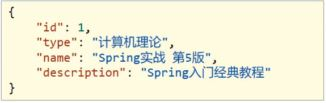
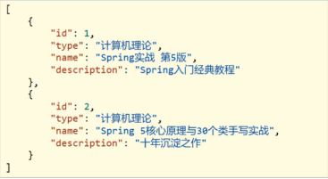
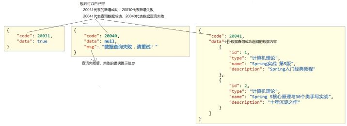
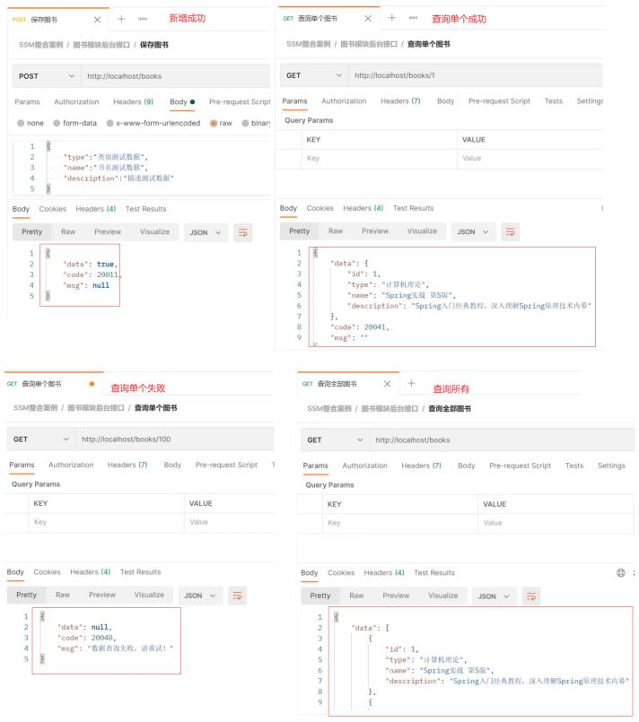

## 表现层与前端数据传输协议定义

SSM整合以及功能模块开发完成后，接下来，我们在上述案例的基础上分析下有哪些问题需要我们去解决下。首先第一个问题是:

* 在Controller层增删改返回给前端的是boolean类型数据

  ```
  true
  ```
* 在Controller层查询单个返回给前端的是对象

  
* 在Controller层查询所有返回给前端的是集合对象

  

目前我们就已经有三种数据类型返回给前端，如果随着业务的增长，我们需要返回的数据类型会越来越多。对于前端开发人员在解析数据的时候就比较凌乱了，所以对于前端来说，如果后台能够返回一个统一的数据结果，前端在解析的时候就可以按照一种方式进行解析。开发就会变得更加简单。

所以我们就想能不能将返回结果的数据进行统一，具体如何来做，大体的思路为:

* 为了封装返回的结果数据:创建结果模型类，封装数据到data属性中
* 为了封装返回的数据是何种操作及是否操作成功:封装操作结果到code属性中
* 操作失败后为了封装返回的错误信息:封装特殊消息到message(msg)属性中



根据分析，我们可以设置统一数据返回结果类

```
public class Result{
    private Object data;
    private Integer code;
    private String msg;
}
```

注意:Result类名及类中的字段并不是固定的，可以根据需要自行增减提供若干个构造方法，方便操作。

## 表现层与前端数据传输协议实现

前面我们已经分析了如何封装返回结果数据，具体在项目中该如何实现，我们通过个例子来操作一把

### 环境准备

* 创建一个Web的Maven项目
* pom.xml添加SSM整合所需jar包
* 创建对应的配置类
* 编写Controller、Service接口、Service实现类、Dao接口和模型类
* resources下提供jdbc.properties配置文件

因为这个项目环境的内容和SSM整合的内容是一致的，所以我们就不在把代码粘出来了，大家在练习的时候可以在前面整合的例子案例环境下，进行本节内容的开发。

最终创建好的项目结构如下:


### 结果封装

对于结果封装，我们应该是在表现层进行处理，所以我们把结果类放在controller包下，当然你也可以放在domain包，这个都是可以的，具体如何实现结果封装，具体的步骤为:

#### 步骤1:创建Result类

```
public class Result {
    //描述统一格式中的数据
    private Object data;
    //描述统一格式中的编码，用于区分操作，可以简化配置0或1表示成功失败
    private Integer code;
    //描述统一格式中的消息，可选属性
    private String msg;
    public Result() {
    }
    //构造方法是方便对象的创建
    public Result(Integer code,Object data) {
        this.data = data;
        this.code = code;
    }
    //构造方法是方便对象的创建
    public Result(Integer code, Object data, String msg) {
        this.data = data;
        this.code = code;
        this.msg = msg;
    }
//setter...getter...省略
}
```

#### 步骤2:定义返回码Code类

```
//状态码
public class Code {
    public static final Integer SAVE_OK = 20011;
    public static final Integer DELETE_OK = 20021;
    public static final Integer UPDATE_OK = 20031;
    public static final Integer GET_OK = 20041;
    public static final Integer SAVE_ERR = 20010;
    public static final Integer DELETE_ERR = 20020;
    public static final Integer UPDATE_ERR = 20030;
    public static final Integer GET_ERR = 20040;
}
```

注意:code类中的常量设计也不是固定的，可以根据需要自行增减，例如将查询再进行细分为GET_OK,GET_ALL_OK,GET_PAGE_OK等。

#### 步骤3:修改Controller类的返回值

```
//统一每一个控制器方法返回值
@RestController
@RequestMapping("/books")
public class BookController {
    @Autowired
    private BookService bookService;
    @PostMapping
    public Result save(@RequestBody Book book) {
        boolean flag = bookService.save(book);
        return new Result(flag ? Code.SAVE_OK:Code.SAVE_ERR,flag);
    }
    @PutMapping
    public Result update(@RequestBody Book book) {
        boolean flag = bookService.update(book);
        return new Result(flag ? Code.UPDATE_OK:Code.UPDATE_ERR,flag);
    }
    @DeleteMapping("/{id}")
    public Result delete(@PathVariable Integer id) {
        boolean flag = bookService.delete(id);
        return new Result(flag ? Code.DELETE_OK:Code.DELETE_ERR,flag);
    }
    @GetMapping("/{id}")
    public Result getById(@PathVariable Integer id) {
        Book book = bookService.getById(id);
        Integer code = book != null ? Code.GET_OK : Code.GET_ERR;
        String msg = book != null ? "" : "数据查询失败，请重试！";
        return new Result(code,book,msg);
    }
    @GetMapping
    public Result getAll() {
        List<Book> bookList = bookService.getAll();
        Integer code = bookList != null ? Code.GET_OK : Code.GET_ERR;
        String msg = bookList != null ? "" : "数据查询失败，请重试！";
        return new Result(code,bookList,msg);
    }
}
```

#### 步骤4:启动服务测试



至此，我们的返回结果就已经能以一种统一的格式返回给前端。前端根据返回的结果，先从中获取code ,根据code判断，如果成功则取data属性的值，如果失败，则取msg中的值做提示。
