## 问题描述

在讲解这一部分知识点之前，我们先来演示个效果，修改BookController类的getById方法

```
@GetMapping("/{id}")
public Result getById(@PathVariable Integer id) {
    //手动添加一个错误信息
    if(id==1){
        int i = 1/0;
    }
    Book book = bookService.getById(id);
    Integer code = book != null ? Code.GET_OK : Code.GET_ERR;
    String msg = book != null ? "" : "数据查询失败，请重试！";
    return new Result(code,book,msg);
}
```

重新启动运行项目，使用PostMan发送请求，当传入的id为1，则会出现如下效果：

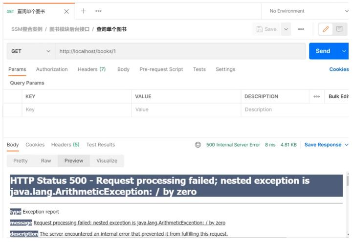

### 异常种类和原因

在解决问题之前，我们先来看下异常的种类及出现异常的原因:

* 框架内部抛出的异常：因使用不合规导致
* 数据层抛出的异常：因外部服务器故障导致（例如：服务器访问超时）
* 业务层抛出的异常：因业务逻辑书写错误导致（例如：遍历业务书写操作，导致索引异常等）
* 表现层抛出的异常：因数据收集、校验等规则导致（例如：不匹配的数据类型间导致异常）
* 工具类抛出的异常：因工具类书写不严谨不够健壮导致（例如：必要释放的连接长期未释放等）

看完上面这些出现异常的位置，你会发现，在我们开发的任何一个位置都有可能出现异常，而且这些异常是不能避免的。所以我们就得将异常进行处理。

**思考**

* 各个层级均出现异常，异常处理代码书写在哪一层?
  * 所有的异常均抛出到表现层进行处理
* 异常的种类很多，表现层如何将所有的异常都处理到呢?
  * 异常分类
* 表现层处理异常，每个方法中单独书写，代码书写量巨大且意义不强，如何解决?
  * AOP

对于上面这些问题及解决方案，SpringMVC已经为我们提供了一套解决方案:

异常处理器:

* 集中的、统一的处理项目中出现的异常。

  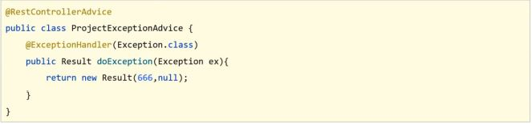

## 异常处理器的使用

### 环境准备

* 创建一个Web的Maven项目
* pom.xml添加SSM整合所需jar包
* 创建对应的配置类
* 编写Controller、Service接口、Service实现类、Dao接口和模型类
* resources下提供jdbc.properties配置文件

内容参考前面的项目或者直接使用前面的项目进行本节内容的学习。

最终创建好的项目结构如下:

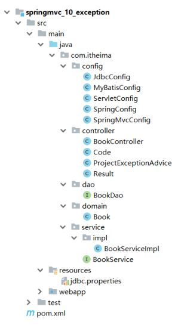

### 使用步骤

#### 步骤1:创建异常处理器类

```
//@RestControllerAdvice用于标识当前类为REST风格对应的异常处理器
@RestControllerAdvice
public class ProjectExceptionAdvice {
    //除了自定义的异常处理器，保留对Exception类型的异常处理，用于处理非预期的异常
    @ExceptionHandler(Exception.class)
    public void doException(Exception ex){
        System.out.println("嘿嘿,异常你哪里跑！")
    }
}
```

**确保SpringMvcConfig能够扫描到异常处理器类**

#### 步骤2:让程序抛出异常

修改BookController的getById方法，添加 `int i = 1/0` .

```
@GetMapping("/{id}")
public Result getById(@PathVariable Integer id) {
    int i = 1/0;
    Book book = bookService.getById(id);
    Integer code = book != null ? Code.GET_OK : Code.GET_ERR;
    String msg = book != null ? "" : "数据查询失败，请重试！";
    return new Result(code,book,msg);
}
```

#### 步骤3:运行程序，测试

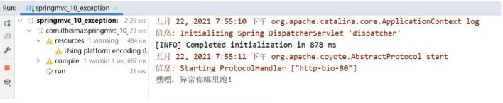

说明异常已经被拦截并执行了doException方法。

#### 异常处理器类返回结果给前端

```
//@RestControllerAdvice用于标识当前类为REST风格对应的异常处理器
@RestControllerAdvice
public class ProjectExceptionAdvice {
    //除了自定义的异常处理器，保留对Exception类型的异常处理，用于处理非预期的异常
    @ExceptionHandler(Exception.class)
    public Result doException(Exception ex){
        System.out.println("嘿嘿,异常你哪里跑！")
        return new Result(666,null,"嘿嘿,异常你哪里跑！");
    }
}
```

启动运行程序，测试

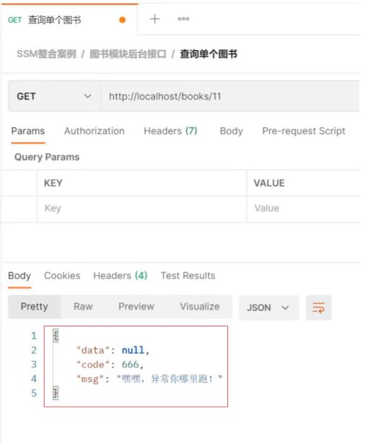

至此，就算后台执行的过程中抛出异常，最终也能按照我们和前端约定好的格式返回给前端。

**知识点1：@RestControllerAdvice**

| 名称 | @RestControllerAdvice              |
| ---- | ---------------------------------- |
| 类型 | 类注解                             |
| 位置 | Rest风格开发的控制器增强类定义上方 |
| 作用 | 为Rest风格开发的控制器类做增强     |

说明:此注解自带@ResponseBody注解与@Component注解，具备对应的功能

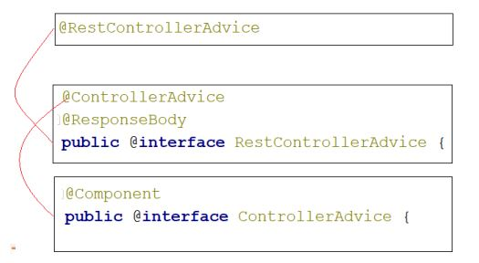

**知识点2：@ExceptionHandler**

| 名称 | @ExceptionHandler                                                                                   |
| ---- | --------------------------------------------------------------------------------------------------- |
| 类型 | 方法注解                                                                                            |
| 位置 | 专用于异常处理的控制器方法上方                                                                      |
| 作用 | 设置指定异常的处理方案，功能等同于控制器方法，<br />出现异常后终止原始控制器执行,并转入当前方法执行 |

说明：此类方法可以根据处理的异常不同，制作多个方法分别处理对应的异常

## 项目异常处理方案

### 异常分类

异常处理器我们已经能够使用了，那么在咱们的项目中该如何来处理异常呢?

因为异常的种类有很多，如果每一个异常都对应一个@ExceptionHandler，那得写多少个方法来处理各自的异常，所以我们在处理异常之前，需要对异常进行一个分类:

* 业务异常（BusinessException）
  * 规范的用户行为产生的异常
    * 用户在页面输入内容的时候未按照指定格式进行数据填写，如在年龄框输入的是字符串
      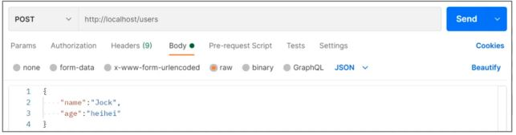
    * 不规范的用户行为操作产生的异常
      * 如用户故意传递错误数据
        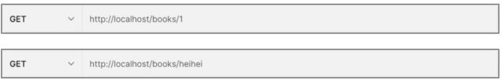
* 系统异常（SystemException）
  * 项目运行过程中可预计但无法避免的异常
    * 比如数据库或服务器宕机
* 其他异常（Exception）
  * 编程人员未预期到的异常，如:用到的文件不存在

    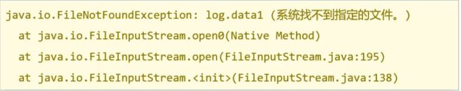

将异常分类以后，针对不同类型的异常，要提供具体的解决方案

### 异常解决方案

* 业务异常（BusinessException）
  * 发送对应消息传递给用户，提醒规范操作
    * 大家常见的就是提示用户名已存在或密码格式不正确等
* 系统异常（SystemException）
  * 发送固定消息传递给用户，安抚用户
    * 系统繁忙，请稍后再试
    * 系统正在维护升级，请稍后再试
    * 系统出问题，请联系系统管理员等
* 发送特定消息给运维人员，提醒维护
  * 可以发送短信、邮箱或者是公司内部通信软件
* 记录日志
  * 发消息和记录日志对用户来说是不可见的，属于后台程序
* 其他异常（Exception）
  * 发送固定消息传递给用户，安抚用户
  * 发送特定消息给编程人员，提醒维护（纳入预期范围内）
    * 一般是程序没有考虑全，比如未做非空校验等
  * 记录日志

### 异常解决方案的具体实现

#### 思路

1. 先通过自定义异常，完成BusinessException和SystemException的定义
2. 将其他异常包装成自定义异常类型
3. 在异常处理器类中对不同的异常进行处理

#### 步骤1:自定义异常类

```
//自定义异常处理器，用于封装异常信息，对异常进行分类
public class SystemException extends RuntimeException{
    private Integer code;
    public Integer getCode() {
        return code;
    }
    public void setCode(Integer code) {
        this.code = code;
    }
    public SystemException(Integer code, String message) {
        super(message);
        this.code = code;
    }
    public SystemException(Integer code, String message, Throwable cause) {
        super(message, cause);
        this.code = code;
    }
}
//自定义异常处理器，用于封装异常信息，对异常进行分类
public class BusinessException extends RuntimeException{
    private Integer code;
    public Integer getCode() {
        return code;
    }
    public void setCode(Integer code) {
        this.code = code;
    }
    public BusinessException(Integer code, String message) {
        super(message);
        this.code = code;
    }
    public BusinessException(Integer code, String message, Throwable cause) {
        super(message, cause);
        this.code = code;
    }
}
```

**说明:**

* 让自定义异常类继承RuntimeException的好处是，后期在抛出这两个异常的时候，就不用在try...catch...或throws了
* 自定义异常类中添加code属性的原因是为了更好的区分异常是来自哪个业务的

#### 步骤2:将其他异常包成自定义异常

假如在BookServiceImpl的getById方法抛异常了，该如何来包装呢?

```
public Book getById(Integer id) {
    //模拟业务异常，包装成自定义异常
    if(id == 1){
        throw new BusinessException(Code.BUSINESS_ERR,"请不要使用你的技术挑战我的耐性!");
    }
    //模拟系统异常，将可能出现的异常进行包装，转换成自定义异常
    try{
        int i = 1/0;
    }catch (Exception e){
        throw new SystemException(Code.SYSTEM_TIMEOUT_ERR,"服务器访问超时，请重试!",e);
    }
    return bookDao.getById(id);
}
```

具体的包装方式有：

* 方式一: try{}catch(){}在catch中重新throw我们自定义异常即可。
* 方式二:直接throw自定义异常即可

上面为了使code看着更专业些，我们在Code类中再新增需要的属性

```
//状态码
public class Code {
    public static final Integer SAVE_OK = 20011;
    public static final Integer DELETE_OK = 20021;
    public static final Integer UPDATE_OK = 20031;
    public static final Integer GET_OK = 20041;
    public static final Integer SAVE_ERR = 20010;
    public static final Integer DELETE_ERR = 20020;
    public static final Integer UPDATE_ERR = 20030;
    public static final Integer GET_ERR = 20040;
    public static final Integer SYSTEM_ERR = 50001;
    public static final Integer SYSTEM_TIMEOUT_ERR = 50002;
    public static final Integer SYSTEM_UNKNOW_ERR = 59999;
    public static final Integer BUSINESS_ERR = 60002;
}
```

#### 步骤3:处理器类中处理自定义异常

```
//@RestControllerAdvice用于标识当前类为REST风格对应的异常处理器
@RestControllerAdvice
public class ProjectExceptionAdvice {
    //@ExceptionHandler用于设置当前处理器类对应的异常类型
    @ExceptionHandler(SystemException.class)
    public Result doSystemException(SystemException ex){
        //记录日志
        //发送消息给运维
        //发送邮件给开发人员,ex对象发送给开发人员
        return new Result(ex.getCode(),null,ex.getMessage());
    }
    @ExceptionHandler(BusinessException.class)
    public Result doBusinessException(BusinessException ex){
        return new Result(ex.getCode(),null,ex.getMessage());
    }
    //除了自定义的异常处理器，保留对Exception类型的异常处理，用于处理非预期的异常
    @ExceptionHandler(Exception.class)
    public Result doOtherException(Exception ex){
        //记录日志
        //发送消息给运维
        //发送邮件给开发人员,ex对象发送给开发人员
        return new Result(Code.SYSTEM_UNKNOW_ERR,null,"系统繁忙，请稍后再试！");
    }
}
```

#### 步骤4:运行程序

根据ID查询，如果传入的参数为1，会报BusinessException

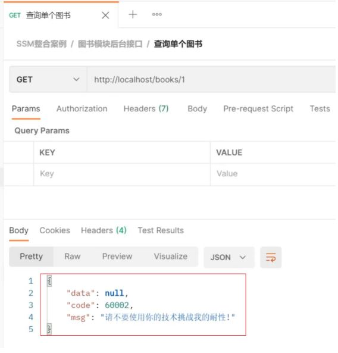

如果传入的是其他参数，会报SystemException

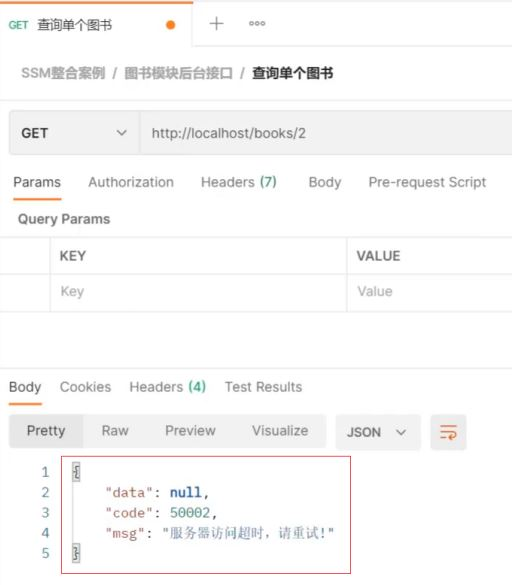

对于异常我们就已经处理完成了，不管后台哪一层抛出异常，都会以我们与前端约定好的方式进行返回，前端只需要把信息获取到，根据返回的正确与否来展示不同的内容即可。

**小结**

以后项目中的异常处理方式为:

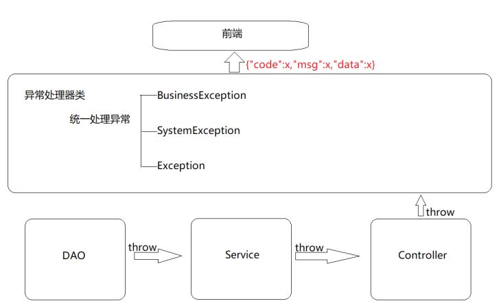
