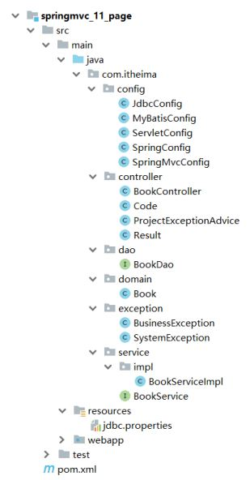
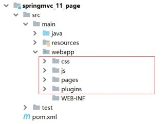
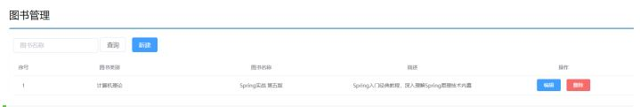
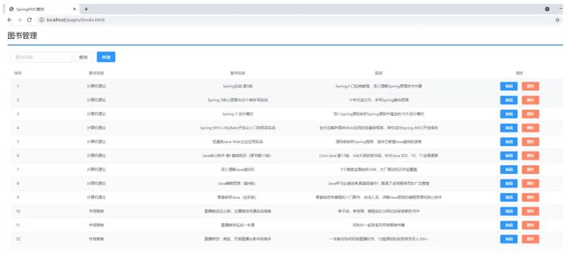
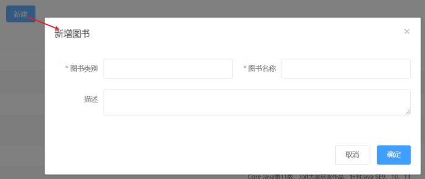
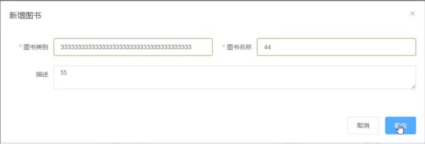
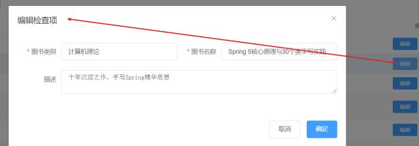

## 环境准备

* 创建一个Web的Maven项目
* pom.xml添加SSM整合所需jar包
* 创建对应的配置类
* 编写Controller、Service接口、Service实现类、Dao接口和模型类
* resources下提供jdbc.properties配置文件

内容参考前面的项目或者直接使用前面的项目进行本节内容的学习。

最终创建好的项目结构如下:



将资料\SSM功能页面下面的静态资源拷贝到webapp下。



因为添加了静态资源，SpringMVC会拦截，所有需要在SpringConfig的配置类中将静态资源进行放行。

* 新建SpringMvcSupport

  ```
  @Configuration
  public class SpringMvcSupport extends WebMvcConfigurationSupport {
      @Override
      protected void addResourceHandlers(ResourceHandlerRegistry registry) {
          registry.addResourceHandler("/pages/**").addResourceLocations("/pages/");
          registry.addResourceHandler("/css/**").addResourceLocations("/css/");
          registry.addResourceHandler("/js/**").addResourceLocations("/js/");
          registry.addResourceHandler("/plugins/**").addResourceLocations("/plugins
                  /");
      }
  }
  ```
* 在SpringMvcConfig中扫描SpringMvcSupport

  ```
  @Configuration
  @ComponentScan({"com.itheima.controller","com.itheima.config"})
  @EnableWebMvc
  public class SpringMvcConfig {
  }
  ```

接下来我们就需要将所有的列表查询、新增、修改、删除等功能一个个来实现下。

## 列表功能



需求:页面加载完后发送异步请求到后台获取列表数据进行展示。

1. 找到页面的钩子函数，created()
2. created()方法中调用了this.getAll()方法
3. 在getAll()方法中使用axios发送异步请求从后台获取数据
4. 访问的路径为http://localhost/books
5. 返回数据

返回数据res.data的内容如下:

```
{
    "data": [
        {
            "id": 1,
            "type": "计算机理论",
            "name": "Spring实战 第五版",
            "description": "Spring入门经典教程，深入理解Spring原理技术内幕"
        },
        {
            "id": 2,
            "type": "计算机理论",
            "name": "Spring 5核心原理与30个类手写实践",
            "description": "十年沉淀之作，手写Spring精华思想"
        },...
    ],
    "code": 20041,
    "msg": ""
}
```

发送方式:

```
getAll() {
    //发送ajax请求
    axios.get("/books").then((res)=>{
        this.dataList = res.data.data;
    });
}
```



## 添加功能



需求:完成图片的新增功能模块

1.找到页面上的新建按钮，按钮上绑定了@click="handleCreate()"方法

2.在method中找到handleCreate方法，方法中打开新增面板

3.新增面板中找到确定按钮,按钮上绑定了@click="handleAdd()"方法

4.在method中找到handleAdd方法

5.在方法中发送请求和数据，响应成功后将新增面板关闭并重新查询数据

handleCreate打开新增面板

```
handleCreate() {
    this.dialogFormVisible = true;
},
```

handleAdd方法发送异步请求并携带数据

```
handleAdd () {
    //发送ajax请求
    //this.formData是表单中的数据，最后是一个json数据
    axios.post("/books",this.formData).then((res)=>{
        this.dialogFormVisible = false;
        this.getAll();
    });
}
```

## 添加功能状态处理

基础的新增功能已经完成，但是还有一些问题需要解决下:

需求:新增成功是关闭面板，重新查询数据，那么新增失败以后该如何处理?

1.在handlerAdd方法中根据后台返回的数据来进行不同的处理

2.如果后台返回的是成功，则提示成功信息，并关闭面板

3.如果后台返回的是失败，则提示错误信息

修改前端页面

```
handleAdd () {
    //发送ajax请求
    axios.post("/books",this.formData).then((res)=>{
        //如果操作成功，关闭弹层，显示数据
        if(res.data.code == 20011){
            this.dialogFormVisible = false;
            this.$message.success("添加成功");
        }else if(res.data.code == 20010){
            this.$message.error("添加失败");
        }else{
            this.$message.error(res.data.msg);
        }
    }).finally(()=>{
        this.getAll();
    });
}
```

后台返回操作结果，将Dao层的增删改方法返回值从void改成int

```
public interface BookDao {
    // @Insert("insert into tbl_book values(null,#{type},#{name},#
    {description})")
    @Insert("insert into tbl_book (type,name,description) values(#{type},# {name},#{description})")
    public int save(Book book);
    @Update("update tbl_book set type = #{type}, name = #{name}, description = #{description} where id = #{id}")
    public int update(Book book);
    @Delete("delete from tbl_book where id = #{id}")
    public int delete(Integer id);
    @Select("select * from tbl_book where id = #{id}")
    public Book getById(Integer id);
    @Select("select * from tbl_book")
    public List<Book> getAll();
}
```

在BookServiceImpl中，增删改方法根据DAO的返回值来决定返回true/false

```
@Service
public class BookServiceImpl implements BookService {
    @Autowired
    private BookDao bookDao;
    public boolean save(Book book) {
        return bookDao.save(book) > 0;
    }
    public boolean update(Book book) {
        return bookDao.update(book) > 0;
    }
    public boolean delete(Integer id) {
        return bookDao.delete(id) > 0;
    }
    public Book getById(Integer id) {
        if(id == 1){
            throw new BusinessException(Code.BUSINESS_ERR,"请不要使用你的技术挑战
                    我的耐性!");
        }
    // //将可能出现的异常进行包装，转换成自定义异常
    // try{
    // int i = 1/0;
    // }catch (Exception e){
    // throw new SystemException(Code.SYSTEM_TIMEOUT_ERR,"服务器访问超时，请重试!",e);
    // }
        return bookDao.getById(id);
    }
    public List<Book> getAll() {
        return bookDao.getAll();
    }
}
```

测试错误情况，将图书类别长度设置超出范围即可



处理完新增后，会发现新增还存在一个问题，

新增成功后，再次点击新增按钮会发现之前的数据还存在，这个时候就需要在新增的时候将表单内容清空。

```
resetForm(){
    this.formData = {};
}
handleCreate() {
    this.dialogFormVisible = true;
    this.resetForm();
}
```

## 修改功能



需求:完成图书信息的修改功能

1.找到页面中的编辑按钮，该按钮绑定了@click="handleUpdate(scope.row)"

2.在method的handleUpdate方法中发送异步请求根据ID查询图书信息

3.根据后台返回的结果，判断是否查询成功。如果查询成功打开修改面板回显数据，如果失败提示错误信息

4.修改完成后找到修改面板的确定按钮，该按钮绑定了@click="handleEdit()"

5.在method的handleEdit方法中发送异步请求提交修改数据

6.根据后台返回的结果，判断是否修改成功。如果成功提示错误信息，关闭修改面板，重新查询数据，如果失败提示错误信息

scope.row代表的是当前行的行数据，也就是说,scope.row就是选中行对应的json数据，如下:

```
{
  "id": 1,
  "type": "计算机理论",
  "name": "Spring实战 第五版",
  "description": "Spring入门经典教程，深入理解Spring原理技术内幕"
}
```

修改handleUpdate方法

```
//弹出编辑窗口
handleUpdate(row) {
  // console.log(row); //row.id 查询条件
  //查询数据，根据id查询
  axios.get("/books/"+row.id).then((res)=>{
    if(res.data.code == 20041){
    //展示弹层，加载数据
    this.formData = res.data.data;
    this.dialogFormVisible4Edit = true;
    }else{
      this.$message.error(res.data.msg);
    }
  });
}
```

修改handleEdit方法

```
handleEdit() {
  //发送ajax请求
  axios.put("/books",this.formData).then((res)=>{
    //如果操作成功，关闭弹层，显示数据
    if(res.data.code == 20031){
    this.dialogFormVisible4Edit = false;
    this.$message.success("修改成功");
    }else if(res.data.code == 20030){
      this.$message.error("修改失败");
    }else{
      this.$message.error(res.data.msg);
    }
  }).finally(()=>{
    this.getAll();
});
}
```

至此修改功能就已经完成。

## 删除功能


需求:完成页面的删除功能。

1.找到页面的删除按钮，按钮上绑定了@click="handleDelete(scope.row)"

2.method的handleDelete方法弹出提示框

3.用户点击取消,提示操作已经被取消。

4.用户点击确定，发送异步请求并携带需要删除数据的主键ID

5.根据后台返回结果做不同的操作

* 如果返回成功，提示成功信息，并重新查询数据
* 如果返回失败，提示错误信息，并重新查询数据

修改handleDelete方法

```
handleDelete(row) {
    //1.弹出提示框
    this.$confirm("此操作永久删除当前数据，是否继续？","提示",{
        type:'info'
    }).then(()=>{
        //2.做删除业务
        axios.delete("/books/"+row.id).then((res)=>{
            if(res.data.code == 20021){
                this.$message.success("删除成功");
            }else{
                this.$message.error("删除失败");
            }
        }).finally(()=>{
            this.getAll();
        });
    }).catch(()=>{
        //3.取消删除
        this.$message.info("取消删除操作");
    });
}
```

接下来，下面是一个完整页面

```
<!DOCTYPE html>
<html>
<head>
    <!-- 页面meta -->
    <meta charset="utf-8">
    <meta http-equiv="X-UA-Compatible" content="IE=edge">
    <title>SpringMVC案例</title>
    <meta content="width=device-width,initial-scale=1,maximumscale=1,user-scalable=no" name="viewport">
    <!-- 引入样式 -->
    <link rel="stylesheet" href="../plugins/elementui/index.css">
    <link rel="stylesheet" href="../plugins/font-awesome/css/fontawesome.min.css">
    <link rel="stylesheet" href="../css/style.css">
</head>
<body class="hold-transition">
<div id="app">
    <div class="content-header">
        <h1>图书管理</h1>
    </div>
    <div class="app-container">
        <div class="box">
            <div class="filter-container">
                <el-input placeholder="图书名称" vmodel="pagination.queryString" style="width: 200px;"
                          class="filter-item">
                </el-input>
                <el-button @click="getAll()" class="dalfBut">查询
                </el-button>
                <el-button type="primary" class="butT"
                           @click="handleCreate()">新建
                </el-button>
            </div>
            <el-table size="small" current-row-key="id"
                      :data="dataList" stripe highlight-current-row>
                <el-table-column type="index" align="center"
                                 label="序号"></el-table-column>
                <el-table-column prop="type" label="图书类别"
                                 align="center"></el-table-column>
                <el-table-column prop="name" label="图书名称"
                                 align="center"></el-table-column>
                <el-table-column prop="description" label="描述"
                                 align="center"></el-table-column>
                <el-table-column label="操作" align="center">
                    <template slot-scope="scope">
                        <el-button type="primary" size="mini"
                                   @click="handleUpdate(scope.row)">编辑
                        </el-button>
                        <el-button type="danger" size="mini"
                                   @click="handleDelete(scope.row)">删除
                        </el-button>
                    </template>
                </el-table-column>
            </el-table>
            <!-- 新增标签弹层 -->
            <div class="add-form">
                <el-dialog title="新增图书"
                           :visible.sync="dialogFormVisible">
                    <el-form ref="dataAddForm" :model="formData"
                             :rules="rules" label-position="right" label-width="100px">
                        <el-row>
                            <el-col :span="12">
                                <el-form-item label="图书类别"
                                              prop="type">
                                    <el-input vmodel="formData.type"/>
                                </el-form-item>
                            </el-col>
                            <el-col :span="12">
                                <el-form-item label="图书名称"
                                              prop="name">
                                    <el-input vmodel="formData.name"/>
                                </el-form-item>
                            </el-col>
                        </el-row>
                        <el-row>
                            <el-col :span="24">
                                <el-form-item label="描述">
                                    <el-input vmodel="formData.description" type="textarea"></el-input>
                                </el-form-item>
                            </el-col>
                        </el-row>
                    </el-form>
                    <div slot="footer" class="dialog-footer">
                        <el-button @click="dialogFormVisible =
false">取消
                        </el-button>
                        <el-button type="primary"
                                   @click="handleAdd()">确定
                        </el-button>
                    </div>
                </el-dialog>
            </div>
            <!-- 编辑标签弹层 -->
            <div class="add-form">
                <el-dialog title="编辑检查项"
                           :visible.sync="dialogFormVisible4Edit">
                    <el-form ref="dataEditForm" :model="formData"
                             :rules="rules" label-position="right" label-width="100px">
                        <el-row>
                            <el-col :span="12">
                                <el-form-item label="图书类别"
                                              prop="type">
                                    <el-input vmodel="formData.type"/>
                                </el-form-item>
                            </el-col>
                            <el-col :span="12">
                                <el-form-item label="图书名称"
                                              prop="name">
                                    <el-input vmodel="formData.name"/>
                                </el-form-item>
                            </el-col>
                        </el-row>
                        <el-row>
                            <el-col :span="24">
                                <el-form-item label="描述">
                                    <el-input vmodel="formData.description" type="textarea"></el-input>
                                </el-form-item>
                            </el-col>
                        </el-row>
                    </el-form>
                    <div slot="footer" class="dialog-footer">
                        <el-button @click="dialogFormVisible4Edit =
false">取消
                        </el-button>
                        <el-button type="primary"
                                   @click="handleEdit()">确定
                        </el-button>
                    </div>
                </el-dialog>
            </div>
        </div>
    </div>
</div>
</body>
<!-- 引入组件库 -->
<script src="../js/vue.js"></script>
<script src="../plugins/elementui/index.js"></script>
<script type="text/javascript" src="../js/jquery.min.js"></script>
<script src="../js/axios-0.18.0.js"></script>
<script>
    var vue = new Vue({
    el: '#app',
    data:{
    pagination: {},
    dataList: [],//当前页要展示的列表数据
    formData: {},//表单数据
    dialogFormVisible: false,//控制表单是否可见
    dialogFormVisible4Edit:false,//编辑表单是否可见
    rules: {//校验规则
    type: [{ required: true, message: '图书类别为必填项',
    trigger: 'blur' }],
    name: [{ required: true, message: '图书名称为必填项',
    trigger: 'blur' }]
    }
    },
    //钩子函数，VUE对象初始化完成后自动执行
    created() {
    this.getAll();
    },
    methods: {
    //列表
    getAll() {
    //发送ajax请求
    axios.get("/books").then((res)=>{
    this.dataList = res.data.data;
    });
    },
    //弹出添加窗口
    handleCreate() {
    this.dialogFormVisible = true;
    this.resetForm();
},
//重置表单
resetForm() {
this.formData = {};
},
//添加
handleAdd () {
//发送ajax请求
axios.post("/books",this.formData).then((res)=>{
console.log(res.data);
//如果操作成功，关闭弹层，显示数据
if(res.data.code == 20011){
this.dialogFormVisible = false;
this.$message.success("添加成功");
}else if(res.data.code == 20010){
this.$message.error("添加失败");
}else{
this.$message.error(res.data.msg);
}
}).finally(()=>{
this.getAll();
});
},
//弹出编辑窗口
handleUpdate(row) {
// console.log(row); //row.id 查询条件
//查询数据，根据id查询
axios.get("/books/"+row.id).then((res)=>{
// console.log(res.data.data);
if(res.data.code == 20041){
//展示弹层，加载数据
this.formData = res.data.data;
this.dialogFormVisible4Edit = true;
}else{
this.$message.error(res.data.msg);
}
});
},
//编辑
handleEdit() {
//发送ajax请求
axios.put("/books",this.formData).then((res)=>{
   //如果操作成功，关闭弹层，显示数据
if(res.data.code == 20031){
this.dialogFormVisible4Edit = false;
this.$message.success("修改成功");
}else if(res.data.code == 20030){
this.$message.error("修改失败");
}else{
this.$message.error(res.data.msg);
}
}).finally(()=>{
this.getAll();
});
},
// 删除
handleDelete(row) {
//1.弹出提示框
this.$confirm("此操作永久删除当前数据，是否继续？","提示",{
type:'info'
}).then(()=>{
//2.做删除业务
axios.delete("/books/"+row.id).then((res)=>{
if(res.data.code == 20021){
this.$message.success("删除成功");
}else{
this.$message.error("删除失败");
}
}).finally(()=>{
this.getAll();
});
}).catch(()=>{
//3.取消删除
this.$message.info("取消删除操作");
});
}
}
})
</script>
</html>
```
