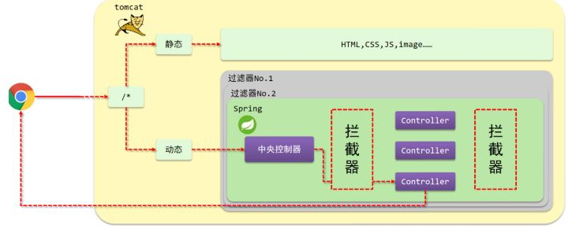
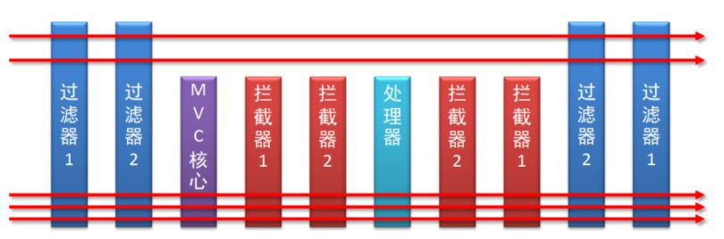
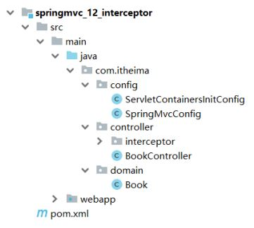
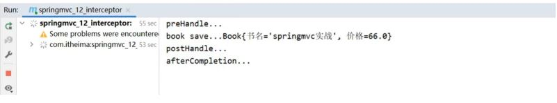
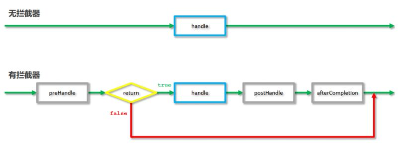
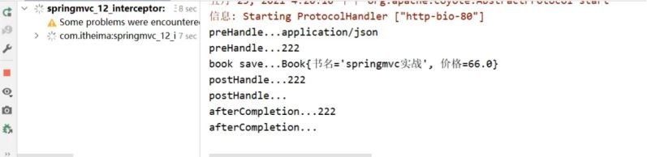
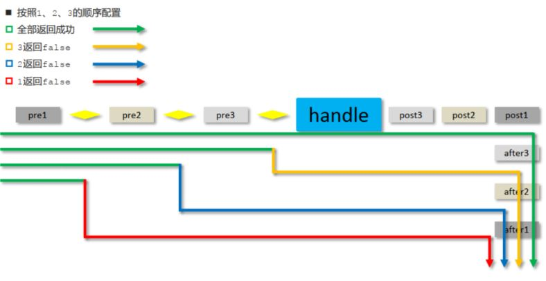

对于拦截器这节的知识，我们需要学习如下内容:

* 拦截器概念
* 入门案例
* 拦截器参数
* 拦截器工作流程分析

## 拦截器概念

讲解拦截器的概念之前，我们先看一张图:



(1)浏览器发送一个请求会先到Tomcat的web服务器

(2)Tomcat服务器接收到请求以后，会去判断请求的是静态资源还是动态资源

(3)如果是静态资源，会直接到Tomcat的项目部署目录下去直接访问

(4)如果是动态资源，就需要交给项目的后台代码进行处理

(5)在找到具体的方法之前，我们可以去配置过滤器(可以配置多个)，按照顺序进行执行

(6)然后进入到到中央处理器(SpringMVC中的内容)，SpringMVC会根据配置的规则进行拦截

(7)如果满足规则，则进行处理，找到其对应的controller类中的方法进行执行,完成后返回结果

(8)如果不满足规则，则不进行处理

(9)这个时候，如果我们需要在每个Controller方法执行的前后添加业务，具体该如何来实现?

这个就是拦截器要做的事。

* 拦截器（Interceptor）是一种动态拦截方法调用的机制，在SpringMVC中动态拦截控制器方法的执行
* 作用:
  * 在指定的方法调用前后执行预先设定的代码
  * 阻止原始方法的执行
  * 总结：拦截器就是用来做增强

## 拦截器和过滤器差异

看完以后，大家会发现

* 拦截器和过滤器在作用和执行顺序上也很相似

所以这个时候，就有一个问题需要思考:拦截器和过滤器之间的区别是什么?

* 归属不同：Filter属于Servlet技术，Interceptor属于SpringMVC技术
* 拦截内容不同：Filter对所有访问进行增强，Interceptor仅针对SpringMVC的访问进行增强



## 拦截器入门案例

### 环境准备

* 创建一个Web的Maven项目
* pom.xml添加SSM整合所需jar包

  ```
  <?xml version="1.0" encoding="UTF-8"?>
  <project xmlns="http://maven.apache.org/POM/4.0.0"
           xmlns:xsi="http://www.w3.org/2001/XMLSchema-instance"
           xsi:schemaLocation="http://maven.apache.org/POM/4.0.0
  http://maven.apache.org/xsd/maven-4.0.0.xsd">
      <modelVersion>4.0.0</modelVersion>
      <groupId>com.itheima</groupId>
      <artifactId>springmvc_12_interceptor</artifactId>
      <version>1.0-SNAPSHOT</version>
      <packaging>war</packaging>
      <dependencies>
          <dependency>
              <groupId>javax.servlet</groupId>
              <artifactId>javax.servlet-api</artifactId>
              <version>3.1.0</version>
              <scope>provided</scope>
          </dependency>
          <dependency>
              <groupId>org.springframework</groupId>
              <artifactId>spring-webmvc</artifactId>
              <version>5.2.10.RELEASE</version>
          </dependency>
          <dependency>
              <groupId>com.fasterxml.jackson.core</groupId>
              <artifactId>jackson-databind</artifactId>
              <version>2.9.0</version>
          </dependency>
      </dependencies>
      <build>
          <plugins>
              <plugin>
                  <groupId>org.apache.tomcat.maven</groupId>
                  <artifactId>tomcat7-maven-plugin</artifactId>
                  <version>2.1</version>
                  <configuration>
                      <port>80</port>
                      <path>/</path>
                  </configuration>
              </plugin>
              <plugin>
                  <groupId>org.apache.maven.plugins</groupId>
                  <artifactId>maven-compiler-plugin</artifactId>
                  <configuration>
                      <source>8</source>
                      <target>8</target>
                  </configuration>
              </plugin>
          </plugins>
      </build>
  </project>
  ```
* 创建对应的配置类

  ```
  public class ServletContainersInitConfig extends
          AbstractAnnotationConfigDispatcherServletInitializer {
      protected Class<?>[] getRootConfigClasses() {
          return new Class[0];
      }
      protected Class<?>[] getServletConfigClasses() {
          return new Class[]{SpringMvcConfig.class};
      }
      protected String[] getServletMappings() {
          return new String[]{"/"};
      }
      //乱码处理
      @Override
      protected Filter[] getServletFilters() {
          CharacterEncodingFilter filter = new CharacterEncodingFilter();
          filter.setEncoding("UTF-8");
          return new Filter[]{filter};
      }
  }
  @Configuration
  @ComponentScan({"com.itheima.controller"})
  @EnableWebMvc
  public class SpringMvcConfig{
  }
  ```
* 创建模型类Book

  ```
  public class Book {
      private String name;
      private double price;
      public String getName() {
          return name;
      }
      public void setName(String name) {
          this.name = name;
      }
      public double getPrice() {
          return price;
      }
      public void setPrice(double price) {
          this.price = price;
      }
      @Override
      public String toString() {
          return "Book{" +
                  "书名='" + name + '\'' +
                  ", 价格=" + price +
                  '}';
      }
  }
  ```
* 编写Controller

  ```
  @RestController
  @RequestMapping("/books")
  public class BookController {
      @PostMapping
      public String save(@RequestBody Book book){
          System.out.println("book save..." + book);
          return "{'module':'book save'}";
      }
      @DeleteMapping("/{id}")
      public String delete(@PathVariable Integer id){
          System.out.println("book delete..." + id);
          return "{'module':'book delete'}";
      }
      @PutMapping
      public String update(@RequestBody Book book){
          System.out.println("book update..."+book);
          return "{'module':'book update'}";
      }
      @GetMapping("/{id}")
      public String getById(@PathVariable Integer id){
          System.out.println("book getById..."+id);
          return "{'module':'book getById'}";
      }
      @GetMapping
      public String getAll(){
          System.out.println("book getAll...");
          return "{'module':'book getAll'}";
      }
  }
  ```

最终创建好的项目结构如下:



### 拦截器开发

#### 步骤1:创建拦截器类

让类实现HandlerInterceptor接口，重写接口中的三个方法。

```
@Component
//定义拦截器类，实现HandlerInterceptor接口
//注意当前类必须受Spring容器控制
public class ProjectInterceptor implements HandlerInterceptor {
    @Override
    //原始方法调用前执行的内容
    public boolean preHandle(HttpServletRequest request, HttpServletResponse
            response, Object handler) throws Exception {
        System.out.println("preHandle...");
        return true;
    }
    @Override
    //原始方法调用后执行的内容
    public void postHandle(HttpServletRequest request, HttpServletResponse
            response, Object handler, ModelAndView modelAndView) throws Exception {
        System.out.println("postHandle...");
    }
    @Override
    //原始方法调用完成后执行的内容
    public void afterCompletion(HttpServletRequest request,
                                HttpServletResponse response, Object handler, Exception ex) throws Exception
    {
        System.out.println("afterCompletion...");
    }
}
```

注意:拦截器类要被SpringMVC容器扫描到。

#### 步骤2:配置拦截器类

```
@Configuration
public class SpringMvcSupport extends WebMvcConfigurationSupport {
    @Autowired
    private ProjectInterceptor projectInterceptor;
    @Override
    protected void addResourceHandlers(ResourceHandlerRegistry registry) {
        registry.addResourceHandler("/pages/**").addResourceLocations("/pages/");
    }
    @Override
    protected void addInterceptors(InterceptorRegistry registry) {
        //配置拦截器
        registry.addInterceptor(projectInterceptor).addPathPatterns("/books"
        );
    }
}
```

#### 步骤3:SpringMVC添加SpringMvcSupport包扫描

```
@Configuration
@ComponentScan({"com.itheima.controller","com.itheima.config"})
@EnableWebMvc
public class SpringMvcConfig{
}
```

#### 步骤4:运行程序测试

使用PostMan发送http://localhost/books



如果发送http://localhost/books/100会发现拦截器没有被执行，原因是拦截器的addPathPatterns方法配置的拦截路径是/books ,我们现在发送的是/books/100，所以没有匹配上，因此没有拦截，拦截器就不会执行。

#### 步骤5:修改拦截器拦截规则

```
@Configuration
public class SpringMvcSupport extends WebMvcConfigurationSupport {
    @Autowired
    private ProjectInterceptor projectInterceptor;
    @Override
    protected void addResourceHandlers(ResourceHandlerRegistry registry) {
        registry.addResourceHandler("/pages/**").addResourceLocations("/pages/");
    }
    @Override
    protected void addInterceptors(InterceptorRegistry registry) {
        //配置拦截器
        registry.addInterceptor(projectInterceptor).addPathPatterns("/books","/books/*" );
    }
}
```

这个时候，如果再次访问http://localhost/books/100，拦截器就会被执行。

最后说一件事，就是拦截器中的preHandler方法，如果返回true,则代表放行，会执行原始Controller类中要请求的方法，如果返回false，则代表拦截，后面的就不会再执行了。

#### 步骤6:简化SpringMvcSupport的编写

```
@Configuration
@ComponentScan({"com.itheima.controller"})
@EnableWebMvc
//实现WebMvcConfigurer接口可以简化开发，但具有一定的侵入性
public class SpringMvcConfig implements WebMvcConfigurer {
    @Autowired
    private ProjectInterceptor projectInterceptor;
    @Override
    public void addInterceptors(InterceptorRegistry registry) {
        //配置多拦截器
        registry.addInterceptor(projectInterceptor).addPathPatterns("/books","/books/*");
    }
}
```

此后咱们就不用再写SpringMvcSupport类了。

最后我们来看下拦截器的执行流程:



当有拦截器后，请求会先进入preHandle方法，

如果方法返回true，则放行继续执行后面的handle[controller的方法]和后面的方法

如果返回false，则直接跳过后面方法的执行。

## 拦截器参数

### 前置处理方法

原始方法之前运行preHandle

```
public boolean preHandle(HttpServletRequest request,
        HttpServletResponse response,
        Object handler) throws Exception {
    System.out.println("preHandle");
    return true;
}
```

* request:请求对象
* response:响应对象
* handler:被调用的处理器对象，本质上是一个方法对象，对反射中的Method对象进行了再包装

使用request对象可以获取请求数据中的内容，如获取请求头的Content-Type

```
public boolean preHandle(HttpServletRequest request, 
        HttpServletResponse 
        response, Object handler) throws Exception {
    String contentType = request.getHeader("Content-Type");
    System.out.println("preHandle..."+contentType);
    return true;
}
```

使用handler参数，可以获取方法的相关信息

```
public boolean preHandle(HttpServletRequest request, HttpServletResponse
        response, Object handler) throws Exception {
        HandlerMethod hm = (HandlerMethod)handler;
        String methodName = hm.getMethod().getName();//可以获取方法的名称
        System.out.println("preHandle..."+methodName);
        return true;
        }
```

### 后置处理方法

原始方法运行后运行，如果原始方法被拦截，则不执行

```
public boolean preHandle(HttpServletRequest request, 
        HttpServletResponse response, 
        Object handler) throws Exception {
    HandlerMethod hm = (HandlerMethod)handler;
    String methodName = hm.getMethod().getName();//可以获取方法的名称
    System.out.println("preHandle..."+methodName);
    return true;
}
```

前三个参数和上面的是一致的。

modelAndView:如果处理器执行完成具有返回结果，可以读取到对应数据与页面信息，并进行调整

因为咱们现在都是返回json数据，所以该参数的使用率不高。

### 完成处理方法

拦截器最后执行的方法，无论原始方法是否执行

```
public void afterCompletion(HttpServletRequest request,
        HttpServletResponse response,
        Object handler,
        Exception ex) throws Exception {
    System.out.println("afterCompletion");
}
```

前三个参数与上面的是一致的。

ex:如果处理器执行过程中出现异常对象，可以针对异常情况进行单独处理

因为我们现在已经有全局异常处理器类，所以该参数的使用率也不高。

这三个方法中，最常用的是preHandle,在这个方法中可以通过返回值来决定是否要进行放行，我们

可以把业务逻辑放在该方法中，如果满足业务则返回true放行，不满足则返回false拦截。

## 拦截器链配置

目前，我们在项目中只添加了一个拦截器，如果有多个，该如何配置?配置多个后，执行顺序是什么?

### 配置多个拦截器

#### 步骤1:创建拦截器类

实现接口，并重写接口中的方法

```
@Component
public class ProjectInterceptor2 implements HandlerInterceptor {
    @Override
    public boolean preHandle(HttpServletRequest request, HttpServletResponse
            response, Object handler) throws Exception {
        System.out.println("preHandle...222");
        return false;
    }
    @Override
    public void postHandle(HttpServletRequest request, HttpServletResponse
            response, Object handler, ModelAndView modelAndView) throws Exception {
        System.out.println("postHandle...222");
    }
    @Override
    public void afterCompletion(HttpServletRequest request,
                                HttpServletResponse response, Object handler, Exception ex) throws Exception
    {
        System.out.println("afterCompletion...222");
    }
}
```

#### 步骤2:配置拦截器类

```
@Configuration
@ComponentScan({"com.itheima.controller"})
@EnableWebMvc
//实现WebMvcConfigurer接口可以简化开发，但具有一定的侵入性
public class SpringMvcConfig implements WebMvcConfigurer {
    @Autowired
    private ProjectInterceptor projectInterceptor;
    @Autowired
    private ProjectInterceptor2 projectInterceptor2;
    @Override
    public void addInterceptors(InterceptorRegistry registry) {
        //配置多拦截器
        registry.addInterceptor(projectInterceptor).addPathPatterns("/books","/books/*");
        registry.addInterceptor(projectInterceptor2).addPathPatterns("/books","/books/*");
    }
}
```

#### 步骤3:运行程序，观察顺序



拦截器执行的顺序是和配置顺序有关。就和前面所提到的运维人员进入机房的案例，先进后出。

* 当配置多个拦截器时，形成拦截器链
* 拦截器链的运行顺序参照拦截器添加顺序为准
* 当拦截器中出现对原始处理器的拦截，后面的拦截器均终止运行
* 当拦截器运行中断，仅运行配置在前面的拦截器的afterCompletion操作



* preHandle：与配置顺序相同，必定运行
* postHandle:与配置顺序相反，可能不运行
* afterCompletion:与配置顺序相反，可能不运行。
* 这个顺序不太好记，最终只需要把握住一个原则即可:以最终的运行结果为准
