## SpringBoot简介

SpringBoot 是由 Pivotal 团队提供的全新框架，其设计目的是用来简化 Spring 应用的初始搭建以及开发过程。
使用了 Spring 框架后已经简化了我们的开发。而 SpringBoot 又是对 Spring 开发进行简化的，可想而知 SpringBoot
使用的简单及广泛性。既然 SpringBoot 是用来简化 Spring 开发的，那我们就先回顾一下，以 SpringMVC 开发为例：

### 步骤1:创建工程，并在 pom.xml 配置文件中配置所依赖的坐标


### 步骤2:编写 `web3.0` 的配置类

作为 `web` 程序，`web3.0` 的配置类不能缺少，而这个配置类还是比较麻烦的，代码如下


### 步骤3:编写 `SpringMVC` 的配置类


做到这只是将工程的架子搭起来。要想被外界访问，最起码还需要提供一个 `Controller` 类，在该类中提供一个方法。

### 步骤3:编写 `Controller` 类


从上面的 `SpringMVC` 程序开发可以看到，前三步都是在搭建环境，而且这三步基本都是固定的。`SpringBoot` 就是对这三步进行简化了。接下来我们通过一个入门案例来体现 `SpingBoot` 简化 `Spring` 开发。

## SpringBoot快速入门

### 开发步骤

`SpringBoot` 开发起来特别简单，分为如下几步：

* 创建新模块，选择Spring初始化，并配置模块相关基础信息
* 选择当前模块需要使用的技术集
* 开发控制器类
* 运行自动生成的Application类

知道了 `SpringBoot` 的开发步骤后，接下来我们进行具体的操作

#### 创建新模块

* 点击 `+` 选择 `New Module` 创建新模块

  
* 选择 `Spring Initializr` ，用来创建 `SpringBoot` 工程

  以前我们选择的是 `Maven` ，今天选择 `Spring Initializr` 来快速构建 `SpringBoot` 工程。而在 `Module SDK` 这一项选择我们安装的 `JDK` 版本。

  
* 选中 `Web`，然后勾选 `Spring Web`

  由于我们需要开发一个 `web` 程序，使用到了 `SpringMVC` 技术，所以按照下图红框进行勾选

  
* 下图界面不需要任何修改，直接点击 `Finish` 完成 `SpringBoot` 工程的构建

  

  经过以上步骤后就创建了如下结构的模块，它会帮我们自动生成一个 `Application` 类，而该类一会再启动服务器时会用到

  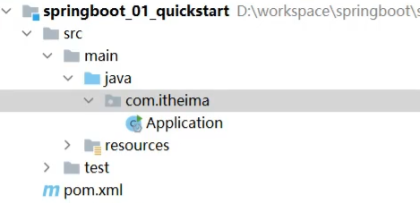

#### 创建 `Controller`

在  `com.itheima.controller` 包下创建 `BookController` ，代码如下：

```
@RestController
@RequestMapping("/books")
public class BookController {

    @GetMapping("/{id}")
    public String getById(@PathVariable Integer id){
        System.out.println("id ==> "+id);
        return "hello , spring boot!";
    }
}
```

#### 启动服务器

运行 `SpringBoot` 工程不需要使用本地的 `Tomcat` 和 插件，只运行项目 `com.itheima` 包下的 `Application` 类，我们就可以在控制台看出如下信息

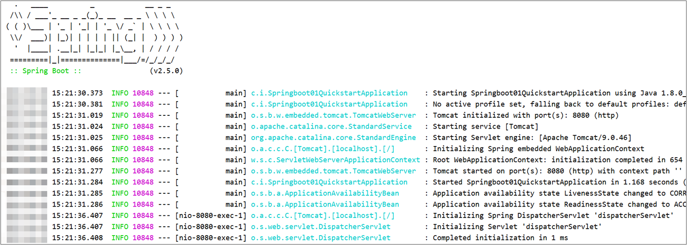

#### 进行测试

使用 `Postman` 工具来测试我们的程序

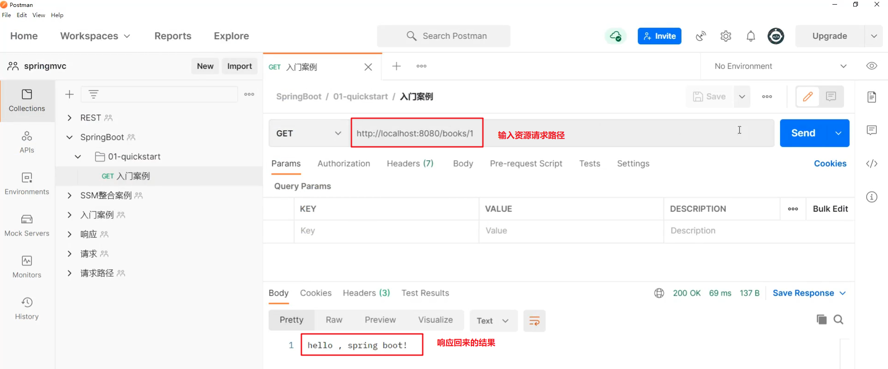

通过上面的入门案例我们可以看到使用 `SpringBoot` 进行开发，使整个开发变得很简单，那它是如何做到的呢？

要研究这个问题，我们需要看看 `Application` 类和 `pom.xml` 都书写了什么。先看看 `Applicaion` 类，该类内容如下：

```
@SpringBootApplication
public class Application {
    public static void main(String[] args) {
        SpringApplication.run(Application.class, args);
    }
}
```

这个类中的东西很简单，就在类上添加了一个 `@SpringBootApplication` 注解，而在主方法中就一行代码。我们在启动服务器时就是执行的该类中的主方法。

再看看 `pom.xml` 配置文件中的内容

```
<?xml version="1.0" encoding="UTF-8"?>
<project xmlns="http://maven.apache.org/POM/4.0.0" xmlns:xsi="http://www.w3.org/2001/XMLSchema-instance"
         xsi:schemaLocation="http://maven.apache.org/POM/4.0.0 https://maven.apache.org/xsd/maven-4.0.0.xsd">
    <modelVersion>4.0.0</modelVersion>
  
    <!--指定了一个父工程，父工程中的东西在该工程中可以继承过来使用-->
    <parent>
        <groupId>org.springframework.boot</groupId>
        <artifactId>spring-boot-starter-parent</artifactId>
        <version>2.5.0</version>
    </parent>
    <groupId>com.itheima</groupId>
    <artifactId>springboot_01_quickstart</artifactId>
    <version>0.0.1-SNAPSHOT</version>

    <!--JDK 的版本-->
    <properties>
        <java.version>8</java.version>
    </properties>
  
    <dependencies>
        <!--该依赖就是我们在创建 SpringBoot 工程勾选的那个 Spring Web 产生的-->
        <dependency>
            <groupId>org.springframework.boot</groupId>
            <artifactId>spring-boot-starter-web</artifactId>
        </dependency>
		<!--这个是单元测试的依赖，我们现在没有进行单元测试，所以这个依赖现在可以没有-->
        <dependency>
            <groupId>org.springframework.boot</groupId>
            <artifactId>spring-boot-starter-test</artifactId>
            <scope>test</scope>
        </dependency>
    </dependencies>

    <build>
        <plugins>
            <!--这个插件是在打包时需要的，而这里暂时还没有用到-->
            <plugin>
                <groupId>org.springframework.boot</groupId>
                <artifactId>spring-boot-maven-plugin</artifactId>
            </plugin>
        </plugins>
    </build>
</project>
```

我们代码之所以能简化，就是因为指定的父工程和 `Spring Web` 依赖实现的。具体的我们后面在聊。

### 对比

做完 `SpringBoot` 的入门案例后，接下来对比一下 `Spring` 程序和 `SpringBoot` 程序。如下图


* 坐标
  * `Spring` 程序中的坐标需要自己编写，而且坐标非常多
  * `SpringBoot` 程序中的坐标是我们在创建工程时进行勾选自动生成的
* web3.0配置类
  * `Spring` 程序需要自己编写这个配置类。这个配置类大家之前编写过，肯定感觉很复杂
  * `SpringBoot` 程序不需要我们自己书写
* 配置类
  * `Spring/SpringMVC` 程序的配置类需要自己书写。而 `SpringBoot`  程序则不需要书写。

## 官网构建工程

在入门案例中之所以能快速构建 `SpringBoot` 工程，是因为 `Idea` 使用了官网提供了快速构建 `SpringBoot` 工程的组件实现的。那如何在官网进行工程构建呢？通过如下步骤构建

#### 进入SpringBoot官网

官网地址如下：

```
https://spring.io/projects/spring-boot
```

进入到 `SpringBoot` 官网后拖到最下方就可以看到如下内容


然后点击 `Spring Initializr` 超链接就会跳转到如下页面

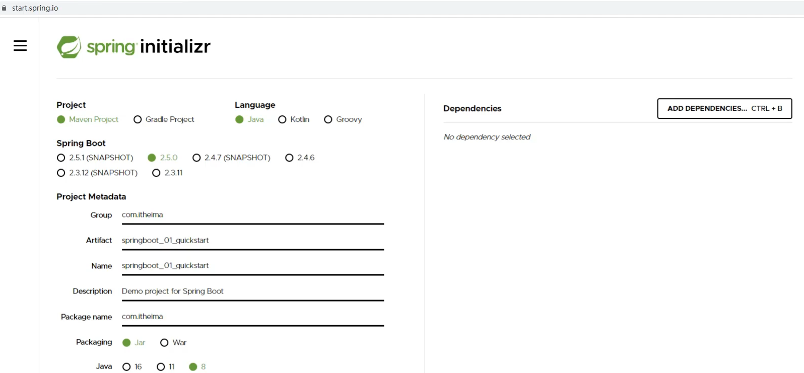

这个页面内容是不是感觉很眼熟的，这和我们使用 `Idea` 快速构建 `SpringBoot` 工程的界面基本相同。在上面页面输入对应的信息

### 选择依赖

选择 `Spring Web` 可以点击上图右上角的 `ADD DEPENDENCIES... CTRL + B` 按钮，就会出现如下界面

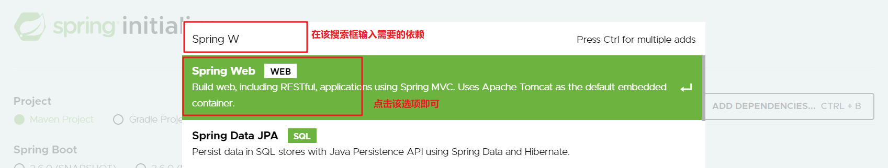

### 生成工程

以上步骤完成后就可以生成 `SpringBoot` 工程了。在页面的最下方点击 `GENERATE CTRL + 回车` 按钮生成工程并下载到本地，如下图所示


打开下载好的压缩包可以看到工程结构和使用 `Idea` 生成的一模一样，如下图

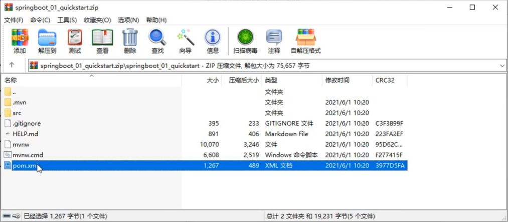

而打开 `pom.xml` 文件，里面也包含了父工程和 `Spring Web` 的依赖。

通过上面官网的操作，我们知道 `Idea` 中快速构建 `SpringBoot` 工程其实就是使用的官网的快速构建组件，那以后即使没有 `Idea` 也可以使用官网的方式构建 `SpringBoot` 工程。

## SpringBoot工程快速启动

### 打包

由于我们在构建 `SpringBoot` 工程时已经在 `pom.xml` 中配置了如下插件

```
<plugin>
    <groupId>org.springframework.boot</groupId>
    <artifactId>spring-boot-maven-plugin</artifactId>
</plugin>
```

所以我们只需要使用 `Maven` 的 `package` 指令打包就会在 `target` 目录下生成对应的 `Jar` 包。

### 启动

进入 `jar` 包所在位置，在 `命令提示符` 中输入如下命令

```
jar -jar springboot_01_quickstart-0.0.1-SNAPSHOT.jar
```

执行上述命令就可以看到 `SpringBoot` 运行的日志信息

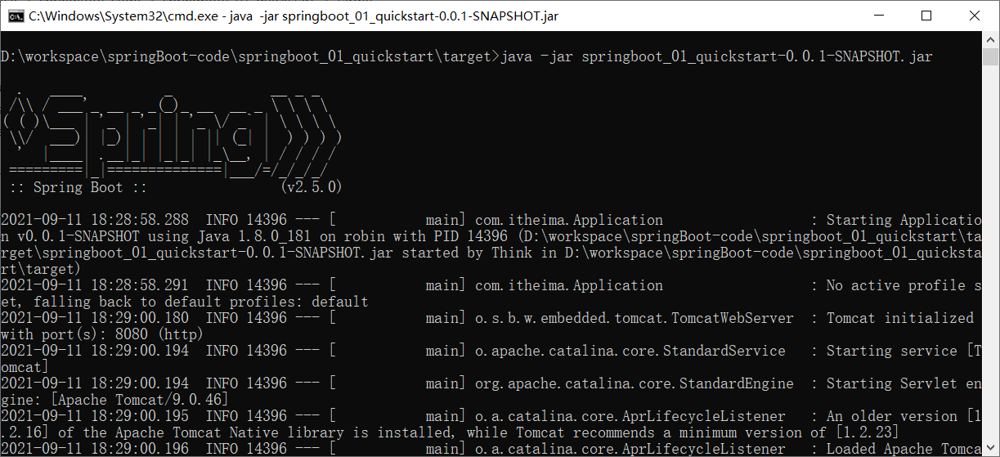

## SpringBoot概述

`SpringBoot` 是由Pivotal团队提供的全新框架，其设计目的是用来简化Spring应用的初始搭建以及开发过程。

大家已经感受了 `SpringBoot` 程序，回过头看看 `SpringBoot` 主要作用是什么，就是简化 `Spring` 的搭建过程和开发过程。

原始 `Spring` 环境搭建和开发存在以下问题：

* 配置繁琐
* 依赖设置繁琐

`SpringBoot` 程序优点恰巧就是针对 `Spring` 的缺点

* 自动配置。这个是用来解决 `Spring` 程序配置繁琐的问题
* 起步依赖。这个是用来解决 `Spring` 程序依赖设置繁琐的问题
* 辅助功能（内置服务器,...）。我们在启动 **`SpringBoot` 程序时既没有使用本地的 `tomcat` 也没有使用 `tomcat` 插件，而是使用 `SpringBoot` 内置的服务器。

接下来我们来说一下 `SpringBoot` 的起步依赖

### 起步依赖

我们使用 `Spring Initializr`  方式创建的 `Maven` 工程的的 `pom.xml` 配置文件中自动生成了很多包含 `starter` 的依赖，如下图


这些依赖就是启动依赖，接下来我们探究一下他是如何实现的。

#### 探索父工程

从上面的文件中可以看到指定了一个父工程，我们进入到父工程，发现父工程中又指定了一个父工程，如下图所示

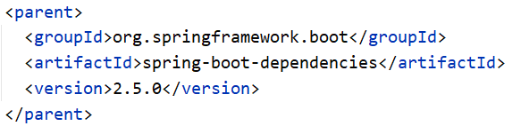

再进入到该父工程中，在该工程中我们可以看到配置内容结构如下图所示


上图中的 `properties` 标签中定义了各个技术软件依赖的版本，避免了我们在使用不同软件技术时考虑版本的兼容问题。在 `properties` 中我们找 `servlet`  和 `mysql` 的版本如下图


`dependencyManagement` 标签是进行依赖版本锁定，但是并没有导入对应的依赖；如果我们工程需要那个依赖只需要引入依赖的 `groupid` 和 `artifactId` 不需要定义 `version`。

而 `build` 标签中也对插件的版本进行了锁定，如下图

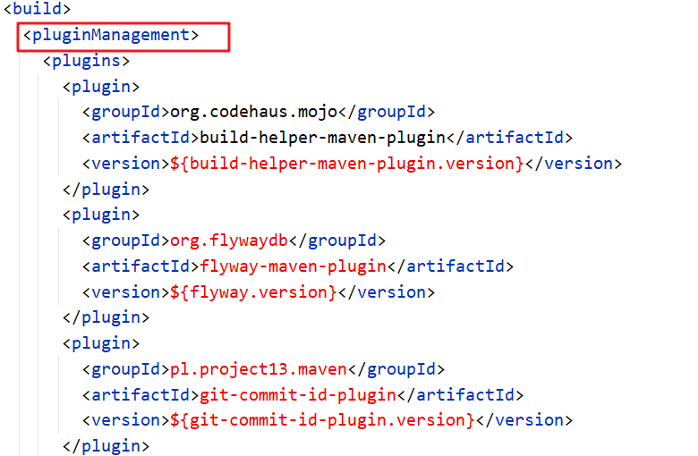

看完了父工程中 `pom.xml` 的配置后不难理解我们工程的的依赖为什么都没有配置 `version`。

#### 探索依赖

在我们创建的工程中的 `pom.xml` 中配置了如下依赖

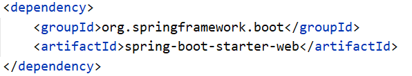

进入到该依赖，查看 `pom.xml` 的依赖会发现它引入了如下的依赖

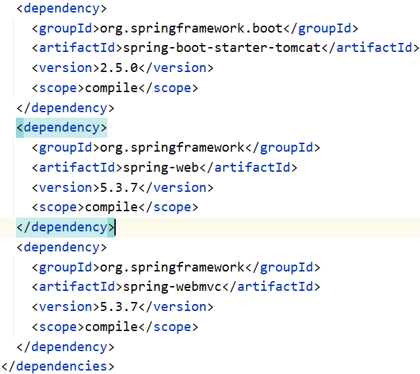

里面的引入了 `spring-web` 和 `spring-webmvc` 的依赖，这就是为什么我们的工程中没有依赖这两个包还能正常使用 `springMVC` 中的注解的原因。

而依赖 `spring-boot-starter-tomcat` ，从名字基本能确认内部依赖了 `tomcat`，所以我们的工程才能正常启动。

结论：以后需要使用技术，只需要引入该技术对应的起步依赖即可

#### 小结

starter

* `SpringBoot` 中常见项目名称，定义了当前项目使用的所有项目坐标，以达到减少依赖配置的目的

parent

* 所有 `SpringBoot` 项目要继承的项目，定义了若干个坐标版本号（依赖管理，而非依赖），以达到减少依赖冲突的目的
* `spring-boot-starter-parent`（2.5.0）与 `spring-boot-starter-parent`（2.4.6）共计57处坐标版本不同

实际开发

* 使用任意坐标时，仅书写GAV中的G和A，V由SpringBoot提供
  > G：groupid
  >
  > A：artifactId
  >
  > V：version
  >
* 如发生坐标错误，再指定version（要小心版本冲突）

### 程序启动

创建的每一个 `SpringBoot` 程序时都包含一个类似于下面的类，我们将这个类称作引导类

```
@SpringBootApplication
public class Springboot01QuickstartApplication {
    
    public static void main(String[] args) {
        SpringApplication.run(Springboot01QuickstartApplication.class, args);
    }
}
```

注意：

* `SpringBoot` 在创建项目时，采用jar的打包方式
* `SpringBoot` 的引导类是项目的入口，运行 `main` 方法就可以启动项目
  因为我们在 `pom.xml` 中配置了 `spring-boot-starter-web` 依赖，而该依赖通过前面的学习知道它依赖 `tomcat` ，所以运行 `main` 方法就可以使用 `tomcat` 启动咱们的工程。

#### 1.2.3  切换web服务器

现在我们启动工程使用的是 `tomcat` 服务器，那能不能不使用 `tomcat` 而使用 `jetty` 服务器，`jetty` 在我们 `maven` 高级时讲 `maven` 私服使用的服务器。而要切换 `web` 服务器就需要将默认的 `tomcat` 服务器给排除掉，怎么排除呢？使用 `exclusion` 标签

```
<dependency>
    <groupId>org.springframework.boot</groupId>
    <artifactId>spring-boot-starter-web</artifactId>
    <exclusions>
        <exclusion>
            <artifactId>spring-boot-starter-tomcat</artifactId>
            <groupId>org.springframework.boot</groupId>
        </exclusion>
    </exclusions>
</dependency>
```

现在我们运行引导类可以吗？运行一下试试，打印的日志信息如下

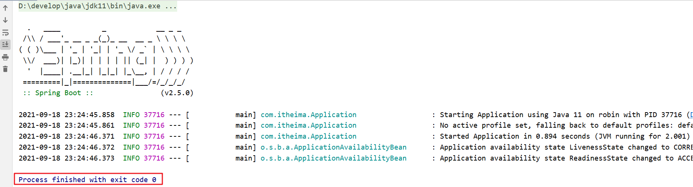

程序直接停止了，为什么呢？那是因为排除了 `tomcat` 服务器，程序中就没有服务器了。所以此时不光要排除 `tomcat` 服务器，还要引入 `jetty` 服务器。在 `pom.xml` 中因为 `jetty` 的起步依赖

```
<dependency>
    <groupId>org.springframework.boot</groupId>
    <artifactId>spring-boot-starter-jetty</artifactId>
</dependency>
```

接下来再次运行引导类，在日志信息中就可以看到使用的是 `jetty` 服务器

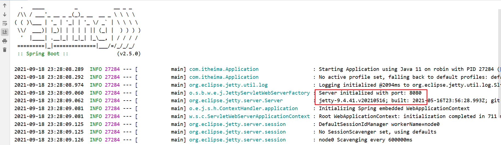

小结：

通过切换服务器，我们不难发现在使用 `SpringBoot` 换技术时只需要导入该技术的起步依赖即可。
