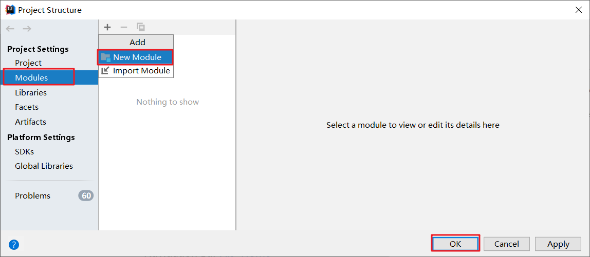

## SpringBoot简介

SpringBoot 是由 Pivotal 团队提供的全新框架，其设计目的是用来简化 Spring 应用的初始搭建以及开发过程。
使用了 Spring 框架后已经简化了我们的开发。而 SpringBoot 又是对 Spring 开发进行简化的，可想而知 SpringBoot
使用的简单及广泛性。既然 SpringBoot 是用来简化 Spring 开发的，那我们就先回顾一下，以 SpringMVC 开发为例：

1. 创建工程，并在 pom.xml 配置文件中配置所依赖的坐标
   
2. 编写 `web3.0` 的配置类
   作为 `web` 程序，`web3.0` 的配置类不能缺少，而这个配置类还是比较麻烦的，代码如下

   
3. 编写 `SpringMVC` 的配置类

   

   做到这只是将工程的架子搭起来。要想被外界访问，最起码还需要提供一个 `Controller` 类，在该类中提供一个方法。
4. 编写 `Controller` 类

   

   从上面的 `SpringMVC` 程序开发可以看到，前三步都是在搭建环境，而且这三步基本都是固定的。`SpringBoot` 就是对这三步进行简化了。接下来我们通过一个入门案例来体现 `SpingBoot` 简化 `Spring` 开发。

## SpringBoot快速入门

### 开发步骤

`SpringBoot` 开发起来特别简单，分为如下几步：

* 创建新模块，选择Spring初始化，并配置模块相关基础信息
* 选择当前模块需要使用的技术集
* 开发控制器类
* 运行自动生成的Application类

知道了 `SpringBoot` 的开发步骤后，接下来我们进行具体的操作

### 创建新模块

* 点击 `+` 选择 `New Module` 创建新模块

  
* 选择 `Spring Initializr` ，用来创建 `SpringBoot` 工程

  以前我们选择的是 `Maven` ，今天选择 `Spring Initializr` 来快速构建 `SpringBoot` 工程。而在 `Module SDK` 这一项选择我们安装的 `JDK` 版本。

  
*
