## 配置文件格式

启动服务器默认的端口号是 `8080`，访问路径可以书写为

```
http://localhost:8080/books/1
```

在线上环境我们还是希望将端口号改为 `80`，这样在访问的时候就可以不写端口号了，如下

```
http://localhost/books/1
```

而 `SpringBoot` 程序如何修改呢？`SpringBoot` 提供了多种属性配置方式

* `application.properties`
  ```
  server.port=80
  ```
* `application.yml`
  ```
  server:
  port: 81
  ```
* `application.yaml`
  ```
  server:
  port: 82
  ```

> 注意：
>
> `SpringBoot` 程序的配置文件名必须是 `application` ，只是后缀名不同而已。

### 环境准备

创建一个新工程 `springboot_02_base_config` 用来演示不同的配置文件，工程环境和入门案例一模一样，结构如下：

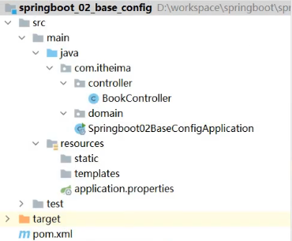

在该工程中的 `com.itheima.controller` 包下创建一个名为 `BookController` 的控制器。内容如下：

```
@RestController
@RequestMapping("/books")
public class BookController {

    @GetMapping("/{id}")
    public String getById(@PathVariable Integer id){
        System.out.println("id ==> "+id);
        return "hello , spring boot!";
    }
}
```

### 不同配置文件演示

#### application.properties配置文件

现在需要进行配置，配合文件必须放在 `resources` 目录下，而该目录下有一个名为 `application.properties` 的配置文件，我们就可以在该配置文件中修改端口号，在该配置文件中书写 `port` ，`Idea` 就会提示，如下

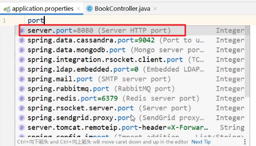

`application.properties` 配置文件内容如下：

```
server.port=80
```

启动服务，会在控制台打印出日志信息，从日志信息中可以看到绑定的端口号已经修改了

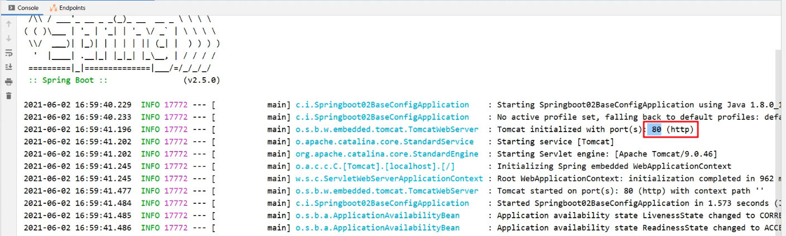

#### application.yml配置文件

删除 `application.properties` 配置文件中的内容。在 `resources` 下创建一个名为 `application.yml` 的配置文件，在该文件中书写端口号的配置项，格式如下：

```
server:
port: 81
```

> 注意：
>
>  `:` 后，数据前一定要加空格。

而在 `yml` 配置文件中也是有提示功能的，我们也可以在该文件中书写 `port` ，然后 `idea` 就会提示并书写成上面的格式

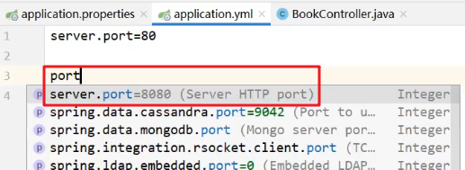

#### application.yaml配置文件

删除 `application.yml` 配置文件和 `application.properties` 配置文件内容，然后在 `resources` 下创建名为 `application.yaml` 的配置文件，配置内容和后缀名为 `yml` 的配置文件中的内容相同，只是使用了不同的后缀名而已

`application.yaml` 配置文件内容如下：

```
server:
port: 83
```

启动服务，在控制台可以看到绑定的端口号

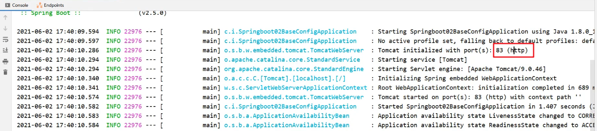

### 三种配合文件的优先级

在三种配合文件中分别配置不同的端口号，启动服务查看绑定的端口号。用这种方式就可以看到哪个配置文件的优先级更高一些

`application.properties` 文件内容如下：

```
server.port=80
```

`application.yml` 文件内容如下：

```
server:
port: 81
```

`application.yaml` 文件内容如下：

```
server:
port: 82
```

启动服务，在控制台可以看到使用的端口号是 `80`。说明 `application.properties` 的优先级最高

注释掉 `application.properties` 配置文件内容。再次启动服务，在控制台可以看到使用的端口号是 `81`，说明 `application.yml` 配置文件为第二优先级。

三种配置文件的优先级是：

`application.properties`  >  `application.yml`   >  `application.yaml`

> 注意：
>
> * `SpringBoot` 核心配置文件名为 `application`
> * `SpringBoot` 内置属性过多，且所有属性集中在一起修改，在使用时，通过提示键+关键字修改属性
>   例如要设置日志的级别时，可以在配置文件中书写 **`logging`，就会提示出来。配置内容如下
>   ```
>   logging:
>     level:
>       root: info
>   ```

## yaml格式

上面讲了三种不同类型的配置文件，而 `properties` 类型的配合文件之前我们学习过，接下来我们重点学习 `yaml` 类型的配置文件。

YAML（YAML Ain't Markup Language），一种数据序列化格式。这种格式的配置文件在近些年已经占有主导地位，那么这种配置文件和前期使用的配置文件是有一些优势的，我们先看之前使用的配置文件。

最开始我们使用的是 `xml` ，格式如下：

```
<enterprise>
    <name>itcast</name>
    <age>16</age>
    <tel>4006184000</tel>
</enterprise>
```

而 `properties` 类型的配置文件如下

```
enterprise.name=itcast
enterprise.age=16
enterprise.tel=4006184000
```

`yaml` 类型的配置文件内容如下

```
enterprise:
name: itcast
age: 16
tel: 4006184000
```

优点：

* 容易阅读
  * `yaml` 类型的配置文件比 `xml` 类型的配置文件更容易阅读，结构更加清晰
* 容易与脚本语言交互
* 以数据为核心，重数据轻格式
  *  `yaml` 更注重数据，而 `xml` 更注重格式

YAML 文件扩展名：

* `.yml` (主流)
* `.yaml`

上面两种后缀名都可以，以后使用更多的还是 `yml` 的。

### 语法规则

* 大小写敏感
* 属性层级关系使用多行描述，每行结尾使用冒号结束
* 使用缩进表示层级关系，同层级左侧对齐，只允许使用空格（不允许使用Tab键）
  空格的个数并不重要，只要保证同层级的左侧对齐即可。
* 属性值前面添加空格（属性名与属性值之间使用冒号+空格作为分隔）
* #表示注释

数组数据在数据书写位置的下方使用减号作为数据开始符号，每行书写一个数据，减号与数据间空格分隔，例如

```
enterprise:
  name: itcast
  age: 16
  tel: 4006184000
  subject:
    - Java
    - 前端
    - 大数据
```

## yaml配置文件数据读取

#### 环境准备

新创建一个名为 `springboot_03_read_data` 的 `SpringBoot` 工程，目录结构如下

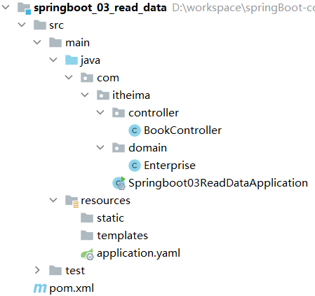

在 `com.itheima.controller` 包写创建名为 `BookController` 的控制器，内容如下

```
@RestController
@RequestMapping("/books")
public class BookController {

    @GetMapping("/{id}")
    public String getById(@PathVariable Integer id){
        System.out.println("id ==> "+id);
        return "hello , spring boot!";
    }
}
```

在 `com.itheima.domain` 包下创建一个名为 `Enterprise` 的实体类等会用来封装数据，内容如下

```
public class Enterprise {
    private String name;
    private int age;
    private String tel;
    private String[] subject;
    
    //setter and getter
    
    //toString
}
```

在 `resources` 下创建一个名为 `application.yml` 的配置文件，里面配置了不同的数据，内容如下

```
lesson: SpringBoot

server:
  port: 80

enterprise:
  name: itcast
  age: 16
  tel: 4006184000
  subject:
    - Java
    - 前端
    - 大数据
```

### 读取配置数据

#### 使用 @Value注解

使用 `@Value("表达式")` 注解可以从配合文件中读取数据，注解中用于读取属性名引用方式是：`${一级属性名.二级属性名……}`

我们可以在 `BookController` 中使用 `@Value`  注解读取配合文件数据，如下

```
@RestController
@RequestMapping("/books")
public class BookController {
    
    @Value("${lesson}")
    private String lesson;
    @Value("${server.port}")
    private Integer port;
    @Value("${enterprise.subject[0]}")
    private String subject_00;

    @GetMapping("/{id}")
    public String getById(@PathVariable Integer id){
        System.out.println(lesson);
        System.out.println(port);
        System.out.println(subject_00);
        return "hello , spring boot!";
    }
}
```

#### Environment对象

上面方式读取到的数据特别零散，`SpringBoot` 还可以使用 `@Autowired` 注解注入 `Environment` 对象的方式读取数据。这种方式 `SpringBoot` 会将配置文件中所有的数据封装到 `Environment` 对象中，如果需要使用哪个数据只需要通过调用 `Environment` 对象的 `getProperty(String name)` 方法获取。具体代码如下：

```
@RestController
@RequestMapping("/books")
public class BookController {
    
    @Autowired
    private Environment env;
    
    @GetMapping("/{id}")
    public String getById(@PathVariable Integer id){
        System.out.println(env.getProperty("lesson"));
        System.out.println(env.getProperty("enterprise.name"));
        System.out.println(env.getProperty("enterprise.subject[0]"));
        return "hello , spring boot!";
    }
}
```

> 注意：
>
> 这种方式，框架内容大量数据，而在开发中很少使用。

#### 自定义对象

`SpringBoot` 还提供了将配置文件中的数据封装到我们自定义的实体类对象中的方式。具体操作如下：

* 将实体类 `bean` 的创建交给 `Spring` 管理。
  * 在类上添加 `@Component` 注解
* 使用 `@ConfigurationProperties` 注解表示加载配置文件
  * 在该注解中也可以使用 `prefix` 属性指定只加载指定前缀的数据
* 在 `BookController` 中进行注入

具体代码如下：

`Enterprise` 实体类内容如下：

```
@Component
@ConfigurationProperties(prefix = "enterprise")
public class Enterprise {
    private String name;
    private int age;
    private String tel;
    private String[] subject;

    public String getName() {
        return name;
    }

    public void setName(String name) {
        this.name = name;
    }

    public int getAge() {
        return age;
    }

    public void setAge(int age) {
        this.age = age;
    }

    public String getTel() {
        return tel;
    }

    public void setTel(String tel) {
        this.tel = tel;
    }

    public String[] getSubject() {
        return subject;
    }

    public void setSubject(String[] subject) {
        this.subject = subject;
    }

    @Override
    public String toString() {
        return "Enterprise{" +
                "name='" + name + '\'' +
                ", age=" + age +
                ", tel='" + tel + '\'' +
                ", subject=" + Arrays.toString(subject) +
                '}';
    }
}
```

`BookController` 内容如下：

```
@RestController
@RequestMapping("/books")
public class BookController {
    
    @Autowired
    private Enterprise enterprise;

    @GetMapping("/{id}")
    public String getById(@PathVariable Integer id){
        System.out.println(enterprise.getName());
        System.out.println(enterprise.getAge());
        System.out.println(enterprise.getSubject());
        System.out.println(enterprise.getTel());
        System.out.println(enterprise.getSubject()[0]);
        return "hello , spring boot!";
    }
}
```

> 注意：
>
> 使用第三种方式，在实体类上有如下警告提示

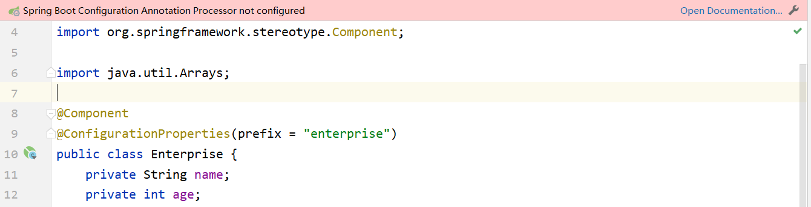

这个警告提示解决是在 `pom.xml` 中添加如下依赖即可

```
<dependency>
    <groupId>org.springframework.boot</groupId>
    <artifactId>spring-boot-configuration-processor</artifactId>
    <optional>true</optional>
</dependency>
```

## 多环境配置

以后在工作中，对于开发环境、测试环境、生产环境的配置肯定都不相同，比如我们开发阶段会在自己的电脑上安装 `mysql` ，连接自己电脑上的 `mysql` 即可，但是项目开发完毕后要上线就需要该配置，将环境的配置改为线上环境的。

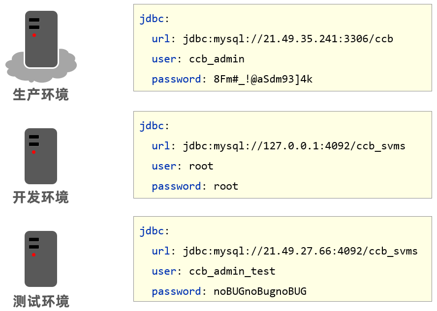

来回的修改配置会很麻烦，而 `SpringBoot` 给开发者提供了多环境的快捷配置，需要切换环境时只需要改一个配置即可。不同类型的配置文件多环境开发的配置都不相同，接下来对不同类型的配置文件进行说明

### yaml文件

在 `application.yml` 中使用 `---` 来分割不同的配置，内容如下

```
#开发
spring:
  profiles: dev #给开发环境起的名字
server:
  port: 80
---
#生产
spring:
  profiles: pro #给生产环境起的名字
server:
  port: 81
---
#测试
spring:
  profiles: test #给测试环境起的名字
server:
  port: 82
---
```

上面配置中 `spring.profiles` 是用来给不同的配置起名字的。而如何告知 `SpringBoot` 使用哪段配置呢？可以使用如下配置来启用都一段配置

```
#设置启用的环境
spring:
  profiles:
    active: dev  #表示使用的是开发环境的配置
```

综上所述，`application.yml` 配置文件内容如下

```
#设置启用的环境
spring:
  profiles:
    active: dev

---
#开发
spring:
  profiles: dev
server:
  port: 80
---
#生产
spring:
  profiles: pro
server:
  port: 81
---
#测试
spring:
  profiles: test
server:
  port: 82
---
```

> 注意：
>
> 在上面配置中给不同配置起名字的 `spring.profiles` 配置项已经过时。最新用来起名字的配置项是

```
#开发
spring:
  config:
    activate:
      on-profile: dev
```

### properties文件

`properties` 类型的配置文件配置多环境需要定义不同的配置文件

* `application-dev.properties` 是开发环境的配置文件。我们在该文件中配置端口号为 `80`
  ```
  server.port=80
  ```
* `application-test.properties` 是测试环境的配置文件。我们在该文件中配置端口号为 `81`
  ```
  server.port=81
  ```
* `application-pro.properties` 是生产环境的配置文件。我们在该文件中配置端口号为 `82`
  ```
  server.port=82
  ```

`SpringBoot` 只会默认加载名为 `application.properties` 的配置文件，所以需要在 `application.properties` 配置文件中设置启用哪个配置文件，配置如下:

```
spring.profiles.active=pro
```

### 命令行启动参数设置

使用 `SpringBoot` 开发的程序以后都是打成 `jar` 包，通过 `java -jar xxx.jar` 的方式启动服务的。那么就存在一个问题，如何切换环境呢？因为配置文件打到的jar包中了。

我们知道 `jar` 包其实就是一个压缩包，可以解压缩，然后修改配置，最后再打成jar包就可以了。这种方式显然有点麻烦，而 `SpringBoot` 提供了在运行 `jar` 时设置开启指定的环境的方式，如下

```
java –jar xxx.jar –-spring.profiles.active=test
```

那么这种方式能不能临时修改端口号呢？也是可以的，可以通过如下方式

```
java –jar xxx.jar –-server.port=88
```

当然也可以同时设置多个配置，比如即指定启用哪个环境配置，又临时指定端口，如下

```
java –jar springboot.jar –-server.port=88 –-spring.profiles.active=test
```

进行测试后就会发现命令行设置的端口号优先级高（也就是使用的是命令行设置的端口号），配置的优先级其实 **`SpringBoot` 官网已经进行了说明，参见 :

```
https://docs.spring.io/spring-boot/docs/current/reference/html/spring-boot-features.html#boot-features-external-config
```

## 配置文件分类

有这样的场景，我们开发完毕后需要测试人员进行测试，由于测试环境和开发环境的很多配置都不相同，所以测试人员在运行我们的工程时需要临时修改很多配置，如下

```
java –jar springboot.jar –-spring.profiles.active=test --server.port=85 --server.servlet.context-path=/heima --server.tomcat.connection-timeout=-1 …… …… …… …… ……
```

针对这种情况，`SpringBoot` 定义了配置文件不同的放置的位置；而放在不同位置的优先级时不同的。

`SpringBoot` 中4级配置文件放置位置：

* 1级：classpath：application.yml
* 2级：classpath：config/application.yml
* 3级：file ：application.yml
* 4级：file ：config/application.yml

级别越高优先级越高

### 代码演示

在这里我们只演示不同级别配置文件放置位置的优先级。

#### 环境准备

创建一个名为 `springboot_06_config_file` 的 `SpringBoot` 工程，目录结构如下

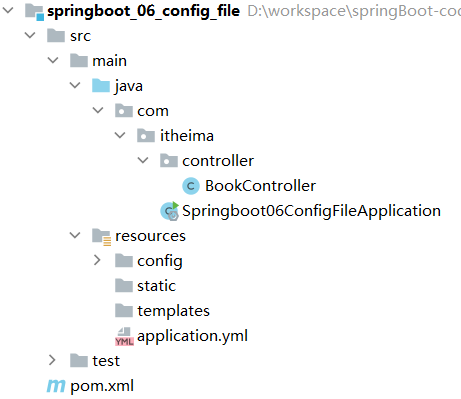

在 `resources` 下创建一个名为 `config` 的目录，在该目录中创建 `application.yml` 配置文件，而在该配置文件中将端口号设置为 `81`，内容如下

```
server:
  port: 81
```

而在 `resources` 下创建的 `application.yml` 配置文件中并将端口号设置为 `80`，内容如下

```
server:
  port: 80
```

#### 验证1级和2级的优先级

运行启动引导类，可以在控制台看到如下日志信息

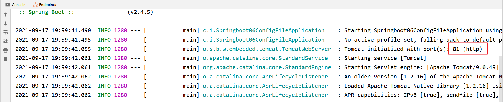

通过这个结果可以得出==类路径下的 `config` 下的配置文件优先于类路径下的配置文件。

#### 验证2级和4级的优先级

要验证4级，按照以下步骤完成

* 将工程打成 `jar` 包
  点击工程的 `package` 来打 `jar` 包

  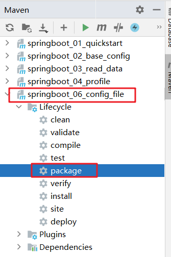
* 在硬盘上找到 `jar` 包所在位置

  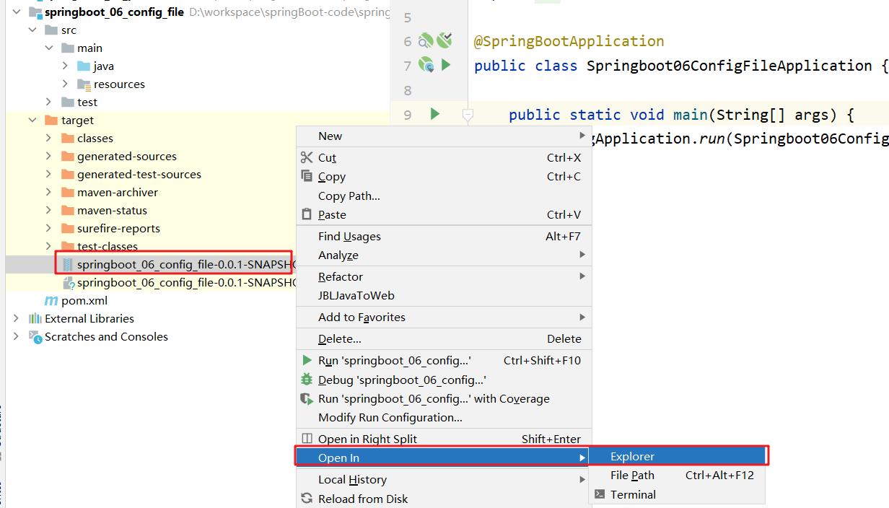
* 在 `jar` 包所在位置创建 `config` 文件夹，在该文件夹下创建 `application.yml` 配置文件，而在该配合文件中将端口号设置为 `82`
* 在命令行使用以下命令运行程序

  ```
  java -jar springboot_06_config_file-0.0.1-SNAPSHOT.jar
  ```

  运行后日志信息如下

  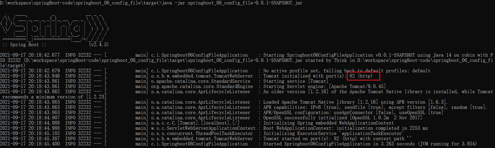

  通过这个结果可以得出file： `config` 下的配置文件优先于类路径下的配置文件。
