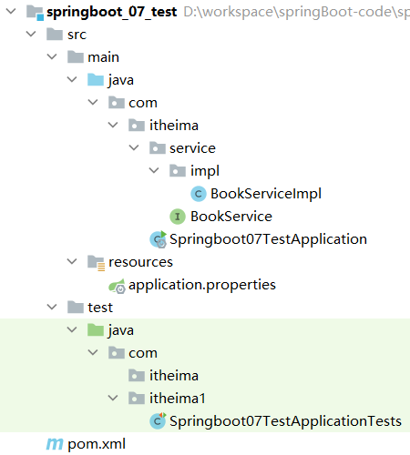

## 回顾 `Spring` 整合 `junit`

```
@RunWith(SpringJUnit4ClassRunner.class)
@ContextConfiguration(classes = SpringConfig.class)
public class UserServiceTest {
    
    @Autowired
    private BookService bookService;
    
    @Test
    public void testSave(){
        bookService.save();
    }
}
```

使用 `@RunWith` 注解指定运行器，使用 `@ContextConfiguration` 注解来指定配置类或者配置文件。而 `SpringBoot` 整合 `junit` 特别简单，分为以下三步完成

* 在测试类上添加 `SpringBootTest` 注解
* 使用 `@Autowired` 注入要测试的资源
* 定义测试方法进行测试

## 环境准备

创建一个名为 `springboot_07_test` 的 `SpringBoot` 工程，工程目录结构如下



在 `com.itheima.service` 下创建 `BookService` 接口，内容如下

```
public interface BookService {
    public void save();
}
```

在 `com.itheima.service.impl` 包写创建一个 `BookServiceImpl` 类，使其实现 `BookService` 接口，内容如下

```
@Service
public class BookServiceImpl implements BookService {
    @Override
    public void save() {
        System.out.println("book service is running ...");
    }
}
```

## 编写测试类

在 `test/java` 下创建 `com.itheima` 包，在该包下创建测试类，将 `BookService` 注入到该测试类中

```
@SpringBootTest
class Springboot07TestApplicationTests {

    @Autowired
    private BookService bookService;

    @Test
    public void save() {
        bookService.save();
    }
}
```

> 注意：
>
> 这里的引导类所在包必须是测试类所在包及其子包。
>
> 例如：
>
> * 引导类所在包是 `com.itheima`
> * 测试类所在包是 `com.itheima`
>
> 如果不满足这个要求的话，就需要在使用 `@SpringBootTest` 注解时，使用 `classes` 属性指定引导类的字节码对象。如 `@SpringBootTest(classes = Springboot07TestApplication.class)`
