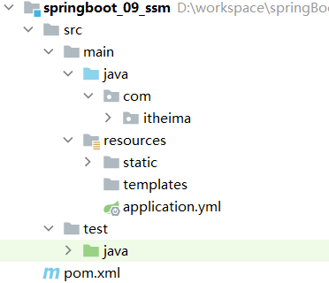
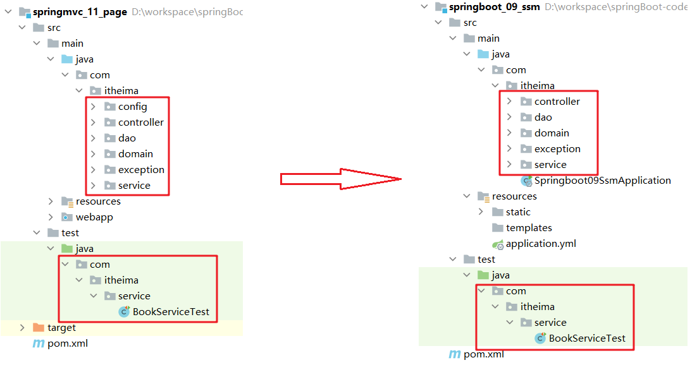
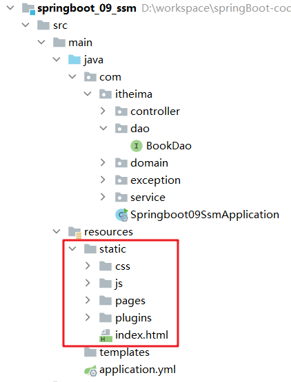

`SpringBoot` 到这就已经学习完毕，接下来我们将学习 `SSM` 时做的三大框架整合的案例用 `SpringBoot` 来实现一下。完成这个案例基本是将之前做的拷贝过来，修改成 `SpringBoot` 的即可，主要从以下几部分完成

* pom.xml
  * 配置起步依赖，必要的资源坐标(druid)
* application.yml
  * 设置数据源、端口等
* 配置类
  * 全部删除
* dao
  * 设置@Mapper
* 测试类
* 页面
  * 放置在resources目录下的static目录中

## 创建工程

创建 `SpringBoot` 工程，在创建工程时需要勾选 `web`、`mysql`、`mybatis`，工程目录结构如下



由于我们工程中使用到了 `Druid` ，所以需要导入 `Druid` 的坐标

```
<dependency>
    <groupId>com.alibaba</groupId>
    <artifactId>druid</artifactId>
    <version>1.1.16</version>
</dependency>
```

## 代码拷贝

将 `springmvc_11_page` 工程中的 `java` 代码及测试代码连同包拷贝到 `springboot_09_ssm` 工程，按照下图进行拷贝



需要修改的内容如下：

* `Springmvc_11_page` 中 `config` 包下的是配置类，而 `SpringBoot` 工程不需要这些配置类，所以这些可以直接删除
* `dao` 包下的接口上在拷贝到 `springboot_09-ssm` 工程中需要在接口中添加 `@Mapper` 注解
* `BookServiceTest` 测试需要改成 `SpringBoot` 整合 `junit` 的

  ```
  @SpringBootTest
  public class BookServiceTest {

      @Autowired
      private BookService bookService;

      @Test
      public void testGetById(){
          Book book = bookService.getById(2);
          System.out.println(book);
      }

      @Test
      public void testGetAll(){
          List<Book> all = bookService.getAll();
          System.out.println(all);
      }
  }
  ```

## 配置文件

在 `application.yml` 配置文件中需要配置如下内容

* 服务的端口号
* 连接数据库的信息
* 数据源

```
server:
  port: 80

spring:
  datasource:
    type: com.alibaba.druid.pool.DruidDataSource
    driver-class-name: com.mysql.cj.jdbc.Driver
    url: jdbc:mysql://localhost:3306/ssm_db #?servierTimezone=UTC
    username: root
    password: root
```

### 静态资源

在 `SpringBoot` 程序中是没有 `webapp` 目录的，那么在 `SpringBoot` 程序中静态资源需要放在什么位置呢？

静态资源需要放在 `resources` 下的 `static` 下，如下图所示


