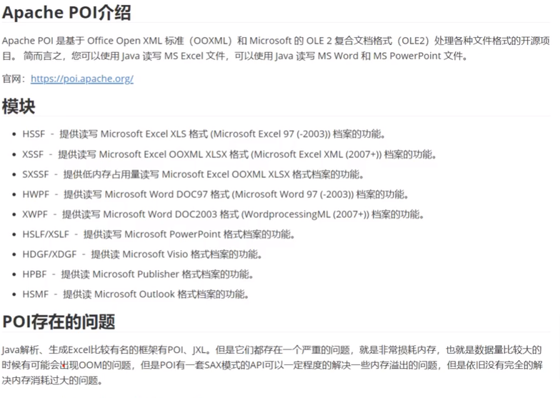
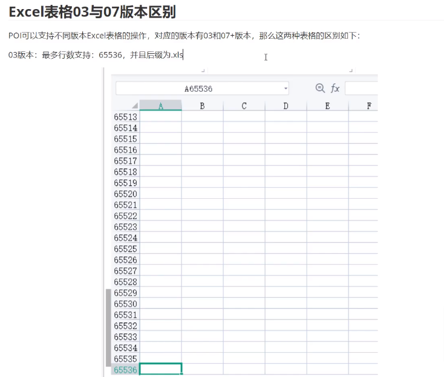
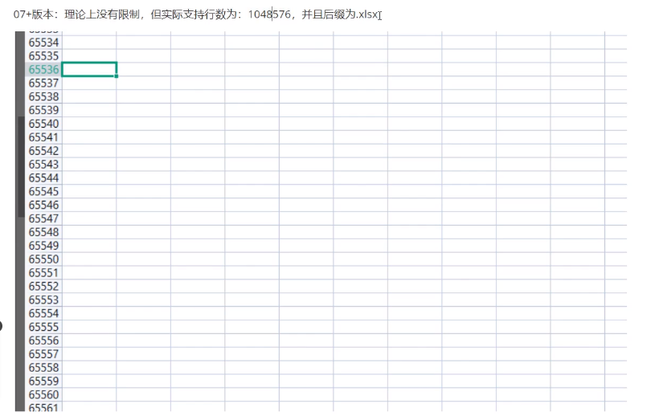
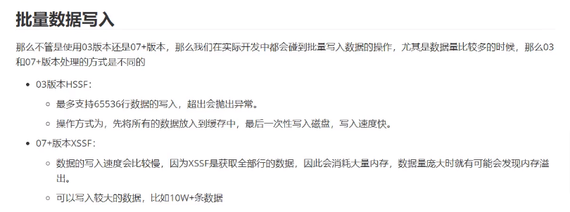
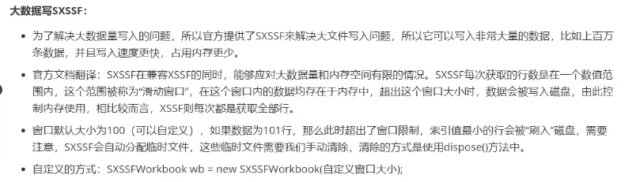
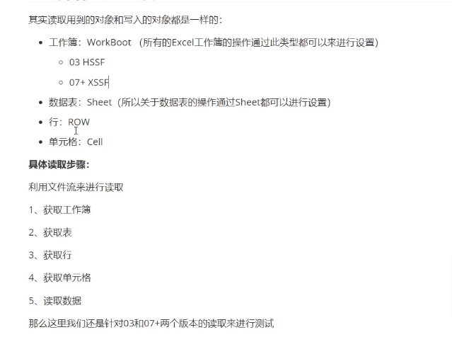
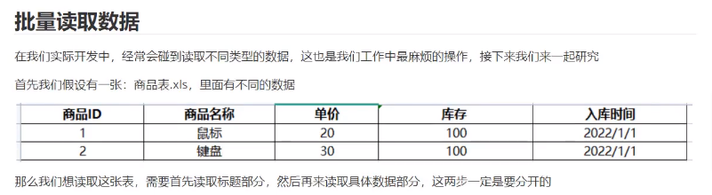
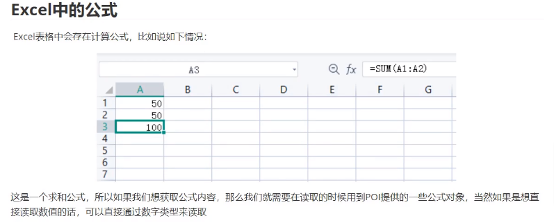

# POI使用簡介








## POI操作Excel-写

第一步，导入maven，这里演示03版本和07+版本，所以两个依赖都需要导入

```xml
		<!--导入依赖-->
	<dependencies>
		<!-- 03 -->
		<dependency>
			<groupId>org.apache.poi</groupId>
			<artifactId>poi</artifactId>
			<version>4.1.2</version>
		</dependency>
		<!-- 07 -->
		<dependency>
			<groupId>org.apache.poi</groupId>
			<artifactId>poi-ooxml</artifactId>
			<version>4.1.2</version>
		</dependency>
	</dependencies>
```

接下来我们完成通过POI写入Excel表格数据的操作，那么首先我们要知道写入一个表格需要的步骤：

1. 创建工作簿：Workbook
2. 创建工作表：sheet
3. 创建行：Row
4. 创建列（单元格）：Cell
5. 具体数据写入

**03版本测试：**

```java
package com.test.write;

import org.apache.poi.hssf.usermodel.HSSFWorkbook;
import org.apache.poi.ss.usermodel.Cell;
import org.apache.poi.ss.usermodel.Row;
import org.apache.poi.ss.usermodel.Sheet;
import org.apache.poi.ss.usermodel.Workbook;

import java.io.FileOutputStream;
import java.io.IOException;

public class ExcelWriteDemo {
    public static void main(String[] args) {
        try {
            new ExcelWriteDemo().writeExcel03();
        } catch (IOException e) {
            e.printStackTrace();
        }
    }
    //03版本写入
    public void writeExcel03() throws IOException {
        //1.创建工作簿
        Workbook workbook = new HSSFWorkbook();
        //2.创建工作表
        Sheet sheet = workbook.createSheet("03版本测试"); //表格名称
        //3.创建行，第一行
        Row row = sheet.createRow(0);
        //4.创建单元格（1，1） 第一行第一列
        Cell cell11 = row.createCell(0);
        //5.写入具体数据
        cell11.setCellValue("商品ID");
        //6.写入数据（1，2）第一行第二列
        Cell cell12 = row.createCell(1);
        cell12.setCellValue("商品名称");

        //第二行（2，1）
        Row row2 = sheet.createRow(1);
        Cell cell21 = row2.createCell(0);
        cell21.setCellValue(1);
        //第二行第二列
        Cell cell22 = row2.createCell(1);
        cell22.setCellValue("鼠标");

        //生成一张表-IO流
        FileOutputStream outputStream = new FileOutputStream("./03版本测试.xls");
        workbook.write(outputStream);
        //关闭IO流
        outputStream.close();
        System.out.println("表格输出完毕");

    }
}
```

**07版本测试：07版本生成的表格文件后缀为.xlsx**

```java
package com.test.write;

import org.apache.poi.ss.usermodel.Cell;
import org.apache.poi.ss.usermodel.Row;
import org.apache.poi.ss.usermodel.Sheet;
import org.apache.poi.ss.usermodel.Workbook;
import org.apache.poi.xssf.usermodel.XSSFWorkbook;

import java.io.FileOutputStream;
import java.io.IOException;

public class ExcelWriteDemo07 {
    public static void main(String[] args) {
        try {
            new ExcelWriteDemo07().writeExcel07();
        } catch (IOException e) {
            e.printStackTrace();
        }
    }
    //07版本写入
    public void writeExcel07() throws IOException {
        //1.创建工作簿
        Workbook workbook = new XSSFWorkbook();
        //2.创建工作表
        Sheet sheet = workbook.createSheet("07版本测试"); //表格名称
        //3.创建行，第一行
        Row row = sheet.createRow(0);
        //4.创建单元格（1，1） 第一行第一列
        Cell cell11 = row.createCell(0);
        //5.写入具体数据
        cell11.setCellValue("商品ID");
        //6.写入数据（1，2）第一行第二列
        Cell cell12 = row.createCell(1);
        cell12.setCellValue("商品名称");

        //第二行（2，1）
        Row row2 = sheet.createRow(1);
        Cell cell21 = row2.createCell(0);
        cell21.setCellValue(1);
        //第二行第二列
        Cell cell22 = row2.createCell(1);
        cell22.setCellValue("鼠标");

        //生成一张表-IO流
        FileOutputStream outputStream = new FileOutputStream("./07版本测试.xlsx");
        workbook.write(outputStream);
        //关闭IO流
        outputStream.close();
        System.out.println("表格输出完毕");
    }
}
```

### 批量数据写入



#### **03版本批量写入测试：**

```java
package com.test.write;

import com.sun.corba.se.spi.orbutil.threadpool.Work;
import org.apache.poi.hssf.usermodel.HSSFWorkbook;
import org.apache.poi.ss.usermodel.Cell;
import org.apache.poi.ss.usermodel.Row;
import org.apache.poi.ss.usermodel.Sheet;
import org.apache.poi.ss.usermodel.Workbook;

import java.io.FileOutputStream;

public class ExcelWriteDemo03_Batch {
    public static void main(String[] args) {
        try{
            new ExcelWriteDemo03_Batch().writeBatchDate03();
        }catch (Exception e){
            e.printStackTrace();
        }
    }
    //03版本批量写入
    public void writeBatchDate03() throws Exception {
        //开始时间
        Long start = System.currentTimeMillis();
        //创建工作簿
        Workbook workbook = new HSSFWorkbook();
        //创建表
        Sheet sheet = workbook.createSheet("03");
        //写入数据
        for(int rowNum = 0;rowNum<65536;rowNum++){
            Row row = sheet.createRow(rowNum);
            for(int cellNum = 0;cellNum<20;cellNum++){
                Cell cell = row.createCell(cellNum);
                cell.setCellValue(cellNum+1);
            }
        }
        //生成表
        FileOutputStream fileOutputStream = new FileOutputStream("./03BatchData.xls");
        workbook.write(fileOutputStream);
        fileOutputStream.close();
        System.out.println("表格生成完毕");
        //结束时间
        long end = System.currentTimeMillis();
        System.out.println("耗时："+ (end-start)/1000 +"秒");
    }
}
```

结果：

```undefined
表格生成完毕
耗时：4秒
```

#### **07版本批量写入测试：**

```java
package com.test.write;

import org.apache.poi.ss.usermodel.Cell;
import org.apache.poi.ss.usermodel.Row;
import org.apache.poi.ss.usermodel.Sheet;
import org.apache.poi.ss.usermodel.Workbook;
import org.apache.poi.xssf.usermodel.XSSFWorkbook;

import java.io.FileOutputStream;

public class ExcelWriteDemo07_Batch {
    public static void main(String[] args) {
        try{
            new ExcelWriteDemo07_Batch().writeBatchDate07();
        }catch (Exception e){
            e.printStackTrace();
        }
    }
    //07版本批量写入
    public void writeBatchDate07() throws Exception {
        //开始时间
        Long start = System.currentTimeMillis();
        //创建工作簿
        Workbook workbook = new XSSFWorkbook();
        //创建表
        Sheet sheet = workbook.createSheet("07");
        //写入数据
        for(int rowNum = 0;rowNum<65536;rowNum++){
            Row row = sheet.createRow(rowNum);
            for(int cellNum = 0;cellNum<20;cellNum++){
                Cell cell = row.createCell(cellNum);
                cell.setCellValue(cellNum+1);
            }
        }
        //生成表
        FileOutputStream fileOutputStream = new FileOutputStream("./07BatchData.xls");
        workbook.write(fileOutputStream);
        fileOutputStream.close();
        System.out.println("表格生成完毕");
        //结束时间
        long end = System.currentTimeMillis();
        System.out.println("耗时："+ (end-start)/1000 +"秒");
    }
}
```

结果：

```undefined
表格生成完毕
耗时：25秒
```

最后我们可以明显的发现，XSSF的速度明显要慢，但是它可以写入更多的数据。

### 大数据写入SXSSF：



**具体演示：**

写法和XSSF类似，只需要改一下对象和清除临时文件即可：

```java
package com.test.write;

import org.apache.poi.ss.usermodel.Cell;
import org.apache.poi.ss.usermodel.Row;
import org.apache.poi.ss.usermodel.Sheet;
import org.apache.poi.ss.usermodel.Workbook;
import org.apache.poi.xssf.streaming.SXSSFWorkbook;

import java.io.FileOutputStream;

public class ExcelWriteBigData07 {
    public static void main(String[] args) {
        try{
            new ExcelWriteBigData07().writeBigDate07();
        }catch (Exception e){
            e.printStackTrace();
        }
    }
    //07版本批量写入
    public void writeBigDate07() throws Exception {
        //开始时间
        long start = System.currentTimeMillis();
        //创建工作簿
        Workbook workbook = new SXSSFWorkbook(); //默认窗口是100，可以自定义大小
        //创建表
        Sheet sheet = workbook.createSheet("07");
        //写入数据
        for(int rowNum = 0;rowNum<65536;rowNum++){
            Row row = sheet.createRow(rowNum);
            for(int cellNum = 0;cellNum<20;cellNum++){
                Cell cell = row.createCell(cellNum);
                cell.setCellValue(cellNum+1);
            }
        }
        //生成表
        FileOutputStream fileOutputStream = new FileOutputStream("./07BigData.xls");
        workbook.write(fileOutputStream);
        fileOutputStream.close();
        System.out.println("表格生成完毕");
        //结束时间
        long end = System.currentTimeMillis();
        System.out.println("耗时："+ (end-start)/1000 +"秒");
    }
}
```

结果：

```php
表格生成完毕
耗时：7秒

//655360条数据耗时
表格生成完毕
耗时：33秒
```

**写入快的同时，SXSSF的CPU和内存消耗都低很多**

## POI操作Excel-读



**03版本读取：**

```java
public class ExcelReadDemo03 {

    public static void main(String[] args) {
        try {
            new ExcelReadDemo03().readExcel03();
        } catch (IOException e) {
            throw new RuntimeException(e);
        }
    }
    public void readExcel03() throws IOException {
        //1.通过文件流读取Excel工作簿
        FileInputStream inputStream = new FileInputStream("./03版本测试.xls");
        //2.获取工作簿
        Workbook workbook = new HSSFWorkbook(inputStream);
        //3.获取表（通过下标来进行获取，也可以通过表名获取）
        Sheet sheet = workbook.getSheetAt(0);
        //4.获取行（通过下标来进行获取第一行）
        Row row = sheet.getRow(0);
        //5.获取单元格（通过下标来获取第一行单元格）
        Cell cell = row.getCell(0);
        //6.读取数据
        String data = cell.getStringCellValue();
        System.out.println(data);
        //7.关闭流
        inputStream.close();
    }
}
```

07版本测试：

```java
public class ExcelReadDemo07 {

    public static void main(String[] args) {
        try {
            new ExcelReadDemo07().readExcel07();
        } catch (IOException e) {
            throw new RuntimeException(e);
        }
    }
    public void readExcel07() throws IOException {
        //1.通过文件流读取Excel工作簿
        FileInputStream inputStream = new FileInputStream("./07版本测试.xlsx");
        //2.获取工作簿
        Workbook workbook = new XSSFWorkbook(inputStream);
        //3.获取表（通过下标来进行获取，也可以通过表名获取）
        Sheet sheet = workbook.getSheetAt(0);
        //4.获取行（通过下标来进行获取第一行）
        Row row = sheet.getRow(0);
        //5.获取单元格（通过下标来获取第一行单元格）
        Cell cell = row.getCell(0);
        //6.读取数据
        String data = cell.getStringCellValue();
        System.out.println(data);
        //7.关闭流
        inputStream.close();
    }

}
```

### 批量读取数据



```java
package com.test.read;

import org.apache.poi.hssf.usermodel.HSSFWorkbook;
import org.apache.poi.ss.usermodel.Cell;
import org.apache.poi.ss.usermodel.Row;
import org.apache.poi.ss.usermodel.Sheet;
import org.apache.poi.ss.usermodel.Workbook;

import java.io.FileInputStream;

public class ExcelReadDemo03_Batch {
    public static void main(String[] args) {
        try {
            new ExcelReadDemo03_Batch().readExcelCellType();
        } catch (Exception e) {
            e.printStackTrace();
        }
    }

    public void readExcelCellType () throws Exception {
        //1.通过文件流读取Excel工作簿
        FileInputStream InputStream = new FileInputStream("./商品表.xls");
        //2.获取工作簿
        Workbook workbook = new HSSFWorkbook(InputStream);
        //3.获取表（通过下标方式来获取）
        Sheet sheet = workbook.getSheetAt(0);
        //4.获取标题内容（获取表中的第一行数据）
        Row title = sheet.getRow(0);
        //5.非空判断
        if(title != null){
            //获取所有单元格
            int cellNum = title.getPhysicalNumberOfCells();
            for(int i =0;i<cellNum;i++){
                Cell cell = title.getCell(i);
                //读取所有单元格数据
                String value = cell.getStringCellValue();
                System.out.print(value+ " | ");
            }
        }
    }
}
```

**添加类型判断：**

```java
package com.test.read;

import org.apache.poi.hssf.usermodel.HSSFWorkbook;
import org.apache.poi.ss.usermodel.*;
import org.apache.poi.xssf.usermodel.XSSFWorkbook;

import java.io.FileInputStream;
import java.text.SimpleDateFormat;
import java.util.Date;

public class ExcelReadDemo03_Batch {
    public static void main(String[] args) {
        try {
            new ExcelReadDemo03_Batch().readExcelCellType();
        } catch (Exception e) {
            e.printStackTrace();
        }
    }

    public void readExcelCellType () throws Exception {
        //1.通过文件流读取Excel工作簿
        FileInputStream InputStream = new FileInputStream("./商品表.xls");
        //2.获取工作簿
        Workbook workbook = new HSSFWorkbook(InputStream);
        //3.获取表（通过下标方式来获取）
        Sheet sheet = workbook.getSheetAt(0);
        //4.获取标题内容（获取表中的第一行数据）
        Row title = sheet.getRow(0);
        //5.非空判断
        if(title != null){
            //获取所有单元格
            int cellNum = title.getPhysicalNumberOfCells();
            for(int i =0;i<cellNum;i++){
                Cell cell = title.getCell(i);
                //读取所有单元格数据
                String value = cell.getStringCellValue();
                System.out.print(value+ " | ");
            }
        }
        //获得标题以下的具体内容
        //获取一共有多少行数据
        int rowNum = sheet.getPhysicalNumberOfRows();
        System.out.println("具有多少行数据：" + rowNum);
        //跳过第一行标题数据获取以下具体内容
        for(int i = 1;i<rowNum;i++){
            Row row = sheet.getRow(i);
            if(row != null){
                //获取每一行里有多少单元格
                int cellNum = row.getPhysicalNumberOfCells();
                System.out.println("单元格数量为："+ cellNum);
                //便利每一行里面单元格的数据
                for(int j=0; j< cellNum; j++){
                    Cell cell = row.getCell(j);
                    if(cell != null){
                        /**
                         * CellType中定义了不同的枚举类型，来作为表格数据的接受类型
                         * _NONE 未知类型
                         * NUMERIC 数值类型（整数，小数，日期）
                         * STRING 字符串
                         * FORMULA 公式
                         * BLANK 空字符串（没有值），但是有单元格样式
                         * ERROR 错误单元格
                         */
                        //获取所有读取数据的类型
                        CellType cellType = cell.getCellType();
                        String cellVal = "";
                        //根据不同的类型来读取数据
                        switch(cellType){
                            case STRING:    //字符串
                                cellVal = cell.getStringCellValue();
                                System.out.println("字符串类型");
                                break;

                            case NUMERIC:   //数值类型
                                //判断是否为日期类型
                                if(DateUtil.isCellDateFormatted(cell)){
                                    System.out.println("日期类型");
                                    Date date = cell.getDateCellValue();
                                    System.out.println(date);
                                    //格式化
                                    cellVal = new SimpleDateFormat("yyyy-MM-dd").format(date);
                                }else {
                                    cellVal = cell.toString();
                                    System.out.println("数值类型");
                                }
                                break;
                            case BLANK:     //空字符串
                                System.out.println("空白类型");
                                break;
                            case BOOLEAN:   //布尔类型
                                cellVal = String.valueOf(cell.getBooleanCellValue());
                                System.out.println("布尔类型");
                                break;
                            case ERROR:     //错误类型
                                System.out.println("格式错误");
                                break;
                        }
                        System.out.println(cellVal);
                    }
                }
            }
        }
        InputStream.close();
    }
}
```

### ExcelUtil封装

简单的ExcelUtil工具类参考代码：

```java
package com.test.util;

import org.apache.poi.ss.usermodel.*;

import java.io.FileInputStream;
import java.lang.reflect.Field;
import java.text.NumberFormat;
import java.text.SimpleDateFormat;
import java.util.*;

/**
 * 解析Excel表格工具类
 */
public class ExcelUtil {
    /**
     * 目的：用户只需要传入Workbook对象（匹配版本），文件输入流，对应实体类class
     * 就可以得到解析表格以后的结果，同时通过传入的实体类型集合的方式来返回
     */
    public static <T> List<T> readExcel(Workbook workBook, FileInputStream fileInputStream, Class<T> tClass) throws Exception{
        //给用户返回的实体类集合
        List<T> result = new ArrayList();
        //在工作簿中获取目标工作表
        Sheet sheet = workBook.getSheetAt(0);
        //在获取工作表中的行数
        int rowNum = sheet.getPhysicalNumberOfRows();
        //获取第一行数据（隐藏行）
        Row row = sheet.getRow(1);
        //便利第一行数据，遍历出的数据就是当前实体类对应的所有数据，同时要把这些数据放到Map中的key
        List<String> key = new ArrayList<>();
        //具体便利
        for(Cell cell:row){
            if(cell != null){
                //获取单元格中的数据
                String value = cell.getStringCellValue();
                key.add(value);
                System.out.println(value);
            }
        }

        //遍历正式数据
        for(int i = 2; i < rowNum; i++){
            //获取属性名以下的数据
            row = sheet.getRow(i);
            if(row != null){
                //计数器j 用于映射数据使用
                int j = 0;
                Map<String,String> excelMap = new HashMap<>();
                for(Cell cell: row){
                    if(cell != null){
                        //把所有单元格中的数据格式设置成String
                        String value = getCellValue(cell);
                        if(value != null && !value.equals("")){
                            //将每个单元格的数据存储到集合中
                            excelMap.put(key.get(j),value);
                            j++;
                        }
                    }
                }
                //创建实体类类型，并且吧读取到的数据转换成实体类对象
                T t = mapTOEntity(excelMap,tClass);
                result.add(t);
            }

        }

        fileInputStream.close();
        return result;
    }

    /**
     * 去除字符串尾部的 .0
     */
    public static NumberFormat nf = NumberFormat.getNumberInstance();
    static{
        nf.setGroupingUsed(false);
    }


    public static String getCellValue(Cell cell){
        String cellVal = "";
        if(cell != null){
            /**
             * CellType中定义了不同的枚举类型，来作为表格数据的接受类型
             * _NONE 未知类型
             * NUMERIC 数值类型（整数，小数，日期）
             * STRING 字符串
             * FORMULA 公式
             * BLANK 空字符串（没有值），但是有单元格样式
             * ERROR 错误单元格
             */
            //获取所有读取数据的类型
            CellType cellType = cell.getCellType();
            //根据不同的类型来读取数据
            switch(cellType){
                case STRING:    //字符串
                    cellVal = cell.getStringCellValue();
                    System.out.println("字符串类型");
                    break;

                case NUMERIC:   //数值类型
                    //判断是否为日期类型
                    if(DateUtil.isCellDateFormatted(cell)){
                        System.out.println("日期类型");
                        Date date = cell.getDateCellValue();
                        System.out.println(date);
                        //格式化
                        cellVal = new SimpleDateFormat("yyyy-MM-dd").format(date);
                    }else {
                        cellVal = cell.toString();
                        cellVal = nf.format(cell.getNumericCellValue());

                    }
                    break;
                case BLANK:     //空字符串
                    System.out.println("空白类型");
                    break;
                case BOOLEAN:   //布尔类型
                    cellVal = String.valueOf(cell.getBooleanCellValue());
                    System.out.println("布尔类型");
                    break;
                case ERROR:     //错误类型
                    System.out.println("格式错误");
                    break;
            }
            System.out.println(cellVal);
        }
        return cellVal;
    }

    private static <T> T mapTOEntity(Map<String, String> map, Class<T> entity){
        T t = null;
        try{
            t = entity.newInstance();
            for(Field field: entity.getDeclaredFields()){
                if(map.containsKey(field.getName())){
                    boolean flag = field.isAccessible();
                    field.setAccessible(true);
                    //获取Map中的属性对应的值
                    String str = map.get(field.getName());
                    //获取实体类属性的类型
                    String type = field.getGenericType().toString();
                    //重新指定对应属性的值
                    if(str != null){
                        if(type.equals("class java.lang.String")){
                            field.set(t,str);
                        }else if (type.equals("class java.lang.Double")){
                            field.set(t,Double.parseDouble(String.valueOf(str)));
                        }else if (type.equals("class java.lang.Integer")){
                            field.set(t,Integer.parseInt(String.valueOf(str)));
                        }else if (type.equals("class java.util.Date")) {
                            Date date = new SimpleDateFormat("yyyy-MM-dd").parse(str);
                            field.set(t,date);

                        }
                    }
                    field.setAccessible(flag);
                }

            }
            return t;
        }catch (Exception e){
            e.printStackTrace();
        }
        return t;
    }
}
```

实体类代码参考：

```kotlin
package com.test.entity;

import java.util.Date;

public class Product {
    Integer id;
    String name;
    Double price;
    Integer count;
    Date createTime;

    public Product(){
    }
    public Product(Integer id, String name, Double price, Integer count, Date createTime){
        this.id = id;
        this.name = name;
        this.price = price;
        this.count = count;
        this.createTime = createTime;
    }

    @Override
    public String toString() {
        return "Product{" +
                "id=" + id +", " +
                "name='" + name + '\''+ ", " +
                "price=" + price + ", " +
                "count=" + count + ", " +
                "createTime=" + createTime + ", " +
                '}';
    }
}
```

调用代码参考：

```java
package com.test.read;

import com.test.util.ExcelUtil;
import org.apache.poi.ss.usermodel.Workbook;
import org.apache.poi.xssf.usermodel.XSSFWorkbook;
import com.test.entity.Product;

import java.io.FileInputStream;
import java.util.List;

public class ExcelReadDemo {
    public static void main(String[] args) {
        try {
            new ExcelReadDemo().getEntitys();
        } catch (Exception e) {
            e.printStackTrace();
        }
    }
    public void getEntitys() throws Exception{
        FileInputStream inputStream = new FileInputStream("./商品表.xls");
        Workbook workbook = new XSSFWorkbook(inputStream);
        List<Product> list = ExcelUtil.readExcel(workbook, inputStream, Product.class);
        System.out.print(list);
        inputStream.close();
    }
}
```

### Execel中的公式

获取公式的操作不常用，知道即可



```java
package com.test.read;

import com.sun.corba.se.spi.orbutil.threadpool.Work;
import org.apache.poi.ss.usermodel.*;
import org.apache.poi.xssf.usermodel.XSSFFormulaEvaluator;
import org.apache.poi.xssf.usermodel.XSSFWorkbook;

import java.io.FileInputStream;
import java.io.IOException;

/**
 * 读取Excel中的公式
 */
public class ExcelReadDemo_Formula {
    public static void main(String[] args) {
        try {
            new ExcelReadDemo_Formula().getFormule();
        } catch (Exception e) {
            e.printStackTrace();
        }

    }

    public void getFormule() throws Exception {
        //1.通过文件流读取Excel工作簿
        FileInputStream fileInputStream = new FileInputStream("./读取公式.xlsx");
        //2.获取工作簿
        Workbook workbook = new XSSFWorkbook(fileInputStream);
        //3.获取表（通过下标的方式来进行读取，也可以采用表名进行读取）
        Sheet sheet = workbook.getSheetAt(0);

        //获取带有公式的单元格
        Row row = sheet.getRow(2);
        Cell cell = row.getCell(0);

        //获取计算公式
        FormulaEvaluator formulaEvaluator = new XSSFFormulaEvaluator((XSSFWorkbook) workbook);
        //获取单元格内容
        CellType cellType = cell.getCellType();
        switch (cellType){
            case FORMULA:   //公式
                //获取公式
                String formula = cell.getCellFormula();
                System.out.println("计算公式是：" + formula);
                //获取计算结果
                CellValue value = formulaEvaluator.evaluate(cell);
                String val = value.formatAsString();
                System.out.println("单元格中的公式结果值为：" + val);
                break;
        }
        //不通过计算公式也可以获取值
        System.out.println("直接计算值是：" + cell.getNumericCellValue());

        fileInputStream.close();


    }

}
```

# Reference Links :

#學習參考視頻地址：

[https://www.bilibili.com/video/BV1cG411M7ut/](https://www.bilibili.com/video/BV1cG411M7ut/)
