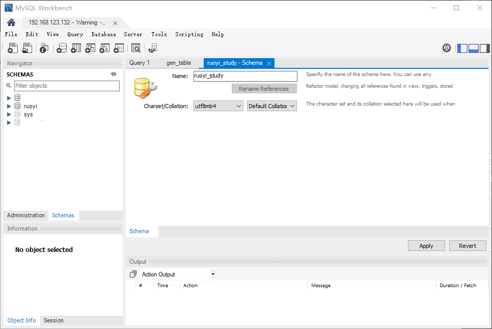
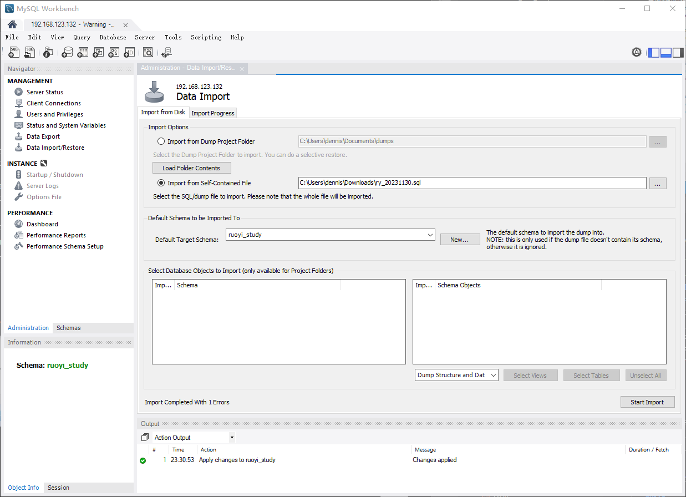
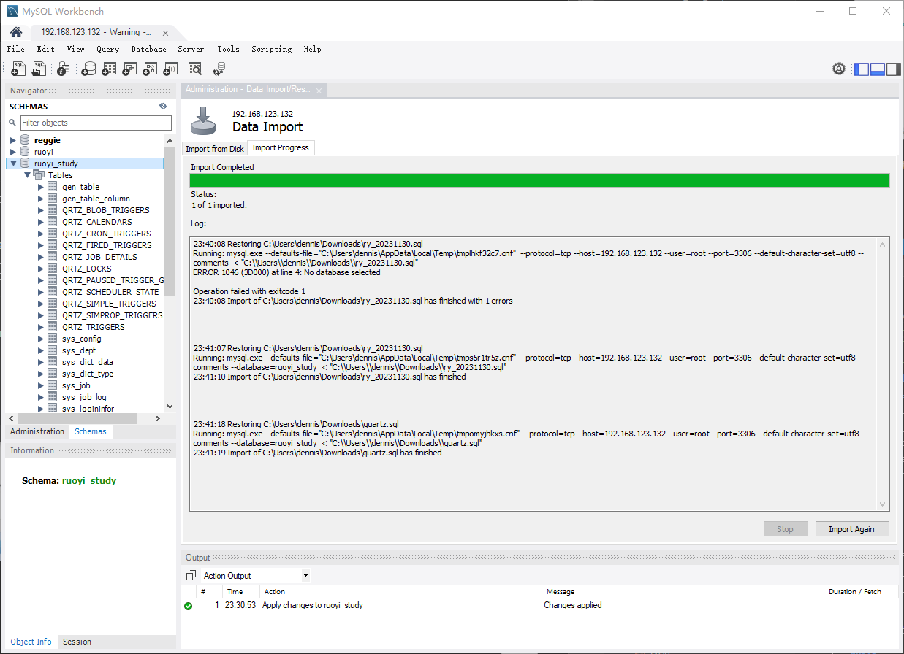
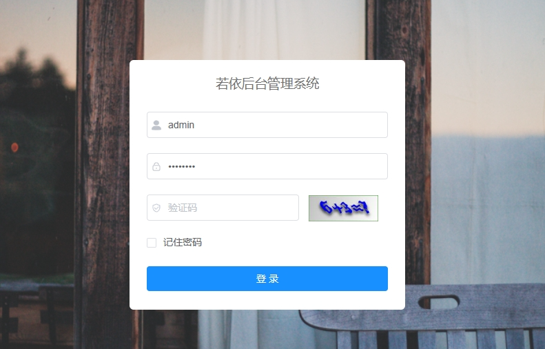

> 该系列笔记内容来自 B站视频教程，教程地址：
>
> https://www.bilibili.com/video/BV1zm4y1A7yQ
>
> https://www.bilibili.com/video/BV1684y1X7tK/

## 环境说明：

系统版本：

* rockylinux9.2

开发工具：

* vscode远程开发

软件版本：

* java：openjdk version "1.8.0_402"
* vue：

若依官方Gitee地址：https://gitee.com/y_project/RuoYi-Vue

## 运行测试环境

1. 首先克隆代码，到项目根目录

   ```
   mkdir ruoyi_study		#新建项目根文件
   cd ruoyi_study
   mkdir back_end			#新建前端项目目录
   cd back_end
   git clone https://gitee.com/y_project/RuoYi-Vue.git .
   mv ruoyi-ui ../front_end	#分离前后端代码，将前端代码放到front_end目录
   ```

   项目目录大概如下：

   ```
   [fams_itoper01@ca-s2104 ruoyi_study]$ tree . -L 2
   .
   ├── back_end
   │   ├── LICENSE
   │   ├── README.md
   │   ├── bin
   │   ├── doc
   │   ├── pom.xml
   │   ├── ruoyi-admin
   │   ├── ruoyi-common
   │   ├── ruoyi-framework
   │   ├── ruoyi-generator
   │   ├── ruoyi-quartz
   │   ├── ruoyi-system
   │   ├── ry.bat
   │   ├── ry.sh
   │   └── sql
   └── front_end
       ├── README.md
       ├── babel.config.js
       ├── bin
       ├── build
       ├── package.json
       ├── public
       ├── src
       └── vue.config.js

   15 directories, 9 files
   ```
2. 新建数据库，这里使用 MySQL Workbench

   

   或者也可以命令行运行，数据库创建语句如下：

   ```
   CREATE SCHEMA `ruoyi_study` DEFAULT CHARACTER SET utf8mb4 ;
   ```
3. 导入数据。右击左边菜单栏的 `Administration` 工具选择 `Data Import/Restore` 选项，数据库选择 `ruoyi_study`，将项目 `sql`目录中的 `ry_20231130.sql` 和 `quartz.sql` 导入到数据库中。先导入 `ry_20231130.sql`。

   

   导入成功后，能够查看到数据库中出现了表

   
4. 新建数据库用户，并授予 `ruoyi_study` 数据库所有权限

   ```
   CREATE USER "ruoyi"@"%" IDENTIFIED BY "JapT94LaKjb3Ryh";
   GRANT all privileges ON ruoyi_study.* TO "ruoyi"@"%";
   ```

   更改数据库地址。将数据库地址改成自己本地的数据库

   ```
   # 数据库配置文件目录如下
   back_end/ruoyi-admin/src/main/resources/application-druid.yml

   # 将数据库连接改成自己的
                   url: jdbc:mysql://192.168.123.132:3306/ruoyi_study?useUnicode=true&characterEncoding=utf8&zeroDateTimeBehavior=convertToNull&useSSL=true&serverTimezone=GMT%2B8
                   username: ruoyi
                   password: JapT94LaKjb3Ryh
   ```
5. 搭建redis。使用docker搭建

   ```
   vim docker_redis.yml
   # 复制以下内容
   version: '3.3'
   services:
     redis:
       image: redis:latest
       container_name: redis
       networks:
         test_network:
       restart: always
       ports:
         - '6379:6379'
       volumes:
   	# 挂载目录设置成自己想要的目录
         - /data/app/redis/data:/data
         - /data/app/redis/conf:/usr/local/etc/redis/redis.conf
         - /data/app/redis/logs:/logs
       #配置文件启动
       command: redis-server /usr/local/etc/redis/redis.conf
   networks:
       test_network:
   ```

   redis.conf配置文件示例：

   ```
   # Redis 服务器配置

   # 监听地址和端口
   bind 127.0.0.1
   port 16000

   # 如果需要监听多个地址，可以使用如下配置：
   # bind 127.0.0.1 192.168.1.100

   # 日志文件
   logfile "/logs/redis-server.log"

   # 数据库数量，默认为16个
   databases 16

   # 快照
   save 900 1             # 如果900秒内至少有1个 key 发生变化，则执行快照
   save 300 10            # 如果300秒内至少有10个 key 发生变化，则执行快照
   save 60 10000          # 如果60秒内至少有10000个 key 发生变化，则执行快照

   # RDB持久化
   # 将内存中的数据定期保存到磁盘上，默认开启
   # dbfilename 是 RDB 文件的名称
   # dir 是 RDB 文件保存的目录
   # 注意：RDB 快照会阻塞 Redis 服务器进程，所以在主服务器上不推荐开启
   # 如果是从服务器，可以关闭
   # save ""

   # AOF 持久化
   # 将每次写操作记录到 AOF 文件中，恢复时重放 AOF 文件即可恢复数据
   # appendonly no           # 启用 AOF 持久化，默认为 no
   # appendfilename "appendonly.aof"  # AOF 文件名称
   # appendfsync always      # 每次写操作都会同步写入 AOF 文件，最慢但最安全
   # appendfsync everysec     # 每秒同步写入 AOF 文件，推荐设置，性能和安全兼顾
   # appendfsync no          # 每次写操作都不会同步写入 AOF 文件，性能最好但数据安全性最差

   # 最大连接数
   maxclients 10000

   # 密码认证
   requirepass QsHmaTRP]#+6r#VK4M6bf5T+sqhy4@

   # 配置主从复制
   # slaveof masterip masterport

   # 配置 Sentinel（哨兵）模式
   # sentinel monitor mymaster 127.0.0.1 6379 2
   # sentinel down-after-milliseconds mymaster 5000
   # sentinel failover-timeout mymaster 60000
   # sentinel parallel-syncs mymaster 1

   # 配置集群
   # cluster-enabled yes
   # cluster-config-file nodes-6379.conf
   # cluster-node-timeout 5000
   # cluster-require-full-coverage yes

   # 配置慢查询日志
   # slowlog-log-slower-than 10000
   # slowlog-max-len 128

   # 配置网络
   timeout 0           # 设置客户端连接超时时间，默认为0，表示不超时
   tcp-keepalive 300  # 如果客户端在300秒内没有发来任何数据，服务端就向客户端发送心跳包，默认关闭

   ```

   使用 docker compose 安装

   ```
   docker compose -f docker_redis.yml up -d
   ```
6. 更改后端的redis配置

   ```
   # 更改以下文件
   back_end/ruoyi-admin/src/main/resources/application.yml

     redis:
       # 地址
       host: 192.168.123.132	#更改IP地址即可
   ```
7. 运行后端程序

   ```
   # 运行下面的程序
   back_end/ruoyi-admin/src/main/java/com/ruoyi/RuoYiApplication.java
   ```

   报错了，报错如下：

   ```
   00:15:25,427 |-ERROR in ch.qos.logback.core.rolling.RollingFileAppender[file_info] - openFile(/home/ruoyi/logs/sys-info.log,true) call failed. java.io.FileNotFoundException: /home/ruoyi/logs/sys-info.log (No such file or directory)
           at java.io.FileNotFoundException: /home/ruoyi/logs/sys-info.log (No such file or directory)
   ```

   更改日志地址

   ```
   # 日志地址文件
   back_end/ruoyi-admin/src/main/resources/logback.xml

   # 更改成自己想要的地址即可
       <!-- 日志存放路径 -->
   	<property name="log.path" value="/data/app/ruoyi/logs" />
   ```

   还要更改上传文件保存的地址

   ```
   # 保存的文件路径，在以下配置文件中
   back_end/ruoyi-admin/src/main/resources/application.yml

   # 更改成自己的日志即可
     # 文件路径 示例（ Windows配置D:/ruoyi/uploadPath，Linux配置 /home/ruoyi/uploadPath）
     #profile: D:/ruoyi/uploadPath
     profile: /data/app/ruoyi/uploadPath
   ```
8. 再次运行，能够正常启动。
9. 启动前端项目

   ```
   # 进入前端项目根目录
   cd front_end/

   # 设置阿里云npm源（不是必须）
   npm config set registry https://registry.npmmirror.com


   # 安装依赖
   npm isntall 

   # 运行开发环境
   npm run build
   ```
10. 访问前端页面。可以正常访问

    

## 运行正式环境

### 安装nginx

使用docker compose 安装 nginx，以下是nginx.yml文件

```
#nginx.yml
version: '3'
services:
  nginx:
    image: nginx
    container_name: nginx
    ports:
      - "80:80"
    volumes:
      - "/data/app/nginx/nginx.conf:/etc/nginx/nginx.conf"
      - "/data/app/nginx/logs:/var/log/nginx"
      - "/data/app/nginx/html:/usr/share/nginx/html"
    restart: always

```

编写nginx.conf文件

```
vim /data/app/nginx/nginx.conf
#复制以下配置文件内容
worker_processes  1;
events {
    worker_connections  1024;
}
http {
# 开启gzip压缩
gzip on;
# 不压缩临界值，大于1K的才压缩，一般不用改
gzip_min_length 1k;
# 压缩缓冲区
gzip_buffers 16 64K;
# 压缩版本（默认1.1，前端如果是squid2.5请使用1.0）
gzip_http_version 1.1;
# 压缩级别，1-10，数字越大压缩的越好，时间也越长
gzip_comp_level 5;
# 进行压缩的文件类型
gzip_types text/plain application/x-javascript text/css application/xml application/javascript;
# 跟Squid等缓存服务有关，on的话会在Header里增加"Vary: Accept-Encoding"
gzip_vary on;
# IE6对Gzip不怎么友好，不给它Gzip了
gzip_disable "MSIE [1-6]\.";
    include       /etc/nginx/mime.types;
    server {
      listen       80;
      server_name  localhost;
      location / {
        root   /usr/share/nginx/html/;
        index  index.html index.htm;
      }
      location /prod-api/ {
	proxy_set_header Host $http_host;
	proxy_set_header X-Real-IP $remote_addr;
	proxy_set_header REMOTE-HOST $remote_addr;
	proxy_set_header X-Forwarded-For $proxy_add_x_forwarded_for;
	proxy_pass http://192.168.123.132:8080/;

      }
    access_log /var/log/nginx/access.log;
    error_log /var/log/nginx/error.log;
}
} 
```

执行命令安装容器

```
docker compose -f nginx.yml up -d
```

### 打包前端环境

```
npm install
npm run build:prod
```

将打包好的dist目录下的文件拷贝到nginx的html目录下

```
cp /data/app/gitrepo/ruoyi_study/front_end/dist/* -r /data/app/nginx/html/
```

### 打包后端环境

```
cd back_end			#进入项目根目录
mvn clean package  -DskipTests	#打包
```

将打包好的文件ruoyi-admin.jar拷贝到自己想要的目录，然后运行

```
sudo java -jar ruoyi-admin.jar
```

### 访问测试

访问前端页面，能正常显示验证码的话，部署成功

```
http://192.168.123.132
```

## Reference Links：

#阿里云NPM源设置

https://developer.aliyun.com/article/868238
