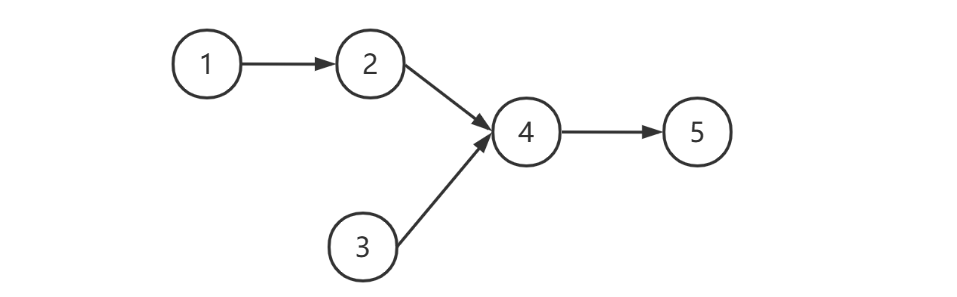

## 2.2 链表

### 概述

**定义**

在计算机科学中，链表是数据元素的线性集合，其每个元素都指向下一个元素，元素存储上并不连续

> In computer science, a **linked list** is a linear collection of data elements whose order is not given by their physical placement in memory. Instead, each element points to the next.

可以分类为[^5]

* 单向链表，每个元素只知道其下一个元素是谁


* 双向链表，每个元素知道其上一个元素和下一个元素


* 循环链表，通常的链表尾节点 tail 指向的都是 null，而循环链表的 tail 指向的是头节点 head


链表内还有一种特殊的节点称为哨兵（Sentinel）节点，也叫做哑元（ Dummy）节点，它不存储数据，通常用作头尾，用来简化边界判断，如下图所示


**随机访问性能**

根据 index 查找，时间复杂度 $O(n)$

**插入或删除性能**

* 起始位置：$O(1)$
* 结束位置：如果已知 tail 尾节点是 $O(1)$，不知道 tail 尾节点是 $O(n)$
* 中间位置：根据 index 查找时间 + $O(1)$

### 单向链表

根据单向链表的定义，首先定义一个存储 value 和 next 指针的类 Node，和一个描述头部节点的引用

```java
public class SinglyLinkedList {
  
    private Node head; // 头部节点
  
    private static class Node { // 节点类
        int value;
        Node next;

        public Node(int value, Node next) {
            this.value = value;
            this.next = next;
        }
    }
}
```

* Node 定义为内部类，是为了对外**隐藏**实现细节，没必要让类的使用者关心 Node 结构
* 定义为 static 内部类，是因为 Node **不需要**与 SinglyLinkedList 实例相关，多个 SinglyLinkedList实例能共用 Node 类定义

**头部添加**

```java
public class SinglyLinkedList {
    // ...
    public void addFirst(int value) {
		this.head = new Node(value, this.head);
    }
}
```

* 如果 this.head == null，新增节点指向 null，并作为新的 this.head
* 如果 this.head != null，新增节点指向原来的 this.head，并作为新的 this.head
  * 注意赋值操作执行顺序是从右到左

**while 遍历**

```java
public class SinglyLinkedList {
    // ...
    public void loop() {
        Node curr = this.head;
        while (curr != null) {
            // 做一些事
            curr = curr.next;
        }
    }
}
```

**for 遍历**

```java
public class SinglyLinkedList {
    // ...
    public void loop() {
        for (Node curr = this.head; curr != null; curr = curr.next) {
            // 做一些事
        }
    }
}
```

* 以上两种遍历都可以把**要做的事**以 Consumer 函数的方式传递进来
  * Consumer 的规则是**一个参数**，**无返回值**，因此像 System.out::println 方法等都是 Consumer
  * 调用 Consumer 时，将当前节点 curr.value 作为参数传递给它

**迭代器遍历**

```java
public class SinglyLinkedList implements Iterable<Integer> {
    // ...
    private class NodeIterator implements Iterator<Integer> {
        Node curr = head;
    
        public boolean hasNext() {
            return curr != null;
        }

        public Integer next() {
            int value = curr.value;
            curr = curr.next;
            return value;
        }
    }
  
    public Iterator<Integer> iterator() {
        return new NodeIterator();
    }
}
```

* hasNext 用来判断是否还有必要调用 next
* next 做两件事
  * 返回当前节点的 value
  * 指向下一个节点
* NodeIterator 要定义为**非 static 内部类**，是因为它与 SinglyLinkedList 实例相关，是对某个 SinglyLinkedList 实例的迭代

**递归遍历**

```java
public class SinglyLinkedList implements Iterable<Integer> {
    // ...
    public void loop() {
        recursion(this.head);
    }

    private void recursion(Node curr) {
        if (curr == null) {
            return;
        }
        // 前面做些事
        recursion(curr.next);
        // 后面做些事
    }
}
```

**尾部添加**

```java
public class SinglyLinkedList {
    // ...
    private Node findLast() {
        if (this.head == null) {
            return null;
        }
        Node curr;
        for (curr = this.head; curr.next != null; ) {
            curr = curr.next;
        }
        return curr;
    }
  
    public void addLast(int value) {
        Node last = findLast();
        if (last == null) {
            addFirst(value);
            return;
        }
        last.next = new Node(value, null);
    }
}
```

* 注意，找最后一个节点，终止条件是 curr.next == null
* 分成两个方法是为了代码清晰，而且 findLast() 之后还能复用

**尾部添加多个**

```java
public class SinglyLinkedList {
    // ...
	public void addLast(int first, int... rest) {
    
        Node sublist = new Node(first, null);
        Node curr = sublist;
        for (int value : rest) {
            curr.next = new Node(value, null);
            curr = curr.next;
        }
    
        Node last = findLast();
        if (last == null) {
            this.head = sublist;
            return;
        }
        last.next = sublist;
    }
}
```

* 先串成一串 sublist
* 再作为一个整体添加

**根据索引获取**

```java
public class SinglyLinkedList {
    // ...
	private Node findNode(int index) {
        int i = 0;
        for (Node curr = this.head; curr != null; curr = curr.next, i++) {
            if (index == i) {
                return curr;
            }
        }
        return null;
    }
  
    private IllegalArgumentException illegalIndex(int index) {
        return new IllegalArgumentException(String.format("index [%d] 不合法%n", index));
    }
  
    public int get(int index) {
        Node node = findNode(index);
        if (node != null) {
            return node.value;
        }
        throw illegalIndex(index);
    }
}
```

* 同样，分方法可以实现复用

**插入**

```java
public class SinglyLinkedList {
    // ...
	public void insert(int index, int value) {
        if (index == 0) {
            addFirst(value);
            return;
        }
        Node prev = findNode(index - 1); // 找到上一个节点
        if (prev == null) { // 找不到
            throw illegalIndex(index);
        }
        prev.next = new Node(value, prev.next);
    }
}
```

* 插入包括下面的删除，都必须找到上一个节点

**删除**

```java
public class SinglyLinkedList {
    // ...
	public void remove(int index) {
        if (index == 0) {
            if (this.head != null) {
                this.head = this.head.next;
                return;
            } else {
                throw illegalIndex(index);
            }
        }
        Node prev = findNode(index - 1);
        Node curr;
        if (prev != null && (curr = prev.next) != null) {
            prev.next = curr.next;
        } else {
            throw illegalIndex(index);
        }
    }
}
```

* 第一个 if 块对应着 removeFirst 情况
* 最后一个 if 块对应着至少得两个节点的情况
  * 不仅仅判断上一个节点非空，还要保证当前节点非空

### 单向链表（带哨兵）

观察之前单向链表的实现，发现每个方法内几乎都有判断是不是 head 这样的代码，能不能简化呢？

用一个不参与数据存储的特殊 Node 作为哨兵，它一般被称为哨兵或哑元，拥有哨兵节点的链表称为带头链表

```java
public class SinglyLinkedListSentinel {
    // ...
    private Node head = new Node(Integer.MIN_VALUE, null);
}
```

* 具体存什么值无所谓，因为不会用到它的值

加入哨兵节点后，代码会变得比较简单，先看几个工具方法

```java
public class SinglyLinkedListSentinel {
    // ...
  
    // 根据索引获取节点
    private Node findNode(int index) {
        int i = -1;
        for (Node curr = this.head; curr != null; curr = curr.next, i++) {
            if (i == index) {
                return curr;
            }
        }
        return null;
    }
  
    // 获取最后一个节点
    private Node findLast() {
        Node curr;
        for (curr = this.head; curr.next != null; ) {
            curr = curr.next;
        }
        return curr;
    }
}
```

* findNode 与之前类似，只是 i 初始值设置为 -1 对应哨兵，实际传入的 index 也是 $[-1, \infty)$
* findLast 绝不会返回 null 了，就算没有其它节点，也会返回哨兵作为最后一个节点

这样，代码简化为

```java
public class SinglyLinkedListSentinel {
    // ...
  
    public void addLast(int value) {
        Node last = findLast();
        /*
        改动前
        if (last == null) {
            this.head = new Node(value, null);
            return;
        }
        */
        last.next = new Node(value, null);
    }
  
    public void insert(int index, int value) {
        /*
        改动前
        if (index == 0) {
            this.head = new Node(value, this.head);
            return;
        }
        */
        // index 传入 0 时，返回的是哨兵
        Node prev = findNode(index - 1);
        if (prev != null) {
            prev.next = new Node(value, prev.next);
        } else {
            throw illegalIndex(index);
        }
    }
  
    public void remove(int index) {
        /*
        改动前
        if (index == 0) {
            if (this.head != null) {
                this.head = this.head.next;
                return;
            } else {
                throw illegalIndex(index);
            }
        }
        */
        // index 传入 0 时，返回的是哨兵
        Node prev = findNode(index - 1);
        Node curr;
        if (prev != null && (curr = prev.next) != null) {
            prev.next = curr.next;
        } else {
            throw illegalIndex(index);
        }
    }
  
    public void addFirst(int value) {
        /*
        改动前
        this.head = new Node(value, this.head);
        */
		this.head.next = new Node(value, this.head.next);
        // 也可以视为 insert 的特例, 即 insert(0, value);
    }
}
```

* 对于删除，前面说了【最后一个 if 块对应着至少得两个节点的情况】，现在有了哨兵，就凑足了两个节点

### 双向链表（带哨兵）

```java
public class DoublyLinkedListSentinel implements Iterable<Integer> {

    private final Node head;
    private final Node tail;

    public DoublyLinkedListSentinel() {
        head = new Node(null, 666, null);
        tail = new Node(null, 888, null);
        head.next = tail;
        tail.prev = head;
    }

    private Node findNode(int index) {
        int i = -1;
        for (Node p = head; p != tail; p = p.next, i++) {
            if (i == index) {
                return p;
            }
        }
        return null;
    }

    public void addFirst(int value) {
        insert(0, value);
    }

    public void removeFirst() {
        remove(0);
    }

    public void addLast(int value) {
        Node prev = tail.prev;
        Node added = new Node(prev, value, tail);
        prev.next = added;
        tail.prev = added;
    }

    public void removeLast() {
        Node removed = tail.prev;
        if (removed == head) {
            throw illegalIndex(0);
        }
        Node prev = removed.prev;
        prev.next = tail;
        tail.prev = prev;
    }

    public void insert(int index, int value) {
        Node prev = findNode(index - 1);
        if (prev == null) {
            throw illegalIndex(index);
        }
        Node next = prev.next;
        Node inserted = new Node(prev, value, next);
        prev.next = inserted;
        next.prev = inserted;
    }

    public void remove(int index) {
        Node prev = findNode(index - 1);
        if (prev == null) {
            throw illegalIndex(index);
        }
        Node removed = prev.next;
        if (removed == tail) {
            throw illegalIndex(index);
        }
        Node next = removed.next;
        prev.next = next;
        next.prev = prev;
    }

    private IllegalArgumentException illegalIndex(int index) {
        return new IllegalArgumentException(
                String.format("index [%d] 不合法%n", index));
    }

    @Override
    public Iterator<Integer> iterator() {
        return new Iterator<Integer>() {
            Node p = head.next;

            @Override
            public boolean hasNext() {
                return p != tail;
            }

            @Override
            public Integer next() {
                int value = p.value;
                p = p.next;
                return value;
            }
        };
    }

    static class Node {
        Node prev;
        int value;
        Node next;

        public Node(Node prev, int value, Node next) {
            this.prev = prev;
            this.value = value;
            this.next = next;
        }
    }
}
```

### 环形链表（带哨兵）

双向环形链表带哨兵，这时哨兵**既作为头，也作为尾**


参考实现

```java
public class DoublyLinkedListSentinel implements Iterable<Integer> {

    @Override
    public Iterator<Integer> iterator() {
        return new Iterator<>() {
            Node p = sentinel.next;

            @Override
            public boolean hasNext() {
                return p != sentinel;
            }

            @Override
            public Integer next() {
                int value = p.value;
                p = p.next;
                return value;
            }
        };
    }

    static class Node {
        Node prev;
        int value;
        Node next;

        public Node(Node prev, int value, Node next) {
            this.prev = prev;
            this.value = value;
            this.next = next;
        }
    }

    private final Node sentinel = new Node(null, -1, null); // 哨兵

    public DoublyLinkedListSentinel() {
        sentinel.next = sentinel;
        sentinel.prev = sentinel;
    }

    /**
     * 添加到第一个
     * @param value 待添加值
     */
    public void addFirst(int value) {
        Node next = sentinel.next;
        Node prev = sentinel;
        Node added = new Node(prev, value, next);
        prev.next = added;
        next.prev = added;
    }

    /**
     * 添加到最后一个
     * @param value 待添加值
     */
    public void addLast(int value) {
        Node prev = sentinel.prev;
        Node next = sentinel;
        Node added = new Node(prev, value, next);
        prev.next = added;
        next.prev = added;
    }
  
    /**
     * 删除第一个
     */
    public void removeFirst() {
        Node removed = sentinel.next;
        if (removed == sentinel) {
            throw new IllegalArgumentException("非法");
        }
        Node a = sentinel;
        Node b = removed.next;
        a.next = b;
        b.prev = a;
    }

    /**
     * 删除最后一个
     */
    public void removeLast() {
        Node removed = sentinel.prev;
        if (removed == sentinel) {
            throw new IllegalArgumentException("非法");
        }
        Node a = removed.prev;
        Node b = sentinel;
        a.next = b;
        b.prev = a;
    }

    /**
     * 根据值删除节点
     * <p>假定 value 在链表中作为 key, 有唯一性</p>
     * @param value 待删除值
     */
    public void removeByValue(int value) {
        Node removed = findNodeByValue(value);
        if (removed != null) {
            Node prev = removed.prev;
            Node next = removed.next;
            prev.next = next;
            next.prev = prev;
        }
    }

    private Node findNodeByValue(int value) {
        Node p = sentinel.next;
        while (p != sentinel) {
            if (p.value == value) {
                return p;
            }
            p = p.next;
        }
        return null;
    }

}
```

### 习题

#### E01. 反转单向链表-Leetcode 206

对应力扣题目 [206. 反转链表 - 力扣（LeetCode）](https://leetcode.cn/problems/reverse-linked-list/)

```
输入：head = [1,2,3,4,5]
输出：[5,4,3,2,1]

输入：[1,2]
输出：[2,1]

输入：[]
输出：[]
```

**方法1**

构造一个新链表，从**旧链表**依次拿到每个节点，创建新节点添加至**新链表**头部，完成后新链表即是倒序的

```java
public ListNode reverseList(ListNode o1) {
    ListNode n1 = null;
    ListNode p = o1;
    while (p != null) {
        n1 = new ListNode(p.val, n1);
        p = p.next;
    }
    return n1;
}
```

评价：简单直白，就是得新创建节点对象

**方法2**

与方法1 类似，构造一个新链表，从**旧链表头部**移除节点，添加到**新链表头部**，完成后新链表即是倒序的，区别在于原题目未提供节点外层的容器类，这里提供一个，另外一个区别是并不去构造新节点

```java
static class List {
    ListNode head;

    public List(ListNode head) {
        this.head = head;
    }

    public ListNode removeFirst(){
        ListNode first = head;
        if (first != null) {
            head = first.next;
        }
        return first;
    }

    public void addFirst(ListNode first) {
        first.next = head;
        head = first;
    }
}
```

代码

```java
public ListNode reverseList(ListNode head) {
    List list1 = new List(head);
    List list2 = new List(null);
    ListNode first;
    while ((first = list1.removeFirst()) != null) {
        list2.addFirst(first);
    }
    return list2.head;
}
```

评价：更加面向对象，如果实际写代码而非刷题，更多会这么做

**方法3**

递归，在**归**时让 $5 \rightarrow 4$，$4 \rightarrow 3$ ...

首先，写一个递归方法，返回值用来拿到最后一个节点

```java
public ListNode reverseList(ListNode p) {
    if (p == null || p.next == null) { // 不足两个节点
        return p; // 最后一个节点
    }
    ListNode last = reverseList(p.next);
    return last;
}
```

* 注意1：递归终止条件是 curr.next == null，目的是到最后一个节点就结束递归，与之前递归遍历不一样
* 注意2：需要考虑空链表即 p == null 的情况

可以先测试一下

```java
ListNode o5 = new ListNode(5, null);
ListNode o4 = new ListNode(4, o5);
ListNode o3 = new ListNode(3, o4);
ListNode o2 = new ListNode(2, o3);
ListNode o1 = new ListNode(1, o2);
ListNode n1 = new E01Leetcode206().reverseList(o1);
System.out.println(n1);
```

会打印

```
[5]
```

下面为**伪码**调用过程，假设节点分别是 $1 \rightarrow 2 \rightarrow 3 \rightarrow 4 \rightarrow 5 \rightarrow null$，先忽略返回值

```java
reverseList(ListNode p = 1) {
    reverseList(ListNode p = 2) {
    	reverseList(ListNode p = 3) {
    		reverseList(ListNode p = 4) {
    			reverseList(ListNode p = 5) {
    				if (p == null || p.next == null) {
                        return p; // 返回5
                    }
				}
                // 此时p是4, p.next是5
			}
            // 此时p是3, p.next是4
		}
        // 此时p是2, p.next是3
	}
    // 此时p是1, p.next是2
}
```

接下来，从 p = 4 开始，要让 $5 \rightarrow 4$，$4 \rightarrow 3$ ...

```java
reverseList(ListNode p = 1) {
    reverseList(ListNode p = 2) {
    	reverseList(ListNode p = 3) {
    		reverseList(ListNode p = 4) {
    			reverseList(ListNode p = 5) {
    				if (p == null || p.next == null) {
                        return p; // 返回5
                    }
				}
                // 此时p是4, p.next是5, 要让5指向4,代码写成 p.next.next=p
                // 还要注意4要指向 null, 否则就死链了
			}
            // 此时p是3, p.next是4
		}
        // 此时p是2, p.next是3
	}
    // 此时p是1, p.next是2
}
```

最终代码为：

```java
public ListNode reverseList(ListNode p) {  
    if (p == null || p.next == null) { // 不足两个节点
        return p; // 最后一个节点
    }
    ListNode last = reverseList(p.next);
    p.next.next = p;
    p.next = null;
    return last;
}
```

Q：为啥不能在**递**的过程中倒序？

A：比如

* $ 1 \rightarrow 2 \rightarrow 3 $ 如果递的过程中让 $2 \rightarrow 1$ 那么此时 $2 \rightarrow 3$ 就被覆盖，不知道接下来递给谁
* 而归的时候让 $3 \rightarrow 2$ 不会影响上一层的 $1 \rightarrow 2$

评价：单向链表没有 prev 指针，但利用递归的特性【记住了】链表每次调用时相邻两个节点是谁

**方法4**

从链表每次拿到第二个节点，将其从链表断开，插入头部，直至它为 null 结束

1. 设置指针 o1(旧头)、n1(新头)、o2(旧老二)，分别指向第一，第一，第二节点

$\frac{n1 \ o1}{1} \rightarrow \frac{o2}{2} \rightarrow 3 \rightarrow 4 \rightarrow 5 \rightarrow null$

2. 将 o2 节点从链表断开，即 o1 节点指向第三节点

$ \frac{n1 \ o1}{1} \rightarrow 3 \rightarrow 4 \rightarrow 5 \rightarrow null$ ，$\frac{o2}{2}$

3. o2 节点链入链表头部，即

$\frac{o2}{2} \rightarrow \frac{n1 \ o1}{1} \rightarrow 3 \rightarrow 4 \rightarrow 5 \rightarrow null$

4. n1 指向 o2

$\frac{n1 \ o2}{2} \rightarrow \frac{o1}{1} \rightarrow 3 \rightarrow 4 \rightarrow 5 \rightarrow null$

5. o2 指向 o1 的下一个节点，即

$\frac{n1}{2} \rightarrow \frac{o1}{1} \rightarrow \frac{o2}{3} \rightarrow 4 \rightarrow 5 \rightarrow null$

6. 重复以上 $2\sim5$ 步，直到 o2 指向 null
7. 还应当考虑边界条件，即链表中不满两个元素时，无需走以上逻辑

参考答案

```java
public ListNode reverseList(ListNode o1) {  
    if (o1 == null || o1.next == null) { // 不足两个节点
        return o1;
    }
    ListNode o2 = o1.next;
    ListNode n1 = o1;
    while (o2 != null) {
        o1.next = o2.next; 
        o2.next = n1;
        n1 = o2;
        o2 = o1.next;
    }
    return n1;
}
```

**方法5**

要点：把链表分成两部分，思路就是不断从链表2的头，往链表1的头搬移

1. n1 指向 null，代表**新链表**一开始没有元素，o1 指向**原链表**的首节点

$\frac{n1}{null}$，$\frac{o1}{1} \rightarrow 2 \rightarrow 3 \rightarrow 4 \rightarrow 5 \rightarrow null$

2. 开始循环，o2 指向**原链表**次节点

$\frac{n1}{null}$，$\frac{o1}{1} \rightarrow \frac{o2}{2} \rightarrow 3 \rightarrow 4 \rightarrow 5 \rightarrow null$

3. 搬移

$\frac{o1}{1} \rightarrow \frac{n1}{null}$  ， $\frac{o2}{2} \rightarrow 3 \rightarrow 4 \rightarrow 5 \rightarrow null$

4. 指针复位

$\frac{n1}{1} \rightarrow null$ ， $\frac{o1 \ o2}{2} \rightarrow 3 \rightarrow 4 \rightarrow 5 \rightarrow null$

5. 重复 $2\sim4$ 步
6. 当 o1 = null 时退出循环

**参考答案**

```java
public ListNode reverseList(ListNode o1) {
    if (o1 == null || o1.next == null) {
        return o1;
    }
    ListNode n1 = null;
    while (o1 != null) {
        ListNode o2 = o1.next;
        o1.next = n1;
        n1 = o1;
        o1 = o2;
    }
    return n1;
}
```

评价：本质上与方法2 相同，只是方法2更为面向对象

#### E02. 根据值删除节点-Leetcode 203

例如

```
输入：head = [1,2,6,3,6], val = 6
输出：[1,2,3]

输入：head = [], val = 1
输出：[]

输入：head = [7,7,7,7], val = 7
输出：[]
```

**方法1**

图中 s 代表 sentinel 哨兵（如果不加哨兵，则删除第一个节点要特殊处理），例如要删除 6

```
p1   p2
s -> 1 -> 2 -> 6 -> 3 -> 6 -> null
```

* 如果 p2 不等于目标，则 p1，p2 不断后移

```
	 p1   p2
s -> 1 -> 2 -> 6 -> 3 -> 6 -> null

	 	  p1   p2
s -> 1 -> 2 -> 6 -> 3 -> 6 -> null
```

* p2 == 6，删除它，注意 p1 此时保持不变，p2 后移

```
	 	  p1   p2
s -> 1 -> 2 -> 3 -> 6 -> null
```

* p2 不等于目标，则 p1，p2 不断后移

```
	 	  	   p1   p2
s -> 1 -> 2 -> 3 -> 6 -> null
```

* p2 == 6，删除它，注意 p1 此时保持不变，p2 后移

```
	 	  	   p1   p2
s -> 1 -> 2 -> 3 -> null
```

* p2 == null 退出循环

最后代码

```java
public ListNode removeElements(ListNode head, int val) {
    ListNode sentinel = new ListNode(-1, head);
    ListNode p1 = sentinel;
    ListNode p2;
    while ((p2 = p1.next) != null) {
        if (p2.val == val) {
            p1.next = p2.next;
        } else {
            p1 = p1.next;
        }
    }
    return sentinel.next;
}
```

**方法2**

思路，递归函数负责返回：从当前节点（我）开始，完成删除的子链表

1. 若我与 v 相等，应该返回下一个节点递归结果
2. 若我与 v 不等，应该返回我，但我的 next 应该更新（让我能带上后续删过的子链表）

```java
removeElements(ListNode p=1, int v=6){
    1.next=removeElements(ListNode p=2, int v=6){
    	2.next=removeElements(ListNode p=6, int v=6){
    		removeElements(ListNode p=3, int v=6){
    			3.next=removeElements(ListNode p=6, int v=6){
    				removeElements(ListNode p=null, int v=6){
    					// 没有节点,返回
                        return null
					}
				}
                return 3
			}
		}
        return 2
    }
    return 1
}
```

代码

```java
public ListNode removeElements(ListNode head, int val) {
    if (head == null) {
        return null;
    }
    if (head.val == val) {
        return removeElements(head.next, val);
    } else {
        head.next = removeElements(head.next, val);
        return head;
    }
}
```

#### E03.  删除倒数节点-Leetcode 19

例如

```
输入：head = [1,2,3,4,5], n = 2
输出：[1,2,3,5]

输入：head = [1], n = 1
输出：[]

输入：head = [1,2], n = 1
输出：[1]
```

另外题目提示

* 链表至少一个节点
* n 只会在合理范围

**方法1**

思路，写一个递归函数，用来返回下一个节点的倒数序号

```java
recursion(ListNode p=1, int n=2) {
    recursion(ListNode p=2, int n=2) {
    	recursion(ListNode p=3, int n=2) {
    		recursion(ListNode p=4, int n=2) {
    			recursion(ListNode p=5, int n=2) {
    				recursion(ListNode p=null, int n=2) {
    					return 0; // 最内层序号0
					}
                    return 1; // 上一次返回值+1
				}
                return 2;
			}
            if(返回值 == n == 2) {
                // 删除 next
            }
            return 3;
		}
        return 4;
	}
    return 5;
}
```

但上述代码有一个问题，就是若删除的是第一个节点，它没有上一个节点，因此可以加一个哨兵来解决

代码

```java
public ListNode removeNthFromEnd(ListNode head, int n) {
    ListNode sentinel = new ListNode(-1, head);
    recursion(sentinel, n);
    return sentinel.next;
}

public int recursion(ListNode p, int n) {
    if (p == null) {
        return 0;
    }
    int nth = recursion(p.next, n);
    if (nth == n) {
        p.next = p.next.next;
    }
    return nth + 1;
}
```

Q：p.next.next 不怕空指针吗？

A：

* p 是待删除节点的上一个节点，如果能递归回到 p，那么 p.next 肯定有值，不会是 null
* 且题目说明了 n >=1，不会因为 nth == 0 而让 p.next 指向最后的 null

**方法2**

快慢指针，p1 指向待删节点的上一个，p2 先走 n + 1 步

```java
i=0
p2
s -> 1 -> 2 -> 3 -> 4 -> 5 -> null

     i=1
     p2
s -> 1 -> 2 -> 3 -> 4 -> 5 -> null

          i=2
          p2
s -> 1 -> 2 -> 3 -> 4 -> 5 -> null

               i=3 从此开始 p1 p2 依次向右平移, 直到 p2 移动到末尾
p1             p2
s -> 1 -> 2 -> 3 -> 4 -> 5 -> null

               p1             p2
s -> 1 -> 2 -> 3 -> 4 -> 5 -> null
```

代码

```java
public ListNode removeNthFromEnd(ListNode head, int n) {
    ListNode s = new ListNode(-1, head);
    ListNode p1 = s;
    ListNode p2 = s;
    for (int i = 0; i < n + 1; i++) {
        p2 = p2.next;
    }
    while (p2 != null) {
        p1 = p1.next;
        p2 = p2.next;
    }
    p1.next = p1.next.next;
    return s.next;
}
```

**方法3**

```java
public ListNode removeNthFromEnd(ListNode head, int n) {
    Composite c = recursion(head, n);
    return c.node;
}

static class Composite {
    ListNode node;
    int nth;

    public Composite(ListNode node, int nth) {
        this.node = node;
        this.nth = nth;
    }
}

public Composite recursion(ListNode p, int n) {
    if (p == null) {
        return new Composite(null, 1);
    }
    Composite c = recursion(p.next, n);
    if (c.nth != n) {
        p.next = c.node;
        c.node = p;
    }
    c.nth +=1;
    return c;
}
```

#### E04. 有序链表去重-Leetcode 83

例如

```
输入：head = [1,1,2]
输出：[1,2]

输入：head = [1,1,2,3,3]
输出：[1,2,3]
```

注意：**重复元素保留一个**

**方法1**

```
p1   p2
1 -> 1 -> 2 -> 3 -> 3 -> null
```

* p1.val == p2.val 那么删除 p2，注意 p1 此时保持不变

```
p1   p2
1 -> 2 -> 3 -> 3 -> null
```

* p1.val != p2.val 那么 p1，p2 向后移动

```java
     p1   p2
1 -> 2 -> 3 -> 3 -> null
     
          p1   p2
1 -> 2 -> 3 -> 3 -> null   
```

* p1.val == p2.val 那么删除 p2

```
          p1   p2
1 -> 2 -> 3 -> null   
```

* 当 p2 == null 退出循环

代码

```java
public ListNode deleteDuplicates(ListNode head) {
    // 链表节点 < 2
    if (head == null || head.next == null) {
        return head;
    }
    // 链表节点 >= 2
    ListNode p1 = head;
    ListNode p2;
    while ((p2 = p1.next) != null) {
        if (p1.val == p2.val) {
            p1.next = p2.next;
        } else {
            p1 = p1.next;
        }
    }
    return head;
}
```

**方法2**

递归函数负责返回：从当前节点（我）开始，完成去重的链表

1. 若我与 next 重复，返回 next
2. 若我与 next 不重复，返回我，但 next 应当更新

```java
deleteDuplicates(ListNode p=1) {
    deleteDuplicates(ListNode p=1) {
        1.next=deleteDuplicates(ListNode p=2) {
            2.next=deleteDuplicates(ListNode p=3) {
                deleteDuplicates(ListNode p=3) {
					// 只剩一个节点，返回
                    return 3
                }            
            }
            return 2
        }
        return 1
    }
}
```

代码

```java
public ListNode deleteDuplicates(ListNode p) {
    if (p == null || p.next == null) {
        return p;
    }
    if(p.val == p.next.val) {
        return deleteDuplicates(p.next);
    } else {
        p.next = deleteDuplicates(p.next);
        return p;
    }
}
```

#### E05. 有序链表去重-Leetcode 82

例如

```
输入：head = [1,2,3,3,4,4,5]
输出：[1,2,5]

输入：head = [1,1,1,2,3]
输出：[2,3]
```

注意：**重复元素一个不留**

**方法1**

递归函数负责返回：从当前节点（我）开始，完成去重的链表

1. 若我与 next 重复，一直找到下一个不重复的节点，以它的返回结果为准
2. 若我与 next 不重复，返回我，同时更新 next

```java
deleteDuplicates(ListNode p = 1) {
    // 找下个不重复的
	deleteDuplicates(ListNode p = 1) {
        deleteDuplicates(ListNode p = 1) {
			deleteDuplicates(ListNode p = 2) {
                2.next=deleteDuplicates(ListNode p = 3) {
					// 只剩一个节点，返回
                    return 3
                }
                return 2
			}
        }
    }
}
```

代码

```java
public ListNode deleteDuplicates(ListNode p) {
    if (p == null || p.next == null) {
        return p;
    }
    if (p.val == p.next.val) {
        ListNode x = p.next.next;
        while (x != null && x.val == p.val) {
            x = x.next;
        }
        return deleteDuplicates(x);
    } else {
        p.next = deleteDuplicates(p.next);
        return p;
    }
}
```

**方法2**

p1 是待删除的上一个节点，每次循环对比 p2、p3 的值

* 如果 p2 与 p3 的值重复，那么 p3 继续后移，直到找到与 p2 不重复的节点，p1 指向 p3 完成删除
* 如果 p2 与 p3 的值不重复，p1，p2，p3 向后平移一位，继续上面的操作
* p2 或 p3 为 null 退出循环
  * p2 为 null 的情况，比如链表为 1 1 1 null

```
p1 p2 p3
s, 1, 1, 1, 2, 3, null

p1 p2    p3
s, 1, 1, 1, 2, 3, null

p1 p2       p3
s, 1, 1, 1, 2, 3, null

p1 p3
s, 2, 3, null

p1 p2 p3
s, 2, 3, null

   p1 p2 p3
s, 2, 3, null
```

代码

```java
public ListNode deleteDuplicates(ListNode head) {
    if (head == null || head.next == null) {
        return head;
    }

    ListNode s = new ListNode(-1, head);
    ListNode p1 = s;
    ListNode p2;
    ListNode p3;
    while ((p2 = p1.next) != null && (p3 = p2.next) != null) {
        if (p2.val == p3.val) {
            while ((p3 = p3.next) != null 
                   && p3.val == p2.val) {
            }
            p1.next = p3;
        } else {
            p1 = p1.next;
        }
    }
    return s.next;
}
```

#### E06. 合并有序链表-Leetcode 21

例

```
输入：l1 = [1,2,4], l2 = [1,3,4]
输出：[1,1,2,3,4,4]
  
输入：l1 = [], l2 = []
输出：[]

输入：l1 = [], l2 = [0]
输出：[0]
```

**方法1**

* 谁小，把谁链给 p，p 和小的都向后平移一位
* 当 p1、p2 有一个为 null，退出循环，把不为 null 的链给 p

```
p1
1	3	8	9	null

p2
2	4	null

p
s	null
```

代码

```java
public ListNode mergeTwoLists(ListNode p1, ListNode p2) {
    ListNode s = new ListNode(-1, null);
    ListNode p = s;
    while (p1 != null && p2 != null) {
        if (p1.val < p2.val) {
            p.next = p1;
            p1 = p1.next;
        } else {
            p.next = p2;
            p2 = p2.next;
        }
        p = p.next;
    }
    if (p1 != null) {
        p.next = p1;
    }
    if (p2 != null) {
        p.next = p2;
    }
    return s.next;
}
```

* 可以自行验证**例**中后两种情况

**方法2**

递归函数应该返回

* 更小的那个链表节点，并把它剩余节点与另一个链表再次递归
* 返回之前，更新此节点的 next

```java
mergeTwoLists(p1=[1,3,8,9], p2=[2,4]) {
    1.next=mergeTwoLists(p1=[3,8,9], p2=[2,4]) {
        2.next=mergeTwoLists(p1=[3,8,9], p2=[4]) {        
            3.next=mergeTwoLists(p1=[8,9], p2=[4]) {
                4.next=mergeTwoLists(p1=[8,9], p2=null) {
                    return [8,9]
                }
                return 4
            }
            return 3
        }
        return 2
    }
	return 1
}
```

#### E07. 合并多个有序链表-Leetcode 23

例

```
输入：lists = [[1,4,5],[1,3,4],[2,6]]
输出：[1,1,2,3,4,4,5,6]
解释：链表数组如下：
[
  1->4->5,
  1->3->4,
  2->6
]
将它们合并到一个有序链表中得到。
1->1->2->3->4->4->5->6
```

**方法1**

递归

```java
public ListNode mergeKLists(ListNode[] lists) {
    if (lists.length == 0) {
        return null;
    }
    return split(lists, 0, lists.length - 1);
}

public ListNode split(ListNode[] lists, int i, int j) {
    System.out.println(i + " " + j);
    if (j == i) {
        return lists[i];
    }
    int m = (i + j) >>> 1;
    return mergeTwoLists(
        split(lists, i, m),
        split(lists, m + 1, j)
    );
}
```

还可以用优先级队列求解，这个放在后面讲

#### E08. 查找链表中间节点-Leetcode 876

例如

```
输入：[1,2,3,4,5]
输出：此列表中的结点 3 (序列化形式：[3,4,5])

输入：[1,2,3,4,5,6]
输出：此列表中的结点 4 (序列化形式：[4,5,6])
```

* **偶数**节点时，中间点是靠右的那个

解法：快慢指针，快指针一次走两步，慢指针一次走一步，当快指针到链表结尾时，慢指针恰好走到链表的一半

```java
public ListNode middleNode(ListNode head) {
    ListNode p1 = head;	// 慢指针，中间点
    ListNode p2 = head;	// 快指针
    while (p2 != null && p2.next != null) {
        p1 = p1.next;
        p2 = p2.next;
        p2 = p2.next;
    }
    return p1;
}
```

#### E09. 回文链表-Leetcode 234

所谓回文指正着读、反着读，结果一样，例如

```
[1,2,2,1]
[1,2,3,2,1]
```

它们都是回文链表，不是回文的例子

```
[1,2,3,1]  --反过来-->  [1,3,2,1]
```

解法

```java
/*
    步骤1. 找中间点
    步骤2. 中间点后半个链表反转
    步骤3. 反转后链表与原链表逐一比较
*/
public boolean isPalindrome(ListNode head) {
    ListNode middle = middle(head);
    ListNode newHead = reverse(middle);
    while (newHead != null) {
        if (newHead.val != head.val) {
            return false;
        }
        newHead = newHead.next;
        head = head.next;
    }
    return true;
}

private ListNode reverse(ListNode o1) {
    ListNode n1 = null;
    while (o1 != null) {
        ListNode o2 = o1.next;
        o1.next = n1;
        n1 = o1;
        o1 = o2;
    }
    return n1;
}

private ListNode middle(ListNode head) {
    ListNode p1 = head; // 慢
    ListNode p2 = head; // 快
    while (p2 != null && p2.next != null) {
        p1 = p1.next;
        p2 = p2.next.next;
    }
    return p1;
}
```

优化后解法

```java
public boolean isPalindrome(ListNode h1) {
    if (h1 == null || h1.next == null) {
        return true;
    }
    ListNode p1 = h1; 	// 慢指针，中间点
    ListNode p2 = h1; 	// 快指针
    ListNode n1 = null;	// 新头
    ListNode o1 = h1;	// 旧头
    // 快慢指针找中间点
    while (p2 != null && p2.next != null) {
        p1 = p1.next;
        p2 = p2.next.next;

        // 反转前半部分
        o1.next = n1;
        n1 = o1;
        o1 = p1;
    }
    if (p2 != null) { // 节点数为奇数
        p1 = p1.next;
    }
    // 同步比较新头和后半部分
    while (n1 != null) {
        if (n1.val != p1.val) {
            return false;
        }
        p1 = p1.next;
        n1 = n1.next;
    }
    return true;
}
```

#### E10. 环形链表-Leetcode 141

本题以及下题，实际是 Floyd's Tortoise and Hare Algorithm （Floyd 龟兔赛跑算法）[^15]

> 除了 Floyd 判环算法外，还有其它的判环算法，详见 https://en.wikipedia.org/wiki/Cycle_detection


如果链表上存在环，那么在环上以不同速度前进的两个指针必定会在某个时刻相遇。算法分为两个阶段

阶段1

* 龟一次走一步，兔子一次走两步
* 当兔子能走到终点时，不存在环
* 当兔子能追上龟时，可以判断存在环

阶段2

* 从它们第一次相遇开始，龟回到起点，兔子保持原位不变
* 龟和兔子一次都走一步
* 当再次相遇时，地点就是环的入口

为什么呢？

* 设起点到入口走 a 步（本例是 7），绕环一圈长度为 b（本例是 5），
* 那么**从起点开始，走 a + 绕环 n 圈，都能找到环入口**
* 第一次相遇时
  * 兔走了 a + 绕环 n 圈（本例 2 圈） + k，k 是它们相遇距环入口位置（本例 3，不重要）
  * 龟走了 a + 绕环 n 圈（本例 0 圈） + k，当然它绕的圈数比兔少
  * 兔走的距离是龟的两倍，所以**龟走的** = 兔走的 - 龟走的 = **绕环 n 圈**
* 而前面分析过，如果走 a + 绕环 n 圈，都能找到环入口，因此从相遇点开始，再走 a 步，就是环入口

阶段1 参考代码（判断是否有环）

```java
public boolean hasCycle(ListNode head) {
    ListNode h = head; // 兔
    ListNode t = head; // 龟
    while (h != null && h.next != null) {
        t = t.next;
        h = h.next.next;
        if(h == t){
            return true;
        }
    }
    return false;
}
```

#### E11. 环形链表-Leetcode 142

阶段2 参考代码（找到环入口）

```java
public ListNode detectCycle(ListNode head) {
    ListNode t = head; // 龟
    ListNode h = head; // 兔
    while (h != null && h.next != null) {
        t = t.next;
        h = h.next.next;
        if (h == t) {
            t = head;
            while (true) {
                if (h == t) {
                    return h;
                }
                h = h.next;
                t = t.next;
            }
        }
    }
    return null;
}
```

* 还有一道扩展题目，也可以用判环算法思想来解：就是 287 题，寻找重复数

#### Ex1. 删除节点-Leetcode 237

这道题目比较简单，留给大家自己练习

例如

```
输入：head = [4,5,1,9], node = 5
输出：[4,1,9]


输入：head = [4,5,1,9], node = 1
输出：[4,5,9]
```

注意：被删除的节点**不是**末尾节点

**参考答案**

```java
public class Ex1Leetcode237 {
    /**
     *
     * @param node 待删除节点, 题目已说明肯定不是最后一个节点
     */
    public void deleteNode(ListNode node) {
        node.val = node.next.val;		// 下一个节点值赋值给待"删除"节点
        node.next = node.next.next;		// 把下一个节点删除
    }

    public static void main(String[] args) {
        ListNode o5 = new ListNode(5, null);
        ListNode o4 = new ListNode(4, o5);
        ListNode o3 = new ListNode(3, o4);
        ListNode o2 = new ListNode(2, o3);
        ListNode o1 = new ListNode(1, o2);
        System.out.println(o1);
        new E0xLeetcode237().deleteNode(o3);
        System.out.println(o1);
    }
}
```

输出

```
[1,2,3,4,5]
[1,2,4,5]
```

#### Ex2. 共尾链表-Leetcode 160

原题叫做**相交**链表，个人觉得用**共尾**链表更形象些，此题更像是一道脑筋急转弯，留给大家练习

例如，下图的两个链表 [1, 2, 4, 5] 与 [3, 4, 5] 它们中 [4, 5] 是相同的，此时应返回节点 4



非共尾的情况，如下图所示，此时返回 null


思路，称两个链表为 a=[1, 2, 4, 5]，b=[3, 4, 5]，图中用 N 代表 null

1. 遍历 a，遇到 null 时改道遍历 b
2. 与此同时，遍历 b，遇到 null 时改道遍历 a
3. 在此过程中，如果**遇到相同**的节点，即为找寻目标，返回即可，如下图中的第二次出现的 4
4. 相同节点应该比较其**引用值**，图中数字只是为了便于区分

```
1	2	4	5	N	3	4	5	N
3	4	5	N	1	2	4	5	N
```

如果两个链表长度相同，则可以更早找到目标，例如 a=[1, 4, 5]，b=[3, 4, 5]，第一次出现 4 时，即可返回

```
1	4	5	N	3	4	5	N
3	4	5	N	1	4	5	N
```

如果是非共尾的情况，如 a=[1, 2, 4]，b=[3, 5]，可以看到，唯一相等的情况，是遍历到最后那个 N 此时退出循环

```
1	2	4	N	3	5	N
3	5	N	1	2	4	N
```

代码

```java
public ListNode getIntersectionNode(ListNode a, ListNode b) {
    ListNode p1 = a;
    ListNode p2 = b;
    while (true) {
        if (p1 == p2) {
            return p1;
        }
        if (p1 == null) {
            p1 = b;
        } else {
            p1 = p1.next;
        }
        if (p2 == null) {
            p2 = a;
        } else {
            p2 = p2.next;
        }        
    }
}
```
